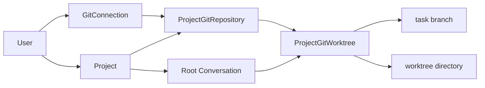

# Project Git 配置与分支参考

本页集中说明 Project 多仓库功能的启动配置、资源关系、目录与分支规则、状态和权限边界。按界面完成首次配置请先阅读[为 Project 配置 Git 仓库](../intro/project-git.md)。

## 启动配置

Git 能力由 API 和 worker 读取以下环境变量：

| 变量 | 默认值 | 读取者 | 约束与生效时机 |
| --- | --- | --- | --- |
| `YUXI_GIT_CREDENTIAL_KEY` | 空 | API、worker | 32 字节 base64url AES key；为空或无效时 Git API fail-closed，其他 Yuxi 能力仍可启动 |
| `YUXI_GIT_BRANCH_PREFIX` | `agent/` | worker | 必须是安全的 Git ref 前缀并以 `/` 结尾；只影响新派生和校验的任务分支 |
| `YUXI_GIT_ALLOWED_GITEA_ORIGINS` | 开发 Compose 中为 `http://gitea:3000` | API、worker | 逗号分隔的精确 origin；包含 scheme、host 和可选 port，不接受 path、userinfo 或 redirect |

可用下面的命令生成 master key，并把输出写入部署环境文件：

```bash
openssl rand -base64 32 | tr '+/' '-_' | tr -d '=\n'
```

同一套数据库必须长期使用同一个 key。更换或丢失 key 后，已有 Token 和 deploy private key 无法解密。修改配置后重新创建 API 和 worker：

```bash
docker compose up -d --force-recreate api worker
```

这些变量不传给 `sandbox-provisioner` 或动态 Sandbox。Gitea Token 和 deploy private key也不进入 Sandbox environment、UserWorkspace、Agent prompt、Run manifest、日志或 Git remote URL。

## 四类凭据和密钥

| 名称 | 来源与存放位置 | 是否敏感 | 用途 |
| --- | --- | --- | --- |
| Gitea SSH host key | Gitea SSH 服务持有私钥；connection 保存已核验的服务器公钥 `known_hosts` 行 | 公钥不敏感 | worker 校验远端服务器身份，防止连到错误主机 |
| Gitea API Token | 用户在 Gitea 创建；Yuxi 加密保存于 PostgreSQL | 敏感 | 查询仓库元数据、保护规则及管理 deploy key |
| 仓库 deploy keypair | 绑定仓库时由 Yuxi 自动生成；公钥注册到 Gitea，私钥加密保存于 PostgreSQL | 私钥敏感 | 可信 worker 对该仓库执行 fetch 和 push |
| `YUXI_GIT_CREDENTIAL_KEY` | 运维生成并放在 API/worker 环境中 | 高度敏感 | AES-GCM 加密 API Token 和 deploy private key，本身不参与 SSH 认证 |

停用仓库绑定后，远端 deploy key 被撤销，对应私钥密文引用被销毁；保留本地 bare repository、worktree 和远端任务分支。Connection 的 host key 与 deploy key 是两条不同信任链，不能互相替代。

## 开发 Compose 的 Gitea

仓库提供 `git-integration` profile，用于真实 Gitea integration 和本地功能验证：

```bash
docker compose --profile git-integration up -d gitea
```

默认 host HTTP 端口是 `3300`，host SSH 端口是 `2222`，均监听 `0.0.0.0`。同一局域网中的设备可通过宿主机局域网 IP 访问；实际可达性还取决于宿主机防火墙和网络隔离。端口占用时可在启动命令前设置 `YUXI_GITEA_HTTP_PORT` 或 `YUXI_GITEA_SSH_PORT`。Gitea 的 `ROOT_URL` 仍为容器网络地址 `http://gitea:3000/`，页面生成的绝对链接可能无法从局域网设备打开。

Yuxi API 和 worker 与 Gitea 位于同一 Compose network，因此 connection 使用容器可访问的 endpoint：

| 字段 | 开发值 |
| --- | --- |
| API Origin | `http://gitea:3000` |
| SSH Host | `gitea` |
| SSH Port | `2222` |

完整表单样例、SSH known-host 三段格式与 Token 的 `read:user`、`write:repository` 权限选择见[首次配置教程](../intro/project-git.md#本地-docker-compose-填写样例)。

host 浏览器端口只用于打开 Gitea 页面，不能替代 API/worker 看到的容器 endpoint。`YUXI_GIT_ALLOWED_GITEA_ORIGINS` 必须包含表中的 API Origin。

开发 profile 的 Gitea 仓库和数据库保存在 `${YUXI_STATE_DIR}/gitea-git-integration`，配置和密钥保存在 `${YUXI_STATE_DIR}/gitea-config`。迁移环境时停机后一起复制这两个目录。Gitea 是测试依赖，不随默认 `docker compose up` 启动。

## 资源关系


```mermaid
flowchart LR
    U[User] --> C[GitConnection]
    U --> P[Project]
    C --> R[ProjectGitRepository]
    P --> R
    P --> V[Root Conversation]
    V --> W[ProjectGitWorktree]
    R --> W
    W --> B[task branch]
    W --> D[worktree directory]
```

- `GitConnection` 是用户级 Gitea endpoint 和加密 API Token 记录，只能服务同一用户的 Project。
- `ProjectGitRepository` 是 Project 内仓库绑定，保存 alias、canonical 仓库身份、默认分支、deploy public key 和远端 key ID。
- `ProjectGitWorktree` 由 repository binding 与根 `runtime_scope_id` 唯一确定，保存分支、base/head/last pushed 和清理状态。
- Conversation、AgentRun 和 Project Git 表是任务状态权威；Git commit 保存代码进展。

第一版 provider factory 只接受 `gitea`。`github`、`gitlab` 和未知值会返回 unsupported-provider 错误。

## 仓库目录

Project Workdir 下的稳定布局是：

```text
repos/<repository-directory>/repository.git
repos/<repository-directory>/worktrees/<task-key>
```

`repository-directory` 由规范化 alias 加 repository binding ID 摘要生成。同一用户的多个 Project 可以共享一个 Workdir，这个摘要避免同名 alias 发生目录碰撞。Alias 和 owner/name 不直接拼接为宿主机路径。

`task-key` 是 `sha256(uid + runtime_scope_id)` 的稳定截断摘要。原始用户输入、Conversation ID 和 uid 不直接出现在目录名中。宿主机解析会拒绝 `repos` 路径中的符号链接穿越。

动态 Sandbox 仍挂载当前用户的整个 UserWorkspace。worktree 隔离 Git 分支、索引和任务目录，不提供同 uid 恶意 Agent 之间的强文件隔离。

## 分支分配

资源先完整检出选定分支到配置的项目相对目录；新增时默认远端默认分支。直接修改模式使用该目录和分支，按实际目录持续占用；其他任务进入 FIFO 等待。任务或对话运行结束保留占用，需明确处理成果并释放。

隔离模式在根智能体申请资源后分配任务分支与 worktree。分支默认以 `agent/` 开头，完整名称由类型、slug 和稳定任务摘要组成；管理员设置的前缀优先。同一项目任务跨智能体、多轮和重试复用作用域，普通项目对话使用对话作用域。子智能体共享根运行的工作区；子任务默认共用父任务，也可在首次执行前选择从父任务已提交 HEAD 创建独立工作区。

运行终态不自动回收工作树或提交、推送、合并。项目内可以审查差异、人工提交与推送、创建 Gitea 合并请求及执行实际合并，之后安全清理工作树；远端任务分支与本地保留分支继续存在。当前占用、队列和失败现场由 PostgreSQL 分配事实及实际文件状态拥有。

## 仓库状态

| 状态 | 含义 | 后续动作 |
| --- | --- | --- |
| `provisioning` | 已保存绑定意图，worker 正在创建/认领 deploy key 和 bare repo | 等待 worker 或 reconciler |
| `active` | 可参与 Run preflight 和 push | 正常使用 |
| `provision_failed` | provision 失败，错误不包含 secret | 修正依赖后点击重试 |
| `deleting` | 已禁止新 preflight/push，正在撤销 key | 等待 worker |
| `delete_failed` | 撤权失败 | 恢复 Gitea/API Token 后重试 |
| `disabled` | 远端 key 已撤销，私钥密文已销毁 | 本地代码仍保留 |

Project 中存在未停用且非 `active` 的绑定时，Run 在 Agent 执行前重试，不向 Agent 提供部分仓库集合。

## Worktree 状态

| 状态 | 含义 |
| --- | --- |
| `preparing` | worker 持有可过期 lease，正在 fetch/import/add |
| `ready` | identity、分支和路径已回读，可交给 Agent |
| `prepare_failed` | 准备失败，下一次 Run 可重新准备 |
| `cleanup_pending` | 安全条件通过，已提交异步清理意图 |
| `cleanup_failed` | 文件系统或 Git 清理失败，可重试 |
| `removed` | 本地 worktree 已移除；远端分支保留 |

repository maintenance advisory lock 只串行化同一 bare repo 的 import、worktree add/remove 和 prune。repository operation session advisory lock 跨事务串行化同一 binding 的 provision 与撤权，进程退出时由 PostgreSQL 自动释放，避免 deploy key 创建和停用交错后遗留权限。不同仓库以及不修改共享 bare repo 的远端 staging fetch 可以并发。

## Agent 与可信 Git 操作

沙盒文件工具用于修改普通仓库内容。平台 Git 执行器使用私有元数据与临时索引审查、提交、推送，避免使用智能体可写配置、hooks、过滤器或凭据路径。Gitea Token、deploy private key 和可信元数据保留在 API/worker 的边界内。

根智能体通过 `git_list_project_repositories` 选择资源，`git_prepare_worktree` 经对话审批申请工作区，`git_review_workspace` 读取可信 HEAD/tree 和差异。`git_request_action` 固定快照申请 commit/push/merge，`git_action_status` 回读批准和执行终态。旧 `git_push_branch` 也进入同一可追溯审批链。

授权模式与运行模式独立。资源目标或 Gitea 规则受保护时等待人工批准；符合自动授权规则的任务分支及合法目标先记录批准依据再执行。动作执行前重新检查根运行 lease、任务持续占用、分配归属、内容快照和保护策略。已批准不等于已执行；申请与真实 Task attempt、Git 结果绑定。

`git_list_pull_requests` 查看自身任务的请求及合法目标，`git_create_pull_request` 从已推送任务分支向资源目标或持久父任务分支创建请求。实际合并继续申请审批，检查源/目标 SHA；Gitea 能原子校验源提交，目标检查之后的并发推送仍可能进入合并。子智能体不装配 Git 管理工具，后端独立拒绝其管理调用。

首次操作的点击顺序、指令和结果核对见[Git 操作快速入门](../intro/project-git.md)。

## API 参考

连接、仓库发现、项目资源、工作树、成果审查、占用队列、Git 动作和合并请求接口由 [Git 路由](https://github.com/Sxyon/Yuanlei/blob/main/backend/server/routers/git_router.py)及运行服务拥有；正在部署的接口定义可以在平台 `/docs` 的 Git 分类查看。

Token 是 write-only 字段。资源创建、停用和工作树清理通过异步任务收敛；PostgreSQL 状态是持久事实，Redis/ARQ 负责投递。发布失败时 reconciler 扫描未完成状态并重新投递。审批记录与实际动作结果分别显示，批准后仍需检查最终执行状态。

## 撤权与恢复

停用仓库或删除 Project 会先在数据库中写入 `deleting` 并阻止新操作，再撤销远端 deploy key。若 provision job 已创建 key 但发现 operation generation 已变化，该旧 job 会自行撤销刚创建的 key；delete job也会按确定性 title 与 public-key fingerprint 查找并撤销没有写回 ID 的 key。

远端 key 已存在、远端 branch 已等于 expected SHA 或本地路径已缺失时，重试通过回读收敛。只有 Gitea 撤权成功或确认 key 不存在后，服务才销毁本地 deploy private credential。

数据库、Gitea 和 POSIX 文件系统不共享事务。排障时以数据库状态、Gitea deploy key/branch 和真实 worktree 路径回读为准，不能仅依据 HTTP 200、日志或 ARQ job 结束状态。
