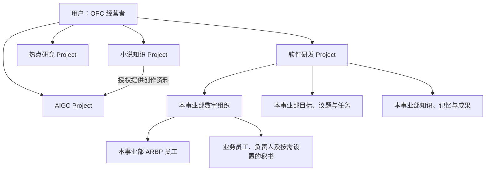
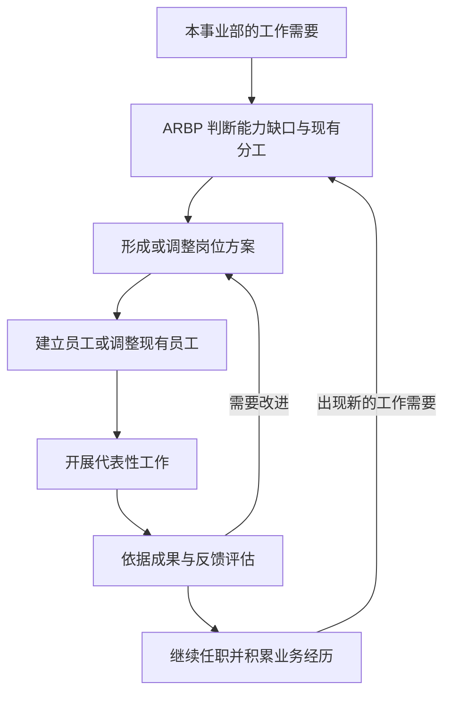
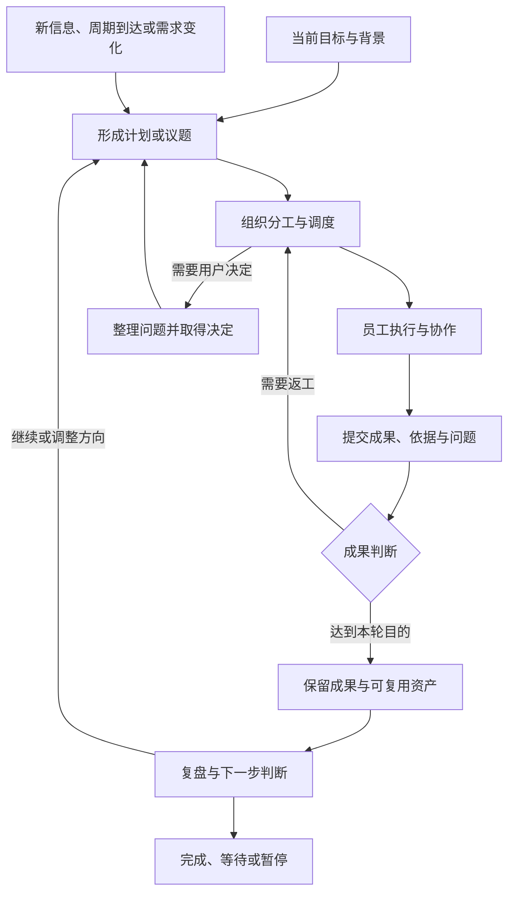
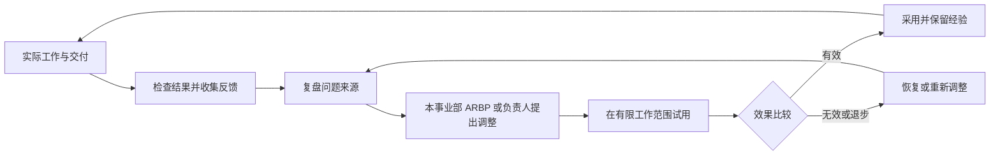
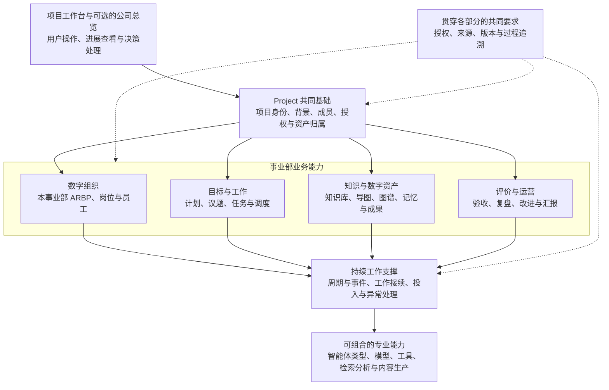

# Project 与 OPC 事业部整体规划 V0.1

版本：V0.1。状态：初版草稿，归档供后续参考。归档日期：2026-09-10。

**V0.1 不是教条，只是初版草稿版本。** 本文整理产品讨论中的整体构想，所有模块、关系、流程和图示均可根据实际使用调整；它们不构成已实现能力、固定架构、发布承诺或首版上线清单。

本文面向项目发起人、产品规划者与后续模块设计者，回答 Project 的业务定位、数字员工与资产关系、工作闭环和目标系统的职责划分。阅读只需理解用户以个人公司经营者身份管理多个事业部的场景；本文不涉及代码、接口、数据结构、技术选型或具体开发步骤。

阅读顺序：[归档说明](./README.md) → 本文 → [V0.1 场景详解](./v0.1-scenarios.md)。继续规划时同时阅读 [V0.2 方向修正](./v0.2-direction.md)：目标、组织和约定随实践演进，先上线最小可执行版本；ARBP 只在事业部内任职。归档稿已纳入这个明确的 ARBP 范围修正，不保留公司级 ARBP 建设方案。

## 1. 战略目标与讨论范围

战略目标是为每个用户提供专属的项目级管理、目标自主规划推动和落地执行的 AI 智能团队，支持 One Person Company（OPC，一人公司）的经营场景。

用户是公司的经营者与最终决策者，Project 是探索一个业务领域的事业部。每个事业部拥有自己的背景、发展方向、阶段规划、数字资产和一群能够积累业务经历的数字员工。员工围绕议题与任务协作，形成实际成果，组织再根据工作效果调整下一步行动。

平台首先需要支持从用户意图到可检查结果的完整工作。较成熟的目标形态可以包含持续规划、组织发展、共享知识、员工记忆、成果评价和跨事业部合作；各部分的上线顺序与深度以后根据真实需求确定。

四个代表性场景分别检验软件协作、持续情报研究、时序知识理解和多模态生产能力。场景是解释基础能力的样本，不代表用户已决定开展这些业务，也不要求首版同时支持它们。

本稿保存整体方向和模块之间的关系。最低可执行范围、技术方案、页面细节、记忆机制及开发排期均未确定。

## 2. 用户、Project 与数字组织

Project 列表保持扁平：普通项目与具有事业部能力的项目可以并列存在，事业部内部的团队、岗位和员工表达组织结构。用户可以经营多个事业部，每个事业部的方向和组织规模可以不同。

公司级视角表达用户查看整体经营情况、决定重点和协调事业部的需要。它是候选产品视角，不要求首先建立完整的公司管理层。ARBP 的业务范围固定在事业部内：平台可以提供可复用的 ARBP 智能体类型，各事业部按需设立该类型的数字员工。

图中只展开一个事业部的内部结构，其他事业部可按业务需要配置对应能力，无需拥有相同的岗位数量或完整模块组合。

| 概念 | 业务含义 | 关系说明 |
| --- | --- | --- |
| 智能体类型或能力 | 某类专业工作的可复用能力与行为基础 | 可以用于建立不同事业部的员工 |
| 岗位 | 组织需要承担的业务责任 | 随工作需要产生、调整或合并 |
| 岗位方案 | 职责、能力、行为、资源、记忆与评价方式的描述 | 随实际效果完善，不要求开始工作前全部定稿 |
| 数字员工 | 在某事业部任职、承担工作并积累业务经历的主体 | 同类型员工的身份、授权、记忆与记录分别归属所在事业部 |
| 团队 | 围绕相近业务责任形成的组织 | 员工可以跨团队参与议题 |
| 议题工作组 | 围绕具体问题组织的协作关系 | 可以在工作完成后结束或重组 |

组织关系需要表达三件不同的事：员工长期向谁汇报，当前工作由谁安排，成果由谁检查。三者可以由相同角色承担，也可以分开；随着任务复杂度增加再明确必要分工。

员工规模服务当前工作。一个岗位可以配置多名员工，一名员工可以承担相容职责；临时工作也可以通过一次协作完成，不强制新增长期岗位。

## 3. 事业部背景、目标与运行约定

基础信息包含项目名称、图标与背景。业务背景可以进一步表达服务对象、关注领域、已有材料和当前问题，为用户与员工建立共同理解。

事业部目标表达希望取得的结果，蓝图表达对业务能力和整体结构的设想，阶段计划表达下一段工作安排。这些材料允许同时存在未知项，并随着新信息、成果和用户决定修订。

| 规划内容 | 使用时需要理解的事情 | 调整依据 |
| --- | --- | --- |
| 业务定位 | 为什么开展这项工作，服务谁，关注什么领域 | 用户方向、需求与环境变化 |
| 阶段目标 | 当前希望得到什么，怎样观察进展 | 交付结果、探索发现与投入情况 |
| 业务蓝图 | 不同工作、能力与成果如何联系 | 实践暴露的遗漏与更简单的办法 |
| 成果判断 | 如何判断当前工作达到目的 | 工作对象、实际证据与用户反馈 |
| 自主范围 | 当前哪些事情可以直接推进，哪些需要决策 | 具体工作需要与明确授权 |
| 工作节奏 | 何时执行、复查、等待或暂停 | 任务性质、外部变化与可用投入 |
| 资源范围 | 本轮工作可以使用哪些资料和能力 | 当前任务与资产授权 |

这些是逐步澄清工作的维度，不是创建事业部前必须填完的表单。初始方向可以很简单，先完成有价值的工作，再完善岗位、计划和协作规则。投入、访问与对外行动遵循当前有效授权；组织约定的渐进完善不代表默认取得额外权限。

探索型目标可以以形成可靠判断、验证假设或排除路线作为成果。目标调整时保留与当前工作有关的理由，让员工理解哪些工作继续、哪些需要重新安排，避免用过期计划解释新成果。

## 4. ARBP 与数字员工发展

ARBP（Agent Resources Business Partner，智能体资源业务伙伴）是事业部内承担岗位配置与员工发展工作的数字员工类型。每个事业部可以建立自己的 ARBP 员工，依据本项目的目标、资料、组织情况和反馈开展工作；本规划不建设公司级或更高层级的 ARBP 组织。

ARBP 的候选工作包括分析能力缺口、形成岗位方案、辅助建立员工、观察代表性工作、组织复盘，以及建议调整岗位或分工。它可以使用授权的成果、工作记录与反馈，管理身份不自动开放其他员工的私有记忆。

| 岗位方案维度 | 描述内容 |
| --- | --- |
| 业务责任 | 对哪些结果负责，当前重点是什么 |
| 专业能力 | 需要理解的业务领域与可以完成的工作 |
| 提示词与行为 | 岗位表达、工作习惯、规范和必要约束 |
| 可用资源 | 能够使用的资料、工具、知识库与其他专业能力 |
| 记忆要求 | 需要积累的业务知识、经历和经验，以及适用范围 |
| 协作关系 | 当前汇报对象、任务指挥关系和配合岗位 |
| 评价方式 | 如何从实际工作判断适配程度与改进效果 |
| 任职与交接 | 职责调整或退出时需要接续的工作与组织资产 |

岗位方案可以先描述当前工作最需要的部分，在任职过程中逐步补齐。特殊提示词服务岗位责任；员工能否胜任，要通过工作表现和成果判断。

图示表达可以逐步形成的工作关系，不要求每次岗位调整经过一套完整招聘仪式。ARBP 先判断现有员工、临时协作或分工调整是否足够，再建议增加岗位。

议题负责人承担当前议题的目标、分工和交付责任；业务员工执行工作并如实报告；评判角色结合专业依据检查结果；秘书整理进展、问题和待决事项，并传达用户决定。这些职责可按工作需要分配，秘书是否设立及服务范围留给实际场景决定。

## 5. 目标、议题、任务与自主推进

较复杂工作的参考层次是“事业部目标 → 阶段计划 → 议题 → 任务 → 工作过程与交付物”。议题承载需要协调解决的问题，任务承载具体分工，交付物承载能够检查和继续使用的结果。简单工作可以直接形成任务，不强制补齐所有层次。

| 工作形态 | 代表情形 | 推进重点 |
| --- | --- | --- |
| 一次性交付 | 完成一个功能、制作一段视频 | 围绕成果推进，验收后结束 |
| 持续探索 | 研究方向、完善领域知识 | 分阶段提出问题、开展工作并判断是否继续 |
| 周期运营 | 持续形成动态报告 | 按业务节奏复查并说明变化 |
| 事件响应 | 新资料、代码变更或制作反馈 | 判断影响，安排相关分析或修订 |

任务协作需要让参与者了解当前目标、输入、负责人、依赖与预期成果。多人合作时，议题负责人协调分工与冲突，员工围绕自己的实际工作汇报；规划材料随决定更新，以便后续工作接续。

目标自主推进包含判断何时继续、何时等待、何时调整和何时停止。当前授权范围内的日常工作可直接推进；涉及方向、重要投入或授权变化的事项交给相应决策者。具体介入方式和频率以后按场景设计。

较长期的工作需要在中断后理解已有进展、尚未解决的问题和已经形成的结果。员工的完成报告提供线索，工作结束的判断结合实际交付与必要验证。该方向描述产品应达到的效果，不规定调度或恢复的技术机制。

## 6. 数字资产、知识表达与员工记忆

数字资产包括工作输入、资料、知识、规划表达、交付物和可复用经验。Project 需要让使用者理解它们的归属、来源、适用范围和当前版本；同一内容可以用于多项工作，不必为每个员工复制全部资料。

| 信息范围 | 典型内容 | 参考使用关系 |
| --- | --- | --- |
| 授权共享资料 | 跨事业部共用的规范、模板与正式成果 | 由来源方明确共享范围，接收方按需要使用 |
| 事业部共享知识 | 项目背景、共同事实、蓝图、决策和业务成果 | 为本事业部员工提供共同依据 |
| 员工私有业务积累 | 岗位知识、专业笔记、工作经历、经验和未解决事项 | 默认仅该员工调用，经明确规则形成共享产出 |
| 议题与任务资料 | 当前输入、讨论、进展和临时材料 | 服务当前工作，筛选后再长期保留 |

知识库群支持一个事业部组织多类共享知识库，以及按岗位需要建立私有知识空间。员工私有空间与组织共享资产分别表达使用范围；用户审阅、员工交接和退出时的处理方式留给后续专线明确。

| 知识表达 | 用途 | 需要保留的区别 |
| --- | --- | --- |
| 知识库 | 保存资料、文档、事实依据和可引用知识 | 来源资料、确认结论与个人解释 |
| 思维导图 | 组织目标、结构、观点、规划与探索过程 | 已确认方向与待讨论设想 |
| 知识图谱 | 表达人物、事件、对象之间的关系及时间变化 | 有依据的关系、争议说法与推演假设 |

三类表达可以关联同一份来源或成果。导图中的设想和图谱中的推演保持各自的性质，经确认后再进入正式知识。对于热点或小说，还需要理解事件发生时间、资料出现顺序及角色当时所知，具体表达方式以后再设计。

业务记忆服务员工持续承担岗位责任。参考内容包括岗位规范、领域知识、工作经历与经验总结；具体记忆机制预留，不在本稿细化。后续可围绕以下问题展开：

- 该岗位需要长期积累什么，哪些只服务当前任务？
- 知识和经验来自哪里，适用于哪个项目、版本或时期？
- 资料变化或出现矛盾时，怎样更新理解？
- 哪些积累仅限员工调用，哪些应形成共享成果？
- 哪些内容需要失效、纠正或遗忘，哪些事项需要交接？

例如，模块数字员工可以持续维护本模块的职责、结构、规范、关键关系和变更理解，并使用项目级知识认识系统协作。资料变化后需要重新核对相关理解；一次导入知识只是开始，岗位能力由后续分析与实际工作体现。

跨事业部合作的参考方式包括资产共享与工作委托。共享资产说明来源、版本与使用范围；委托明确需要解决的问题与交付。来源更新后，接收方需要知道哪些工作受影响，再决定如何采用。小说与 AIGC 的具体例子见[场景详解](./v0.1-scenarios.md)。

## 7. 成果评价、复盘与项目内改进

业务工作产生交付物，复盘帮助判断哪些做法有效、哪些需要调整。项目内改进可以从简单问答和人工反馈开始，在实际需要出现时再增加专业评价角色与自动协作。

评价材料包括实际交付、可核验依据、工作标准、专业审查与用户反馈。不同智能体可以从事实依据、专业质量、目标适配或投入情况等角度给出意见；意见需要说明依据，多方一致认可本身不能替代对结果的检查。

复盘先判断问题来自目标理解、资料质量、专业能力、分工协作还是评价方式，再决定改变什么。候选改进对象包括岗位描述、提示词、知识组织、记忆要求、协作方式和团队分工。

日常改进遵循当前授权。重要方向与授权变化由有权决策者处理，被评价员工不单独降低自己的成果标准。岗位方案的重要变化可以保留原因与实际效果，帮助后续理解组织为何这样工作；记录深度随使用需要确定。

工作与组织同时允许调整。评价结论用于决定继续、返工、换一种做法或停止，不把持续扩编、不断重试或增加管理环节当作默认发展方向。

## 8. 目标系统的逻辑架构

下图划分目标系统的业务职责与依托关系。分区表示概念上的能力范围，不代表技术选型、服务拆分、部署结构或首版模块要求。

Project 提供共同的业务范围，组织、工作、资产与评价分别维护各自的内容。专业能力为不同业务提供支持；可复用的 ARBP 类型在具体 Project 中形成员工，任职后的工作与业务记录属于该事业部。

持续工作支撑的目标是让工作能够等待、接续、处理变化并控制投入；资产支撑的目标是让重要内容可查找、可引用、可理解来源；运营支撑的目标是让汇报能够连接到实际工作与结果。实现顺序以最小可执行版本和实际使用反馈确定。

不同领域通过岗位方案、专业资料、工具能力和成果标准表达差异。软件开发、热点研究、小说问答和 AIGC 生产的具体专业方法分别作为后续议题讨论。

## 9. 工作台、看板与模块阅读地图

用户进入 Project 后，需要理解事业部当前在做什么、谁承担工作、形成了哪些结果，以及哪些问题需要自己决定。页面可以围绕这些实际动作组织，候选模块可以合并、延后或调整。

| 页面或能力组 | 主要内容 | 用户希望完成的动作 |
| --- | --- | --- |
| 事业部概览 | 定位、当前目标、重点进展与待决事项 | 快速了解当前情况 |
| 背景与规划 | 项目信息、蓝图、阶段目标与重要调整 | 明确或修改工作方向 |
| 组织与员工 | 本事业部 ARBP、岗位、员工和协作关系 | 组建和调整当前需要的团队 |
| 议题与任务 | 工作分派、依赖、进展、阻塞与验收 | 发起工作、协调推进和检查结果 |
| 知识与思考 | 知识库群、思维导图群、知识图谱及私有空间 | 查找、组织和积累业务理解 |
| 成果与资产 | 交付物、制作资料、版本与共享关系 | 检查、使用或继续修改成果 |
| 运营与改进 | 工作汇报、投入情况、反馈、复盘和改进记录 | 判断效果并调整组织或工作方式 |
| 项目管理 | 成员、资源范围、暂停、归档与交接 | 管理项目的持续使用 |

项目专属看板可以围绕目标进展、任务情况、员工工作、交付成果和待决事项组织。员工汇报关联具体议题、任务与成果，秘书据此整理摘要；需要了解细节时，用户能够继续查看依据。

公司总览只作为聚合多个事业部情况的候选视角。它不承担 ARBP 的岗位建设职责，也不作为事业部开始运行的前置模块。

## 10. 归档边界与后续使用

V0.1 保存讨论形成的目标形态、术语关系、业务场景和模块地图。文中较完整的形态为理解方向提供参考，不要求先完成全部规划或建设全部模块。

后续明确的工作原则见 [V0.2 方向修正](./v0.2-direction.md)：目标、岗位和协作方式随实践变化，优先上线最小可执行版本，在使用中完善；ARBP 仅在事业部内任职。

本轮止于归档，尚未选择首版能力集合、样本事业部、排期、技术路线或具体开发任务。后续工作等待用户下一步指示，相关专线可以引用本稿并直接修订不适用的假设。
