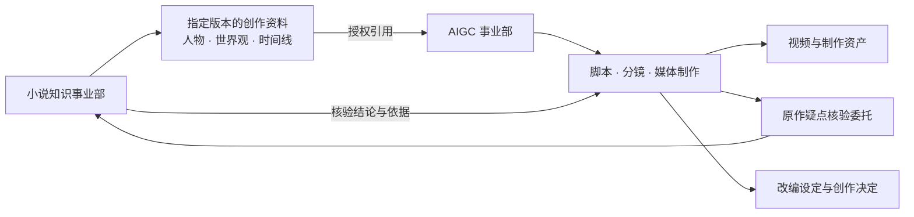

# Project OPC 场景草稿 V0.1

版本：V0.1；归档日期：2026-09-10；状态：初版规划草稿。

本文面向参与 Project 规划讨论的用户与项目维护者，具体记录四个事业部场景，用于检查整体构想能否承载不同领域的工作。阅读前先了解 [V0.1 整体规划](./v0.1-overview.md)；动态演进、最小可执行版本和 ARBP 定位以 [V0.2 方向修正](./v0.2-direction.md)为后续依据。

**V0.1 不是教条，只是初版草稿。** 四个场景是未来能力的检验案例，不是实施清单、上线范围或现有功能说明。本文归档用户期待的工作效果，不指定开发顺序、技术方案或完整组织配置。

## 场景的共同前提

用户以公司经营者的身份管理不同领域的事业部，每个事业部由一个 Project 承载自己的目标、员工和数字资产。目标、规划、岗位和协作关系随实际工作调整，团队可以从少量必要角色开始，遇到真实缺口再补充能力。

ARBP（Agent Resources Business Partner，智能体资源业务伙伴）作为可复用智能体类型，在各事业部设立对应数字员工，负责所在事业部的岗位配置与组织改进。它结合当前任务辅助生成岗位提示词、记忆要求、行为约束和管理关系，再依据工作结果调整；不在公司层级建立 ARBP 职责。

下面的岗位名称用于描述分工，一个员工可以承担相容职责。每个场景以可检查的成果说明期待效果，实际能力和验收办法留待对应专线讨论。

## 场景一：AI 软件开发司

目标是围绕指定软件项目的功能蓝图持续分析、开发和交付，同时积累对模块及其协作关系的理解。蓝图随着使用反馈、开发发现和业务优先级调整，议题据此继续推进、重新规划或结束。

岗位示例包括架构师、模块规划员、开发专家、模块数字员工和评审人员。议题负责人组织当前工作的分工与汇总；秘书整理进展、成果和需要用户决定的事项；事业部 ARBP 根据实际工作发现补充或调整岗位。

主要链路为：用户提出功能目标 → 形成议题与预期成果 → 分析系统影响及模块协作 → 安排开发与评审任务 → 提交可检查成果 → 验收与复盘。模块员工向议题负责人汇报完成情况、依据和阻塞；跨模块分歧由相关负责人协调，需要用户决定的内容交给秘书汇总。

知识资产分为项目共享资料与员工专业积累。共享资料包括系统背景、功能规划、架构关系和通用规范；模块员工在仅自己调用的知识空间维护模块知识、方法与函数的含义、约束、历史问题和工作经验。实际代码和规范变化后，员工需要识别受影响的理解并更新知识。

可观察交付包括功能成果、验证依据、评审意见、遗留问题，以及供后续工作引用的设计与知识更新。独有要求是长期模块责任与临时议题协作并存；员工需要把知识用于判断和交付，并能说明当前理解的依据、适用版本和尚未核实的部分。

## 场景二：热点追踪项目

目标是围绕用户关心的主题持续整理事件起因、过程、背景与关联，形成随资料变化而更新的研究资产和动态报告。追踪主题、分析角度和报告节奏依据实际价值调整。

岗位示例包括调研师、收集专员、事实核验员、知识图谱发掘师、社会学点评师及报告整理人员。不同岗位承担资料收集、来源比较、关系探索和解释分析，事业部 ARBP 根据研究缺口调整分工。

主要链路为：确定当前关注主题 → 按周期或新事件开展收集 → 比较资料并记录出处 → 整理时间线、背景与关系 → 开展多角度分析 → 更新报告 → 根据新证据修正。资料不足或互相冲突时，报告保留待核实事项，并指出其对结论的影响。

知识资产包括来源资料、事件时间线、主体关系、背景知识、分析假设和历次报告。知识图谱承载可追溯的关系及待验证关联，思维导图帮助组织研究问题；员工私有空间积累专业线索与研究经验。

可观察交付包括动态报告、来源引用、关系图谱和变更说明。用户能够看到新增事实、已修正判断及仍有争议的内容。独有要求是区分事件发生时间、信息出现时间和研究更新时间，并区分资料事实、相关方说法与分析推断；社会学、心理学解释保留依据与不确定性。

## 场景三：小说超级知识库

目标是将一部小说及其指定版本逐步整理为可持续问答的知识体系。用户期待查询某个时期人物在做什么、发生了什么、动机是什么，以及这些事件如何影响后续情节。

岗位示例包括章节分析员、人物分析员、关系与时间线整理员、情节分析员和问答核验员。事业部 ARBP 根据作品特点和问答反馈调整分工，分析范围可以从用户关注的人物、章节或事件逐步扩展。

主要链路为：确定作品与版本 → 阅读并拆分章节内容 → 整理人物、地点、事件及关系 → 校对故事时间和叙述顺序 → 建立可引用的知识 → 回答问题 → 根据问答暴露的缺口补充分析。新增理解需要关联文本依据；存在多种解释时，分别说明其依据。

知识资产包括原文引用、人物画像、事件记录、关系变化、时间线、世界观设定及情节因果分析。知识图谱表达人物与事件关系，思维导图组织人物弧线和情节结构；私有专业积累服务员工的长期分析工作。

可观察交付包括可追溯的回答、人物在指定时期的状态、关系图谱与情节分析。独有要求是区分故事事实、人物当时所知、读者读至指定章节所知，以及后续情节揭示的信息。期待覆盖全书的问答能力作为愿景保留；文本缺失、作品歧义和分析空白需要明确呈现。

## 场景四：AIGC 项目

目标是将用户的创作意图转化为可观看的视频及可继续修改的制作资产。输入可以来自用户描述、已有素材，或小说知识事业部授权提供的人物、故事与世界观资料。

岗位示例包括创作规划员、脚本与分镜人员、图片生产员工、音频员工、视频员工和成片审核人员。事业部 ARBP 围绕当前作品需要组合岗位和能力，制作反馈也可以促使团队重新分工。

主要链路为：明确创作意图与当前成果要求 → 整理设定和素材 → 形成脚本与分镜 → 分工生产图像、音频和视频 → 检查角色、场景与叙事连续性 → 合成并验收 → 根据反馈修改。需要改变创作方向或解决原作疑点时，将相关事项交给用户决定或委托知识事业部核验。

知识资产包括创作要求、人物与世界观设定、风格参考、脚本、分镜、素材、改编决定及各版成果。员工私有空间积累本岗位的制作经验；项目共享空间保存协作所需的设定和已确认结果。

可观察交付包括可播放视频、对应制作资产、采用的设定版本和待改进事项。独有要求是多种媒体之间保持一致，局部修改后能够识别受影响的制作内容；生成结果不满足要求时，保留具体问题以支持返工和复盘。实际制作质量与效率在使用中检验。

## 跨事业部协作：小说知识用于视频制作

这组关系用于说明资产引用与工作委托的区别。小说知识事业部提供指定版本的创作资料；AIGC 事业部引用这些资料开展制作，遇到原作疑点时提出核验委托。每个事业部继续维护自己的员工和专业积累。

原作知识由小说知识事业部维护，改编设定与制作资产由 AIGC 事业部维护。源资料更新后，制作方需要知道哪些内容发生变化，再判断是否影响当前作品。资料引用、核验答复和改编决定保留关联，让后续修改能够理解当时的依据。

四个案例分别检验持续专业责任、动态研究、时序知识和多媒体协作。它们共同表达的期待是：事业部能够围绕变化的目标开展工作、留下可使用的结果，并通过真实反馈改善组织与知识。具体改造在后续专线议题中决定，本页不继续展开上线方案。
