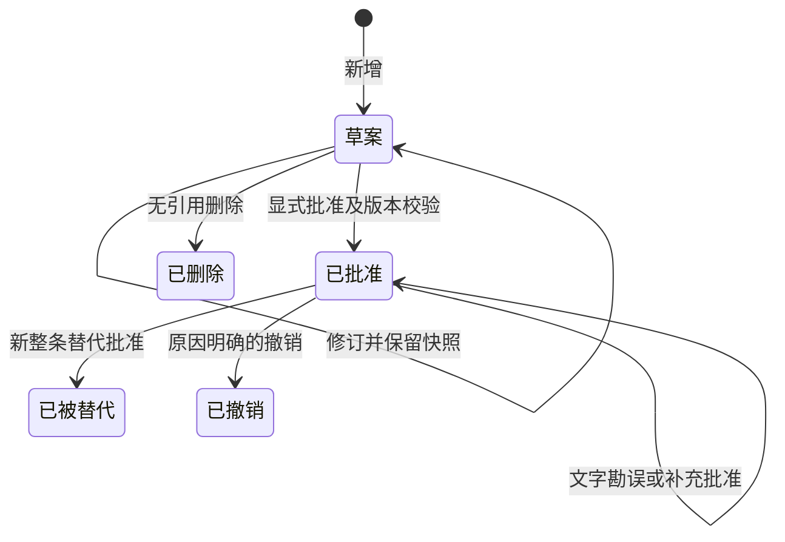

# 决策批准、关系与局部历史

状态：implemented
类型：feature
Owner：backend/package/yuxi/services/governance_service.py

## 问题

普通保存直接拍板并显示已实施，草案与正式依据缺少边界；批准文本和补充替代关系无法稳定追溯。依据为架构 v1.2 与 P01 需求补充，P00 已完成。

## 决策

决策为 draft/approved/superseded/revoked，形成方式独立为普通、补充、整条替代，后两者指向同项目一条已批准决策。默认保存草案；批准明确记录原因、操作者、时间及完整版本，并锁定当时议题依据。补充保留原效力，整条替代批准同事务改变新旧状态；原依据变化的补充显示需复核。撤销、勘误保留原文且不改变任务和执行记录。勘误由个人用户声明业务含义不变，保存字段及新旧片段，不自动拼接权威正文。

v28→v29 映射 proposed→draft、implemented→approved，保留已有批准事实，建立迁移基线，不推断未记录版本。新增决策局部修订、事件和勘误表，及软删除与单目标关系字段。公开创建契约移除旧 decided 开关，不保留双状态写路径。批准重试不重复节点；草案保存及批准按预期版本拒绝竞争覆盖。项目内决策写和治理任务决策引用创建共享项目行锁，再锁议题/决策，串行闭合跨议题事件和引用删除竞争；锁不产生组织审批资格。

## 替代方案

直接覆盖批准文本会丢失历史依据，拒绝。自由标签无法表达替代对象，拒绝。通用事件平台、部分替代与多目标合并没有首期消费者，暂缓。默认保存并批准仍混淆保存与批准，采用分开的显式动作。

## 验收标准

| 验收主张 | 失败面 | 语义 Owner | 直接证据 / 命令 | 负向案例 | 当前结果 |
| --- | --- | --- | --- | --- | --- |
| 默认草案、正式原文不可覆盖、可追溯勘误 | 保存暗中拍板或勘误改写正文 | governance service/model | PostgreSQL 与 HTTP 回读 | 批准后编辑拒绝、含义变化声明拒绝 | 已通过；见下方验证 |
| 补充与替代效力真实且并发安全 | 双替代、失效目标仍批准 | governance service/repository | 双会话并发、状态与事件回读 | 两替代仅一个成功、旧草案覆盖失败 | 已通过；见下方验证 |
| 草案删除受引用保护，迁移保留批准事实 | 历史失联、迁移重复或降级 | repository/migrator | 真实旧结构迁移、引用删除竞争 | 引用草案拒删、重入不重复 | 已通过；见下方验证 |
| 界面与议题关联可追溯，不改变执行 | 历史错误当作当前依据、状态误联动 | Web/inspection service | 浏览器及 HTTP 最终事实 | 候选排除撤销替代，任务及执行回读不变 | 已通过；见下方验证 |

## 后果

旧批准依据版本未知时照实展示；无 AI 语义判断，用户对勘误性质负责。当前正式工作无决策外键，P02 才建设，不提前增加。跨项目关系和无效目标由后端拒绝；关联议题待纳入仅提示，归档删除阻止创建及批准，历史撤销和勘误仍允许。

## 状态与关系

| 维度 | 当前值 | 对其他维度的影响 |
| --- | --- | --- |
| 决策效力 | 草案、已批准、已被替代、已撤销 | 批准只建立正式依据，不改变议题或执行状态 |
| 决策形成方式 | 普通、补充、整条替代 | 后两种保存同项目单一目标；保存草案不影响旧效力 |
| 议题纳入 | 待纳入、已纳入、已拒绝 | 待纳入只提示，不构成批准门禁 |
| 议题进度 | 研讨中、已形成决策、已关闭 | 关联决策批准后仍须显式确认；确认清除业务执行提示 |

勘误与历史不成为第二个效力 Owner。撤销后续决策不复活旧决策，补充来源被替代或撤销时显示“原依据已变化，需复核”，补充自身效力保持原值。批准原文和依据版本保存在完整快照；有议题但版本未知时明确显示未知。

## 验证

- 原本地 HEAD 为 fcf638ac；原暂存人工规划文档保留。真实迁移命令 `docker compose exec api uv run python -m yuxi.storage_migration` 已完成，数据库版本回读为 business=7、knowledge=2、yuanlei=29。隔离旧 v28 结构验证两种旧状态映射、原拍板者及日期保留、基线快照和事件重入不重复。
- `docker compose exec api uv run --group test pytest test/integration/api/test_decision_lifecycle_api.py test/integration/services/test_governance_service.py test/integration/services/test_inspection_board_service.py -q`：20 通过。真实 HTTP 另行复验 P01 3 项通过，覆盖跨项目、授权、不可覆盖批准原文、用户含义声明、撤销依据、草案引用删除、保存/批准竞争、双替代和引用/删除竞争。最终状态、原文、事件及引用重新从 PostgreSQL 读取。
- `docker compose exec api uv run --group test pytest test/unit -m "not slow" -q`：2787 通过、63 跳过。跳过项按既有运行环境条件标记；pytest 缓存目录权限警告不影响测试结果。
- Web lint、build 通过。完整 Web 单测首次仅两项旧状态 oracle 失败；明确审阅更新四种决策状态及图配色后，相关治理与历史 16 项通过，后续新增迟到删除确认用例后决策组件 4 项通过；最终完整重跑 469 项全部通过。
- 真实浏览器完成新增草案、显式批准、文字勘误、补充批准、整条替代批准及双向链接；原文保持，原决策被替代，补充显示复核提示。双页面同时编辑同版草案，先保存者成功，后保存者收到冲突，独有草稿与完整复制入口保留。无引用测试草案通过统一对话框删除，数据库回读 deleted_at 已设置；已有治理任务仍为 proposed。
- 全新独立 Reviewer 未继承开发会话，完整需求、diff、规范及负向案例复审通过；独立重跑治理状态与决策组件 11 项通过，`git diff --check` 通过。
- 工程信任 gate 与其 70 项 unittest 通过，文档 build 通过。深链接刷新后批准、替代及补充复核状态正确；浅深主题通过。450px（应用已有最小宽度）下决策面板、卡片和详情 scrollWidth 等于 clientWidth，操作按钮可见；420px 受全局既有 450px 最小宽度限制，不计为适配通过。本批未修改全局布局。

P02 的正式工作决策关系、团队权限、实际目标达成与里程碑平台未实施。文字勘误性质由操作者声明，本批不引入模型语义检测。

浏览器截图为本地验收产物：`relations.jpg`、`conflict.jpg`、`dark.jpg`、`narrow-450.png`。截图为本地验收产物，不提交用户数据。
