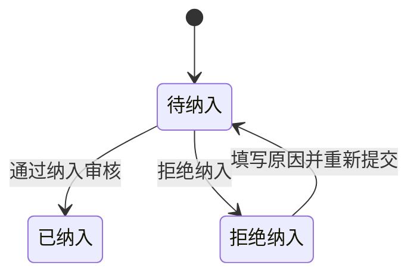
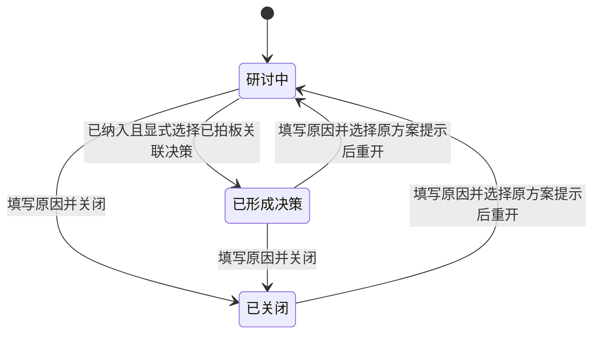
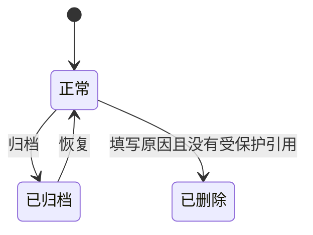

# 议题状态与历史

本页面向使用和维护项目议题的人，解释第一批已实现的状态、操作条件及实际影响。问题型议题与推进事项使用同一套规则；回复、讨论处置及人工实际结果确认分别记录自身事实。

## 议题的独立维度

页面把纳入状态和研讨进度同时展示；归档与删除控制对象的可见性及维护入口，重开提示记录对原方案的建议。各维度分别保存事实，任何一个维度都不能推断任务或运行状态。

| 维度 | 回答的问题 | 状态或取值 | 实际影响 |
| --- | --- | --- | --- |
| 纳入状态 | 项目是否接纳这个议题？ | 待纳入、已纳入、拒绝纳入 | 决定纳入审核及重新提交入口 |
| 研讨进度 | 议题目前推进到哪一步？ | 研讨中、已形成决策、已关闭 | 决定确认决策、关闭及重开入口 |
| 保存与可见性 | 议题是否继续保留在日常视图？ | 正常、已归档、已删除 | 归档后只读且默认隐藏；删除后退出页面和选择器 |
| 实际结果确认 | 现实中是否达到当时预期？ | 未记录、人工确认、追加更正、撤回 | 按当时条件保存判断与依据；不改变任务或运行 |
| 原方案执行提示 | 重开时对原方案有什么建议？ | 未设置、继续执行、建议暂停 | 展示提示；任务和运行独立处理 |

新议题默认是“待纳入 + 研讨中 + 正常”，原方案提示未设置。例如“已纳入 + 研讨中”表示项目已接纳，议题仍在研讨；“拒绝纳入 + 研讨中”保留修改、讨论和重新提交的机会。

## 纳入状态：接纳议题的资格

| 操作 | 前置条件 | 改变什么 | 保留什么 |
| --- | --- | --- | --- |
| 通过纳入 | 待纳入、未归档 | 纳入状态成为已纳入，记录审核人和时间 | 研讨进度、正文及历史 |
| 拒绝纳入 | 待纳入、未归档 | 纳入状态成为拒绝纳入，记录审核信息 | 同一议题和既有讨论 |
| 重新提交 | 拒绝纳入、未归档，原因必填 | 返回待纳入，清空当前审核字段 | 时间线中的旧审核记录、修订、研讨进度 |

正文修改不自动重新提交。已纳入议题重开时，纳入状态仍是已纳入。当前没有“已纳入直接改为拒绝”的操作。

## 研讨进度：讨论、形成决策与关闭

| 进度 | 含义 | 可执行的进度操作 | 讨论与正文 |
| --- | --- | --- | --- |
| 研讨中（`open`） | 议题正在研讨或重审 | 已纳入时可确认已形成决策；也可关闭 | 未归档时可讨论和修订 |
| 已形成决策（`decided`） | 用户明确关联已拍板决策并确认此进度 | 关闭或重开 | 未归档时可讨论和修订 |
| 已关闭（`closed`） | 用户决定结束当前议题推进 | 重开 | 未归档时仍可追加反馈和修订 |

“已形成决策”要求所选决策属于同一项目、关联当前议题并已拍板。创建决策本身不会自动改变进度。该进度也不表示目标已经实现。

重开要求填写原因，并明确选择“原方案继续执行”或“建议暂停原方案”。重开把进度变成研讨中，保留原决策。建议暂停在议题及关联决策视图突出显示；它不修改任务、执行尝试、Request 或 Run，实际执行控制仍在各自入口处理。再次确认已形成决策时清除当前提示；关闭不会清除提示。

研讨、重议、纠偏表达评论意图，三个进度下都可使用。发帖不会自动重开、重新提交、改变决策或停止执行。“已关闭”是推进结论，讨论入口是否只读由归档控制。

## 归档与删除：可见性和恢复

归档保留纳入状态、研讨进度、提示和历史，默认列表、选择器、督查板及关系图隐藏该议题。开启归档查看或定位详情可阅读；恢复后重新提供维护入口。归档期间不可修订、发帖、审核或执行其他生命周期操作。删除归档议题需先恢复。

对使用者，操作名称是“删除”。确认后议题从页面移除，当前没有回收站或删除恢复入口。有决策、治理任务或项目工作引用时拒绝删除，即使关联工作已经完成也受保护；此时可归档。后端采用逻辑删除并保留历史和来源标识，防止渠道重导入复活对象。这里的内部存储方式不进入按钮名称。

## 修订与时间线：还原讨论脉络

当前标题和正文展示在历史列表上方。修改保存完整修订快照并记录原因；保存时检查预期修订号，遇到并发修改会拒绝覆盖，用户需重新读取再修改。正文修订不覆盖已记录的正式决策。

时间线按议题递增序号倒序展示创建、修订、评论、纳入通过或拒绝、重新提交、确认决策、关闭、重开和归档恢复等节点。评论绑定发布时的修订；展开快照可查看该时点正文。通过前后的普通研讨由纳入节点区分。正式决策绑定记录时的议题版本，后续正文更新保留原依据。

例如列表自上而下可呈现：纠偏评论 → 重开并建议暂停 → 修订正文 → 确认已形成决策 → 通过纳入 → 研讨评论 → 创建。读者可同时判断讨论发生时的正文、纳入状态及原方案提示。

## 旧数据、权限与验证边界

| 旧数据 | 迁移后的事实 | 无法补回的事实 |
| --- | --- | --- |
| proposed / canonical / rejected | 原样保留，分别显示待纳入 / 已纳入 / 拒绝纳入 | 未记录的状态变更 |
| 无研讨进度字段 | 统一初始化为研讨中 | 不从关联决策猜测进度，不推断目标达成 |
| 当前标题和正文 | 建立标为迁移来源的基线修订 | 基线之前的正文版本 |
| 创建、审核、旧评论 | 已知时间生成历史节点 | 旧评论及旧决策对应的正文版本记为未知 |

议题接口首先检查当前用户对有效项目的访问范围；生命周期及引用保护在后端执行。归档写入、无效转换、无有效决策的确认和有引用的删除会被拒绝。持久化操作在议题行锁及所属事务内收敛，创建引用也持有该锁，避免引用与删除竞争。

业务流程由 `governance_service.py` 拥有，查询和引用保护由 `governance_repository.py` 拥有，PostgreSQL 的 `yuanlei` 表保存最终事实。页面只展示接口结果，相关取舍见[生命周期决策记录](../develop-guides/yuanlei/decisions/implemented/2026-10-05-topic-lifecycle-revisions.md)，差异边界见[项目治理 Feature](../develop-guides/yuanlei/features/project-governance.md)。

真实 PostgreSQL 和 HTTP 测试覆盖修订冲突、重新提交、决策确认、归档恢复、引用删除竞争及运行状态不变；组件测试覆盖异步响应隔离。实际目标达成、回复和采纳不进入当前状态图。本地浏览器验收结果与适用屏幕宽度见生命周期决策记录。未发送讨论的正文与类型保留在当前工作台会话中，切换议题可恢复；整页刷新或离开工作台不提供持久草稿恢复。

## 回复、处置与实际结果确认

每条顶层讨论可发布一层回复，保存发布时议题修订；原讨论下按时间和ID正序显示。倒序时间线中的回复事件提供原讨论定位入口，原讨论在更早分页时也能独立打开。回复不能指向另一议题或另一条回复。

顶层讨论的采纳、部分采纳、不采纳使用独立处置记录，说明必填，未处置保持为空。修改处置追加版本，不改原评论。去向可指向同项目真实议题修订、决策版本或工作结果；没有去向时显示“尚未关联去向”。引用保存当时准确版本与快照，关联草案不批准决策，关联业务结果不改变验收。

预期结果和核对条件可保持空，修改随议题修订进入快照。个人通过“记录实际达成”提供说明与工作结果或证据；更正确认继续记录达成判断的修正，判断失效可撤回确认。三种动作都追加历史并保留当时条件。条件随后变化时，旧确认显示旧条件并提示当前条件已变化，不表示新目标已实现。

归档后回复、处置与确认只读。新写入在项目锁、议题锁内和历史同事务提交；处置与确认使用预期版本避免覆盖，实际确认还核对议题修订。响应丢失后相同操作与意图可重试，不重复节点；改变内容使用新请求标识。冲突或证据不可访问时保留输入。网页标注仅引用、未读取或验证，文件及附件在提交时由现有工作证据边界检查。

讨论处置、实际确认及对外议题修订引用加入删除保护。源决策、任务、执行与验收继续独立维护，不根据完成任务或接受业务结果自动推导议题实际达成。
