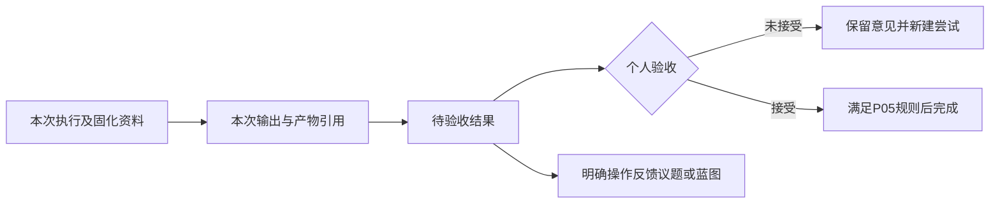

# P06完成核对与P07启动建议

检查日期：2026-10-06。

检查基线：`develop-v0.0.1`，`da51ad9710046769c7dc9d0f1cb33912eddbac50`。

## 1. 判断

P06核心范围及P05交接约束已实现，未发现阻止进入P07的功能遗漏或架构问题。建议继续原开发会话执行P07，不重做P06。本次未修改产品代码。

当前已经能够选择、预览、固化和回看执行资料。P07下一步是将同次执行输出转为P05的待验收业务结果，再由个人验收和反馈，不建设新的执行平台。

P03真实Codex成功产物和Multica出向仍未补验收。P06捕获的执行器协议与确定性回放不替代真实服务成功证据；该遗留范围继续明确保留。

## 2. P06要求与实现对应

| 要求 | 核对结果 |
|---|---|
| 资料选择 | 工作要求和来源默认纳入；议题修订、蓝图、结果、文件、附件可显式选择；知识库和网页为按需引用 |
| 来源版本 | 决策采用工作选定批准修订，保留当前效力提示；议题按选定或创建时当前修订读取，不替代正式决策 |
| 预览一致性 | 内容指纹排除读取时间；创建事务重新组装，指纹不同返回冲突；页面选择改变使预览失效并要求刷新 |
| 固化时点 | 创建ProjectWorkExecution时保存业务快照和实际prompt；待接受、排队及恢复继续使用原输入 |
| 直接委派 | ChannelDelegation保存自己的快照；任务载荷附加真实资料正文；正式执行中的工具委派继承当次快照 |
| 两类真实Owner | 不制造假Run或假执行尝试；共用组装服务，不合并底层状态机或runtime manifest |
| 预算及截断 | 固定256000字符预算；必需要求完整保留，超限显式失败；其他资料标明摘录、截断与实际注入正文 |
| 附件与文件 | 经过Workdir和对象存储读取；跨工作附件拒绝；非UTF-8作为引用；文件前缀哈希与全文哈希范围明确 |
| 历史回看 | 保存实际注入文本及支持范围内蓝图原文；更名不覆盖旧快照；旧行为空并提示未记录 |
| 访问变化 | 历史接口核对当前项目/工作归属；运行知识库选择沿用快照并重新核对访问和项目关联，不静默换成当前选择 |
| 页面隔离 | 迟到预览、蓝图列表及切换工作响应不能串入当前资料；执行及委派均可进入历史查看 |
| 迁移 | yuanlei v33→v34为两个执行Owner增加可空JSON快照；旧输入保留，不推断旧快照 |

哈希不代表字节备份：首期保证已注入文本可回看，大文件其余字节不保证还原；网页仍明确未抓取。资料缺失以预览说明或运行失败结局呈现，没有声称所有引用都已读取。

## 3. 本次独立验证

已确认原开发工作区HEAD与检查节点一致且检查前干净，使用现有容器复跑：

- 前端三个相关文件18项通过，覆盖资料抽屉、任务详情及委派交互。组件stub/SSR提示未造成失败，不作为视觉验收证据。
- 后端40项通过：独立PostgreSQL/ASGI HTTP/真实对象存储资料测试3项、迁移单测22项、项目智能体服务单测15项。覆盖预览冲突、历史修订、两类实际协议正文、预算、UTF-8前缀、附件对象缺失、旧数据迁移及访问选择。
- 工程约束检查、70项检查器单测、增量diff空白检查通过。

仓库记录另提供真实API/worker确定性E2E四例、运行期撤销知识库关联后的明确失败、完整后端2797项通过/63项跳过、完整Web497项通过、真实浏览器及窄屏验收。本次审查了实现、测试和记录，未独立复跑完整套件、worker E2E、lint/build或浏览器，原截图未检查。

## 4. P07实施顺序与交接约束

### P07-1：同次输出形成待验收结果

首先扩展`reconcile_project_work_executions`及现有委派结果回收。当前智能体终态收敛已经验证Run归属和恢复链，并只从该Run的`output_message_id`与`Message.run_id`读取输出；保留这些约束，不改成按线程取最后一条消息。

成功执行有输出时，创建P05待验收结果，保存明确的尝试/委派来源、最终Run或turn/operation定位、摘要、实际产物引用及未解决事项。文字汇报可以作为结果，但不凭模型说“已完成”判断文件存在或业务合格；失败、中断、取消和缺输出不得伪装成功结果。

同一尝试重复收敛只生成一份自动结果，恢复链仍归原尝试；新尝试可以有自己的新结果。使用数据库唯一约束及稳定自动生成标识兜底并发和崩溃重试，区分自动导入与人工提交，保留人工补充能力。既有评论不批量迁移为结果，避免同次新输出反复生成重复评论/结果。

### P07-2：条件取自当次快照，沿用P05验收

**自动结果的要求必须来自P06当次快照，不能读取工作当前条件。**执行期间条件可以变化；旧条件结果仍可展示，P05现有版本与完成守卫决定它是否可用于当前完成。

P05人工`submit_result`要求匹配当前修订，不能直接拿当前修订调用它来伪造自动结果依据。抽取最小的追加写入过程供自动导入复用；结果接受和完成仍由P05服务拥有，不另开自动done路径。

P06现有快照的requirements项保存要求修订及组合正文。若P07需要单独的描述/验收条件字段，给后续快照增补最小结构化字段，并兼容已有快照；不得从当前任务补旧值，也不要靠拆提示词标题猜测原条件。缺少可核对旧条件时明确显示依据不足，不能静默算作满足当前条件。

结果显示“待验收/接受/未接受”，执行显示“结束/失败”，两者分开。接受可以保持工作待办；接受并完成复用P05的两类活跃执行、Git成果、证据访问和通知幂等规则。未接受保存原因，允许新尝试选上次结果与验收意见。

P06当前结果资料只注入摘要、未解决事项和状态说明；P07应补入所选结果的验收意见，并标明按哪个修订验收。避免新尝试只看到失败结果却看不到拒绝原因。

### P07-3：结果反馈到议题

提供明确按钮及文字预览，选择研讨/纠偏和同项目目标议题，追加评论并关联结果，记录反馈发生时的议题修订。结果卡可以打开反馈，议题评论可以返回结果。

复用现有议题锁、历史事件及归档只读规则；归档时提示先恢复，不绕过。重复确认不重复追加同一反馈，不自动重开议题、修改决策或清除执行暂停标记。仅建立当前需要的关系，不造通用事件或图平台。

### P07-4：补入蓝图复盘

从结果与验收意见生成可编辑预览，用户选择蓝图并确认后通过现有文件保存入口追加或编辑。保存前核对读取时的内容版本/哈希；发现外部编辑或更名，提示刷新比较，保留反馈草稿，不能覆盖对方改动。

共用工作目录继续显示P04提示；已存在蓝图不重新套模板、不自动全文改写。文件写入与数据库不能假装同一原子事务，若同时记录反馈定位，失败和重试必须有可观察状态，不能写成已保存却找不到文字。

### P07-5：闭环验收

验证两次不同尝试输出各自归属；中断恢复仍归原尝试；相邻Run不能串结果；缺输出显式失败；并发及重试不重复结果；任务条件在执行中修改后结果保留旧依据且不能直接按新条件完成；自动结果只待验收；未接受后新尝试收到原验收意见；人工短路径仍可用；委派回收结果保留真实来源；议题反馈双向可定位且不自动重开；蓝图并发修改不被覆盖。

最后用一项隔离真实工作完成“资料预览→执行→结果待验收→未接受与再尝试→接受→完成→反馈”链路，回读输入、输出、结果、通知与文件。确定性worker链路与真实外部成功链路分别报告；Codex/Multica未配置或未成功时继续标明未验收，不替代为内部stub通过。

## 5. 可直接发送给原开发会话

> P06已核对，基线为`develop-v0.0.1`、`da51ad9710046769c7dc9d0f1cb33912eddbac50`。继续原第一阶段计划P07“执行与结果模块：完成一次交付并反馈”，同时遵循本交接文档第4节。
>
> 先列终态/回收Owner、最小模型补充、自动结果幂等、当次条件来源、反馈写入和验收方案，再开发。保留现有Run归属与恢复链，只从本次Run输出或委派回收事实产生P05待验收结果，不取线程最后一条消息，不自动done。结果保存当次P06要求依据；不要调用人工接口时用当前任务条件替换旧要求，必要时抽取最小未提交写入过程。快照不足的旧值不猜测补填。
>
> 同次收敛重试不重复结果，验收和完成沿用P05守卫。新尝试选择上次结果时补入验收意见。先完成输出→待验收→人工接受/未接受→完成链，再做议题反馈和蓝图复盘：议题使用现有版本/锁/历史并可返回结果，不自动重开；蓝图先预览确认，保存前检测内容变化，不能覆盖外部修改。
>
> 按第4节完成数据库、真实worker、协议与页面验收。人工短路径继续保留；团队权限、周期Work Definition和通用图/Review平台不在本批。P03真实Codex成功产物和Multica出向继续独立补验收，未通过不声称通过。

## 6. 依据

- [检查提交](https://github.com/Sxyon/Yuanlei/commit/da51ad9710046769c7dc9d0f1cb33912eddbac50)。
- 仓库记录：`docs/develop-guides/yuanlei/decisions/implemented/2026-10-06-work-context-snapshots.md`。
- 原第一阶段计划P06、P07，以及P05、P06当前服务与数据事实。
