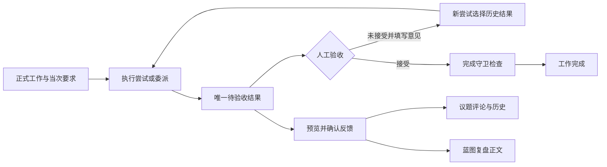

# P07完成核对与P08启动建议

审查日期：2026-10-07。基线：`develop-v0.0.1`，`db0963e1d525e0c6c49ed81e0f08b9b6a49c6b14`；对比上一阶段 `da51ad9710046769c7dc9d0f1cb33912eddbac50`。依据：原第一阶段计划和《P06完成核对与P07启动建议》第4节。只审查，不修改产品代码。

## 1. 结论

**P07的本阶段实现可以收口，可以开始P08。** 本次未发现阻止进入下一阶段的问题。

已完成的核心能力是：同次执行或委派回收形成唯一待验收结果，保存当次要求与真实输出来源；人工接受或拒绝，满足完成守卫后结束工作；显式确认后将结果反馈到议题或蓝图。保持个人先用、项目扁平、松散关联，没有提前引入团队权限、周期工作或通用图平台。

“可以开始P08”不等于所有执行渠道和第一阶段整体都已验收。真实Codex成功产物、Multica出向仍需补验；本次没有重新执行浏览器和完整worker E2E，仓库记录与本次复验分开列出。

## 2. P07实现核对

| 原要求 | 当前实现与判断 |
|---|---|
| 同次输出自动成为业务结果 | Run收敛只读取该Run绑定的assistant输出；委派从本次回收结果导入。结果先pending，不自动完成工作。符合。 |
| 重试、恢复不重复、不串结果 | 自动来源有稳定标识和数据库唯一约束；结果追加只flush，由收敛/回收事务提交。委派租约接管后，迟到收集者不能覆盖新结果或释放新租约。符合。 |
| 保留执行当时的条件 | P06要求项增加结构化描述、条件及修订；自动结果从当次快照读取，不能借用当前工作要求。旧快照缺条件时明确阻止接受和完成。符合。 |
| 人工验收与完成分开 | 未接受必须填写意见；接受检查当前条件与证据；完成沿用活跃执行、Git确认与通知幂等守卫。符合。 |
| 反馈进入下一次输入 | 新尝试选中历史结果后可携带验收意见；仓库有实际worker输入及持久事实回读记录。符合实现边界，本次未重跑该E2E。 |
| 反馈议题可追溯 | 同项目目标、结果/议题版本检查、幂等确认、评论与历史同事务写入，双向返回来源；归档只读，不自动重开或改决策。符合。 |
| 蓝图复盘不覆盖改动 | 可编辑预览，保存核对哈希和文件身份；冲突保留草稿，刷新显示最新原文，人工确认合并。符合。 |
| 旧数据可升级 | yuanlei 34→35；旧人工结果保留；旧执行不伪造要求快照。真实数据库迁移及重入复验通过。 |

蓝图写入的保护范围要准确理解：受控Workspace操作按物理目录使用跨进程文件锁；哈希与文件身份核对阻止已发生的外部修改。直接绕过这些入口的shell或外部进程写文件，不受该锁约束，最后检查与原子替换之间仍有竞争窗口。当前记录已明确这一限制，不需要为P08引入文件版本平台。



## 3. 验证证据与未验证范围

审查克隆和运行容器所挂载的原开发工作区均核对为本次commit；原开发工作区无未提交修改。以下为本次独立复跑结果：

| 检查 | 结果 |
|---|---|
| `test_project_work_context.py`、`test_delegation_service.py`、`test_project_work_execution_service.py`、`test_filesystem.py`、`test_storage_migration.py` | 合计67项通过；覆盖隔离真实PostgreSQL、HTTP反馈、自动结果唯一性、旧要求拒绝、迁移、租约接管及受控文件并发。 |
| `resultFeedbackPanel.test.js`、`workResultsPanel.test.js` | 8项通过；覆盖失败草稿、幂等标识、迟到预览、冲突合并、切换任务与完成确认。 |
| 前端 `pnpm run lint:check` | 通过。 |
| 工程约束检查和检查器测试 | 约束通过；70项测试通过。 |
| `git diff da51ad9 db0963e --check` | 通过。 |

后端有pytest缓存目录不可写提示，不影响测试断言及结果。

仓库《P07执行与验收记录》另记载完整后端2800通过/63跳过、前端499通过、build、确定性真实API/worker闭环及浏览器验收。这些是开发记录，不能表述为本次全部重新验证。本次也未确认其本地截图附件的视觉质量。

**保留动作：**在第一阶段最终验收前，补一次真实Codex成功产物和Multica出向回收，回读实际输出、结果归属及人工验收状态。未配置或未成功时继续标明未验收。可与P08独立推进。

## 4. P08按顺序执行的工作包

P08目的：默认首页能回答“还有哪些事情待处理、哪些正式工作在推进、哪些结果等我验收、哪些异常需要查看”。本阶段改默认概览及其读API，不改执行、验收状态机。

当前切入点很明确：`inspection_board_service.py`仍主要汇总治理对象和Run；跨项目`blockers`来自历史failed/interrupted Run数量。`DefaultProjectDashboard.vue`仍显示旧待办统计；`ProjectGovernanceGraph.vue`任务列仍读取`governance.tasks`。这些是P08应修正的对象，不是P07遗漏。

### P08-1：先固定统计口径，再补只读API

1. 在现有inspection服务/repository增加正式工作、结果及反馈的读取；不得以工作建议或Run数量代替正式工作进展。
2. 待处理分开列待纳入议题、未纳入工作建议、草稿决策。议题归档后不进入日常待处理；已纳入建议不重复计入。
3. 正式工作按已有状态分组。业务受阻只取工作`blocked`；逾期按`due_date`与明确的日期口径判断，已完成工作不算逾期。受阻和逾期可以交叉，不能简单相加成总工作数。
4. 待验收按结果`pending`统计，另显示涉及的工作数。一个工作两份结果应显示“2份结果，1项工作”；工作完成状态不反向改写历史结果。
5. 执行异常展示失败/中断事实及对应工作和尝试；不再把全部历史失败标为当前业务阻塞。至少区分“当前仍需查看的执行异常”和“历史异常”，后续尝试成功或工作完成后，旧失败保留可查，但退出当前异常提醒。先列清楚使用的已有状态与关联字段，再实现判定。
6. 统计和分页使用同一项目可见性与过滤条件；摘要返回总数，列表返回分页信息，不用截断列表长度冒充总数。归档、终态、排序、日期口径写入测试和功能说明。

验收：构造独立工作、已纳入建议、blocked、逾期、done但日期已过、单工作多结果、失败后成功七类数据；用数据库回读核对统计，历史失败不能形成永久阻塞。

### P08-2：默认概览四类卡片和准确跳转

沿用现有组件与样式，上方四组：待处理、工作进展、待验收、异常。每组显示数量及少量最近记录，更多入口打开相同过滤范围的列表。

- 待处理：明确条目是议题、工作建议还是草稿决策。
- 工作进展：显示编号、标题、状态、截止日期；业务受阻与逾期分别标记。
- 待验收：显示结果摘要、对应工作、产生时间、要求修订；点击定位结果卡，不只打开工作台首页。
- 异常：标明执行失败/中断，不混用工作受阻；打开具体尝试或委派。
- 下方保留蓝图和近期有效决策。近期复盘优先读取已有结果—议题反馈；蓝图是文件正文，目前没有独立结构化复盘记录，不把文件修改时间冒充一次复盘。不为此新建通用Review模块。

```text
项目名称                                      进入工作台
┌ 待处理 ─────┐ ┌ 工作进展 ───┐ ┌ 待验收 ─────┐ ┌ 异常 ───────┐
│议题/建议/决策│ │进行中/受阻/逾期│ │结果数/工作数 │ │当前执行异常 │
└───────────┘ └───────────┘ └───────────┘ └───────────┘
只读关系图：议题 → 决策 → 正式工作 → 结果
项目蓝图                  近期有效决策 / 最近议题反馈
```

已有自定义Dashboard原样保留。加载、空状态、请求失败、窄屏显示需覆盖；切换项目时迟到响应不串项目。详情操作后返回概览应重新读取，首版用现有刷新机制，无需新建实时事件平台。

验收：变更工作状态、生成pending结果、验收、完成后，概览刷新与详情一致；每个条目能定位到唯一维护入口。核对浅深主题和窄屏。

### P08-3：关系图改为正式工作及实际结果

1. 任务列从`GovernanceTask`改为正式工作；建议保留独立待处理列表，已纳入建议可跳转正式工作。
2. 从已保存的来源字段画议题/决策到工作的边，从结果归属画工作到结果的边。独立工作可以没有前置节点，不强迫补议题或决策。
3. 明确当前工作来源和执行当次冻结来源的区别。默认展示当前关联；历史依据通过执行详情定位，不能把旧尝试关联画成工作当前关系。
4. 引用旧决策修订时保留修订信息及入口，不把已替代决策显示成当前有效版本。结果反馈到议题的边应标明“反馈”，不能与工作来源边混为一谈。
5. 每类节点上限与遗漏数量明确显示；未显示的关联节点提供历史入口，不画不存在的数据，不建可编辑图副本。

验收：旧修订、独立工作、多结果、已纳入建议、超显示上限的场景均能正确阅读和跳转。结果无title时用摘要/工作编号形成可读节点，不能套用旧任务标题字段。

### P08-4：巡检与收件箱文案、最终验收

将规则触发的检查准确标为“系统规则巡检”；实际智能体执行保留真实Agent与Run入口。负责人仍是标识，不新增角色、审批权限或任务分配权限。

完成真实HTTP聚合测试、前端交互测试、lint/build及一组隔离项目的真实页面验收。统计回读、跳转、返回刷新、用户自定义Dashboard保留分别给证据；再更新功能说明和决策记录。P09回复/采纳与目标实现、周期Work Definition、通用图引擎、团队权限不进入此批。

## 5. 可发给原Codex开发会话的启动内容

> P07已完成核对，可以继续原会话执行P08“概览模块：反映正式工作进展”。基线为`develop-v0.0.1`、`db0963e1d525e0c6c49ed81e0f08b9b6a49c6b14`，请先核对工作区；如HEAD已前进，说明差异并按当前事实实施，不回退现有代码。
>
> 按本交接文档第4节依次做：先补只读聚合与统计口径，再改默认首页四组卡片，再改正式工作/结果关系图，最后核对巡检文案与真实页面。代码首先从inspection_board_service.py及其repository切入，再到DefaultProjectDashboard.vue、ProjectGovernanceGraph.vue和现有定位入口。
>
> 概览以正式工作与业务结果为事实来源：建议不冒充工作、Run成功不冒充验收完成、历史Run失败不冒充当前业务受阻。pending结果数量与涉及工作数量分别展示，done工作不逾期，统计与分页范围一致。当前关联与历史冻结依据分开表达，每条可定位维护页，详情变更后刷新一致。
>
> 保留自定义Dashboard与现有状态机，不新建进度副本、图事实库、Review平台或团队权限。先提交具体字段/统计口径、页面布局、跳转和验证方案，再实现。真实Codex与Multica外部验收仍保留未验证标识，不用确定性worker测试替代。

无需终止原开发会话，也无需重新定义P07。把本文件作为P08的阶段交接发给原会话即可。
