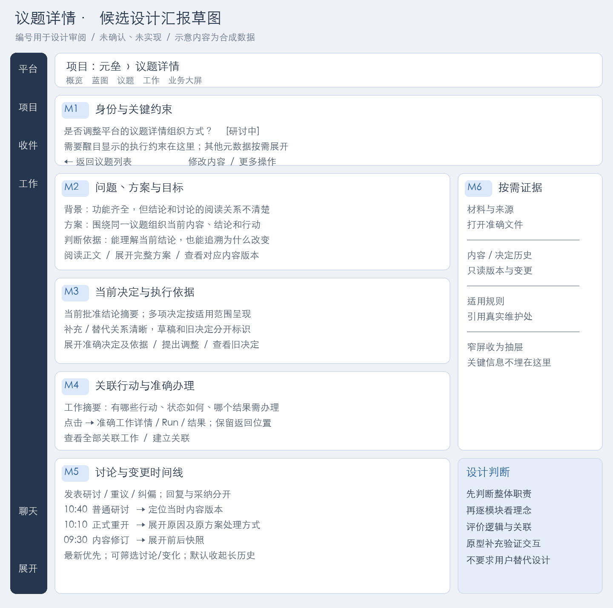
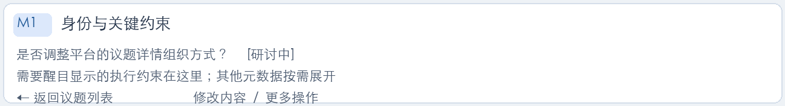
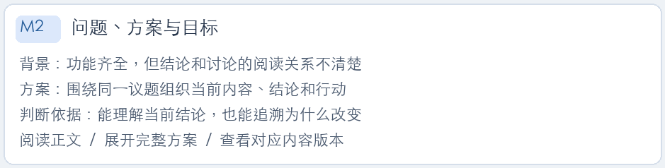
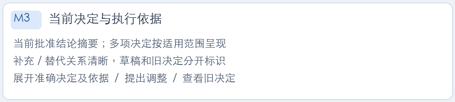
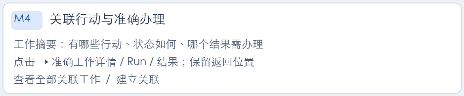
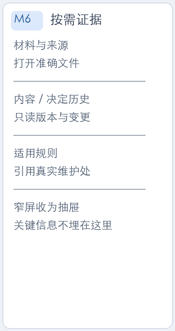

# SYS-DB-002｜议题详情设计汇报示范

读者：用户及 Dashboard 执行者。目标：示范可以用于设计决策的汇报方式；本稿是候选草图，未确认、未实现，不声明图中控件已有产品能力。真实设计需继续核对当前模型与接口。

## 1. 目标、整体与阅读顺序

议题详情拥有一个持续维护的问题空间。用户先看讨论对象，再看当前结论和要做的事，最后追溯讨论与变化。议题列表承担寻找入口；详情承担持续研讨与关联办理；准确工作详情继续承担结果接受等操作。

平台窄栏保留跨项目出口；项目导航保留当前项目定位。议题内的模块属于同一页面，可用锚点定位和渐进展开。推荐先采用主阅读区＋补充侧栏，窄屏将侧栏收为抽屉。导航的展开/固定、键盘与窄屏行为需在正式稿展示，不把悬浮作为唯一访问方式。

阅读顺序为 M1 身份和约束 → M2 问题与目标 → M3 当前结论 → M4 关联行动 → M5 讨论与变化；M6 为按需证据。图的编号用于评审定位，产品不要求展示这些编号。

## Archify关系图：补齐设计逻辑的汇报

<a href="图解/05-topic/topic-relations.html" target="_blank" rel="noopener">打开可探索关系图</a>。图型为architecture，按M1—M6映射模块职责、阅读关联、准确工作办理和返回上下文。页面草图解释位置与信息层级，关系图解释路径和边界，两者共同用于审阅。

本图依据本候选稿编制，未宣称已核验当前产品源码。图中箭头为设计关系，并非已实现API调用。后续技术汇报的真实接线图需冻结代码版本并附源码证据。

汇报时先说明设计目标，再结合关系图指出本轮涉及的节点、路径及取舍，随后用局部页面图解释为什么这样呈现。单模块发生复杂审批、调用或恢复过程时再补workflow、sequence或lifecycle；无需每轮重画不变的关系。

## 2. M1｜议题身份与关键约束

**设计理念：**先建立“我在什么项目、处理什么问题、当前结论能否继续使用”。标题与状态优先；暂停或依据失效等影响执行判断的提示紧邻身份区。普通元数据放入展开信息。

**操作逻辑：**返回保留列表筛选；修改打开当前议题内容的编辑方式；重开等动作明确目标议题和原因，写入历史。页面导航与业务状态分开，点击某个区块不改变状态。

**取舍：**推荐显示少量关键操作，其余放入更多菜单。把所有按钮铺在标题下会增加阅读负担。若日常高频操作的实际观察表明菜单妨碍使用，再调整可见按钮。正式稿必须说明已归档、已达成、已拒绝等状态可用操作。

## 3. M2｜问题、方案与目标

**设计理念：**正文首先解释“为什么讨论、准备改变什么、怎样判断结果”。用阅读态组织背景、方案和目标，编辑表单按需打开。长正文显示摘要与展开，不截断到无法判断方案。

**操作逻辑：**编辑的是最新内容版本；查看旧版进入明确版本，当前与历史醒目标识。正文修订和正式结论变更遵守各自规则，不能仅改正文就悄悄改变已批准依据。

**取舍：**推荐结构提示配合自由正文，避免要求每个问题都填业务目标表。问题型议题和推进型议题均能表达；“形成结论”与“实际目标达成”分别解释。若当前模型没有结构字段，先在展示/编辑提示层实现，字段新增另行说明。

## 4. M3｜当前决定与执行依据

**设计理念：**结论在正文后清楚呈现。一个议题可关联多项决定，主决定及补充决定的有效范围须可理解。统一页面不意味着合并数据库对象。

**操作逻辑：**当前批准决定可展开依据、版本、补充/替代关系；草稿独立标识，旧决定移入历史但可回溯。提出调整进入明确的决定操作，不用一条讨论冒充批准。正式设计须映射已有批准、撤销及替代 API，并处理并发冲突。

**取舍：**推荐结论摘要＋按需展开，历史默认收起。若多项决定无法归纳，列表必须显示各自目标和适用范围，不强选“唯一当前决定”。图中只有一个示例摘要，不构成一对一模型约束。

## 5. M4｜关联行动与准确办理

**设计理念：**让用户理解“结论落到了哪些行动、现在需要处理什么”。显示工作名称、状态和需要关注的结果，避免任务字段全集占据正文。

**操作逻辑：**关联工作打开准确工作详情，并携带项目、议题与返回上下文；结果办理定位准确 Run/结果。建立关联是明确操作，正文提及名称不能自动形成正式关系。跨项目同名工作以项目及准确身份区分。

**取舍：**推荐少量摘要与全部入口。任务创建/结果接受仍在职责明确的办理区完成，用户返回议题后保留位置。任务完成不会自动推定议题目标达成。没有关联工作时说明空态并提供建立关联入口。

## 6. M5｜讨论与变更时间线

**设计理念：**像论坛主题一样持续讨论，同时能理解“当时内容是什么、之后为什么改变”。研讨、重议、纠偏与通过、重开、修订等事件在同一时间轴分型呈现。

**操作逻辑：**最新优先；每条讨论能定位当时版本，回复与采纳结论分开。系统事件可展开前后快照。筛选“讨论/变化”只改变视图，不删去事实。历史讨论引用旧决定时清楚标注，不悄悄替换成新内容。

**取舍：**推荐单时间线＋筛选，保留回复层次并控制默认展开量。完全分开的讨论页与历史页会丢失因果；全部事件正文展开会造成噪声。正式稿根据已有回复能力决定首包实现，不能从示例推定回复/采纳字段已经存在。

## 7. M6｜材料、历史和适用规则

**设计理念：**辅助判断的信息容易找到，主线保持清楚。材料、版本历史和适用规则按需展开；与本次决定强相关的依据仍在 M3 显示引用。

**操作逻辑：**文件指向准确来源；旧版以只读历史打开；规则引用其真实维护处。将材料关联到议题不扩大原文件权限，无法读取时说明原因。议题独有的补充约定可展示，但不能复制规则正文形成两个维护源。

**取舍：**推荐宽屏侧栏、窄屏抽屉。若阅读观察证明侧栏影响正文，就将低频内容全部收为详情按钮；不通过额外常驻导航增加层级。

## 8. 正式审阅必须补齐的状态与比较

| 状态 | 图稿必须表达的差异 | 保持的架构边界 |
| --- | --- | --- |
| 研讨中、无批准决定 | M3 说明未形成有效结论，草稿有明确标识 | 讨论不能等同批准 |
| 已批准并执行 | 当前依据、关联工作、需要处理的准确结果 | Run 完成不等于业务接受或目标达成 |
| 重开且暂停原方案 | M1 醒目提示，M3 说明原结论处理方式 | 议题要求与任务运行松散解耦 |
| 旧条件下生成的结果 | M4 摘要提示，工作详情展示准确依据 | 旧结果不能冒充当前条件交付 |
| 历史、归档、并发冲突 | 只读/可用动作和冲突处理入口 | 不丢版本，不覆盖他人更新 |

正式稿还应比较“主阅读区＋侧栏”和“全文单列＋按需抽屉”，提供完整平台外壳和窄屏图。当前推荐前者，是为了同时保留正文阅读与证据定位；实际内容宽度、辅助材料使用频率可以推翻推荐。

## 9. 用户审阅与下一步

需要审阅的是：整体职责与入口是否合适；阅读顺序是否符合思考方式；每个模块是否帮助判断和操作；当前与历史的表达是否清楚。用户可直接指出 M3 的理念或 M5 的逻辑问题，无需先操作原型完成任务。

Codex收到反馈后，说明影响哪些模块和边界，更新整体及局部图，再集中确认关键取舍。正式稿确认相应范围后进入产品实现，自行完成验证。图中未核实的能力须在正式稿标为新增/复用/暂缓，给出技术映射与代价。

每轮汇报示例：目标维度说明“本轮把议题的当前结论与持续讨论组织为同一阅读主线，M3/M5如何服务这一目标”；技术维度随后说明“采用哪些现有接口、哪些只改展示、哪些新增字段、后续接入哪些模块、哪些尚未核验”。本示范没有实现这些产品改动。
