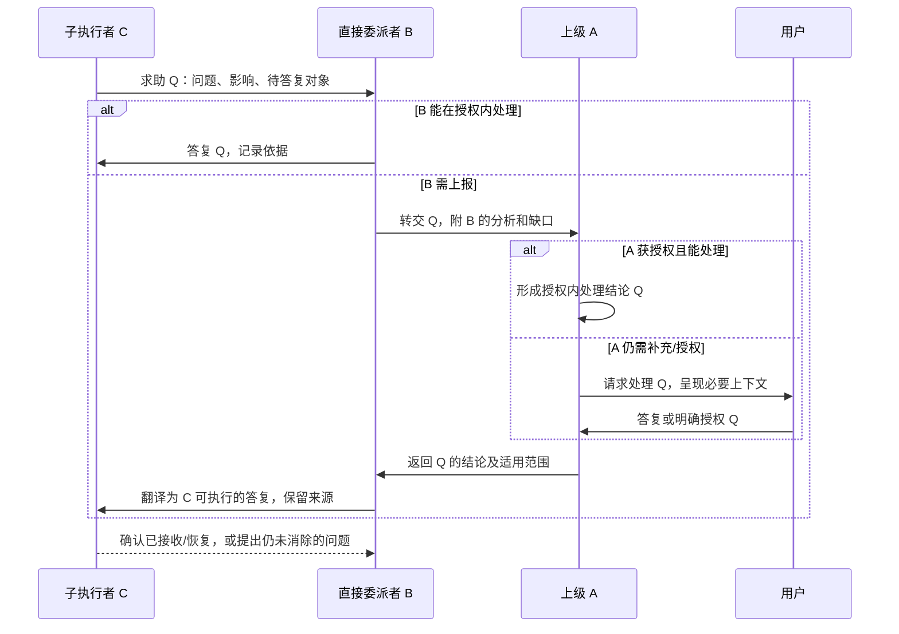

# 协作接入、过程汇报与 Andon 专项规划

日期：2026-10-08；元垒代码事实基线：`ef65969`。

配套：[两项专项总纲](第一阶段两项专项规划总纲-2026-10-08.md)、[Dashboard 专项](信息架构与Dashboard专项规划-2026-10-08.md)。本文规划长期专项的研究轮次与验收方向，不是已定稿的数据库、协议或一次性实施任务。

## 1. 专项目标

以 Multica、本地 OpenClaw 为实际接入样本，与已有本地 Agent/Codex/OpenCode 比较，建立能够逐步扩展的协作契约：

- 明确任务交给谁、实际触发哪次执行。
- 传递当次业务资料与约束，取得准确交付结果。
- 保留执行者可提供的过程补充，委派者按需读取、综合与继续上报。
- 用 Andon 把问题交给直接委派者处理，不能处理再上报；答案可沿原链逐级返回。
- 允许用户明确授权后，智能体批准部分正式决策变更，并记录授权与实际行为。

目标不是重建远端运行器、统一全部提供者设置或替所有 AI 服务设计万能生命周期。

## 2. 已确认的业务原则

### 2.1 三类协作信息分别拥有含义

| 类型 | 含义 | 行为 |
| --- | --- | --- |
| 正式交付 | 本次工作实际产出的文本、文件、PR、数据等 | 绑定准确运行与条件，形成待验收结果 |
| 过程补充 | 执行总结、依据、尝试、发现、建议、必要说明 | 委派者选择阅读深度、汇总或转述，不能冒充交付已合格 |
| Andon 求助 | 缺信息、需判断、越界或异常导致需要上级处理 | 有明确待答复对象和返回路径，必要时暂停受影响执行 |

过程补充不应被强制写成完整工具日志或模型全部思考。可提供重要事实、理由摘要、失败尝试与引用；没有附加发现时不强迫凑文字。

未解决阻塞、越权请求、交付缺项等影响任务判断的事项不能仅放在可选附件里等人碰巧阅读，应在结果/求助摘要明确可见。选择不展开补充，不等于对隐藏问题作出同意。

### 2.2 “上级”是委派链中的处理者

A 委派给 B，B 再委派给 C，C 的直接处理者是 B，不是自动通知人。B 结合自己掌握的上下文和授权，可以答复 C，也可以补充分析后向 A 求助。A 同样处理，必要时才请求用户。

这是一次执行的因果关系，不是第三阶段的公司组织树、职位或审批链。任务负责人标明关系仍不等于审批权限。

### 2.3 用户已确认的授权扩展

用户选择：**允许在用户明确授权后，由智能体批准部分正式决策变更。**

专项应区分：

1. 本次委派范围内的执行解答与调整。
2. 依据明确授权批准正式决策变更。
3. 不能判断、超出授权或需要新增授权，继续逐级上报。

授权需可被 owning 服务实际核查，不能仅凭模型文字“用户授权我”。研究其对象/范围、上限、期限或适用尝试、是否可再委派及撤销行为；这些是个人授权，不扩成组织 RBAC。

正式变更保留版本、原依据、批准者、授权人和授权依据，不能把真实批准者全部伪装成用户。当前权限模型和工具审批必须逐处核对，收到业务答复不自动绕过文件/命令/远端动作的实际授权边界。

## 3. 现有基础与需要补足的接缝

已有委派协议、适配器注册、持久 ChannelDelegation、租约、来源快照、结果导入、子运行关系与中断恢复能力，有复用价值。

研究应从这些 Owner 出发，而不是并行新建一套同样功能：

- `delegation/contracts.py`、`delegation_service.py`：外部委派与回收。
- `delegation/multica.py`、`channel_sync_service.py`：出向/入向边界。
- `subagent_run_service.py`、`subagent_thread_repository.py`：原生父子线程与准确来源。
- `agent_run_service.py`：interrupt/resume 与新恢复 Run。
- 原有工具审批、工作结果与收件箱服务：各自实际状态和权限。

现有子线程/恢复关系不等于已经具备跨平台 Andon。当前普通问题经人答复的入口，与上级智能体逐级处理的入口也不能简单当作相同授权。

当前 Multica 的按钮终态不一致、提前回收封存、回收原描述、未绑定远端 Run 等，作为明确缺陷保留，不用“未来完善框架”替它们拖延；具体修复放在受影响增量中独立验证。

## 4. 首轮事实与能力摸排

### 4.1 实际部署信息在专项中确认

确认用户实际 Multica 版本/工作区/执行者/runtime，以及本地 OpenClaw 的版本、Gateway、Agent 与运行方式。先检查只读可见能力与配置状态，不读取输出密钥，不安装升级或直接写远端任务。

“本地”不代表元垒容器里的 localhost 就能访问宿主 Gateway；目录也不能直接假定共享。连接地址、认证、网络与文件映射需按实际部署验证。

不因为官方最新文档有某接口，就假设用户安装版本具备。记录支持的版本与协议，探测不确定状态要明确未知。

### 4.2 提供者能力矩阵

按实际证据分别记录：

| 能力 | 需要回答 |
| --- | --- |
| 连接与发现 | 可否辨认服务器、工作区、Agent、runtime、版本及就绪状态 |
| 派发 | 如何触发真实执行，是否有调用方幂等键/返回准确句柄 |
| 运行身份 | 会话、工作项、Run、turn 如何区分与关联 |
| 观察 | 查询、事件/流、回调支持什么；断线如何回读 |
| 输出 | 当次最终文本、文件、PR、用量、错误从哪里取得 |
| 补充汇报 | 能否提供概要、进展、引用和主动发现，能否单独读取 |
| 求助 | 能否主动提出可标识的问题、进入等待、接收答复 |
| 恢复 | 原执行续接还是新尝试；如何关联旧等待对象 |
| 取消 | 支持请求还是确认停止；对后代和晚到结果有什么影响 |
| 配置 | 哪些是连接配置、远端 Agent 配置、当次覆盖，能否查看生效版本 |

能力标为真实验证、代码/文档支持但未验、无能力或未知。没有取消/续接接口时显示限制，不能由本地状态修改伪装远端已停止/恢复。

## 5. Multica 与 OpenClaw 的研究差异

### 5.1 Multica

优先研究选择远端 Agent、创建/分派工作项、取得具体 task-run、输出/评论/产物、多个运行的绑定，以及 issue 状态与执行状态分离。

入向同步与出向委派需要关联识别，避免委派出去的 issue 又变成不相关新议题。外部变更可以作为观察或讨论输入，不静默批准本地决策、改写工作条件。

不能用“创建工作项成功”代替“执行已经启动”，也不能把描述和 done 字符串当真实交付。

### 5.2 本地 OpenClaw

官方资料将 Gateway 作为控制接口，使用 WebSocket 的角色/范围握手，并涉及 Agent、session、run 与审批等能力。[Gateway 协议](https://docs.openclaw.ai/gateway/protocol)

其原生子任务文档有结果向直接父级返回、父级综合后继续向上汇报的链路；这是用户逐级处理构想的可研究参照，但完成 announce 不等于元垒的阻塞求助与持久答复闭环。[嵌套与 announce 链](https://docs.openclaw.ai/tools/subagents/nesting)

会话工具文档区分 session 与 run，描述创建子会话、跨会话发送与 task 恢复；专项需核对实际安装版本的准确行为。[会话工具](https://docs.openclaw.ai/concepts/session-tool)

研究可选的 Gateway 原生接入与受控 CLI 路径，比较身份/结果准确性、交互、恢复、配置和维护成本。可以验证远端/本地可提供哪些能力，但不能为了配齐接口 fork OpenClaw 重写其内部子任务系统。

元垒只对自己能准确映射的运行与问题作承诺。OpenClaw 自己产生但未通过接口暴露的内部后代，可作为其局部协作树；元垒不猜测全树，也不依赖扫描私有 transcript 文件充当稳定协议。

## 6. 配置管理：统一组织，保留差异

### 6.1 四层概念

| 层 | 用途 | 管理边界 |
| --- | --- | --- |
| 提供者类型 | Multica、OpenClaw、既有编码执行器 | 说明协议与能力，非某个实际账号 |
| 连接实例 | 某服务地址/工作区/本地 Gateway、凭据引用与状态 | 一种提供者可有多个连接；不以 executor_key 代表全部身份 |
| 协作者目标 | 该连接中的远端 Agent/session/runtime 或已约定入口 | 与元垒数字员工角色的映射明确，不自动同步所有设置 |
| 当次执行配置 | 已选目标、允许覆盖、业务资料与约束、生效配置证据 | 绑定本次委派，不能从当前全局配置推断旧执行 |

共通字段统一呈现，提供者专属字段按其配置契约呈现。共通界面不等于所有原始配置都存成一个无验证 JSON 文本框，也不等于强制所有提供者拥有模型/沙盒相同字段。

### 6.2 必须比较的取舍

- 元垒只管理连接和目标，远端长期配置仍在远端；或由元垒有限管理哪些远端设置。
- 动态发现目标还是手动配置绑定；连接异常时能否保留明确目标而不静默换人。
- 配置是否按版本固定，还是记录远端实际生效摘要；远端无法固定时诚实说明。
- 凭据引用、配置验证与连接就绪如何进入日常体验，而不展示秘密值。

第一阶段不建设完整配置编辑器插件平台或统一密钥服务。先通过两个样本确定重复需求，再形成小的公共契约。

## 7. 过程补充与交付扩展

### 7.1 候选语义

可研究最小公共类型：执行摘要、进展说明、依据/引用、关键尝试、发现/建议、未解决事项。提供者仍可带带命名空间的专属内容，需版本与大小边界；不允许任意扩展覆盖公共状态。

公共部分给委派者简短概览与展开入口，详细过程可以按引用取得。委派者可阅读、综合、附到自身交付，也可只保留可回查来源。

不要求把每一步 token、工具输出和内部思考全部复制到元垒；现有日志保留原 Owner。过程摘要不能成为第二份可独立修改的运行终态。

### 7.2 真实性与范围

补充同样需要来源：本次 operation/远端运行、作者、时间/修订、内容或引用。区别执行者报告与系统独立验证；某条“测试已通过”只有自述时，应标明是报告而非验证事实。

多层综合保留原始来源链接，不用上级总结覆盖子执行者原记录。重要结论若基于有限摘录，应说明是否读取完整补充。

### 7.3 交付契约

正式结果需要明确内容与文件来源、验收条件快照及关联尝试。过程补充可在执行中或结束时追加，与已接受结果的修改规则分开。

重要补交如果改变交付结论，形成新的结果或明确修订，不把 accepted 历史悄悄换掉。可选补充内容不改变“无文件事项可接受”的最短路径。

## 8. Andon 的最小完整语义

### 8.1 一次问题有稳定身份

每次求助应能回答：哪个项目/工作、哪次委派/运行提出、问题是什么、需要怎样的答复、影响什么、谁当前负责处理、答案要回到哪里。

这些是概念性协议要求，不在此强制新建多少表或冻结字段名。至少需要稳定问题标识、原始等待对象/尝试、问题版本与当前处理节点；仅用“最新 session”或一段自然语言匹配不能满足要求。

升级时保留同一根问题及父子转交关系；每级可附加自己的上下文、分析、候选与权限边界，不替换掉原问题。

只有负责处理问题的节点取得其需要的上下文与受控引用，不因升级就把整个项目、全部子任务日志或凭据复制给每一级。真实运行父子关系与问题处理链可以不同，关联应显式记录，不能用某一时刻的进程树代替。

### 8.2 正常处理路径

各级不是简单转发。B 收到 A 的结论后，结合自己的分工转为 C 能执行的答复；若实质改变结论，应记录理由与适用授权，必要时再次确认，不能自行越权扩展。

### 8.3 处理状态与执行状态分开

研究状态含义：提出、处理中、已转交、等待补充、已有答复、答复已送达、执行者已确认/恢复、已解决、撤回/失效。

最终实现可以合并状态，但必须能区分：

- 上级写了答案，尚未送到。
- 平台接收答案，远端尚未确认。
- 执行者收到，但问题仍未消除。
- 该次尝试已取消/替换，旧答案不能继续执行。

不能以一次 HTTP 200 认定问题解决；不能以“已上报”自动关闭原问题；不能仅以自然语言中出现“继续”认定恢复成功。

### 8.4 暂停的粒度

阻塞当前子任务，不自动停止整个项目。能独立继续的分支是否继续，由直接委派者在明确依赖与授权范围内判断。

阻塞、提醒和建议分开。无需答复的进展说明不是 Andon；事实不明确时，不能无限盲目重试直到触发人。

等待时保留业务状态和持久等待信息，不长期占用数据库事务或要求运行进程一直存活。当前 runtime 能否 yield、interrupt、resume 或必须新 Run，在适配器试验中验证。

## 9. 防止答案丢失与错配的研究要求

### 9.1 回复关联

回复指向准确问题版本、原始等待尝试与处理链节点。使用外部 session/issue/run 的明确映射；问题标识和远端消息标识各有用途，不能混作一类。

原 Run 恢复后创建新的 Run 时，保留等待对象与恢复后继关系；不能把旧问题自动套到该 session 的最新新任务。

### 9.2 持久送达与可观察恢复

问题、转交、答案和送达进度在事实存储中持久化；提供者传输失败可重试且去重。研究复用已有投递/租约能力，必要时增加最小的待投递记录，而不是把 Redis 消息或进程内 Promise 当唯一事实。

提供者没有消息确认接口时，如实区分“已提交到接口”和“执行者确认”，不能伪造后者。送达失败保留入口，收件箱/协作详情能够看见问题仍未结束。

### 9.3 必须覆盖的边界

- 同一个求助重复投递，不产生多个互不相关问题。
- 两个子任务同时问相似问题，答复不串线。
- 父执行暂时结束/重启，问题仍可被原责任链继续处理；转交必须显式记录。
- 问题内容/依据变了，旧答案晚到需复核或失效，不能照常应用。
- 任务取消或重新委派，旧答复不恢复新尝试；晚到输出仍可保留历史。
- 多级转交不形成环；允许的深度、处理时限与升级条件可观察。
- 授权撤销/过期/越界，不能因上报中而继续批准。
- 一层收到答案后崩溃，重试不能重复正式决策或远端动作。

具体时限、级数、升级条件在场景验证后确定，不直接照搬某个平台默认参数。

## 10. 执行答复与正式决策变更

### 10.1 什么时候只记录处理意见

澄清已有需求、补充数据、在已批准范围内选方法、排除错误输入，通常记录为求助处理/执行依据。无需每次建议新建议题或正式 Decision。

### 10.2 什么时候走正式治理

若答案实质改变批准范围、目标或决策结论，应按原治理模型形成补充/替代/撤销等正式变更，而非直接编辑批准文本。

有用户明确授权的智能体可以在授权范围内批准这类变更；缺授权时提出建议并继续上报。批准动作需验证当前版本、权限/授权及适用范围，保留批准者、依据和授权事实。

治理变更与执行继续是两件事。新决策批准后，不自动改写所有旧 Context Pack 或静默重指全部工作；受影响的等待任务如何采用新依据，需要明确操作和记录。

### 10.3 授权表达需比较，不先造权限平台

研究针对项目/议题/决策类别的授权，和针对一次委派或处理链的授权，各自成本和适用性。关键是实际服务可以执行校验并保留依据，而不是先实现任意策略语言或组织角色系统。

逐级回复可以引用用户新增授权，继承范围只能保持或收窄；是否允许再授权必须明确，不因具有父节点身份就天然拥有审批权。

答复作为明确的增量执行输入留存，保留原 Context Pack，不回写旧快照。若改变了范围或采用新的批准依据，应记录采用动作与后继尝试/恢复关系，不能把新依据假装成原来就已派发。

## 11. 接口与模式的选择基准

保留现有窄接口的优势，研究扩充准确身份、标准化状态/动作、交付、补充与求助。必要的不同模式应由真实能力证明：

- Adapter 转换提供者语义，不只转换字段名称。
- Registry/Factory 装配具体连接和目标；已有注册基础，不重复造大框架。
- Bridge 保持业务委派与远端运行分离；不强迫所有底座继承同一巨大基类。
- Strategy 用于确有不同的观察/回收/续接行为；不为每个条件建策略类。

比较“一条公共协议 + 可选能力”和“按协作模式分小接口”等真实替代。模型推理、知识检索和工具调用维持合适入口，不为了统一全部转成委派。

配置可多样，公共语义应稳定；提供者不支持的求助/续接行为明确标识。可用显式新尝试作为有限替代，但不能声称它是原运行续接。

## 12. 试验样本与最小完整闭环

第一轮只读能力摸排；后续在用户可审阅的具体方案与隔离环境下执行真实写试验。

试验应逐层验证：

1. 单层真实委派：固定资料、准确远端运行、取得真实输出和文件/引用、唯一待验收、人工接受。
2. 补充汇报：执行者提供发现和过程摘要，委派者可选读、综合，并保留来源。
3. 单层求助：缺一项明确业务信息，直接委派者补充，原等待尝试准确继续。
4. 两层求助：C → B → A；B 能处理的一次不上报，B 无法处理的一次升级再返回。
5. 人工与授权：顶层仍无法处理时请求用户；授权范围内的一次正式变更由智能体批准，越界的一次必须拒绝/上报。
6. 恢复与晚到：重启、重复事件、取消、更换尝试和旧答案，不能丢失或串线。

Multica 和 OpenClaw 分别证明支持的部分。若某样本不支持原运行暂停/答复，记录限制并评判适配方式，不靠 stub 宣称真实能力，也不要求先改造远端平台内部。

## 13. UI 与收件箱表现

协作详情以“当前谁处理、为什么等待、下一步是什么”为摘要；展开可看原问题、逐级分析、授权、答案及送达/恢复情况。

项目大屏主要显示数量与重要状态，跳到准确办理位置。人只看到已升级到本人或需要关注的事项；用户仍可以查看整个已映射链路，不能为了避免透传而把历史隐藏。

正式交付与可选补充分层展示。上级处理中的求助不自动成为“待人答复”；已答复但未恢复不能消失在已读收件箱里。UI 对不支持取消/续接的提供者说明真实限制。

与 Dashboard 专项交换这些事实，再做关键状态原型，不把所有协议字段直接平铺成界面。

## 14. 专项轮次与产出

| 轮次 | 产出 | 推进条件 |
| --- | --- | --- |
| C0 实际能力 | 元垒 Owner 地图、两个样本部署版本/能力矩阵 | 明确已验、未验、不支持及配置差异 |
| C1 语义讨论 | 身份、交付/补充/求助、授权与逐级处理场景 | 核心边界可由实际例子说明，未知项有归属 |
| C2 方案比较 | 连接/配置、接入协议、Andon 持久路由与恢复的多方案 | 避免万能接口与纯自然语言路由，有明确成本 |
| C3 隔离试验 | 协议原型、真实运行与求助回读、失败证据 | 身份/输出/答复匹配得到证明 |
| C4 定案 | 用户选定设计、协作基准文档、配置/授权/适配契约 | 具体影响可审阅，不将文档支持写成真实通过 |
| C5 增量实现 | 独立小改动、相关负向测试和真实渠道证据 | 原工作/决策历史不改写，故障可恢复 |
| C6 真实复评 | 日常使用与第二种样本扩展反馈 | 再审哪些抽象有用、哪些应收窄或移除 |

最终基准文档需帮助后续接入者回答：提供者如何实现、承诺什么能力、哪些事实在哪个 Owner、怎样证明真实交付/求助/恢复、不支持能力怎样呈现。不是只列接口名称和设计模式。

## 15. 首轮启动文本

> 开始元垒“协作接入、过程汇报与 Andon 专项”的 C0/C1。阅读本规划、总纲与 ef65969 深度评估；核对已有委派、子运行、中断恢复、治理批准与结果 Owner。以 Multica 和用户本地 OpenClaw 为两个真实样本，先确认实际版本和只读能力，研究配置差异、远端执行者/运行身份、真实交付与可选过程补充，以及直接上级优先处理、逐级上报并准确返回的 Andon 链路。用户允许在明确授权后由智能体批准部分正式决策变更，需研究可核查授权与审计。先输出事实矩阵、具体场景和待讨论项，不改产品代码、不安装升级、不发远端任务，不直接选定框架或批量实现接口。后续多轮比较、隔离试验、定案和增量落地。
