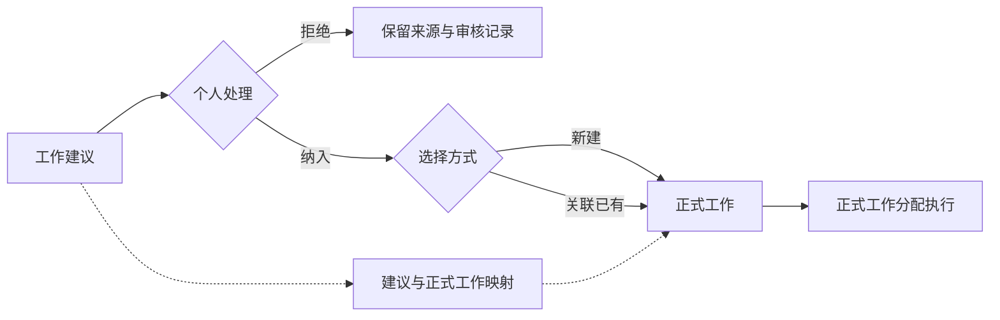

# P02完成核对与P03启动建议

> 历史归档：正文保留原时点判断与证据，不承担当前任务或能力声明。当前入口见[规划目录](../../README.md)。

检查日期：2026-10-05。

代码基线：`develop-v0.0.1`，`dfddcd2c37884c4e7b99a574807a014eded89397`。

## 1. 判断

P02核心范围及P01交接给P02的补充要求已实现，未发现阻止进入P03的功能遗漏或架构问题。可以继续原开发会话执行P03，无需重做P02。

本次检查覆盖从`b459d82`至当前节点的增量、现有实现、迁移、测试及验收记录。功能提交为`ff30aeb`，`dfddcd2`为规划文档收录提交。检查期间未修改产品代码。

“可以开始P03”表示当前能力可以支撑下一批开发，并不表示第一阶段全部完成。完整Context Pack、验收条件、结果验收仍按原计划分批建设。

## 2. P02要求与实现对应

| 要求 | 当前实现与判断 |
|---|---|
| 独立工作仍可创建 | 议题、决策均可空；无议题继续使用GEN编号，没有增加第三种Task |
| 工作可关联正式决策 | 正式工作保存`source_decision_id`及`source_decision_revision`，新关联只接受同项目已批准决策 |
| 议题与决策关系一致 | 同时给议题时验证一致性；项目级无议题决策可单独关联；跨项目来源被拒绝 |
| 从议题、决策进入新建工作 | 页面跳转携带来源并预填，允许用户补充工作内容，不强制每项工作都有决策 |
| 历史来源可以读取 | 工作详情展示来源标题、选定版本正文、版本号和当前效力；撤销、替代及需复核显示提醒 |
| 需复核补充不能无提示采用 | 已批准补充仍保留批准效力，但原依据变化时要求用户明确复核后才能新增关联 |
| 归档与引用保护 | 归档议题不接受新引用，既有来源可读；正式工作及历史执行依据纳入删除保护 |
| 调整来源不改编号 | 独立来源更新接口核对预期旧来源，避免并发覆盖；编号、工作状态保持原样 |
| 旧执行依据不被改写 | 分配时固化当次议题、决策和修订定位；派发使用尝试中的定位，而非重读工作当前来源 |
| 不隐式改变执行 | 决策撤销、替代和来源调整不自动暂停任务、不自动换到新决策，不修改旧Request、Run或输入 |
| 旧数据与迁移 | yuanlei v29→v30新增可空字段及项目/修订外键；旧工作、旧尝试保持空来源，不猜测补填 |
| 阶段范围 | 没有提前增加团队权限、完整Context Pack、工作建议纳入或结果验收 |

原P02说明中“填写验收要求”应结合P05理解：本批已提供标题和描述，结构化验收条件仍在P05建设。这不阻断P03，也不应把正式验收字段误报为已经完成。

## 3. 验证证据与局限

本次独立执行：

- 工程约束检查通过。
- 工程约束单测：70项通过。
- Web相关五个测试文件：31项通过，覆盖来源预填、复核提示、传参、保存冲突保留选择及既有页面交互。
- 后端迁移单测：19项通过。

Web及后端单测使用本机已有容器。已确认容器挂载的原开发工作区HEAD同为`dfddcd2`，且检查前工作区干净。Web测试出现SSR组件提示，但没有失败；不将SSR测试替代真实浏览器验收。

仓库已提交的决策记录另提供真实HTTP/PostgreSQL、v29→v30迁移、worker E2E、完整后端/Web测试及浏览器验收记录。其中包括来源调整后旧尝试保持原依据、跨项目及无效来源拒绝、删除竞争和项目优先锁顺序。本次审查了测试内容与记录，未独立复跑上述集成、E2E或浏览器链路，也未检查原环境截图。

增量`git diff --check`在最新收录的两份规划文档中发现6行Markdown双空格换行，被识别为尾随空格。它不影响P02业务功能，不阻断P03；后续文档提交可统一格式。本次不修改。

420px页面仍受既有全局最小宽度限制；仓库仅记录450px验收，不扩大声称适配范围。

## 4. P03的实施顺序与约束

### 第一步：建立纳入用例和映射

沿用现有治理任务对象承载“工作建议”，界面改用该名称，不额外再造建议对象。新增建议与正式工作的持久映射：一个建议只纳入一次，一个正式工作可以承接多个建议。同项目约束与建议唯一约束由数据库兜底。

“纳入”提供新建正式工作、关联已有工作两种方式。服务先按项目、建议及相关对象的一致顺序加锁；同一建议重试返回原正式工作。重试提交不同目标时应明确返回已有映射或冲突，不能改写原归属或偷偷新建第二项工作。

**必须调整事务组织。**当前`review_governance_task`和`project_work_service.create_task`分别调用`db.commit()`。不可直接串联这两个会提交的服务。应把必要的审核、工作创建/关联和映射写入纳入同一个事务；抽取最小的未提交写入过程供原入口与新纳入入口复用，保持现有独立入口的行为。事务失败不能留下已审核但无工作、孤立工作或半条映射。

新建沿用P02来源校验、需复核确认和既有编号。关联已有工作只新增映射，不悄悄改变目标工作的标题、状态、负责人或主要来源；不同来源也通过建议映射保留，必要的主要来源调整继续使用P02明确操作。

### 第二步：完成纳入页面与跳转

待处理列表展示建议标题、来源、议题/决策及审核情况。“纳入为工作”弹窗提供新建/关联已有工作；新建带入标题、描述和来源，允许确认后调整；关联只列当前项目可选工作。

缺项目或议题缩写时，在同一流程中提示并提供配置入口，不临时造另一套编号。无效来源、需复核未确认和并发冲突显示具体原因并保留输入。纳入成功后跳转正式工作详情；已经纳入的建议显示正式工作链接，重复点击不产生新对象。

### 第三步：收敛新执行入口，保护旧执行

新建议的执行从正式工作发起。同步检查治理工作台、智能体工具、通知、外部镜像及委派接口，不能仅隐藏一个按钮而留下旁路继续产生第二套新任务。

旧canonical建议无执行历史时提供补充关联；既有委派及运行中的执行保留读取、状态刷新、成果回收和结束能力，不批量取消，也不把旧Run、状态或产物复制为新的业务验收记录。

现有委派服务拥有本地编码执行器等真实能力，正式工作分配使用另一条执行链。应先列清消费者，确定新分配如何归属正式工作，必要时补最小适配；保留旧链完成与回收路径。只有新分配有真实可用路径，才关闭对应旧新建入口。不能删除执行能力后声称入口已经统一。

### 第四步：按实际行为验收

至少验证：同建议并发/重复纳入只产生一个映射和一个工作；不同建议关联同工作不复制；创建或映射失败整体回滚；跨项目目标、归档/无效来源被拒绝；需复核确认被沿用；编号不变且缺配置可恢复；旧执行可完成并回收；新建议经纳入后能够从正式工作实际分配执行；通知和工具不会绕过纳入继续制造第二套新执行事实。

## 5. 可直接发送给原开发会话的任务

> P02已完成，基线为`develop-v0.0.1`、`dfddcd2c37884c4e7b99a574807a014eded89397`。开始执行《第一阶段建设评估与执行计划-bd563c9》中的P03“工作建议模块：纳入正式工作，收敛新执行入口”，同时遵循本核对文档第4节。
>
> 先检查治理任务审核、正式工作创建、委派执行及全部相关消费者，列出最小实现与验收方案，再开发。第一批建立同项目的建议—正式工作映射及纳入接口，支持新建或关联已有，幂等与并发有数据库约束；审核、创建/关联、映射由同一个事务提交，不直接串联两个自行commit的服务。沿用P02来源、复核、历史定位及编号规则；关联已有工作不自动改其主要来源。
>
> 第二批完成“工作建议”列表、纳入弹窗、编号补齐、错误保留输入及纳入后的正式工作跳转。第三批检查页面、工具、通知和委派旁路，把新建议执行归到正式工作；旧执行保留完成、回收及历史读取，有真实消费者的执行器先完成最小接入再关闭旧新建入口。最后按第4节复验数据库、HTTP、worker和真实页面，记录通过、未验证与遗留范围。
>
> 保持个人使用范围；不增加团队权限、周期Work Definition、完整Context Pack或结果验收平台。不要批量迁移旧Run或把旧成果标记为已验收。

## 6. 依据

- [功能提交ff30aeb](https://github.com/Sxyon/Yuanlei/commit/ff30aebbd925923f4ac69e2c74011f79531134dd)
- [检查节点dfddcd2](https://github.com/Sxyon/Yuanlei/commit/dfddcd2c37884c4e7b99a574807a014eded89397)
- 仓库验收记录：`docs/develop-guides/yuanlei/decisions/implemented/2026-10-05-work-decision-source.md`。
- 原路线图：`docs/元垒系统架构规划设计/第一阶段建设评估与执行计划-bd563c9.md`的P02、P03、P05、P06。
