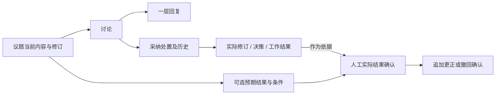

# P08完成核对与P09启动建议

> 历史归档：正文保留原时点判断与证据，不承担当前任务或能力声明。当前入口见[规划目录](../../README.md)。

审查日期：2026-10-07。基线：`develop-v0.0.1`、`89790db82fc8f044bf5df2360b03f7ed182d7215`；对比P07提交`db0963e1d525e0c6c49ed81e0f08b9b6a49c6b14`。范围：原第一阶段计划P08与《P07完成核对与P08启动建议》第4节。仅审查，不修改产品代码。

## 1. 结论

P08本阶段实现符合规划，可以开始P09。默认概览、更多列表和关系图已接入正式工作及业务结果；没有增加可编辑进度副本、图事实库或团队权限。

这不是第一阶段整体验收。真实Codex成功产物、Multica出向及完整业务闭环仍需补证据。本阶段是只读展示，不以首页正确替代执行链路验收。

## 2. 实现核对

| P08要求 | 核对结果 |
|---|---|
| 正式工作成为进度来源 | 读取正式工作源表，建议独立作为待处理；已纳入建议退出待处理计数。符合。 |
| 受阻、逾期和执行异常分开 | blocked取正式工作状态；done/cancelled不逾期；UTC统计日期在页面说明；受阻与逾期可交叉。符合。 |
| 失败不造成永久阻塞 | 按工作及执行入口分别选最新尝试；非终态工作最新失败/中断列当前异常，其余保留历史。跨项目blockers改为业务blocked数量。符合。 |
| 待验收不等于工作完成 | pending结果份数与涉及工作数分别统计；不改验收/完成状态。符合。 |
| 列表统计与分页一致 | 同一读取集合派生总数、首屏及分页，稳定倒序；参数及项目可见性受后端保护。符合。 |
| 默认首页四组卡片 | 待处理、工作进展、待验收、执行异常；保留蓝图、有效批准决策、实际议题反馈和历史异常入口。符合。 |
| 关系图读取真实关联 | 议题→决策→正式工作→结果及明确反馈边；当前来源与执行冻结修订分开；建议退出工作列。符合。 |
| 显示上限不误导 | 每类10条，显示遗漏数；图外来源仍能打开维护或历史入口，独立工作无需前置议题。符合。 |
| 定位与返回刷新 | 结果、执行、委派按ID定位；详情异步渲染后滚动；返回默认概览重新读取；关闭列表/切换项目拒绝迟到响应。符合。 |
| 保留用户页面与准确文案 | 自定义Dashboard继续原静态页路径；规则检查明确“系统规则巡检”，负责人只是跟进标识。符合。 |

当前异常口径有一项明确取舍：智能体尝试和外部委派分别判断最新记录，不推断两个入口互相替代。因此同一工作的两个入口各有最新失败时，可以出现两条异常。这是已记录的展示口径，不代表两项工作受阻。

聚合仍在服务内读取集合再分页，适合当前个人数据量。后续有实际性能证据再下推数据库分页/聚合，不在P09提前建设缓存或统计平台。

## 3. 验证与遗留事项

审查克隆及运行容器挂载的原工作区均核对为本次commit，原工作区无未提交修改。

本次独立复验：

- 后端`test_inspection_board_service.py`与`test_delegation_service.py`：27项通过；覆盖真实隔离PostgreSQL/HTTP、统计分页、他人项目隔离、当前与冻结来源、异常分类及委派回归。
- 前端`defaultProjectDashboard`、`formalOverview`、`projectDashboardLoading`、`workDelegationsPanel`四个测试文件：10项通过。
- 前端lint：通过。
- 工程约束：通过；检查器70项通过。
- 本次提交差异空白检查：通过。
- 技能跨进程同步超时项：本次独立复验1项通过，测试的20秒子进程限制与断言未改动；仍不代表此前完整测试命令全绿。

前端测试输出包含SSR环境Markdown渲染和简化测试路由警告，断言通过不等于浏览器视觉验收。本次未重新操作浏览器、重跑完整前后端测试或build；仓库《P08执行与验收记录》中的502项前端全套、build及真实页面证据属于开发记录。

后端pytest缓存目录不可写提示不影响断言与测试结果。

开发记录的后端全套有技能跨进程同步单项超时，后续单项通过，完整命令未全绿；不能把后续单项通过写成全套通过，也没有证据将该问题归因于P08。单独保留并跟进运行耗时，不修改测试断言或20秒限制掩盖问题。

开发记录当时worker为unhealthy；本次读取为running/healthy。健康状态恢复不证明真实Codex、Multica或完整worker业务闭环通过。P09的议题功能可以继续；P10最终验收仍需真实执行证据。

## 4. P09按顺序执行的工作包

P09补齐“讨论如何被回应和处理、议题预期是否在现实中实现”。当前已有议题修订、评论与稳定序号时间线，已有P05业务结果和P07结果反馈；在这些Owner上扩展，不重新设计审批或执行系统。

### P09-1：一层回复与历史定位

在议题评论上增加可空父评论关联，旧评论保持顶层。回复只能指向同一议题内的顶层评论，后端拒绝跨议题引用及回复的回复，不做无限评论树。

保存回复作者、时间和发布时实际议题修订；不能把父评论当时修订冒充回复时修订。顶层时间线保持稳定序号倒序，回复在所属讨论内按时间和ID正序。回复发生时保留可追溯事件，事件可定位原讨论；避免在分页中同一回复被渲染成两个独立正文。父讨论位于更早分页时仍有打开路径，回复不能仅依赖当前页缓存。

界面：每条讨论提供“回复”，输入框明确回复对象；原讨论下显示回复作者、时间、修订及正文。归档可读不可写。发布失败保留草稿，切换议题后迟到请求不能清空新议题输入。

验收：旧评论迁移保持正文与修订；同议题回复可回读；跨议题、第二层回复、归档写入被拒绝；翻页不丢回复或重复显示。

### P09-2：采纳处置与实际去向

处置独立于讨论正文：采纳、部分采纳、不采纳，附说明。未处置保留为空，不默认“不采纳”。处置可以引用同项目实际议题修订、决策记录或工作结果；没有实际修改时允许记录说明，明确“尚未关联去向”，不假造已落实。

保存处置的作者、时间、版本和引用的准确修订/版本。修改处置追加历史，旧处置仍可读；当前标签从最近有效处置生成。更新时有版本冲突检查，响应丢失后的同意图重试不重复历史节点。相关写入沿用项目/议题锁与同事务历史，不另建审批人资格。

界面：讨论卡“记录处理”打开小表单，选类型、填写说明、可选去向。卡片显示当前标签和去向链接，“处理历史”展开旧记录。决策是草稿、已批准、已替代等状态要照实显示；关联处置不批准决策、不更改任务状态。首版顶层讨论支持处置即可，一层回复用于解释和补充，不额外扩展回复级处置。

验收：采纳后引用可回读；修改处置保留旧值；跨项目引用、虚构修订及版本冲突被拒绝；没有去向时文字准确，P07反馈讨论仍可使用。

### P09-3：可选预期结果与人工实际确认

议题增加可选“预期结果”和“核对条件”，修改进入已有议题修订快照。旧议题为空，不从标题、已有决策或任务自动推断目标。问题型议题可一直不填写。

实际达成通过单独的确认记录表达：说明、依据、确认人、确认时间和当时议题修订/条件。允许引用同项目真实P05结果及现有证据入口；引用某份accepted工作结果只是依据，不能自动确认整个议题达成。网页继续标为引用，不冒充已抓取或内容已验证。

结果确认与纳入资格、研讨进度、归档独立。确认后不自动close、不改决策、不完成任务或Run。后来发现判断错误，追加更正或撤回确认记录并说明原因，保留原依据和历史；“再次讨论”与“现实结果未达成”不是同一操作。目标/条件随后修订时，旧确认继续显示对应旧修订，并提示当前条件已变化，不能当作对新条件的确认。

界面：当前正文下可选“预期结果/验证情况”，按钮“记录实际达成”“更正确认”。记录显示依据链接和当时修订，时间线显示确认与更正事件。主状态菜单仍只维护已有纳入和研讨进度，不把“已达成”塞回单一状态机。

验收：只有任务全部done时，议题不会自动达成；人工确认回读说明、依据与版本；更正保留原确认；条件变化提示准确；归档、跨项目、不可访问证据等失败保留草稿且不写半条历史。

### P09-4：整合迁移与真实验收

先列最小模型补充、引用边界、版本与幂等规则，再实施。新增结构只进yuanlei域，按实际结构升版本；升级/重入在真实PostgreSQL验证，旧评论、事件、结果反馈和议题修订保持可读，未知旧版本不能补造。

重点检查议题删除的引用守卫是否覆盖新引用，防止删除后处置/确认链接失效。沿用归档只读和项目可见性，持久写入及事件由一个用例事务拥有。不得改写P01批准决策、P02尝试依据、P05验收或P07输出归属。

真实场景：提出讨论→一层回复→部分采纳并关联实际修订→更正处置→引用工作结果确认实际达成→追加更正→归档只读→恢复后历史完整。回读数据库、HTTP、DOM，核对倒序分页、深浅主题、窄屏、空态与失败草稿，再更新功能和决策记录。

代码从议题评论/修订/事件模型、governance repository/service/router、`TopicHistoryPanel.vue`和议题编辑入口切入。复用业务结果读取与证据校验边界，不建立第二套结果模型、独立目标中心、投票或论证图。

## 5. 可发给原Codex开发会话的启动内容

> P08已核对，可以继续原会话执行P09“议题模块：回复、采纳处置与实际结果确认”。基线为`develop-v0.0.1`、`89790db82fc8f044bf5df2360b03f7ed182d7215`。先核对工作区，如HEAD已前进说明差异，不回退代码。
>
> 以原第一阶段计划P09及本交接文档第4节为范围。按一层回复→采纳处置与历史→可选预期结果/实际确认→迁移和真实场景验收的顺序开发。先列字段、锁和事务、版本冲突、引用范围、分页定位和界面方案，再实施。
>
> 继续使用议题现有修订和倒序时间线。回复记录发布时修订；采纳处置独立于讨论正文且保留历史，去向必须指向真实记录；实际达成由个人明确确认，有说明、依据和当时条件，后续更正追加记录。纳入、研讨进度、归档和实际达成保持独立，不由任务done或结果accepted自动推导，不新增主状态“已达成”。
>
> 旧数据不猜测补填，归档只读，同项目引用由后端验证，失败保留草稿，重试不重复历史。P07反馈讨论、批准决策、执行依据与业务验收保持各自Owner。团队权限、无限评论树、投票、独立目标/Review中心与周期工作均不纳入。
>
> P08全套后端的技能测试超时记录保留并跟进；真实Codex成功产物和Multica出向继续标为待验收，不用健康检查或确定性执行替代。交付分别列独立复验、完整测试、真实页面和未验证项。

继续原会话即可，发送第5节并附本文件，不需要终止会话或重新开启一轮架构规划。
