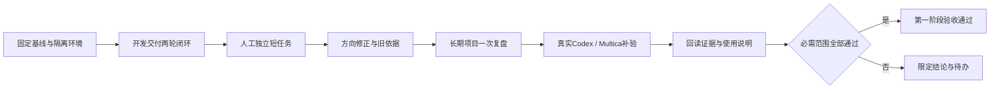

# P09完成核对与P10启动建议

> 历史归档：正文保留原时点判断与证据，不承担当前任务或能力声明。当前入口见[规划目录](../../README.md)。

审查日期：2026-10-07。基线：`develop-v0.0.1`、`f611b0c23fd2f015eb3cace075f5c7362d4363ae`；对比P08提交`89790db82fc8f044bf5df2360b03f7ed182d7215`。依据：原第一阶段P09/P10计划及《P08完成核对与P09启动建议》第4节。仅审查，不改产品代码。

## 1. 结论

P09本阶段实现符合规划，可以开始P10整体验收。本次没有发现阻止进入下一阶段的问题。

当前支持一层回复、采纳处置及版本历史、准确引用去向、可选预期结果/核对条件，以及人工实际确认、更正和撤回。保持纳入资格、研讨进度、归档、实际达成相互独立；没有增加审批权限、无限评论树或独立目标中心。

P10是第一阶段业务闭环与证据收口。开始P10不等于第一阶段已经通过，更不等于开始第二阶段周期工作或团队协作。

## 2. P09实现核对

| 要求 | 当前实现与判断 |
|---|---|
| 同议题一层回复 | 父评论可空；回复仅指向同议题顶层，跨议题和二层回复拒绝。回复保存发布时修订、身份与时间。符合。 |
| 时间线与早期讨论 | 顶层事件稳定倒序，原讨论内回复正序；回复/处置事件定位原讨论。早期讨论可独立读取，不依赖当前历史页。符合。 |
| 独立采纳处置 | 采纳/部分采纳/不采纳追加版本；说明、真实去向与引用快照保留；没有去向照实显示，不覆盖讨论正文。符合。 |
| 引用准确且可定位 | 同项目真实议题修订、决策版本或工作结果；精确旧议题/决策修订读取入口独立于时间线分页。结果引用保存当时版本及快照。符合。 |
| 可选目标与条件 | 随原议题修订保存，旧值为空；旧调用未提交这两个字段时保留当前值，不意外清空。符合。 |
| 实际确认独立 | 人工confirm/correct/withdraw追加历史并冻结条件与依据；不从任务done或结果accepted推断议题达成，不改任务/Run。符合。 |
| 冲突与幂等 | 项目→议题锁，处置/确认预期版本，确认另检查议题修订；同操作标识只重放同意图。成功发布消耗标识，允许再次独立发表同文。符合。 |
| 归档与删除保护 | 新写入检查归档只读；新引用加入删除守卫，引用创建与删除使用共同项目锁。符合。 |
| 旧数据迁移 | yuanlei35→36，旧评论无父关联，旧目标/条件保持空，已有修订/历史保留；真实升级重入测试。符合。 |
| P07兼容性 | 结果反馈仍通过原Owner追加顶层讨论，新增功能不自行提交其内部写过程；相关HTTP/数据库回归保持原边界。符合。 |

“采纳”是讨论处理结论，“接受结果”是工作验收，“实际达成”是对议题现实结果的个人确认。这三个动作没有互相代替。确认可以引用待验收或其他状态的结果，页面保留引用时状态，由人承担判断；引用本身不升级工作结果的验收状态。

## 3. 验证证据及未验证范围

审查克隆和运行容器挂载的原开发工作区均核对为本次commit；原工作区无未提交修改。

本次独立复验：

- 后端`test_topic_followup_service.py`、`test_project_work_context.py`、`test_storage_migration.py`：40项通过；包含隔离真实PostgreSQL、P09升级重入/引用与删除竞争、版本/证据守卫，以及P07资料和反馈HTTP回归。
- 前端`topicFollowup`、`topicHistoryPanel`、`decisionHistoryPanel`、`projectBlueprintEditing`：34项通过。
- 前端lint：通过。
- 工程约束：通过；检查器70项通过。
- `git diff 89790db f611b0c --check`：通过。

本次未重跑完整前后端、build、真实浏览器及外部执行。仓库《P09执行与验收记录》另记载真实HTTP、页面、后端完整2807项通过/63跳过、前端完整515项通过及build；这些属于开发证据，不能写成本次全部独立重跑。跳过场景不算覆盖。

后端pytest缓存目录不可写提示不影响本次断言及结果。本次没有单独重跑P09常驻API测试文件，新增HTTP路由的开发验证证据与本次服务/数据库复验分开计。

此前技能同步超时与磁盘不足记录保留；开发记录记载恢复环境后单项及完整后端通过。本次没有重新诊断该环境问题。worker本次健康读取为running/healthy，健康状态不证明实际执行和产物正确。

真实Codex成功产物及Multica出向仍待验收。P10需分别给出结论，配置缺失或执行失败不能用stub、确定性模型、健康检查或HTTP 200替代。

## 4. P10按先后顺序执行

### P10-0：固定范围与隔离环境

记录执行时commit、数据库schema版本及所用API/Web/worker/执行器；先核对各服务可用性和存储空间，不输出凭据。明确哪个真实执行入口承担个人主链路，以及Codex、Multica各自是否已配置。

创建带统一验收标记的独立项目和工作目录，用可公开的合成业务内容及账号。真实编码执行只作用于隔离目录/独立测试仓库，不能修改原业务代码或覆盖现有蓝图。保留用户项目、历史、配置与运行数据；测试清理只删除本次明确创建的资源。检查integration自动清理fixture的范围，避免顺带清理其他会话资源。

先列四个场景的输入、预期、验证位置和执行渠道，再运行。每一场景保留记录ID、修订、实际产物路径、截图和回读结果；失败保留原因，修复后另记复验，不覆盖原记录。

### P10-1：开发交付完整闭环

1. 建一个阶段交付项目，填写类型/分类/标签；用模板建立并编辑蓝图，保留目标和验收边界。
2. 建议题，填写可选预期结果与条件，发布讨论、一层回复、部分采纳并关联真实修订；新增并批准决策，明确纳入议题不等于批准决策。
3. 从建议纳入或直接从议题创建正式工作，核对关联决策准确修订、描述和验收标准。
4. 预览Context Pack，选本次必要蓝图、来源修订和附件；派发后回读当次固化资料及真实执行输入。
5. 执行一个可人工核对的小交付，例如生成一份含指定表格与结论的Markdown方案和一份可运行的示例脚本。通过明确的两轮范围调整制造真实未接受与补交，不伪造执行结果或手工修改数据库状态。
6. 首次实际输出自动进入pending；核对输出Message/Run或委派ID准确归属、产物存在且内容正确、工作没有自动done。
7. 人工未接受并说明缺项；选该结果启动新尝试，核对新输入包含原意见和调整要求，旧资料和结果不被改写。
8. 第二次交付符合当前条件后人工接受并完成，沿用Git、活跃执行、证据和通知守卫；回读结果accepted、工作done及通知幂等。
9. 显式预览并确认反馈议题与蓝图；用结果作为依据记录议题实际达成。概览更新待验收/工作/异常，图可打开实际结果与来源。

通过依据：两次尝试、两份独立结果、真实产物、实际输入、人工意见、完成状态和反馈全部回读一致；不以模型声称完成代替产物检查。

### P10-2：人工短任务，验证最短路径

不建议题或决策，直接建独立工作并填简短条件；人工完成一项可核对事项，上传/引用证据，提交并验收完成。核对编号、pending→accepted、done、通知和首页；不创建虚假Run，不要求补议题或目标。

这里可以同时覆盖“人工提交并完成”的短路径与正常分开验收的路径；重复确认回读不能产生重复通知或结果。选择最少的相关用例，不为每个按钮重复跑整套链路。

### P10-3：方向修正与历史依据

1. 一份已批准决策已经作为一次尝试的依据；记录其修订和Context Pack。
2. 重开议题，选择建议暂停。页面醒目显示提示，但任务/Run保持独立，不自动撤销旧决策。
3. 新建替代决策并批准，原决策保留历史和替代关系。
4. 工作通过明确操作换成新依据；下一次尝试读取新决策/条件。
5. 回读旧尝试仍指向旧修订和旧资料，新尝试指向新依据，关系图区分当前与冻结来源。
6. 针对旧实际确认追加更正或撤回；若目标/条件改变，旧记录仍保留原条件并显示提示。归档后回复、处置、实际确认不可写，恢复后完整可读。

通过依据：没有静默改写旧快照，没有自动暂停执行，没有用替代决策覆盖旧批准文本。

### P10-4：长期经营项目可用性

建立无结束日期的长期项目，维护分类和标签，使用方向蓝图；创建一次记录/复盘工作，人工或已验证渠道完成并反馈。核对筛选、蓝图编辑、工作结果和首页关联。

本场景验收长期项目承载能力，每周自动生成实例属于第二阶段。周期引擎缺失不算第一阶段失败，不能借P10加入调度、监控或团队权限。

### P10-5：补真实外部渠道及异常保护证据

Codex：从正式工作发起一次真实委派，回收实际产物；核对当次资料、工作目录边界、来源ID、唯一pending结果及人工验收；重试回收不得重复结果。实际产物内容必须人工或独立程序核对。

Multica：执行真实出向创建/派发并回读远端记录、状态及结果；核对本地委派与远端标识匹配、来源准确、回收幂等。已有入向同步或stub协议测试不能替代出向成功。

若缺账号、服务或配置，记录缺失项、未通过环节和后续动作。主链路可以有明确的限定范围验收结论，但不得声明“全部外部渠道通过”；若这些渠道属于本次承诺范围，保持对应项未完成。

复用已有负向自动化核对串Run、旧条件拒绝、归档只读、跨项目引用、重复提交及蓝图冲突，不在真实渠道上人为制造破坏性故障。需要修复时只改具体失败的Owner，补针对性回归，再重跑受影响场景。

### P10-6：收口与使用说明

输出一份可审阅的阶段验收表，每项标为通过、失败或未验证，记录基线、证据位置、实际ID、命令与结果。区分开发记录、本轮独立执行、确定性worker和真实外部执行。

提交四个场景记录、最终产物、关键截图、数据库/HTTP/文件回读、未验证及失败项、简短操作说明。说明至少覆盖：项目/蓝图入口、议题与批准决策区别、独立工作短路径、资料预览与当次冻结、未接受再尝试、结果验收、方向修正和复盘。

完成仓库要求的相关检查；若有产品代码修复，按仓库规则独立审查。不为展示测试全绿调整超时限制、吞掉失败、放宽证据或覆盖expected输出。所有必需场景和承诺渠道有证据后，再给第一阶段整体结论；否则列剩余动作，不提前宣告完成。

## 5. 可发给原Codex开发会话的启动内容

> P09已核对，可以继续原会话执行P10“整体验收：一次性业务闭环”。基线为`develop-v0.0.1`、`f611b0c23fd2f015eb3cace075f5c7362d4363ae`。先核对工作区及环境；HEAD已前进时说明差异，不回退代码。
>
> 按原第一阶段P10及本交接第4节执行。先列隔离环境、四个业务场景、真实执行渠道和证据清单，然后实际完成开发交付两轮、人工独立短任务、方向修正、长期项目复盘，并补真实Codex成功产物与Multica出向。主链路需核对实际输入、产物、准确来源、pending结果、人工未接受再尝试、接受完成、通知、反馈与概览。
>
> 批准≠实际达成、运行成功≠工作完成、负责人≠权限继续成立。旧资料、旧决策和旧实际确认保持历史；新方向通过显式换依据和追加更正表达。不要建设周期引擎、团队权限、通用图或Review平台。发现具体缺陷再作最小修复并补相关回归，P10不进行无证据的重构。
>
> 使用隔离项目、目录和合成内容，清理仅限本次资源，保留用户数据；检查测试fixture清理范围。真实渠道未配置或失败如实记录，不能用健康、stub、确定性worker或HTTP 200代替。分别报告通过、失败、未验证与承诺范围，最后交付场景记录、产物、截图、持久事实回读、操作说明及阶段结论。

继续原开发会话即可，发送第5节并附本文件。P10完成后再以新commit和验收证据进行最终核对。
