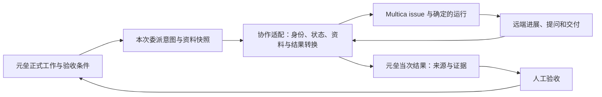

# S01—S03 独立校验与第一阶段深度评估

> 历史归档：正文保留原时点判断与证据，不承担当前任务或能力声明。当前入口见[规划目录](../../README.md)。


日期：2026-10-08

元垒基线：`develop-v0.0.1` / `ef65969b963b65d9fe6dd47719d8011667b04fa1`。

本文回答三个问题：S01—S03 是否实际修复；第一阶段目前建设到什么程度；界面与 Multica 两个专项为什么值得开展、哪些边界尚需讨论。本文不排列下一轮开发任务，不提前选定界面方案或协作框架，不修改产品代码。

## 1. 核心判断

**S01、S02 的修复通过本轮独立检查；S03 在执行者具备并实际调用文件展示工具的范围内通过。第一阶段的个人业务模型主体成立，但工程闭环、日常操作体验和外部协作闭环的成熟程度并不相同。**

现在可以更准确地描述为：

- 核心对象和业务历史已建立，已经能保存一次真实工作的依据、执行与人工验收。
- 本地执行闭环有真实记录，不只是接口或模型自述。
- 用户仍需理解过多页面、术语、状态与配置，才能顺利完成普通工作。
- 外部协作有适配骨架，但 Multica 尚未形成可靠的“选择执行者—发起运行—取得当次输出—人工验收”闭环。
- 跨模块规则仍存在不一致，单个工作包验收通过并没有自动消除这些问题。

因此，你提出的**界面与交互设计专项、Multica 协作接入专项都具有反哺价值，可以合理放在第一阶段末尾**。前者补足个人可用性，后者检验外部执行边界。它们不需要把团队成员、组织权限或周期业务实例提前带进来。

需要调整的是专项的命题：

1. UI 讨论应同时研究信息架构、工作流、交互和视觉，不能只研究配色、组件和好看的截图。
2. Multica 讨论应研究真实协作语义与能力差异；从已有协议演进，不能以集齐设计模式或适配所有 AI 为目标。

## 2. S01—S03 的独立校验

### 2.1 本轮实际做了什么

对比上次基线 `9ace7be` 到本次三个提交：

| 提交 | 实际变更 | 判断 |
| --- | --- | --- |
| `31530de` / S01 | 在隔离测试 Schema 内先移除后续外键依赖，再构造 v32 条件；保留迁移断言 | 修复原测试准备失败，没有放宽生产规则 |
| `8260348` / S02 | 从选定议题历史版本加入预期结果与验证条件；议题超过预算明确拒绝；抽屉注明议题修订 | 修复信息遗漏，没有用当前版本覆盖旧版本 |
| `ef65969` / S03 | 正式工作输入明确要求登记文件；结果显示未登记提示；后端计算可访问文件的工作区定位，前端提供查看入口 | 最小修复方向成立，没有扫描目录猜产物或改写旧结果 |

独立重新执行：

| 检查 | 结果 | 范围 |
| --- | --- | --- |
| 迁移、Context Pack、文件交付 PostgreSQL 集成 | 10 passed，76.07 秒 | 三份相关原测试文件；隔离 Schema 和本用例目录 |
| Context 抽屉、结果面板前端测试 | 8 passed，34.60 秒 | 状态、冲突与恢复逻辑；不等于浏览器 DOM 验收 |
| Multica 适配器现有 unit | 7 passed | 现有用例通过；没有覆盖本轮新发现的提前回收缺陷 |
| Web lint | 通过 | 只读检查 |
| 工程契约 | 通过，185 decisions / 20 features | 文档与工程结构检查 |
| 工程契约 unittest | 70 passed | 本轮重新执行 |
| 差异空白检查 | 发现两处 Markdown 行尾双空格 | 位于引用的上次审查文档第 3、4 行，是 Markdown 硬换行写法；不影响业务，但严格 gate 并非全绿 |

本轮没有重复全量后端/Web 测试或重新构建，也没有使用上次全量通过数冒充本轮结果。未执行真实浏览器点击、主题/窄屏检查，没有新发起真实供应商任务或向 Multica 写入工作项。

### 2.2 真实输入、输出与文件回读

没有仅信任 S03 验收 JSON。重新从实际数据库和项目目录读取以下记录：

- 执行：`c9e6249b-bfa3-4d0c-a31e-76454c97ab88`，completed。
- Run：`12a3d05b-07bd-4a65-b2c8-cad113b84876`。
- 工作：`2001104a-8e60-4e0a-b25f-1e35f8fb7a9d`，done。
- 结果：`47696fb6-ce93-53a7-aa72-155b250e46ab`，accepted，来源执行对应的结果只有一条。

直接校验结果：

| 主张 | 本轮回读 |
| --- | --- |
| 所选历史议题修订正确 | 修订 2；其预期结果和验证条件都出现在议题输入文本中 |
| 真实输入就是冻结输入 | 排队请求关联 Message 的正文等于执行 prompt |
| 文件展示调用归属正确 | 同一 Run 存在一条成功的 `present_artifacts` |
| 输出归属正确 | 结果引用的输出 Message 属于同一 Run |
| 文件已登记 | evidence 包含 `/outputs/proof.md`，可访问，工作区定位为 `/projects/s03-6b787801a8/outputs/proof.md` |
| 文件真实存在 | 读取文件字节，包含总额 50；哈希与原始交付记录一致 |

输入 SHA-256：`125f299f783201fa4f88579b4d8bc926e28112bc645452d32deb091802b57801`。

文件 SHA-256：`6548d0c560aaea3bba6ea5adf2b5af7d5be664806f6f0e05b5420e99b0df7eac`。

这证明 S02 与 S03 接通了一条真实已发生的链路，但不证明所有执行者配置都具备同样能力，也不证明前端链接已经在真实浏览器点击验收。

### 2.3 S03 剩下的是产品条件，而非上次同一个缺陷未修复

现在的交付协议是：执行者写文件、核对，再调用现有 `present_artifacts`；回收端仅认同一 Run 的成功展示记录。

这与“文件落到目录里就自动算交付物”不同。该约束是有价值的：避免相邻 Run、失败展示和无关文件混入结果。纯文字事项仍可验收，也没有变成强制上传文件。

但当前成功依赖执行者拥有展示工具。S03 原记录中的空工具配置曾卡住，独立源码也没有在分配前判断“该执行者能否履行文件交付协议”。增加一段 prompt 不能创造工具能力。

值得讨论的是：文件交付能力应该是工作派发时可看见的条件，还是靠用户记得去数字员工配置中启用？如果无法交付，是明确保留摘要结果并提示人工补交，还是在派发前阻止不符合要求的入口？现阶段不宜直接为所有智能体强制装配工具；部分工具可能由已激活 Skill 提供，能力检查必须依据实际运行时。

## 3. 第一阶段建设效果：模型正确性强于产品可用性

### 3.1 原架构主线仍然成立

| 原设计原则 | 当前事实与评价 |
| --- | --- |
| 项目扁平，标签/分类承担领域区分 | 已有实现，没有必要再增加强制 Domain 容器 |
| 个人先用，团队权限第三阶段 | 当前开发没有必要借外部接入引入组织审批；负责人继续是标明关系 |
| 议题内部融合讨论、提案与决策 | 历史、回复、采纳处置和决策存在；问题主要是页面如何表达这些关系 |
| 业务状态与运行状态分开 | 数据层主要做到，但巡检、按钮与文字仍有跨层误用 |
| 工作可独立创建 | 人工短任务可以不建议题、决策；这是必须保留的最短路径 |
| Context Pack 绑定尝试 | 已有版本选择、真实输入冻结；S02 补足目标与条件 |
| 图来自真实关系 | 已有来源与结果关系，不需要通用图平台来解决目前问题 |
| Work Definition 统一持续工作 | 尚是下一阶段目标；不能将当前巡检或定时 Agent 当成完整周期实例平台 |

最重要的已建成能力，是不同答案分开保存：**这件事为什么做、当时同意了什么、这次给执行者什么、实际发生什么、结果是否合格、目标是否真的达成。**

### 3.2 当前不是一个统一成熟度的“完成系统”

可以从五个角度评判：

| 角度 | 目前程度 | 主要缺口 |
| --- | --- | --- |
| 业务建模 | 主体可用 | 跨模块规则需一致应用，目标在各处的表达仍靠用户协调 |
| 本地执行 | 有真实闭环 | 执行准备、工具可用性、异常后的下一步还偏技术化 |
| 人机操作 | 功能齐、组织弱 | 模块堆叠、术语混杂、低频设置抢占高频动作 |
| 外部协作 | 有骨架、尚不可靠 | 远端执行者、运行身份、输出回收与状态约定未闭合 |
| 长期可信度 | 输入历史较强 | 文件证据主要指当前路径，运行配置与远端环境不能宣称完全可重放 |

不建议给出一个“完成 90%”的数字。它会掩盖关键短板：一个小的终态判断错误就可能切断整条外部交付链路，而大量已存在的字段并不能弥补。

## 4. 本轮新确认的跨模块缺陷

这些问题与 S01—S03 是不同问题。它们说明第一阶段还需要按真实使用场景检查接缝。

### 4.1 Multica 完成后，界面没有正确显示回收入口

证据：`web/src/components/project/WorkDelegationsPanel.vue:56–64` 只对远端 `completed / failed / cancelled` 展示回收按钮；后端 `delegation_service.py:416` 对 Multica 成功结果要求的状态却是 `done`。

因此，远端返回内置 `done` 时，当前按钮条件不成立。前后端对同一渠道的终态定义不一致。这不是审美问题，也不是配置问题。

讨论重点：由适配器返回可供用户操作的标准化状态/动作，还是让每个页面了解每个渠道的枚举？当前散布硬编码会随渠道数量增加持续放大。

### 4.2 提前回收会把尚未完成的委派封成终态

证据：`MulticaExecutor.collect()` 读取任意 issue 状态，都返回其标题、描述和状态；`DelegationService.collect()` 随后无条件写入 `reclaimed`，已回收操作再次调用直接返回旧记录。

本轮使用真实 PostgreSQL 的独立 UUID Schema、内存 Multica 客户端复现，不对远端发请求：

```text
远端 todo → 调用回收 → 本地 reclaimed / 远端 todo
远端随后 done → 再次回收 → 仍返回旧 todo 与原描述
```

Schema 已按隔离 fixture 清理。这证明本地编排缺陷；不是实际 Multica 服务成功验收。

当前普通 UI 不对 todo 提供回收按钮，但后端/API 路径没有相应约束，未来接入工具或其他客户端也会遇到。需要区分“读取当前进展”与“封存当次最终交付”，不能让一次观察结束一项未完成委派。

### 4.3 当前 Multica 回收的是任务描述，不是当次执行输出

证据：`backend/package/yuxi/delegation/multica.py:114–128` 用 `issue.title + issue.description + issue.status` 拼成结果；没有获取远端具体运行的输出、日志、结果评论或交付文件。

描述主要承载原需求。一项 issue 被标为 done 后，原需求被拼进自动待验收结果，并不会因此成为真实执行输出。系统没有自动接受它，保住了人工验收边界，但“结果来自真实执行”这一层仍不足。

当前应诚实称为**远端工作项状态与描述回读**。要升级为协作结果回收，必须回答“哪次运行、输出是什么、交付物在哪、怎么绑定本次委派”。

### 4.4 巡检把没有智能体运行的进行中工作判为异常

证据：`project_work_inspection_service.py:27–28`；`ProjectWorkExecutionRepository.has_active_task_work()` 只查本地 `ProjectWorkExecution`。

本轮隔离数据库中，将一个没有 Agent 尝试的人工工作设为 in_progress，调用真实巡检函数，返回 `in_progress_without_run`。

这会在**工作启用巡检且满足巡检调度条件**时产生不合理提醒：人工正在做，本来就不需要 Agent Run；只存在渠道委派时，该查询也不能表达实际外部执行。运行已经交付、等待人工验收时，没有活跃 Run 同样可能正常。

这里的设计冲突是：原架构允许任务由人或智能体执行，而巡检把“正在推进”解释成“必须有本地智能体运行”。负责人作为跟进标识，不能据此推导执行必为该智能体。

需先区分有客观依据的异常与提示，再评估执行类型字段。“久未更新”“已逾期”“明确要求的执行失联”和“没有 Run”不是同一个含义。

### 4.5 任务列表与概览的逾期判断使用不同日期

证据：`ProjectWorkTasksView.vue:235–250` 用浏览器本地日期；概览与巡检采用 UTC 日期。

例如北京时间 10 月 8 日 00:30，UTC 还是 10 月 7 日。截止日期为 10 月 7 日的未完成工作，在列表可显示逾期，在概览未计逾期。

现有视图对同一事实采用不同判断。需要先确定当前个人产品的日期语义，再让列表、看板、概览与巡检一致。没有必要为修复它先建设完整组织时区体系。

## 5. 其他缺漏与改进项：区分缺陷、设计债与未来能力

### 5.1 执行准备尚未成为清晰的产品环节

用户需要知道：资料是否准备好、执行者是否可用、工具能否交付、渠道是否配置、工作目录是否可用，以及失败后能做什么。

现在这些信息散在资料抽屉、数字员工配置、委派面板与运行错误中。技术上失败可观察，不等于用户在发起之前理解失败原因。

讨论重点应是一个清晰的准备状态与动作解释，不是加一张包含所有部署参数的检查大表。任务可以按人工路径完成，简单文字工作也不必要求编码沙盒就绪。

### 5.2 文件证据可访问，不等于历史文件内容稳定

S03 结果链接指向当前项目路径。文件后续被覆盖，该路径仍可打开，内容却可能已不是当时验收的内容。已有输入资料快照不能替代输出交付物留存。

这属于现有能力的诚实边界，不必把所有结果认定为无效。对于关键开发交付，应讨论保存当次文件摘要/哈希或独立副本；普通事项可以保持轻量。需要让重要验收依据在下一次执行后仍可准确回读。

### 5.3 收件箱尚偏事件阅读，未充分表达待办是否已处理

现有分类为未读/已读/归档，记录含多次 occurrence；查看来源可定位工作或 Run。源码返回的收件箱读模型没有单独表达“该问题当前仍待处理还是已经解决”。

未读和待处理不同：完成通知可未读，已阅读的提问可能仍未答复，已解决的历史异常也可以留作记录。当前不能依据某个旧通知就判断现在还在阻塞。

可研究从现有来源状态派生“待我处理、仅供知悉、已处理”的展示，不必再建立一套能独立修改业务状态的收件箱任务系统。

### 5.4 历史可追溯与日常信息负担之间缺少展示约定

系统需要保存版本、Run ID、条件快照、哈希和来源，但用户不应每次做普通事项都阅读这些信息。

现有 Context 抽屉和结果面板保留了很多有价值信息，却常常先展示定位符、修订、预算和状态，再让人找实际含义。应讨论摘要、操作、专业详情和完整历史四层展示，而不是删掉历史以换取清爽。

### 5.5 蓝图、议题目标与工作条件需要解释关系，不必强制自动同步

现在目标分别存在蓝图文字、议题字段和工作验收条件中。它们的颗粒度不同，保持独立合理，但用户可能重复录入或误以为改一处就应自动改其他处。

值得明确：蓝图表达项目方向；议题目标表达本次讨论希望改变什么；工作条件表达这项交付怎么判断；实际确认表达现实是否达成。界面应帮助理解引用和差异，不能用统一“目标”按钮把它们重新混成一个状态。

目前没有证据支持新增独立目标中心，或让蓝图编辑自动重写所有工作条件。

### 5.6 执行配置冻结与完整可重放需要区分

当前冻结实际业务输入与来源版本很有价值，编码委派也已有当次配置机制。但不能因此宣称相同输入一定能重放出同样结果：工具、Skill、模型供应商与外部运行环境仍有各自版本和事实来源。

未来接入 Multica 后，还会有远端 Agent 的长期指令、工具与 runtime 配置。应记录哪些由元垒提供，哪些由远端追加，哪些配置在本次实际生效；不宜把远端本有能力重新全部复制进元垒配置中心。

### 5.7 不应把合理暂缓当作第一阶段缺陷

以下仍不构成现在的阻断：独立目标对象、独立 Proposal 对象、通用图引擎、完整周期实例、团队组织角色、可视化编排与统一监控平台。

已有用户定时 Agent、规则巡检和 Durable Task 是不同机制。第二阶段可以复用实际调度底座，但不能把它们的状态模型强行合并，也不能仅因存在一个定时器就宣称具备周期业务收敛能力。

## 6. UI 专项：你的反馈对应的是信息架构缺口

### 6.1 为什么应该在第一阶段结束前讨论

原规划已经要求入口明确、概览反映正式工作、议题与工作可理解。现在实际用户反馈是“不直观、细节平铺、组织差”，说明这些要求在工程上接通，但产品体验尚不足。

此前“不以大规模界面重写作为第一阶段前提”的取舍，是为了先验证模型，仍有价值；它不意味着在发现真实操作困难后不能调整界面。当前已有稳定对象和实际使用反馈，正适合进入有依据的产品化讨论。

仓库 `docs/develop-guides/design.md` 也已明确要求渐进披露、隐藏无用内部 ID、同区域一个主要操作。页面缺少统一的工作流和信息层级设计，现有规范没有充分落到产品组合上。

### 6.2 当前四类界面具体哪里不合理

| 界面 | 源码可见的组织问题 | 应研究的产品问题 |
| --- | --- | --- |
| 默认项目看板 | 统计卡、关系图、决策原文、蓝图正文、汇报、反馈连续展示；高低频信息竞争 | 打开项目后的首屏应该帮助判断什么？哪些全文只需摘要和进入详情？ |
| 项目工作台 | 承载蓝图、议题、决策、建议、督查等大量维护与历史内容 | 是项目综合导航、办理中心，还是所有模块表单的汇总页？ |
| 工作详情/任务管理 | 工作详情先渲染包含编辑要求、结果提交与历史的面板；其后还有来源、管理、附件、巡检、资料与执行；任务列表与概览又各有状态摘要 | 用户在准备、运行、待验收、完成时需要的主要操作是否应不同？ |
| 收件箱 | 按读/归档分类，历史 occurrence 直接展开，每行都有主按钮 | 阅读通知与处理当前事项如何区分？多次同类提醒是否需要默认展开？ |

这不是“有无卡片/有没有看板”的问题。相同内容换成另一套组件，如果仍全部平铺，认知负担不会消失。

尤其要明确术语：“项目工作台”是项目综合空间，“智能体工作台”是执行者队列；不能因为名字相近就把两个角色合并，也不能让用户猜“工作、任务、建议”是不是同一对象。

### 6.3 用户心智扁平，不等于所有信息必须同屏

项目不增加领域层级，符合扁平原则。页面中的详情、抽屉、标签页、折叠和明确返回路径，则是为了减少阅读负担，不等于业务对象层级变复杂。

可以研究四层展示约定：

| 层 | 日常应该看到什么 |
| --- | --- |
| 当前摘要 | 这是什么、现在怎样、是否需要我处理 |
| 主要动作 | 下一步最合理的动作，以及必要风险/阻塞原因 |
| 业务详情 | 工作要求、来源、实际交付与人工判断 |
| 完整历史/专业信息 | 旧修订、全部运行、快照、哈希、内部 ID 与排障信息 |

这些是讨论基准，不是已经拍板的布局。关键错误和依据变化不能藏在高级详情里，普通成功和定位符则不应抢占首屏。

### 6.4 GitHub 调研应研究什么

本轮只做了初步候选核查，尚未进行完整设计竞品任务或制作原型：

- [Plane](https://github.com/makeplane/plane)：其官方仓库覆盖工作项、视图、文档和 triage，值得研究任务密度、列表到详情的连续性；不照搬迭代、团队角色和公司项目管理层级。
- [AFFiNE](https://github.com/toeverything/AFFiNE)：官方定位结合文档与画布，值得研究蓝图阅读、编辑和上下文联系；不因此引入无限画布作为元垒默认界面。
- [Multica](https://github.com/multica-ai/multica)：值得同时研究工作项讨论与运行轨迹的衔接。其 `run-outcome.ts` 从真实运行步骤派生文件/命令摘要，提供了“先看交付结果，再展开过程”的参考，而不是先显示所有日志。[运行摘要源码](https://github.com/multica-ai/multica/blob/fbd3470eacc1a643f101d703875fb59a019facf7/packages/views/common/task-transcript/run-outcome.ts)

这些是值得研究的候选，不是技术栈或产品替换建议。参考其交互时，要记录具体解决了哪一个用户动作，不用 stars 数量或首页截图代替分析。

后续比较多套方案，应该让它们完成同一组真实操作：不建议题建人工事项、从决策发起工作、处理执行提问、核对文件并拒绝重做、修改方向追溯旧依据。否则几套漂亮首页之间没有可比较的业务效果。

### 6.5 专项需要形成哪些判断，才能真正反哺架构

应讨论：五个项目入口是否清晰；跨项目“需要我处理”的内容放在哪里；任务详情怎样随阶段呈现主要动作；工作台和默认看板怎样分工；哪些历史默认折叠；资料预览如何融入派发动作；外部协作等待状态如何呈现。

原规划中“概览、蓝图、议题、工作、智能体”的五类入口仍是合理候选，不应机械当作五个必须独立实现的页面。页面组合由实际操作距离决定。

可以比较“项目对象导航优先”“待处理工作优先”“对话协同优先”等方向，但本轮不选优胜者。对话可以辅助操作，验收、暂停和依据替换等明确动作仍需清楚可见，不能全部藏到聊天指令里。

专项交付应包括跨页面流程、关键状态原型、设计选择理由与真实使用观察。设计 token 和组件清单只是其中一部分。必须覆盖空、忙、失败、冲突、长文本和窄屏，不能只挑正常数据截图。

## 7. Multica 专项：应验证协作抽象，而不只是 HTTP 连通性

### 7.1 已有基础，不需要从零新造协作平台

当前已有：

- `DelegatedExecutor` 窄协议：dispatch、status、collect。
- `DelegationRequest / Handle / Result` 值对象。
- `DelegationService` 编排与适配器注册。
- `ChannelDelegation` 持久委派、本地状态、远端投影、lease/owner。
- 本地编码执行适配器，以及 Multica HTTP 客户端。
- 入向同步形成 proposed 议题，避免远端状态直接成为本地批准决定。

这些是有用的资产。已有 `build_default()` 加注册表承担装配职责，不能把“缺少 Factory Pattern”作为重建理由。

不足是接口里的身份、状态和结果还偏粗，适配器尚未承担足够准确的语义转换。共享 service 已出现 `executor_key == 'multica'` 的终态分支，前端又维护另一份终态枚举。

### 7.2 Multica 的真实边界与本地适配不匹配

本轮检出官方仓库，研究基线固定为 `fbd3470eacc1a643f101d703875fb59a019facf7`，提交日期 2026-10-07。**尚未核对用户实际部署的 Multica 版本，不能承诺该版本所有接口都适用于当前部署。**

官方说明中，Multica 协调工作，连接电脑的 runtime 执行工具；issue、Agent 与一次 Run 分开。分配 issue 才触发 Agent 运行，Run 结束也不等于 issue 业务完成。[官方运行边界](https://multica.ai/docs/how-multica-works)

官方源码的创建请求支持 `assignee_type / assignee_id`；另有按 issue 查询 task-runs、按 task 查询 messages 的入口。[创建请求类型](https://github.com/multica-ai/multica/blob/fbd3470eacc1a643f101d703875fb59a019facf7/packages/core/types/api.ts)、[客户端接口](https://github.com/multica-ai/multica/blob/fbd3470eacc1a643f101d703875fb59a019facf7/packages/core/api/client.ts)

对比元垒现状：

| 能力 | 当前元垒适配 | 仍需弄清 |
| --- | --- | --- |
| 连接目标 | 环境变量提供单一 base/token/workspace/project | 实际部署版本、连接就绪与项目映射 |
| 找执行者 | 创建 issue 只传标题、描述和可选 project | 应选择哪个远端 Agent，是否允许由远端自主分派 |
| 触发运行 | 创建工作项 | 普通创建是否触发运行；当前代码未显式分配 Agent，不能据此承诺启动 |
| 运行身份 | 保存 issue identifier | 一项 issue 的多次运行，哪次属于本次 operation |
| 状态观察 | 读取 issue.status | Issue 状态与 Run 状态分别表达什么，是否有自定义状态 |
| 结果回收 | 原 issue 描述加 URL | 当次输出、结果评论、PR/文件等真正交付物 |
| 过程交互 | 协议不承诺 cancel/resume/streaming | 第一轮需要何种阻塞答复与取消语义 |
| 防重复 | operation 标记与 search-before-create | 查询延迟、超时和并发重投时能保证到什么程度 |
| 入向同步 | 远端工作项变 proposed 议题 | 委派出去的 issue 是否应再作为新议题导入，怎样避免回环 |

远端还允许自定义 issue 状态键，不宜永远用字符串 `done` 推导成功；应核对部署版本的状态分类与执行事实。[状态类型](https://github.com/multica-ai/multica/blob/fbd3470eacc1a643f101d703875fb59a019facf7/packages/core/types/issue.ts)

### 7.3 元垒与 Multica 的分工必须明确

建议研究的基准是：元垒拥有项目方向、议题决策、正式工作与人工业务验收；Multica 拥有其远端 Agent 调度、Run、runtime 和运行过程。两边以明确委派和结果关联。

元垒不需要把 Multica 的 Agent 配置、成员体系与所有运行内部状态复制成自己的第二套执行底座；也不能因为远端 issue 完成就自动完成本地工作。

本地数字员工是责任/能力角色，远端 Agent 是实际接入目标，两者是否需要映射必须明确。页面当前允许选本地员工后选 Multica，但 Multica 请求并不使用该员工字段；如果 UI 让人以为所选员工决定远端执行者，就会造成误解。

每个新连接至少要说明：我连接到哪里、代表谁、能调用什么、哪些项目允许使用、输入怎么送达、结果怎么拿回、不能做什么。个人接入的凭据与目录边界现在就必须明确，这不等于提前建设第三阶段的组织权限。

### 7.4 抽象的核心不是一个万能状态枚举

应区分四类事实：

| 事实 | 示例 | 不能推导成什么 |
| --- | --- | --- |
| 本地委派流程 | 已投递、回收中、已回收 | 不等于远端已执行成功 |
| 远端运行 | 排队、运行、等输入、成功、失败、未知 | 不等于工作目标已经达成 |
| 业务结果 | 待验收、接受、未接受 | 不直接批准或撤销决策 |
| 正式工作 | 待办、推进、受阻、完成 | 不要求任何时刻都有本地 Run |

UI 可以合成“等待远端交付”“需要你答复”“待你验收”等摘要，但必须能展开看到来源，不再保存一份独立可编辑的综合状态。



箭头表达业务联系，不要求所有服务共用一张表。将来周期工作生成一个实例后仍可复用这条执行路径，适配器不必知道周报周期或健身计划。

### 7.5 设计模式的合理位置

| 思路 | 当前适合解决什么 | 不宜做什么 |
| --- | --- | --- |
| Adapter | 转换远端身份、状态、输出和错误 | 只换字段名而沿用错误业务语义 |
| Bridge | 让正式工作不依赖某个平台内部结构 | 为体现模式再增加平行继承体系；现有 service/Protocol 已有分离基础 |
| Factory / Registry | 根据连接与能力装配执行器 | 实现热加载插件市场、复杂依赖注入，只为几种已知渠道 |
| Strategy | 在实际差异处处理终态、回收、恢复 | 每个小分支都建一个策略类，让主流程无法阅读 |
| 能力声明 | 明确是否支持当次输出、文件回收、续接、取消等 | 所有平台假装支持同一能力；缺失就静默降级 |

重点是：业务 service 不再了解远端业务枚举，前端不再硬编码所有渠道的终态；由真实能力决定可操作内容。实现可以很小，不必把表中的每个模式都变成一个新模块。

### 7.6 Multica 能代表一类协作，不能代表所有 AI 服务

外部 Agent 平台适合“提交工作—观察运行—收取结果”的委派模式。单次模型推理、知识库检索、工具调用、图像生成接口、需要人持续参与的对话服务，生命周期不完全相同。

元垒已有模型供应商、MCP/工具、知识连接器等入口。它们不必为了统一而全部塞进 `DelegatedExecutor`。可以统一产品上的连接与能力说明，底层按当前消费者保留合适接口。

更稳妥的研究目标是：Multica 验证一种远端受托执行范式，再与已有 Codex/OpenCode 执行比较共同语义。之后接第二种真正不同的 Agent 服务时，再判断哪里需要扩展，不能由一个样本设计覆盖“五花八门服务”的万能框架。

### 7.7 协作基准文档应回答的实质问题

这份文档值得单独形成，但本轮尚未替你拍板。至少要覆盖：

- **身份与归属**：provider、connection、远端执行者、operation、远端工作项和 Run 如何区分。
- **输入**：固定业务内容怎么导出；附件/项目文件引用在远端如何读取；本地路径不能冒充远端可访问文件。
- **状态**：标准化哪些运行状态，保留什么原始状态；未知状态不推断成功；观察与最终回收分开。
- **结果**：原需求、运行输出和交付证据的区别；必须绑定哪次运行；URL 引用、可访问和已验收分别是什么。
- **交互**：阻塞、提问、取消请求、补充要求和重新运行各自含义；不支持时明确表现。
- **恢复**：超时不一定没创建；重复回调、查询失败和补偿怎样处理；search-before-create 不宣称远端强 exactly-once。
- **接入边界**：凭据、目录、对外暴露资料和远端追加指令由谁负责；不复制团队权限系统。
- **扩展**：新适配器要证明什么真实链路；协议版本、能力发现和部署版本怎样记录。

可选的流式展示和自动多轮协作，应在真实需求明确后纳入。现有 MVP 协议明确不承诺它们，这是合理边界，不应只因为远端 API 存在就全部实现。

## 8. 两个专项互相影响，但不能互相代替

UI 若先完全定稿，再研究协作，会漏掉远端排队、提问、失联、回收和重新运行的体验。协作若只定义接口，再让 UI 展示所有字段，又会重现当前的信息平铺。

两者应共享一组业务场景和概念解释；界面可以先用真实状态样本做原型，协作可以先按真实协议检验这些状态能否取得。具体视觉方案和适配器实现仍是不同决定，不必合成一次庞大的重构。

| 共同问题 | UI 要解释 | 协作层要保证 |
| --- | --- | --- |
| 交给谁做 | 执行者名称与连接目标不混淆 | 稳定目标身份与实际触发 |
| 给了什么 | 可预览业务资料与输出要求 | 当次导出内容与引用可访问性 |
| 现在怎样 | 等待、提问、失败与待验收可分辨 | 状态来源准确，不封存未完工作 |
| 交付在哪 | 结果附近能核对真实成果 | 绑定当次 Run，不回收原需求冒充输出 |
| 接下来怎样 | 清楚的主要动作与失败恢复 | 动作真实受支持，重试不改旧事实 |

## 9. 对第一阶段规划应怎样理解

现在不建议再加一串 P11、P12，按页面数量证明“更完整”。应先把第一阶段完成条件分成三类判断：

1. **工程闭环**：来源、版本、执行、交付、人工验收和历史事实一致；不能存在提前回收、错误输出归属等问题。
2. **个人操作闭环**：不依靠开发者解释，用户能找到普通事项的入口与下一步；能理解主要状态并处理异常。
3. **声明能力的真实闭环**：采用的本地/外部渠道真实运行成功；缺能力明确显示，未验收不装成已就绪。

S01—S03 补强第一类；你的 UI 议题直接针对第二类；Multica 议题同时检验第一类和第三类。第一阶段从“工程验证为主”走向“个人可用与外部委派可信”，属于基于真实反馈的完善。

仍需保持原有约束：不强制每项工作走完整议题决策链；不让负责人变成权限；不把外部成功等同于业务接受；不把界面整理变成新增业务层级；不把协作接入变成万能平台；不提前建设周期和团队体系。

## 10. 本轮结论的证据边界

- 已直接验证：S01—S03 相关原测试、本轮数据库与文件回读；提前回收及人工巡检两个隔离 PostgreSQL 复现。
- 已通过源码确认：Multica `done` 按钮不一致、回收只拼原描述、前端本地日期与后台 UTC 判断差异、当前页面组织和协议能力范围。
- 基于资料和代码作出的设计判断：UI 分层、接入身份、能力差异、输入可达性与输出留存。这些值得专项讨论，不是已经决定的数据迁移或实现方案。
- 尚未验证：真实浏览器点击和视觉质量、用户部署 Multica 版本、真实 Multica/Codex 成功闭环、长期真实使用效果。

源码审查目录和原运行目录在本轮开始均为同一 `ef65969` 提交。产品代码没有改动；独立缺陷复现使用测试自带隔离 Schema/目录并清理，不操作真实远端任务，不输出凭据。
