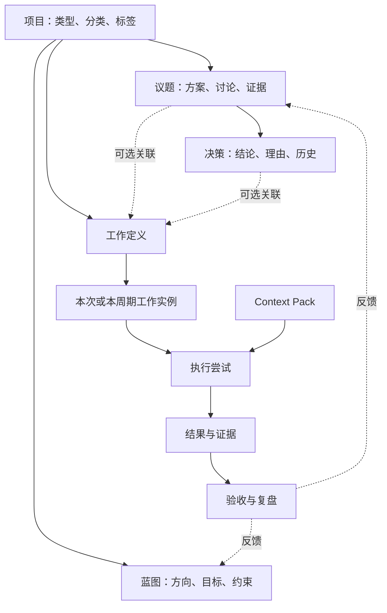

# 元垒系统架构规划设计

> 历史归档：正文保留原时点判断与证据，不承担当前任务或能力声明。当前入口见[规划目录](../../README.md)。

版本：1.2  
规划日期：2026-10-05  
状态：架构主线与阶段范围已确认；具体字段、迁移和实现方案在对应开发需求中细化。  
适用范围：个人用户优先，未来扩展至中小公司。

## 1. 文档定位

本文规定元垒的产品架构主线、核心概念边界、最小可行架构、专项规划、方案取舍理由及三阶段路线图，作为后续需求、设计和开发的依据。

本文区分“当前已有事实”“推荐目标架构”和“未来扩展”。目标架构不表示已经实现；未来方向不构成当前开发范围。开发时以当前源码与数据约束确认事实，以本文确认方向和取舍，再在具体需求中明确验收标准。

本规划不要求一次完成全部模型，不要求每件事经过完整管理流程，也不要求为未来组织协作提前建立权限、成员或租户体系。

## 2. 产品定位与阶段目标

元垒是面向个人及未来中小公司的 AI 管理与执行平台。它围绕项目连接方向维护、问题研讨、决策、工作执行、结果验收与复盘，使人和智能体在同一业务主线上开展工作。

第一阶段以一个个人用户维护和使用系统为前提，跑通业务架构。项目负责人、工作负责人、执行者等字段承担展示、责任标识或现有执行关联，不建立团队成员资格，也不授予权限。团队协作、组织归属与共享授权在第三阶段建设。

阶段目标：

1. 第一阶段：形成可日常使用的个人管理闭环。
2. 第二阶段：用真实周期业务验证持续工作、周期归档和必要的结构化能力。
3. 第三阶段：在已有业务闭环上丰富多人协作、归属与权限边界。

## 3. 设计原则

### 3.1 扁平入口，明确语义

项目是主要组织入口。分类和标签承担领域区分，不增加强制领域层或事业部层。长期经营和阶段交付通过项目属性区分。

扁平化降低操作成本；对象之间仍需要明确身份、状态和关联。界面融合不等于数据库字段合并，关联关系也不等于增加导航层级。

### 3.2 个人先用，按阶段扩展

当前围绕一个用户的实际业务设计。保留现有用户归属和后端访问校验；不提前建设共享成员、组织角色、委托授权或租户隔离。

标明负责人不会改变访问权限。弱关联字段不要求对应未来组织成员，不为其建立超出当前业务需要的资格校验。

### 3.3 流程按需使用

临时事项可以直接创建工作；涉及分歧和取舍时再创建议题；已有稳定方案时可以直接形成持续工作定义。蓝图、议题、决策与工作之间允许松散关联。

重要性和复杂度决定管理深度。简单事项可以在一次操作里提交结果并验收，避免强制多次确认。

### 3.4 业务状态与执行状态分开

工作完成、周期完成、执行尝试结束和 AgentRun 成功分别表达不同事实。运行成功不能自动证明业务目标达成。

### 3.5 事实有唯一来源

正式业务对象在元垒维护。外部渠道保存来源与映射，图形页面从业务关系生成，汇报引用执行结果和产物。避免多个可独立编辑的状态来源。

### 3.6 抽象由真实使用推动

优先复用已有工作任务与执行底座。只有出现稳定的重复需求，才提取目标、提案、通用关系或规则能力。不因未来可能需要而提前引入配置引擎。

## 4. 当前实现基线

检查分支：`develop-v0.0.1`。检查提交：`ed4d598d0e761d59729bf694b1877ecaf8663acd`。

本基线来自源码、数据模型、路由、页面和设计记录阅读，未通过启动应用或运行测试验证。后续分支发生变化时，需要重新核对对应实现。

| 对象 | 已有实现 | 主要边界与缺口 |
|---|---|---|
| 项目 | 用户归属、持久工作目录、管理状态、优先级、负责人、日期 | 当前以单用户归属访问；类型、分类和标签需要补充 |
| 蓝图 | 多份 Markdown，编辑、归档、重命名、删除 | 缺少稳定引用身份、结构化目标与完整修订链 |
| 议题 | 标题、正文、来源、纳入审核、追加讨论 | 审核通过或拒绝后正文和讨论只读，限制持续研讨 |
| 决策 | 结论、理由、拍板人，可关联议题 | 拍板写为 implemented；缺少替代与撤销语义 |
| 治理任务 | 来源审核、议题和决策关联、智能体关联 | 与正式工作任务并存，存在两条执行入口 |
| 项目工作任务 | 状态、子任务、问题单、评论、日期、负责人、知识库、附件、网页引用 | 当前最适合承载正式工作；缺少直接决策关联与明确验收结构 |
| 执行尝试 | 分配、接受、排队、运行关联、中断、失败、重新执行 | 应保留；与业务任务状态分开 |
| 周期能力 | 定时 Agent 定义及触发记录；任务周期巡检 | 尚未统一为业务工作定义与周期实例 |
| 智能体 | 全局配置、项目绑定、项目配置覆盖、接收配置 | 能作为执行底座；业务责任与运行角色需区分 |
| 上下文 | 工作目录、项目覆盖、知识库选择、Skills、摘要、运行 manifest | 尚无完整的业务 Context Pack |
| 图关系 | 通过议题、决策和治理任务外键生成展示 | 尚未完整覆盖正式工作与结果 |

当前页面分为项目 Dashboard、项目工作台、项目工作任务、数字员工工作台、定时任务管理和收件箱。第一阶段重点减少用户对不同入口的辨别成本，不要求同时重写所有页面。

## 5. 核心概念与边界

### 5.1 项目

项目是用户组织、维护和查看一组业务的主要空间，可以承载长期经营或阶段交付。

| 类型 | 示例 | 生命周期 |
|---|---|---|
| 长期经营 | 健康、学习、日常经营 | 可以长期持续，没有强制结束日期 |
| 阶段交付 | 平台 V1、一次活动、阶段学习计划 | 有明确交付范围和完成条件 |

最小属性：名称、描述、类型、分类、标签、管理状态、可选日期、可选负责人标识。

分类用于主要归类，标签用于交叉筛选。分类与标签不承担授权或数据隔离。项目软删除状态与业务管理状态继续区分。

第一阶段不增加强制项目父子层级。跨项目查看通过筛选和汇总实现。

### 5.2 蓝图与目标

蓝图维护方向、目标、原则、约束、阶段路径与复盘结论。蓝图可以有多份文档，不要求一个项目只有一份总纲。

目标描述期望现实发生的变化；决策描述为此选择的做法；工作描述需要执行的行动。工作全部完成后，目标仍可能未达成。

第一阶段采用蓝图模板表达目标，不新增目标管理中心。模板至少包含：

- 背景与当前状态。
- 预期结果。
- 衡量方式或可观察的成功条件。
- 时间范围和复盘时间。
- 原则、资源与约束。
- 阶段路径与当前重点。
- 最近复盘及待调整内容。

指标不要求全部量化；能清楚核对结果即可。第二阶段出现跨工作进度聚合、多个议题共同服务目标等需求时，再提取结构化目标，并继续在项目内呈现。

### 5.3 议题、提案与讨论

议题承载一个需要解决的问题或明确取舍的事项。议题详情融合背景、候选方案、讨论、证据、当前决策、历史决策与关联工作。

第一阶段的提案作为议题正文中的候选方案，或讨论中的建议。吸收既有需求后，讨论类型采用“研讨、重议、纠偏”，默认研讨，不增加“决策讨论”。通过前后的语境由时间线节点表达。证据等内容直接在正文表达，暂不叠加另一套分类体系。

“是否纳入正式管理”与“问题是否解决”分别维护：

| 维度 | 建议状态 | 含义 |
|---|---|---|
| 纳入状态 | 待纳入、已纳入、拒绝 | 来源或事项是否成为正式管理对象 |
| 议题状态 | 开放、已形成决策、已关闭 | 当前研讨与处理进度 |

已纳入议题可以继续讨论。形成决策后仍允许执行反馈；需要重新研讨时可以重开。拒绝纳入的内容允许修改和讨论，准备好后显式重新提交，同一议题保留历次拒绝与重新提交记录。

议题可承载问题型事项或附带预期结果的推进事项，但议题状态仍表达研讨进度。“实际目标已达成”通过可选的结果确认记录表达，附说明和证据；不与纳入状态、议题状态合并为单一状态机，不根据任务全部完成自动推导。问题型议题可以形成决策后关闭，无须虚构业务目标。

第一阶段允许修改议题当前正文、追加讨论，并建设议题专用的最小修订快照与时间线。当前描述置顶，时间线倒序展示创建、修改、讨论、纳入、拒绝、重新提交、重开、关闭、归档等节点。正文修订保存标题、正文、原因、操作者和时间；讨论绑定当时修订；历史变更与快照在同一事务中保存。完整差异比较、分支修订和通用事件平台暂缓。批准决策保留当时相关内容的快照或稳定引用，避免后来修改正文使历史决策失去依据。

正式重开记录原因，并明确“原方案继续执行”或“建议暂停原方案”。后者在议题和相关决策展示醒目提示，不取消 Run、不暂停关联任务、不自动撤销原决策，也不作为执行授权门禁。若需改变正式决策，仍通过替代或撤销记录完成。

归档作为独立可恢复的可见性状态，不替代研讨或结果状态。首期删除仅面向误建、无价值且无受保护引用的议题；有关联决策、正式工作、治理任务或执行依据时拒绝删除并提供归档。删除实现优先软删除，现有引用和历史保留；永久清理与级联销毁不在首期范围。所有操作仍由当前个人用户维护，不引入团队资格规则。

讨论回复和采纳处置有局部价值，放在最小生命周期闭环后实施。首期回复只支持一层；“采纳、部分采纳、不采纳”是独立处置记录，可以关联实际正文修订或决策，不从回复文字推导，也不自动修改业务对象。

仅当候选方案需要独立修订、比较、表决或跨议题复用时，第二阶段再考虑 Proposal 独立对象。

### 5.4 决策

决策是对问题当前被接受的答案或选择。决策保留独立身份，界面在议题中集中维护。

最小内容：结论、理由、关键依据、被否替代、风险或适用条件、拍板记录、关联议题。第一阶段不引入审批人资格或组织权限规则；拍板记录由当前个人用户维护。

建议状态为草案、已批准、已被替代、已撤销。批准表达接受方案；落地情况由关联工作结果和验收判断。

批准后的决策内容不直接覆盖。调整方向时创建新决策，记录替代关系；撤销保留原因与时间。当前有效决策按具体决策的替代和撤销关系判断，不假定一个议题只能有一条有效决策。

草案可以编辑。草案不能默认作为执行中的权威要求；用户确实需要探索性执行时，应明确标明其性质。

吸收既有决策需求后，第一阶段补充以下局部能力：无受保护引用的草案可删除；批准后不改变业务含义的文字错误可追加勘误记录，保留批准原文、修正内容、原因和时间。目标、范围、数值、责任、条件或做法变化按补充、替代或撤销处理，即使起因是输入错误，也不能用勘误覆盖已批准事实。

补充决策追加新的要求或说明，批准后原决策继续有效；替代决策批准后原决策被替代。两者使用明确目标关联，不依赖自由标签。首期补充只针对一条原决策，替代只支持整条；部分替代、复杂合并和级联自动失效暂缓。原决策被替代或撤销时，相关补充提示需要复核，由个人用户处理，不自动修改任务、运行或其他决策。

决策时间线记录草案修订、批准、勘误、补充生效、替代和撤销，原批准文本及依据仍可查看；在议题详情汇总相关节点。不另建里程碑或大事记平台。讨论形成的共识可先作为总结，明确批准后才成为正式决策。议题纳入与决策批准继续独立，待纳入时默认只保存草案；若确需批准，由用户明确操作，并提示议题尚未纳入，不引入强制组织审批门禁。

### 5.5 工作定义、实例与执行尝试

Work Definition 是业务上的工作定义，统一一次性工作、周期工作、自动化工作和监控工作。现有项目工作任务作为演进基础，用户界面可以继续使用“任务”和“持续工作”。

| 对象 | 职责 | 完成含义 |
|---|---|---|
| 工作定义 | 说明做什么、何时触发、谁负责、怎样验收 | 一次性工作结束，或持续定义停止／归档 |
| 工作实例 | 承载本次或本周期的工作范围、状态与结果 | 本次或本周期验收结束 |
| 执行尝试 | 记录一次分配和执行过程 | 本次尝试产生结果，失败或取消 |
| AgentRun | 智能体运行与恢复的技术事实 | 运行终态，不直接证明业务完成 |

一次性工作可以只有一个实例，页面隐藏实例层。第一阶段继续以现有任务作为一次性业务实例，不为尚未开展的周期业务提前新增空壳模型。第二阶段明确区分可重复定义与实例，并迁移相关数据。

工作定义在概念上分别表达：

- 频率：一次性或周期性。
- 触发：手动、定时或事件。
- 执行方式：人、智能体或确定性规则。
- 工作目的：产出、记录或监测。

实现时优先提供预设组合，不要求第一阶段建立四套可自由组合的配置系统。

工作可以没有议题或决策；需要追溯时关联议题和已批准决策。第一阶段以单个主要关联满足需求；多对多关联在真实需求出现后扩展。

### 5.6 负责人、执行者与验收者

负责人标明对工作结果的责任；执行者标明一次尝试由谁执行；验收者标明谁确认结果。

第一阶段这些角色由个人用户维护。负责人等展示字段可以为空或使用轻量标识，保持弱关联，不引入成员资格或授权语义。现有智能体分配为了真实运行而需要合法 Agent 与项目绑定，这属于执行约束，不能扩展成所有责任标识的组织资格校验。

人类工作先支持个人用户手动维护状态、提交结果和验收。无须为手动操作模拟 AgentRun，也不要求提前建立人类执行队列。第三阶段再增加真实团队成员协作和责任规则。

### 5.7 结果、证据与验收

工作开始前说明验收标准。执行结束后记录结果摘要、产物或证据引用、未解决问题、来源执行记录；个人用户确认是否满足要求。

复杂工作可以经历“结果待验收”；简单工作可以提交结果时一并验收。验收不通过时保留结果，继续原工作并创建新尝试，无须删除失败历史。

AgentRun completed、执行尝试 completed、工作 done 分开维护。界面清晰显示三者，避免把“AI 已回复”展示为“业务已完成”。

第一阶段优先在现有评论、产物引用和任务结构上增加最小验收信息。是否提取独立结果表，由重复产物、版本和查询需求决定。

## 6. 最小可行架构

图表示目标关系，不表示第一阶段必须新增所有表。第一阶段通过现有项目、蓝图、议题、决策、工作任务和执行尝试完成一次性闭环。周期实例在第二阶段正式建设。

核心路径：维护方向 → 研讨重要问题 → 形成决策 → 创建或关联工作 → 准备上下文 → 执行 → 核对结果 → 验收 → 复盘。

允许短路径：直接创建任务并执行、手动提交结果、按现有定时能力完成自动化。短路径仍应能追溯实际结果。

## 7. 专项规划

### 7.1 治理任务与正式工作的收敛

当前治理任务维护来源审核，正式工作任务维护长期责任和执行。两者的职责有价值，但继续作为两套普通任务入口会增加辨别成本。

目标：治理任务呈现为“工作建议／待纳入工作”。纳入后创建或关联正式工作对象，保留来源、审核记录和映射；新执行统一进入正式工作。

实施要求：

1. 纳入操作幂等，重复操作不产生重复正式工作。
2. 可以关联已有工作，避免外部镜像与本地工作重复。
3. 来源记录与正式工作状态分开；外部渠道不能绕过元垒改写正式状态。
4. 既有治理执行历史保留可读；新入口收敛不等于立即删除旧表。
5. 外部同步大规模改造暂缓，先打通项目内建议到正式工作的路径。

理由：保留来源审核能力，同时让用户只有一个正式工作事实源。

### 7.2 Context Pack

Context Pack 是为某次执行组装的业务上下文包。它回答“这次执行者需要知道什么”，运行 manifest 回答“这次使用了什么运行配置”。两者互补。

第一阶段至少支持：

| 内容 | 目的 |
|---|---|
| 工作目标、范围和验收标准 | 明确本次交付 |
| 选定蓝图片段及约束 | 保持方向一致 |
| 关联议题摘要与已批准决策 | 解释背景和取舍 |
| 指定文件、网页、知识库 | 提供事实来源 |
| 前次结果、失败原因和未解决问题 | 支持重试与交接 |
| 来源身份、版本或哈希、生成时间 | 核对执行当时的输入 |

组装规则：

1. 必需且简短的内容直接提供，大资料提供引用并按需读取。
2. 设置内容预算，明确显示截断、未获取和缺失资料。
3. 第一阶段优先显式选择和确定性组装，智能推荐可后加。
4. 用户可预览本次上下文；不强制每次手动审批。
5. 执行派发前生成并绑定快照；同一次尝试的派发重试复用快照。用户发起新的执行尝试时可以重新组装。
6. 记录正文快照或可定位来源。大文件采用稳定引用与哈希时，应明确是否能还原旧字节，不能宣称全部输入都可重放。
7. 权限继续由已有后端边界执行。Pack 及其引用不授予额外读取能力。
8. 资料内容与执行指令区分，外部资料不覆盖用户的任务要求。

第一阶段验收：任务执行能获得选定的背景和验收要求；历史尝试可查看当时的 Pack；任务或决策后来修改不会改写已派发尝试的输入记录。

### 7.3 蓝图身份、版本与存储

继续采用 Markdown，避免提前开发复杂战略编辑器。优先支持模板、相关片段选择以及 Context Pack 快照。

稳定蓝图身份用于长期关联，不依赖文件名。可以增加最小元数据索引，但蓝图正文保持一个事实来源，避免数据库和文件各维护一份可独立编辑的正文。

完整逐次修订历史暂缓；决策和执行所需的历史内容通过快照保存。归档与修订不同：归档表示退出当前蓝图集合，修订表示同一蓝图内容变化。

当前多个项目可以共享工作目录，因此可能共享蓝图字节。第一阶段先明确现有共享行为：界面提示实际共享，引用必须包含项目与来源定位。若业务要求项目蓝图独立，再设计按项目隔离的存储位置及迁移，不静默复制或改变已有目录。

### 7.4 底层图关系

业务对象构成图，PostgreSQL 继续拥有业务事实。关系图从数据库关联生成，不保存第二套可独立编辑的图节点状态。

优先建设有明确业务用途的关系：工作来源决策、决策替代、工作父子关系、必要的工作依赖、结果来源执行和产物引用。

强归属关系使用明确外键；松散关联按当前需求使用外键或专用关联表。只有多个业务类型反复需要相同关系管理时，才考虑带关系类型、范围约束和有效目标校验的通用关联表。

现有 Neo4j 知识图谱与业务治理图承担不同职责。第一阶段不迁移业务事实到 Neo4j，不开发全局图编辑器。关系展示优先覆盖正式工作及其决策来源。

### 7.5 周期、自动化与监控

第一阶段保留现有定时 Agent 和规则巡检，明确能力含义，不包装成已完成的 Work Definition 引擎。

第二阶段建立定义与实例：周期触发生成唯一实例；实例保存周期边界、状态、结果和执行尝试；定义暂停仅停止未来触发，历史实例保留。

需要明确的规则包括：时区与周期边界、重复触发幂等、重叠周期处理、错过周期是否补跑、实例取消、定义修改对未来实例的影响、同一实例失败后的重试。

首期采用固定且可解释的默认规则。例如每个定义的周期键唯一，禁止同一实例并行执行；错过周期的补跑方式在具体场景中选定，不先提供大量配置选项。

周报的数据窗口与汇总运行分开：一周内记录持续积累，周一的汇总只是该周期的一次执行。健康记录也通过日期或周期归属保存，不靠一个永久 in_progress 的任务承载全部历史。

监控包含观测对象、检查频率、异常条件、上次发现、通知去重与可选后续行动。确定性规则能完成的检查优先用规则；需要分析判断时再调用智能体。

当前巡检检查任务状态、逾期和活跃执行情况，没有调用智能体。页面应标明“系统规则巡检”；按智能体名称署名不证明该智能体实际参与。

### 7.6 页面与导航

项目内建议呈现五类入口：概览、蓝图、议题、工作、智能体。收件箱保持跨项目入口。

- 概览显示当前重点、待处理议题、正式工作进展、待验收结果与异常。
- 议题详情融合方案、讨论、决策与关联工作。
- 工作统一展示正式任务；第二阶段再增加持续工作及周期实例。
- 智能体页维护配置和执行队列，业务结果仍回到关联工作。
- 治理审核作为待处理建议入口，逐步收纳进议题或工作，不继续扩张为另一套执行中心。

看板、列表、甘特图和关系图读取相同事实。页面数量减少与否由实际操作链决定，不以大规模界面重写作为第一阶段前提。

### 7.7 智能体与运行底座

继续复用 ProjectAgent、AgentRunRequest、AgentRun、worker、租约、恢复、知识库、Skills 和工作目录等现有能力。

业务统一入口不要求合并底层运行机制。AgentRun、定时调度和 Durable Task 保留各自状态与职责。新增业务工作实例通过明确关联复用执行底座。

一个业务工作可以经历多次尝试和不同智能体交接。交接以 Context Pack、结果和未解决问题为依据。第一阶段不扩展复杂多智能体协商平台。

## 8. 三阶段路线图

### 8.1 第一阶段：现在该做

目标：一个个人用户维护完整闭环，先覆盖一次性工作和现有自动化能力。

| 顺序 | 工作包 | 最低验收标准 |
|---|---|---|
| 1 | 统一概念、页面术语与入口 | 用户能区分议题纳入、决策批准、执行结束和业务完成；正式工作入口明确 |
| 2 | 项目属性与蓝图模板 | 长期项目无需结束日期；分类标签可筛选；蓝图能表达目标及复盘条件 |
| 3 | 议题与决策语义 | 已纳入议题能继续讨论；批准不显示为已落地；决策替代保留历史 |
| 4 | 正式工作与决策连接 | 工作可独立创建，也可追溯议题和决策；工作建议纳入不会重复创建 |
| 5 | 验收标准、结果与 Context Pack | 可预览执行背景，快照绑定尝试，执行后可核对证据并验收 |
| 6 | 反馈与概览收敛 | 正式工作结果回到项目概览、议题及复盘；历史治理执行仍可读取 |

顺序表达依赖和推荐优先级，不要求每项单独发布。负责人仅按当前个人使用的标识和弱关联维护，禁止把第三阶段的成员和授权需求混入本阶段。

第一阶段不做：组织模型、团队成员管理、共享访问、复杂审批、独立目标中心、独立 Proposal 平台、通用图引擎、可视化流程编排、完整周期实例平台。

现有周期能力可以继续使用，但不宣称覆盖按周期收敛归档的全部业务。

### 8.2 第二阶段：暂缓，闭环稳定后建设

目标：使持续工作能按周期生成、执行、归档和复盘，并根据实际需求补充结构化管理。

核心工作：

1. 从现有工作任务演进出 Work Definition 与 Work Occurrence。
2. 将定时触发映射到业务实例，保留底层调度记录。
3. 建立周期数据归属、历史查询、失败重试和定义暂停语义。
4. 完善监测发现、通知去重与后续行动连接。
5. 按需求增加工作依赖、多对多来源、结果版本。
6. 在跨工作统计成为常见需求时提取目标；在候选方案独立管理成为常见需求时提取 Proposal。

进入条件：第一阶段闭环已在日常使用；周期业务反复出现；现有方式的具体困难已能复现和描述。

验收重点：同一周期不重复生成；失败不会污染其他周期；暂停不抹掉历史；周报和日常记录能够明确归档到周期；可区分定义、实例与尝试的状态。

### 8.3 第三阶段：未来团队协作与权限

目标：保持项目入口扁平，在已有业务架构上支持多人协作和中小公司管理。

建设内容：团队或组织归属、项目成员和角色、共享文件与资源权限、人类执行记录与协作、责任标识向真实成员关系的映射、协作审计、必要的预算和审批、跨项目目标及外部渠道同步。

个人用户可保留个人空间体验。组织承担归属和权限边界，不强制用户经过多层组织导航。

进入条件：真实多人使用需求成立，具体协作对象、数据范围和授权操作已经明确。

迁移时原有负责人标识不自动获得权限。需要明确认领或映射规则，保留历史显示信息。共享工作目录、知识库、智能体和 Context Pack 引用都必须纳入真实后端授权边界。

## 9. 关键方案取舍及理由

| 议题 | 当前选择 | 理由 | 重新评估条件 |
|---|---|---|---|
| 领域层 | 项目分类与标签 | 扁平入口能满足个人管理与当前项目规模 | 独立领域确有跨项目治理职责 |
| 目标 | 蓝图模板先行 | 保留结果导向，降低新增对象和页面成本 | 经常需要跨工作统计或多议题关联 |
| 议题与决策 | 页面融合，记录分开 | 讨论便利，同时保留拍板历史和执行依据 | 使用中出现更简单且同样可追溯的方式 |
| 提案 | 正文与讨论承载 | 当前独立方案生命周期需求尚未成立 | 独立修订、比较或表决反复发生 |
| 纳入审核 | 与议题进度分开 | 纳入事项不代表研讨结束 | 实际来源流程变化 |
| 正式工作 | 现有 ProjectWorkTask 演进 | 已有丰富任务管理与执行关联 | 当前模型不能承载周期实例时进行明确迁移 |
| 治理任务 | 收敛为工作建议 | 保留来源审核，减少重复执行入口 | 外部来源有新的独立业务生命周期 |
| Work Definition | 统一业务语义，保留运行机制 | 避免把业务完成和底层运行状态混在一起 | 出现可证明的机制重复 |
| 负责人 | 标识与弱关联 | 个人先用，避免提前建设组织资格和授权 | 第三阶段真实协作开始 |
| Context Pack | 显式选择、确定性组装与快照 | 先解决背景缺失和历史输入不可核对 | 真实使用需要自动选择与推荐 |
| 图关系 | PostgreSQL 外键与专用关联 | 复用唯一业务事实源，减少双写 | 查询需求证明需要额外图投影 |
| 蓝图 | Markdown 正文与最小身份元数据 | 易维护、适合 AI 使用，降低编辑器成本 | 修订和引用需求要求更强结构 |
| 团队权限 | 第三阶段 | 当前个人归属足以完成闭环 | 明确多人共享与隔离需求成立 |

## 10. 场景验证与架构验收

### 10.1 开发交付：第一阶段主验收

蓝图说明交付目标 → 议题比较实现方式 → 批准决策 → 创建正式工作 → Context Pack 提供背景、范围和验收标准 → 智能体执行 → 结果绑定产物 → 个人用户验收 → 复盘反馈。

必须验证：决策批准不显示为已落地；Run 成功不自动完成工作；修改决策不改写旧尝试的上下文；失败后新尝试保留旧结果；直接创建临时工作也能完成。

### 10.2 周报：第二阶段周期验收

持续工作定义规定周期和汇总规则 → 每周实例接收本周记录 → 汇总执行读取明确数据窗口 → 验收与归档 → 下一周期独立生成。

必须验证：日常记录与汇总尝试分开；重复触发不重复生成；跨周补充有明确归属；暂停定义保留历史。

### 10.3 健康记录：第二阶段记录与监控验收

蓝图描述期望结果与衡量方式 → 周期实例承载训练和记录 → 人手动录入或智能体辅助整理 → 规则检查缺失或异常 → 周期复盘反馈方向。

必须验证：记录完成与目标达成分开；监控检查不等同于业务执行；通知按实际变化去重；长期项目不要求结束。

这些场景用于验证抽象覆盖能力，具体健康或业务策略不属于系统架构规则。

## 11. 后续需求与开发约束

每个开发需求至少说明：所属阶段、实际场景、当前失败或困难、目标行为、非目标、受影响对象、状态变化、来源与结果、验收方式。

实施前核对当前源码和历史数据；状态语义修改必须制定迁移方案，不能只替换前端文字。保留已有执行尝试、Run、评论、来源和审核历史的可追溯关系。

界面融合优先复用现有 API 与事实，必要的新关系在业务拥有者处维护。不得通过新增中央副本来同步状态。

涉及持久化、执行或上下文的变更，验证实际保存和回读结果；涉及周期与恢复的变更，验证重复触发、失败重试及历史归属；涉及权限的变更仅在对应阶段和实际需求中扩展。

如果新增需求超出当前阶段，应记录进入条件和暂缓理由。只有明确调整阶段范围后才纳入当前开发。

## 12. 尚需在具体实施中确定的事项

以下是工程细化项，不影响已确认主线，也不默认扩张范围：

- 纳入状态与议题状态的精确枚举、迁移方式和重新提交操作。
- 决策替代是否允许分部分替代，首期优先整条替代。
- 验收字段直接放在任务还是关联最小结果记录。
- Context Pack 的具体预算、快照位置、文件引用保留方式与恢复读取规则。
- 蓝图稳定 ID 与共享工作目录的引用、提示和必要迁移。
- 治理任务历史入口收纳及工作建议到正式工作的映射方式。
- 第二阶段周期默认规则与旧任务迁移；不提前为所有可能规则建立配置项。

## 13. 规划维护

本文作为架构主线维护，不复制所有接口和字段。具体实现决定记录在对应设计或决策文档中，并链接回本文涉及的边界。

需要修改本文的情形：核心概念职责变化、阶段范围调整、事实来源改变、关键方案取舍被替换。普通字段调整和局部页面变化不要求重写架构主线。

规划调整时记录日期、改变的决定、原因及受影响阶段。已完成事实仍以当前源码和验证结果为准。

## 14. 源码依据

以下链接固定在本次检查提交，避免后续分支变化影响基线解释：

- [数据模型：项目、议题、决策、工作、执行与定时能力](https://github.com/Sxyon/Yuanlei/blob/ed4d598d0e761d59729bf694b1877ecaf8663acd/backend/package/yuxi/storage/postgres/models_business.py)
- [系统架构与执行底座](https://github.com/Sxyon/Yuanlei/blob/ed4d598d0e761d59729bf694b1877ecaf8663acd/ARCHITECTURE.md)
- [项目用户归属查询](https://github.com/Sxyon/Yuanlei/blob/ed4d598d0e761d59729bf694b1877ecaf8663acd/backend/package/yuxi/repositories/project_repository.py)
- [议题、讨论、审核与决策服务](https://github.com/Sxyon/Yuanlei/blob/ed4d598d0e761d59729bf694b1877ecaf8663acd/backend/package/yuxi/services/governance_service.py)
- [正式工作任务维护](https://github.com/Sxyon/Yuanlei/blob/ed4d598d0e761d59729bf694b1877ecaf8663acd/backend/package/yuxi/services/project_work_service.py)
- [执行尝试、派发与结果收敛](https://github.com/Sxyon/Yuanlei/blob/ed4d598d0e761d59729bf694b1877ecaf8663acd/backend/package/yuxi/services/project_work_execution_service.py)
- [运行上下文与 manifest](https://github.com/Sxyon/Yuanlei/blob/ed4d598d0e761d59729bf694b1877ecaf8663acd/backend/package/yuxi/services/agent_run_manifest_service.py)
- [蓝图文件维护](https://github.com/Sxyon/Yuanlei/blob/ed4d598d0e761d59729bf694b1877ecaf8663acd/backend/package/yuxi/services/project_blueprint_service.py)
- [确定性周期巡检](https://github.com/Sxyon/Yuanlei/blob/ed4d598d0e761d59729bf694b1877ecaf8663acd/backend/package/yuxi/services/project_work_inspection_service.py)
- [项目工作台页面](https://github.com/Sxyon/Yuanlei/blob/ed4d598d0e761d59729bf694b1877ecaf8663acd/web/src/views/ProjectInspectionBoardView.vue)
- [治理关系图](https://github.com/Sxyon/Yuanlei/blob/ed4d598d0e761d59729bf694b1877ecaf8663acd/web/src/components/project/ProjectGovernanceGraph.vue)
- [页面路由](https://github.com/Sxyon/Yuanlei/blob/ed4d598d0e761d59729bf694b1877ecaf8663acd/web/src/router/index.js)

## 15. 修订记录

| 版本 | 日期 | 内容 |
|---|---|---|
| 1.0 | 2026-10-05 | 基于仓库评估和用户确认，建立个人优先、扁平项目入口、业务闭环与三阶段路线；明确负责人弱关联和团队权限第三阶段建设 |
| 1.1 | 2026-10-05 | 吸收“完善议题状态与讨论”中的持续研讨、重开、讨论类型、最小修订时间线及归档需求；将目标达成与议题状态分开，明确暂停提示与任务解耦，确定下一轮开发边界 |
| 1.2 | 2026-10-05 | 核对P00更新后吸收原决策疑问：草案删除、批准后可追溯勘误、补充关系与决策时间线；保留批准原文和整条替代边界，不新增审批门禁或里程碑平台 |
