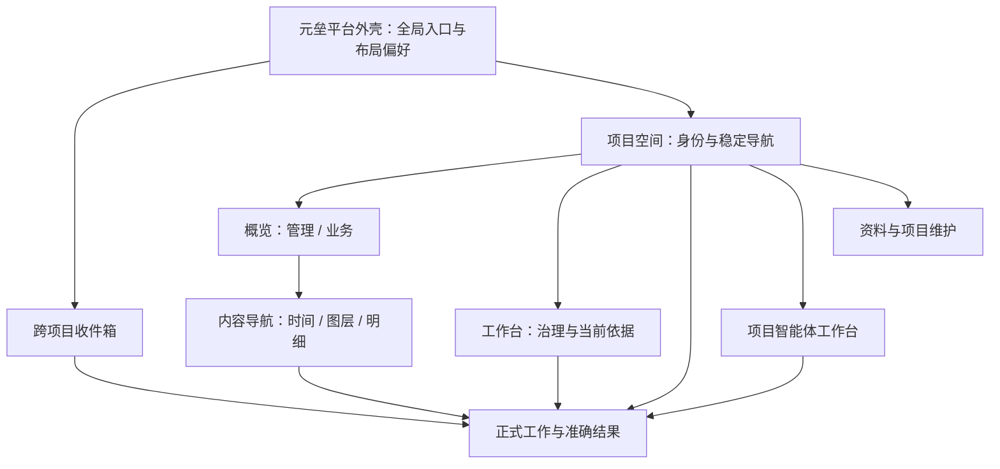
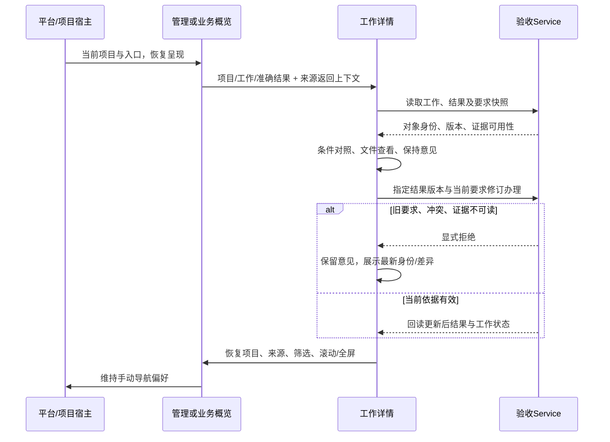

# 信息架构与 Dashboard：U4 分项收敛与首个实施包

> 历史归档：正文保留原时点判断与证据，不承担当前任务或能力声明。当前入口见[规划目录](../../../../README.md)。

状态：U4 导航职责、管理/业务分工与准确结果办理边界已获用户批准，P1a/P1b/P1c 已授权进入 U5；整体 U4 与专项未完成。

读者：专项负责人、产品设计与后续实现/验收人员。类型：设计收敛与实施准备。目标：把平台嵌入关系、页面职责及准确结果办理收敛为可独立实施的首包。本页保存 U4 设计与实施包准备范围；U5 产品实现和实际验收由[首包实施与验收记录](信息架构与Dashboard-U5首包实施与验收-2026-10-09.md)拥有。发布 Dashboard、扩大 R2 与批量模板建设保持后续范围。

## 1. 阶段、证据与拟采用范围

继承 [U2 暂定推荐](信息架构与Dashboard-U2整体方案比较-2026-10-08.md)及 [U3 连续任务与同空间对照](信息架构与Dashboard-U3连续任务与空间对照-2026-10-08.md)，吸收[第三轮复核 §2.4](两专项第三轮独立复核与收敛建议-6a672f4.md)。原事实唯一入口仍为 [U0/U1 记录](信息架构与Dashboard-U0U1事实与讨论-2026-10-08.md)；人工隔离项目验证只覆盖单结果人工链路。多结果、旧依据、跨项目、未恢复、业务观察返回及同空间 R1/R2 的合成证据由 U3 记录拥有，不升级成真实业务或用户效率证据。

| 分类 | 本轮状态 |
| --- | --- |
| 已确认目标 | 五项办理信息可取得且身份连续；个人先用、项目扁平、标签分类；Dashboard 观察分析导航，办理页执行业务动作 |
| 已核实源码 | 平台 AppLayout 与 chatUI 拥有导航布局偏好；项目 Dashboard 当前静态 iframe 和默认管理样板；治理准入与正式工作分开；验收 service 拒绝旧条件作为当前接受依据 |
| 作者原型检查 | 可信同 DOM 平台示意嵌入现有 A 内容；有限合成路径与几何/焦点/恢复检查。具体结果见第 7 节 |
| 可逆呈现假设 | 64px 平台栏、204px 项目栏、概览阅读顺序、文件轻预览组合、窄屏阈值；尚无本轮人类观察 |
| 已批准并实施的界面决定 | 三层导航职责、管理/业务分工、结果身份与依据连续、首包范围，见 [implemented Decision](../../../../../develop-guides/yuanlei/decisions/implemented/2026-10-09-project-navigation-result-interface.md) |
| U4 原未验项的当前状态 | 真 AppLayout 嵌入、隔离多结果及来源回返已由 U5 验证；屏幕阅读器、物理触屏、真实跨登录偏好和真实业务样本仍未验；动态加载/模板版本/Agent 工具/启用回退见后续出口 |

用户批准界面分项并授权首包产品实现，未提供连续操作的阅读/误认观察。职责与业务不变量独立收敛；像素、密度、默认折叠保持可逆假设。无需等待动态创作闭合才准备首包；专项收尾仍必须验证真实嵌入与后续能力。

## 2. 三层职责与同空间取舍

本节保留 U4 嵌入稿与拟采用参数，当前产品偏好映射、宽度和返回行为以[U5 首包记录](信息架构与Dashboard-U5首包实施与验收-2026-10-09.md)及源码为准。

元垒是平台，项目拥有 Dashboard。平台入口提供聊天、智能体管理、个人空间、跨项目收件箱与项目选择；项目空间提供当前项目的概览、工作台、工作、项目智能体和资料；大屏内容只提供自身时间/筛选、图层、明细与准确对象钻取。平台“智能体管理”管理可用 Agent，项目“智能体”查看该项目绑定与执行，二者名称和上下文须可辨认。项目维护入口归概览页标题区，内容定义不生成第二套项目菜单。

嵌入稿（`research/prototypes/dashboard-u3-20261008/embedded.html`）复用现有 A 内容及 B/C 对照；外壳是合成宿主示意，同 DOM 可信页面。它没有挂入真实 AppLayout，也不代表生成代码能够控制宿主。平台菜单中未实现入口禁用；现有 R2 独立隔离样例保留原范围。

| 同一空间策略 | 用户收益 | 代价与反对证据 | 采用范围 / 推翻条件 |
| --- | --- | --- | --- |
| 平台随场景自动收起，悬浮展开 | 业务图墙宽；鼠标可快速取全局入口 | 自动状态与手工偏好混淆；误触遮挡；触屏无 hover；键盘焦点进入后不得因指针离开关闭 | 自动响应窄屏/全屏仅临时呈现；悬浮只保留细指针实验。如真实跨项目高频操作明显受显式展开阻碍且无误收起，再扩大 |
| 项目导航折叠 / 调宽 | 同项目长时间观察可释放整栏；长名可读 | 收起后需要稳定展开入口；调宽挤压明细；连续拖动增加边界和持久化维护 | 首包显式收起；180/204/260 档位原型比较，产品先固定合适宽度。长项目名在真实样本仍被误认，才考虑调宽/拖动 |
| 平台窄栏 + 显式展开/固定；项目按需收起 | 平台身份持续可见；按任务分配空间；手工偏好可预测 | 双层入口需解释；展开覆盖内容，固定占宽；菜单焦点和恢复须有统一 Owner | **暂定推荐**。在内容明显不足时转单列；若双层导航导致频繁误入全局 Agent 或丢项目身份，调整分组和项目头部，必要时取消固定态 |

桌面基线为平台 64 + 项目 204；显式展开平台覆盖到 224，不重排正文，固定到 224 则占位。1440 宽时默认正文约 1172，双固定约 1012，项目调至 260 后约 956；项目收起可释放其整栏。它们是 CSS 几何与截图尺度，未证明真实阅读效率。窄于 1100 时平台固定不再占位，跨断点或重载保持收起；显式展开才呈覆盖，保存的固定偏好在回到宽屏时恢复。窄于 700 时显式打开平台/项目菜单，主内容单列。阈值与宽度是呈现假设，不能成为数据或访问限制。

平台状态由宿主维护：已有 `chatUI.sidebarCollapsed` 作为产品手动偏好 Owner，实施前定义从布尔收起到窄栏/显式展开/固定的映射并保护用户旧值。项目折叠按项目键保存；内容时间筛选/图层及返回位置按项目和实例保存。原型统一宿主偏好只用于空间试验；产品级用户/项目折叠偏好由 U5 实施。全屏和窄屏不得写回手动偏好；跨项目切换不得携带另一项目的结果选择、意见和筛选绑定。

展开后焦点落到收起按钮，Esc 回到展开触发器；悬浮实验在菜单含焦点时保持展开。触屏显式按钮至少 44px，不依赖 hover。产品覆盖层须有可访问名称、焦点约束及关闭恢复；固定栏采用正常导航顺序，无焦点圈闭。菜单滚动与正文滚动分别归宿主管理，打开/收起不得把正文回到顶端。拖动若后续采用，须有档位/键盘替代、范围、取消及恢复验证；本轮没有实现或证明拖动。

## 3. 管理、治理、执行与办理的连续路径

| 页面 / 入口 | 第一层信息和主要动作 | 按需展开 | 连续路径与职责边界 |
| --- | --- | --- | --- |
| 项目概览·管理 | 项目身份、待治理、正式工作、待验收“份/工作数”、当前异常；进入准确事项，新建独立工作 | 当前依据摘要、历史异常、关系与汇报 | 默认初入落点；有业务大屏时仍可显式切回；统计口径与读取时间由真实数据给出 |
| 项目概览·业务 | 数据主题、来源、口径、截至/获取时间、缺数/过期；分析、明细与准确对象钻取 | 来源明细、单位说明、局部图层 | 平台/项目导航仍由宿主保留；全屏退出及办理返回恢复来源筛选；失败有管理兜底 |
| 项目工作台 | 当前蓝图、待治理、有效决策与关联正式工作；研讨、确认/准入、从依据准备执行 | 议题时间线、决策历版、引用与关系图 | 蓝图 → 议题 → 有效决策 → 新建或关联工作。工作建议走治理准入，映射到正式工作后才有执行状态 |
| 工作列表 | 项目范围、编号/标题、状态、负责人、要求修订、结果待办；直接新建人工工作 | 来源和执行摘要、筛选 | 人工事项无需先议题或绑定 Agent；进入已有工作保持筛选与滚动 |
| 工作详情 / 结果办理 | 项目/工作/结果身份、摘要、提交时条件及当前差异、交付文件、意见和办理动作 | 不同结果/尝试、当前来源和历史、编辑设置、Git 成果 | 打开指定结果，旧条件先警示；无指定结果选择当前可办理结果并明确规则；接受结果与完成工作分开 |
| 跨项目收件箱 | 项目、业务对象、待办阶段、处理者与已读分别展示；进入准确事项/答复 | 来源线程、答复/采用/恢复历史 | 已答未恢复保留入口；已读不等于处理。第一包保持现有入口/API，不重做 B 完整队列 |
| 项目智能体工作台 | 项目 + 绑定 Agent；待接受、当前执行、异常、需要人介入、正式结果分别展示 | 尝试/Run、模型快照、求助传递/恢复与配置 | 接收/执行到准确工作和结果；人的求助去收件箱，尚在上级处理不计人待答。全局 Agent 管理不代替项目工作台 |
| 资料 / 维护 | 项目文件入口与 Dashboard 状态，当前生效/默认兜底的身份 | 工作资源、历史定义、后续草稿与版本 | 通用资料浏览和“这份结果的交付”分别表达。维护入口稳定留在宿主，不依赖自定义页面能加载 |

治理到执行的两条路径必须保留：独立人工创建直接调用正式工作创建；工作建议调用准入的 create/link，读取返回的正式工作映射。有效决策可以预填正式工作来源，实际创建仍检查来源有效性和需复核标记。既有 CG-012 样本展示“打开关联工作”，避免用户误以为又创建了一个工作。原型准备表单明确标注未写业务；真正准入、确认、委派、接收和恢复没有模拟成成功。

暂定阅读顺序为：项目与工作/结果身份 → 摘要 → 条件差异与交付 → 办理；不同结果/历史尝试作为可选择的次级区域。长条件按摘要/展开提供，不把文件全文强塞首屏。当前结果可接受且文件可读时，主动作仍须区分“接受结果”和“接受并完成”；无需文件的纯文字事项保留后端合法语义。旧依据不可直接接受的规则来自 service；原型不得把它描述为单纯视觉偏好。

文件组合暂定为 Markdown/图片轻预览，PDF 轻预览能力按真实解析/浏览器条件确认；独立打开作为长文对照、大文件及预览失败的稳定出口。预览标题必须显示项目/工作/结果/文件，关闭回原意见与选中结果。独立打开不传任意宿主路径，不把项目目录 URL 与沙盒虚拟路径混用；未支持类型显示能力说明与合法下载/打开入口。真实文件渲染、鉴权与大文件限制待产品验证，合成 PDF/Markdown 不证明实际服务支持。

## 4. 首个产品实施包：导航与准确结果详情

拟包名 P1：项目空间导航与准确结果办理。可独立评审与实施，进入 U5 需要用户批准范围；本文交付准备材料。范围含平台呈现适配、项目布局、管理/业务入口分工、结果聚焦和返回连续性；工作台和项目 Agent 页复用现有业务主体并补入口/来源链接。治理编辑器、跨项目队列改版、业务大屏动态运行时和素材库不进入 P1。

### 4.1 嵌入页面稿与视觉假设

可操作入口为 `http://127.0.0.1:8767/embedded.html#a/alpha/overview`，本地启动方式见原型目录的 `README.md`。地址只访问合成原型服务。截图是原型页面证据；比较工具栏是研究控制，不进入产品。

| 页面稿 | 核对目的 | 呈现判断 |
| --- | --- | --- |
| [管理概览](https://github.com/Sxyon/Yuanlei/blob/3c5ee33c64f82fcb5214f29e7b7198730bdeed55/research/prototypes/dashboard-u3-20261008/evidence/u4-embedded/management.png) | 平台窄栏 + 项目导航 + 待验收主区域 | 首屏先给数量和定位；结果列表比历史关系优先。已有四组卡片语义保留，密度需真实内容复验 |
| [业务观察](https://github.com/Sxyon/Yuanlei/blob/3c5ee33c64f82fcb5214f29e7b7198730bdeed55/research/prototypes/dashboard-u3-20261008/evidence/u4-embedded/business.png) | 大屏在项目空间中占位 | 内容只带时间和数据导航；与管理并列切换，项目入口稳定 |
| [平台覆盖展开](https://github.com/Sxyon/Yuanlei/blob/3c5ee33c64f82fcb5214f29e7b7198730bdeed55/research/prototypes/dashboard-u3-20261008/evidence/u4-embedded/expanded-overlay.png) / [固定展开](https://github.com/Sxyon/Yuanlei/blob/3c5ee33c64f82fcb5214f29e7b7198730bdeed55/research/prototypes/dashboard-u3-20261008/evidence/u4-embedded/pinned.png) | 取全局入口与长期跨项目工作 | 覆盖展开不压正文，固定展开换取持续可读菜单；宽度代价显式可见 |
| [项目收起](https://github.com/Sxyon/Yuanlei/blob/3c5ee33c64f82fcb5214f29e7b7198730bdeed55/research/prototypes/dashboard-u3-20261008/evidence/u4-embedded/project-folded.png) | 双层组合的释放空间 | 宿主标题区仍留“项目导航”按钮与身份，不把收起等同离开项目 |
| [准确结果](https://github.com/Sxyon/Yuanlei/blob/3c5ee33c64f82fcb5214f29e7b7198730bdeed55/research/prototypes/dashboard-u3-20261008/evidence/u4-embedded/accurate-result.png) | 交付信息与来源在平台中可辨 | 结果选择、提交时依据、意见属于同一对象；历史设置按需展开 |
| [工作台](https://github.com/Sxyon/Yuanlei/blob/3c5ee33c64f82fcb5214f29e7b7198730bdeed55/research/prototypes/dashboard-u3-20261008/evidence/u4-embedded/workbench.png) | 从有效依据进入正式工作 | 议题/决策不是执行列表；创建/关联入口标明正式工作边界 |
| [窄屏深色](https://github.com/Sxyon/Yuanlei/blob/3c5ee33c64f82fcb5214f29e7b7198730bdeed55/research/prototypes/dashboard-u3-20261008/evidence/u4-embedded/narrow-dark.png) / [窄屏菜单](https://github.com/Sxyon/Yuanlei/blob/3c5ee33c64f82fcb5214f29e7b7198730bdeed55/research/prototypes/dashboard-u3-20261008/evidence/u4-embedded/narrow-platform.png) | 触屏显式入口，正文单列 | 窄屏重载收起，显式展开呈覆盖；回宽恢复固定偏好，真实覆盖层可访问实现待验 |
| [全屏](https://github.com/Sxyon/Yuanlei/blob/3c5ee33c64f82fcb5214f29e7b7198730bdeed55/research/prototypes/dashboard-u3-20261008/evidence/u4-embedded/fullscreen.png) / [返回恢复](https://github.com/Sxyon/Yuanlei/blob/3c5ee33c64f82fcb5214f29e7b7198730bdeed55/research/prototypes/dashboard-u3-20261008/evidence/u4-embedded/fullscreen-return.png) | 观察 → R4 → 返回 → 退出 | 全屏是临时呈现；退出后宿主偏好保持 |

### 4.2 组件 / API 映射与改动范围

下表是实施落点，当前能力以源码为准；“拟新增”不代表本轮创建产品组件。详细协议保持既有 API Owner，不把表格当第二份接口规范。

| 用户结果 | 现有 Owner / 拟落点 | 数据/API 使用 | 改动约束 |
| --- | --- | --- | --- |
| 平台窄栏与显式展开/固定 | [AppLayout](https://github.com/sxyon/Yuanlei/blob/main/web/src/layouts/AppLayout.vue)、[chatUI](https://github.com/sxyon/Yuanlei/blob/main/web/src/stores/chatUI.js) | 现有项目与聊天 stores；不新增业务 API | 保护全局聊天、搜索、设置和原 sidebarCollapsed 值。临时窄屏/全屏与手动偏好分开；不让项目页面直写平台 DOM |
| 项目稳定导航 | 拟新增 `web/src/layouts/ProjectLayout.vue`，接入[现有 router](https://github.com/sxyon/Yuanlei/blob/main/web/src/router/index.js)项目页 | project_id 与现有 projects store | 保留 Dashboard/inspection/work/tasks/Agent workbench 已有 URL 和 route name；项目身份解析失败明确提示；全局页不套项目导航 |
| 管理与业务可切回 | [ProjectDashboardView](https://github.com/sxyon/Yuanlei/blob/main/web/src/views/ProjectDashboardView.vue)、[DefaultProjectDashboard](https://github.com/sxyon/Yuanlei/blob/main/web/src/components/project/DefaultProjectDashboard.vue) | [Dashboard API](https://github.com/sxyon/Yuanlei/blob/main/web/src/apis/project_dashboard_api.js)及[治理 overview](https://github.com/sxyon/Yuanlei/blob/main/web/src/apis/governance_board_api.js) | 原自定义 HTML 保持当前 sandbox；有效 HTML 也保留管理入口。未存在业务实例显示空态，不生成伪业务数；不偷渡 R1/R2 |
| 精确结果聚焦 | [ProjectWorkTaskView](https://github.com/sxyon/Yuanlei/blob/main/web/src/views/ProjectWorkTaskView.vue)、[WorkResultsPanel](https://github.com/sxyon/Yuanlei/blob/main/web/src/components/project/WorkResultsPanel.vue) | [projectWorkApi](https://github.com/sxyon/Yuanlei/blob/main/web/src/apis/project_work_api.js)的 getTask/reviewResult；既有 `#work-result-ID` | 从既有锚点选中指定结果，保留执行锚点。无效结果显式说明，不静默选邻近结果；与文件/意见绑定相同身份 |
| 意见与返回上下文 | 工作详情的局部状态、Vue Router 来源记录；沿现有加载 generation 防串扰 | 刷新后真实 getTask 回读；来源只存受控项目 route/筛选/滚动 | 至少页内切换/预览/409 保意见。拟按 project/task/result 保存短期会话草稿，不进业务数据库；登出清理、已办理意见冻结/清理待实现时验证；不接受任意 URL 回返 |
| 文件组合 | WorkResultsPanel、已有 workspace/attachment 文件入口；可提取轻预览面板 | 已有证据 availability 和合法文件 API | 保留独立打开；真实支持类型先查解析 Owner；首包可先做身份清晰与返回稳定，预览失败使用显式独立打开 |
| 治理 → 正式工作 | [ProjectInspectionBoardView](https://github.com/sxyon/Yuanlei/blob/main/web/src/views/ProjectInspectionBoardView.vue)、[WorkContextDrawer](https://github.com/sxyon/Yuanlei/blob/main/web/src/components/project/WorkContextDrawer.vue) | governance API 的准入 create/link 与 projectWorkApi.createTask | 已纳入建议打开已有映射；从决策创建固化来源，需复核明确确认；复用当前业务，不新建审批体系 |
| 项目 Agent → 工作/求助 | [ProjectAgentWorkbenchView](https://github.com/sxyon/Yuanlei/blob/main/web/src/views/ProjectAgentWorkbenchView.vue)、[InboxView](https://github.com/sxyon/Yuanlei/blob/main/web/src/views/InboxView.vue) | [执行 API](https://github.com/sxyon/Yuanlei/blob/main/web/src/apis/project_work_execution_api.js)及现有求助/收件箱接口 | 首包补准确链接/导航活跃态；接收、取消、恢复权限语义不改；不由运行日志推断正式结果 |

管理概览现有数据已给出结果对象与精确锚点：`governance_service` 生成工作/结果 href，默认概览分别计结果与工作。第一包优先消费这些数据，不另建前端汇总事实源。如需要“当前要求/旧要求”分组而 overview 项缺字段，先使用 getTask 的明确字段做小范围展示或保留原列表；禁止 N+1 扫描全项目伪造实时统计。确需 overview 增字段时单列后端契约增量、真实 HTTP/查询代价证据，再纳入范围评审。

### 4.3 后端守卫与兼容边界

[验收 service](https://github.com/sxyon/Yuanlei/blob/main/backend/package/yuxi/services/project_work_result_service.py)拥有 project/task/result 作用域、版本冲突、提交时条件快照、当前要求与证据可用性校验。接受旧条件结果会拒绝；缺快照不能当当前完成依据；不可读证据不能被预览成功掩盖。纯文字且合法空证据事项仍可接受。前端阻止按钮用于解释，真实拒绝最终由 service/repository 执行。

接受并完成继续走现有 Git 成果检查与确认、runtime 锁，以及工作执行/委派的 idle 守卫。已取消需重开；完成需要当前条件的已接受结果与可用证据。相同已办理意图可幂等返回，不同意图冲突；原“接受”不偷偷变成“完成”。冲突响应后保意见、重新读取任务，显示新旧版本及拒绝原因，不自动重放写请求。

[治理 service](https://github.com/sxyon/Yuanlei/blob/main/backend/package/yuxi/services/governance_service.py)拥有建议的准入映射和 create/link 事务。项目可见性、跨项目关联拒绝、已纳入建议的幂等/冲突继续由后端执行。`create_task_pending` 检查正式工作来源；展示有效决策不能代替创建时审核。平台导航、模板结构、前端 route 和 Agent prompt 都不拥有最终权限。

首包不迁移 schema、不修改状态枚举、不改工作/执行/结果身份，也不改 Dashboard 静态加载契约。已有 URL、文件独立打开、结果反馈及执行/委派面板保留；页面重排不能删除反馈、取消/重开/人工交付/要求编辑等现有入口，可放入明确的次级区域。页面生成代码不得访问宿主 DOM、router、导航偏好或业务凭据；后续动态协议独立拟案。

## 5. 增量依赖、真实任务验收与退路

| 增量 | 用户获得 / 依赖 | 实现与兼容约束 | 验证与失败退路 |
| --- | --- | --- | --- |
| P1a 宿主与项目导航 | 稳定全局/项目入口；依赖批准职责和首包范围 | 改 AppLayout/chatUI、项目布局/router；旧导航偏好迁移可逆，保留旧 URL | 浏览器真 AppLayout：全局聊天和项目页、窄屏、键盘/触屏、菜单滚动、临时全屏、重进恢复；失败保留原平台呈现，先发布项目身份/入口，不启用固定/悬浮 |
| P1b 准确结果详情 | 同一个结果的依据、文件、意见与动作；依赖 P1a 项目身份，组件局部重排可并行 | WorkTask/WorkResults；同锚点、同请求版本、同后端完成确认；当前来源与历史分层 | 真多结果/旧条件/失败尝试链及409，数据库/文件回读；失败保留现有卡片列表和锚点，先落身份及意见保护 |
| P1c 管理概览及连续来源 | 无论业务页面是否有效都有管理兜底；工作台/Agent 到工作准确链接；依赖 P1a 和 P1b 结果定位 | Dashboard/DefaultDashboard/InspectionBoard/AgentWorkbench，消费现有 overview，不新造聚合 | 管理 → 指定结果 → 回列表/来源；准入重复/关联与人工独立事项；失败保持现有默认样板及单向准确链接，返回缓存暂不启用 |
| D2 业务运行时契约 | 项目业务主题、受控数据语义和准确钻取；依赖首包嵌入职责 | 有限 R1 与 R2 证据触发路径，加载契约独立；不以组件目录冻结创作上限 | 同空间结构不同样本、真权限/缺数/过期/源失败；表达或隔离失败保留静态 HTML 和管理入口 |
| D3 模板/Agent 草稿与版本 | 结构复用、项目绑定、自主维护；依赖 D2 数据/加载和版本契约 | 草稿/生效分开、CAS 更新、模板升级和项目回退，不带数据凭据共享 | 同模板两项目、验证失败、并发更新、启用/回退；失败不替换生效版本 |

视觉标记、结果层级及源/历史内容可以与 P1a 宿主适配并行；真正的全屏/返回与偏好恢复必须等宿主边界。真实文件轻预览需先核对读取、鉴权和格式支持；可以先交付身份和稳定独立打开。动态定义、生成 Vue 包、数据取数和 Agent 工具不能在加载契约前并行“先上线”。首包若必须增 API，先拆契约任务，不能用前端临时状态绕过后端守卫。

首包真实任务验收必须包含以下连续链，并按对象/文件/数据库回读给出结果；浏览器点击成功不充分。

| 连续任务 | 真正的接受条件 | 必须失败或保留的负向 |
| --- | --- | --- |
| 平台 → 项目 → 管理 → 旧 R2 → 当前 R3 | 身份、条件快照、文件和动作连续；当前结果办理后状态回读准确 | 旧条件接受拒绝且意见保留；失败尝试不冒充结果；R2 不被 R3 办理覆盖 |
| A 当前结果 → B 同名工作 → 返回 | 项目/工作/结果主键准确；跨项目意见隔离；筛选和返回属于来源 | B 不出现 A 的 D-03/文件/意见；删除或失效结果不可静默改选 |
| 项目业务观察 → 指定结果 → 返回 → 退出全屏 | 项目/实例/时间/图层/来源及宿主手动偏好恢复 | 数据失败仍能管理兜底；旧 HTML 无动态导航的能力必须说明，不能借静态 iframe 宣称该链已验 |
| 人工独立工作与议题/决策路径 | 人工无需议题或 Agent；建议准入映射可回读；现有映射优先打开 | 跨项目关联拒绝；需复核决策未确认不创建；重复准入不生成重复工作 |
| 项目 Agent 执行 → 求助收件箱 → 准确结果 | 接收/执行/人介入和正式结果分离；已答未恢复仍可进入 | 已读不消除业务待办；上级处理不计入人的待答；邻近 Run 结果不串入 |
| 宿主键盘/触屏/宽度/滚动/偏好 | 覆盖层焦点恢复，固定栏自然导航，缩窄/恢复宽度不写坏偏好；路由返回恢复正文和菜单位置 | 悬浮指针退出不丢菜单焦点；触屏不用 hover；无效偏好使用明确默认并可操作 |

按改动风险执行 web lint、相关 unit、build 和真实浏览器；源/版本/权限若变更须补真实 HTTP/PostgreSQL，执行/求助语义变更须补 worker E2E。以上是实施后的验收计划，本轮均未接入真实业务执行。真实嵌入联动是首包及专项收尾必验项：平台 → 项目 → Dashboard → 准确对象 → 来源观察；后续真实 Agent/模板生命周期也必须在收尾闭合。

## 6. 后续出口与改变推荐的证据

动态 Dashboard 沿用 U2/U3 技术候选，R1 有限定义与 R2 隔离 Vue 样例只拥有既有同空间证据，本轮未扩展。导航和结果分项不冻结未来创作方式。结构差异明显、关键表达无法由有限定义保留且增加受控素材的维护成本高于可信构建/隔离代价时，触发 R2 再研究；单一空间样例也不足以宣布生成 Vue 为通用运行时。

| 后续包 / Owner 范围 | 必须回答的未闭合问题 | 进入条件与出口 |
| --- | --- | --- |
| 动态加载、数据与导航 | 当前项目受控数据能力、格式/来源/时间、刷新/失败、准确对象导航；宿主全屏/返回接口 | 首包真实宿主职责验证；按实际加载方式定义有限接口。静态 HTML 保留原隔离与管理兜底；不引入万能消息桥 |
| 模板定义/版本与绑定 | 结构/输入/依赖版本、项目实例、业务数据和凭据各自所有权；升级差异与派生 | 数据/加载契约先闭合；同模板两个项目真实验证，结构提取不携带项目数据；先一模板两实例再扩库 |
| Agent 工具与自主维护 | 读取当前、生成/派生草稿、验证报告、CAS、竞争更新、根/子执行者作用域 | 工具版本输入独立提案；草稿失败不替换生效。保持现有作用域守卫，不能通过解除全部限制取得动态能力 |
| 启用与回退 | 人预览、明确配置自动启用、可信模板有限自动启用的实际覆盖；稳定版本和管理兜底 | 权限/验证/版本证据闭合后比较。自主维护无需默认每次人工审批；自动启用也须显式授权策略、失败可观察与可回退 |

导航推荐会被真实证据推翻：双层导航使用户持续误认项目/全局 Agent；固定展开导致关键文件对照不可读；临时状态污染手动偏好；窄屏覆盖焦点无法可靠恢复。优先缩减固定/调宽、强化项目身份和单层移动菜单，而不是立即重写整套导航。

结果层级推荐会被下列观察修改：用户无法找到提交时条件、误把当前要求当当次依据、在结果间串意见，或返回后失去来源。届时先提升差异/身份/结果选择可见性与返回入口；纯视觉排序可以回改。业务状态和权限不变量维持后端约束。首包中不预设用户阅读耗时、误认率或满意度结论。

## 7. U4 原型检查、限制与专项自查

本节检查属于 U4 实施准备阶段；U5 的产品、测试及隔离任务回读结果单列于[首包验收](信息架构与Dashboard-U5首包实施与验收-2026-10-09.md)，不回写原型检查为产品证据。

新合成检查由 原型目录的 `check-embedded.cjs`运行，证据见[结果 JSON](https://github.com/Sxyon/Yuanlei/blob/3c5ee33c64f82fcb5214f29e7b7198730bdeed55/research/prototypes/dashboard-u3-20261008/evidence/u4-embedded/checks.json)：Chrome 155，五组检查通过，包含同空间几何、显式展开焦点/Esc、悬浮含焦点保持、非底部正文折叠位置保持、固定偏好窄屏重载/显式展开/Esc/回宽恢复、治理来源→已有工作、意见/文件返回、业务 R4→观察月份/全屏/宿主偏好、390px 深色与模拟 touch 显式按钮。结果 JSON 记录实际执行 UTC 时间和尺寸，没有人类效率结论。

改动现有原型后的 九组回归（原型目录的 `check-prototype.cjs`）通过；本轮输出独立存放于 [u4-regression](https://github.com/Sxyon/Yuanlei/blob/3c5ee33c64f82fcb5214f29e7b7198730bdeed55/research/prototypes/dashboard-u3-20261008/evidence/u4-regression/checks.json)。它们只重检受影响的合成多结果/错误/意见/文件/返回/有限数据契约；R2 没有扩展也未重跑，保留 U3 证据及未覆盖范围。原独立原型的“业务一屏”结论不自动覆盖嵌入后的可用高度。

作者查看管理、结果、窄屏覆盖等截图后的阅读判断：管理列表与右侧进展/依据形成主次；结果身份和提交依据先于历史设置；双固定栏的正文宽度成本可量化；窄屏只能让内容单列，研究控制栏占高不代表产品标题区。截图不证明真实长条件、密集表格和一屏高度适配，需要真实内容再验。

U4 当时未执行：真实 Vue AppLayout 嵌入、实际业务写入/权限/多结果回读、菜单覆盖的完整焦点约束与屏幕阅读器、原生触屏设备、拖动、逐项目偏好、正文与菜单的完整独立滚动/回返恢复、跨登录清理、真实文件鉴权/渲染、真实业务大屏加载。U5 已验证其中的宿主嵌入、隔离多结果、部分恢复与文件阅读，并通过账户清理单测；剩余范围以 U5 记录为准。原型只检查合成 touch 环境，不能写“真实触屏通过”。用户本轮操作观察未发生。以上不阻塞文档、组件拆分和验收准备。

滚动补检中发现页面位于底部时折叠导致文档高度变化，浏览器将 257px 夹到新底部 251px；非底部位置单独验证保持。产品验收应核对目标对象/可见锚点连续性，不能要求超过文档新底部的像素位置。异步 hash 切换的检查等待可见结果后再断言；最终 JSON 只记录完整执行成功的检查。

专项自查：覆盖三层导航同空间取舍及推翻条件；管理、工作台、正式工作、收件箱、项目 Agent、业务内容职责均有连续出口；准确结果规则引用现有 service，未预选新组件库；实施包提供依赖、兼容、负向和退路；动态创作出口独立，无“组件清单即创作上限”结论；真实嵌入和 Agent/模板闭环明确留作专项收尾。独立 Reviewer 在全新上下文中只读核对需求、相关源码、最终差异、导航、链接和 JSON；发现的窄屏固定偏好/展开标记问题已修正并加入负向复现。最终复核无剩余阻塞。Reviewer 没有重跑浏览器或构建，运行结果由本轮实际命令拥有。

| 文档检查 | 实际结果与范围 |
| --- | --- |
| `python3 scripts/verify_engineering_contracts.py` | Failed：仅既有 S01-S03 评估文档 166/174/190/234 行四处措辞；新提案格式已修正，无新增报错。未修改无关历史文档 |
| `python3 -m unittest scripts.test_verify_engineering_contracts` | Passed，70 项 |
| `cd docs && pnpm run build` | Passed；首次发现仓库外源码相对链接已按规范修正，未扩大 ignoreDeadLinks；仍有既有大 chunk 提示 |
| `git diff --check` 与 `git diff --cached --check` | Passed；用户暂存内容保持，未提交 |
| U4 阶段产品 lint/unit/build、真实业务及真实嵌入 | Not run，U4 当时未改产品代码；U5 产品证据由首包记录拥有 |

## 8. 已批准范围与下一步

用户已认可导航职责、管理/业务分工与准确结果办理边界，并授权 P1a→P1b→P1c 首个产品包。此项反馈已闭合；实施和实际验收由[U5 记录](信息架构与Dashboard-U5首包实施与验收-2026-10-09.md)拥有。宽度、密度、断点继续为可逆假设。新增 schema、后端业务语义、动态运行时或明显超范围改动需要先形成具体增量。

后续用户走查仍以完整任务为单位：旧结果→当前交付→跨项目同名工作→已答未恢复→业务观察返回，汇总寻找、误认、阅读与恢复问题。记录仅采用实际行为与原话，当前人类观察缺席。动态数据与导航、模板派生/版本、自主维护与启用回退按第 6 节出口继续研究；首包界面验证不代表这些生命周期闭合。
