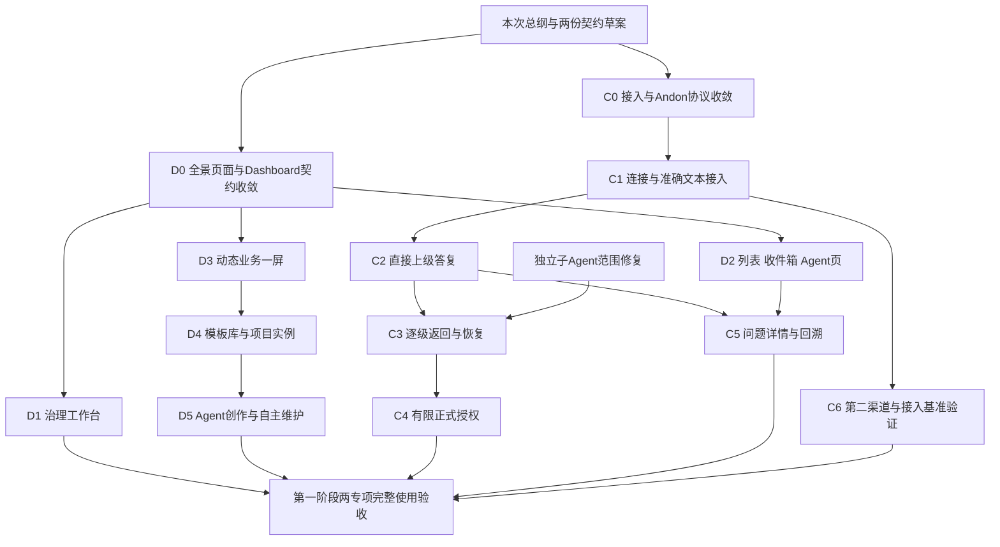

# 两项专项全面审计与第一阶段重规划

> 历史归档：正文保留原时点判断与证据，不承担当前任务或能力声明。当前入口见[规划目录](../../../README.md)。

日期：2026-10-09。审计基线：`93416ef696a643313ee494a95d68c8f1c60c8661`。读者：用户、两个专项执行会话及后续验收者。本文是重新规划提案，不代表产品代码已经具备所述能力，也不替用户授权发布、外部运行或正式业务批准。

## 1. 核心结论：局部推进有效，专项完成度管理失效

原总纲没有漏掉用户这次指出的目标。它明确要求日常产品体验、模板与素材、项目生成与维护、受控加载、配置差异、补充汇报、逐级求助、匹配回复以及有限个人正式决策授权。缺漏发生在总纲向实施包的转化，以及每轮结束后的整体复核。

Dashboard 已交付真实平台/项目导航、管理概览与准确结果办理；协作专项交付 Multica 回收止损和 OpenClaw 一次成功文本协议试验。这些产物可以复用。模板/项目页面生命周期、治理工作台主体、跨页面日常体验、协作者接入标准、下游求助规则、持久 Andon 和有限授权仍未落地。U5 表示某些增量进入实现轮，并不表示专项接近结束。

我此前也存在复核偏差：局部验收后推荐下一技术增量，没有重新把总纲所有目标排入可执行剩余计划。上一份复核的“直接推进 D2/Adapter”建议由本文替代；代码与试验事实保留。

这次不丢弃既有成果、不重开两会话。先重新建立完整设计与实施基线，再按具体包交付。原研究记录保留为依据，不再承担当前进度总表。

## 2. 本次审计依据与证据边界

已读取原系统架构、两专项总纲和各自规划，核对 U4/U5、C2、T1-O 与接入 proposed Decision，并沿 Dashboard service/repository/tools/frame、委派接口/装配/schema、工作结果与 Context Pack、提问/恢复、收件箱及子 Run 范围校验核查实现。

当前 HEAD 与用户指定节点一致，工作树干净。本轮没有产品改动，没有新远端运行，没有重跑全部测试。上一轮同节点的 34 项针对性前端测试与产品只读走查仍是相关证据；作者全量、数据库回读、远端协议附件属于原报告证据，不能升级为本次重新执行。原型下的 R1/R2、数据/导航演示属于 research，不属于产品运行时。

本轮另实际执行工程契约检查：仍失败于ef65969评估文档166/174/190/234四处既有措辞；检查器单测70项通过。三份交付文档的本地相互链接、代码围栏和结尾换行检查通过。未修改仓库文档，因此没有把既有docs构建成功记作本次新增草案已进入文档站的证据。

关键源码事实：

| 事实 | 当前源码位置 | 能说明什么 |
| --- | --- | --- |
| Dashboard 一项目一行，只含 revision/hash/size | `models_business.py:919` 的 ProjectDashboard | 单个静态入口元数据，不能代表模板库或多个项目实例 |
| `/dashboard/index.html`，仅 HTML/CSS，拒绝脚本和外部导航 | `project_dashboard_service.py` | 原静态能力仍在；没有动态页面契约 |
| iframe 禁网络，空 sandbox | `dashboardFrame.js`、ProjectDashboardView | Vue/动态数据未在产品中接通 |
| Dashboard 工具仅根项目 Run 读写 HTML，子 Agent 被拒绝 | `dashboard_tools.py` | 现有工具不是模板发现、草稿、验证、启用工具链 |
| 工作台本轮只改说明与返回滚动 | ProjectInspectionBoardView 的 U5 diff | 蓝图、议题、决策主体排版没有改造 |
| 委派接口只有 dispatch/status/collect | `delegation/contracts.py` | 不承诺问题投递、回答、取消或恢复 |
| 默认装配只有 codex/opencode/multica | `delegation_service.py:build_default` | OpenClaw 尚未产品注册 |
| executor_key 数据约束固定三个值 | `models_business.py:1889` | 新接入需要迁移/约束调整；仅注册一个 Python 类不够 |
| 通用句柄无完整 Agent/sessionKey/生命周期修订恢复映射 | DelegationHandle、DelegationService._handle | 远端精确归属与恢复尚需产品设计 |
| ask_user_question 直接 LangGraph interrupt | `toolkits/buildin/tools.py` | 用户提问与恢复可复用，不能证明逐级 Andon |
| 收件箱管理 read/archive | `user_inbox_service.py` | 阅读状态不是问题处理与恢复事实 |
| 决策批准写 user.uid | governance_service 的决策动作 | 尚未具备智能体实际批准者与可消费个人授权 |

没有因为搜索不到“Andon”就断言基础为零：已有 interrupt/resume、父子关系、委派、租约、结果、通知和历史，均有复用价值。但它们未装配成本专项所需的完整机制。

## 3. 按原目标重算当前建设情况

下表区分设计与产品。没有用测试数量或轮次换算百分比；各项工作大小不同，不能平均计算。

| Dashboard 目标 | 设计情况 | 产品/验证情况 | 剩余缺口 |
| --- | --- | --- | --- |
| 平台/项目嵌入及导航 | 已形成分项决定 | 已实现、部分真实验证 | 键盘、真实身份切换、密集内容观察等收尾 |
| 管理仪表板及结果办理 | 已形成分项决定 | 已实现、隔离多结果与409有证据 | 日常体验复评与残余真实样本 |
| 蓝图/议题/决策工作台 | 页面职责有描述 | 主体仍旧式编辑长页 | 阅读/编辑分离、列表/详情、关联及历史层级设计和实现 |
| 工作列表、收件箱、Agent 工作台 | 地图和部分入口有研究 | 复用主体、有限链接改动 | 三页各自的任务层级与办理上下文改造 |
| 动态加载、数据与宿主交互 | 原型与候选有研究 | 静态产品边界未改变 | 可实现契约、实际动态样板、跨项目负向与准确返回 |
| 多模板和项目 Dashboard 管理 | 概念/候选有研究 | 无库、实例、当前生效版本产品 | 存储、管理页、版本派生、项目选择及启用规则 |
| Agent 生成与维护 | 目标已写 | 仅旧静态 HTML 两工具 | 规则发现、模板读取、生成草稿、校验预览、竞争更新、受控启用 |
| 数据来源与安全 | 静态隔离已实现 | 动态授权与绑定尚未接通 | 正式事实、业务数据、Agent 报告的区分与批准导入 |
| 自动启用/回退 | 有讨论方向 | 无动态版本生命周期 | 显式个人策略、验证报告、失败回退与操作记录 |

| 协作/Andon 目标 | 设计情况 | 产品/验证情况 | 剩余缺口 |
| --- | --- | --- | --- |
| 准确委派与交付 | 有基础和比较 | codex/opencode已有；Multica止损；OpenClaw探针 | OpenClaw产品绑定、可信导入及真实整链；Multica恢复条件 |
| 多连接和差异配置 | 四层概念有推荐 | 默认仍环境装配、executor_key | 个人连接/目标管理、能力验证、生效快照及兼容 |
| 后续接入者可照文档实现 | 接口与设计模式已有描述 | 没有完成端到端接入基准 | 版本协议、适配责任、测试套件、限制声明、接入步骤 |
| 正式交付与过程补充 | 有推荐、同次补充样本 | 缺独立公共补充模型与读取流程 | 原始来源、修订、按需读取、阻塞事项不能隐藏 |
| 下游知道 Andon 规则 | 有上级处理原则 | 现有委派没有完整协作任务包 | 随任务发送的规则、可调用接口或受控返回格式、能力回执 |
| 直接上级处理 | 有场景/推荐 | 未形成产品闭环 | 持久问题、处理责任、上级处理运行、准确答复 |
| 逐级上报和返回 | 时序草图已有 | 未实现 | 处理节点、转交、送达、采用、重启恢复与错配拒绝 |
| Andon 历史与办理 UI | 有投影候选 | 当前主要为通知/Run历史 | 问题详情、逐级时间线、待办与执行状态分开 |
| 正式决策有限授权 | 用户已明确允许、有候选 | 未实现 | 实际 actor、一次/有限授权、撤权/过期/旧版本与副作用事务 |
| 第二种渠道验证 | Multica边界调查 | 未证实可恢复可信成功派发 | 独立解除部署阻塞；不能用OpenClaw代替多提供者证明 |

## 4. 为什么会失控，如何改进进度管理

1. **研究轮次被误当成果覆盖度。** U0—U6/C0—C6是做事方式，一项能力可以还在定义、一项已实现。后续用能力实施包管理，旧轮次仅说明证据产生阶段。
2. **首包缩范围后，没有补齐排除项的实施位置。** 本次把工作台、收件箱、列表、模板、Agent 和 Andon 全部排入明确包。排除首包不等于退出专项。
3. **协议试验成了主线。** 正确交付与隔离检查必要；完成后要沉淀公共契约和产品增量，不能长期重复准备同类探针。
4. **技术未确定与业务未定义混在一起。** 一次交付的字段、问题身份、下游规则、模板/实例与发布关系可以先定义；某远端不支持暂停，只阻塞它的对应动作，不阻塞公共设计。
5. **缺少整个专项的结束标准。** “Review通过”“文档构建通过”“未验保留后续”不能一直代替最终验收。第9节给出第一阶段结束条件。

执行会话每轮只需更新它负责的契约/实施记录，并报告：本轮能力增量、实际验收、失败/未验、总纲剩余包及下一包。进度表由这些证据派生，不建立可独立改写业务事实的中央状态系统。

新增范围必须同时说明原目标中的归属、实际依赖、替代或取消哪个计划项、验收与代价。不能只加“后续完善”。外部写入申请一次完整具体卡；卡内已经授权的动作连续执行。正常可逆实现选择由执行者推荐并说明，不让用户逐字段猜设计。

## 5. 重新建立设计基线

两份配套草案回答目前缺失的机制问题：

- [Dashboard 生成、加载与项目管理契约草案](Dashboard生成加载与项目管理契约草案-v1-93416ef.md)：页面/模板/实例/数据、存储、生成规则、工具、上下级交互、管理界面与启用回退。
- [协作者接入与 Andon 协议草案](协作者接入与Andon协议草案-v1-93416ef.md)：任务包、能力声明、接入步骤、配置、交付/补充、求助规则注入、逐级路由、恢复与回溯、有限授权。

这些是本次具体推荐，不是已拍板或已实现的公共 API。下一轮执行者需对照实际 Owner 细化字段和迁移、核对真实平台差异，给出可操作样板和需要用户决定的具体取舍。已有原则不用重新询问；出现会改变创作能力、数据范围或外部动作的差异才呈现实质选择。

## 6. Dashboard 剩余实施包

以下包名对应交付工作，不能以一个包推进到“实现轮”就把其他包视为完成。

本次D0—D6/C0—C6是重排后的实施包编号，与旧文档里的研究轮次及旧D2动态包不是同一编号体系。交接时以本次包名和交付内容识别；原U/C轮次仍保留为历史，不据编号推算进度。

| 包 | 具体工作与主要改动 | 前置与验收 |
| --- | --- | --- |
| D0 整体设计与契约收敛 | 提供治理工作台/列表/收件箱/Agent页连续稿；提供库/实例管理稿；落实配套草案的定义、数据、宿主、存储、工具及版本接口；提供一条完整生成→预览→加载→返回演示 | 先完成全景设计，标出已有/待实现。交付组件/API/迁移映射，不重复三套全景研究。用户一次确认具体基线和分包范围 |
| D1 治理工作台改造 | 蓝图默认阅读；议题列表与详情、讨论/决策/历史分层；有效决策与关联工作清晰；保留旧锚点、归档、重开等操作 | 不改治理状态。真实“蓝图→议题→有效决策→正式工作”及旧历史/未保存草稿验证；长正文与窄屏可用 |
| D2 日常办理页面改造 | 工作列表先看状态和待办；收件箱区分通知与真实处理入口；Agent页显示接收、执行、阻塞、交付；配置和轨迹按需展开 | 复用Owner；未实现Andon明确待对接。真实人工独立事项、跨项目同名工作、异常→详情→返回；不能删现有功能 |
| D3 动态运行时与业务一屏 | 受控定义→可信Vue组件；项目授权数据；时间/缺数/失败；宿主准确导航与观察返回 | 依赖D0契约，可与D1分开实现。真实一屏产品、跨项目取数拒绝、错误定义不影响管理，旧HTML隔离保留 |
| D4 库与项目实例管理 | 内置/个人共享/项目专属模板，固定版本与派生；项目多实例、一个当前业务首页；版本预览、手动启用和回退 | 依赖D3。真实同模板两个项目不同数据，改模板不自动影响实例；归档/删除与引用保护；至少两模板与实例切换 |
| D5 Agent 创作和自主维护 | 读取规则/素材/模板与当前项目配置；生成草稿、验证、预览；保存CAS；启用策略；生成数据受控提交 | 依赖D3/D4。真实根Agent生成页面并加载；子协作者交草稿、根处理；并发冲突、无权、无数据、失败回退；不只造人工fixture |
| D6 连续使用与收尾 | 宿主↔项目↔业务一屏↔治理/准确结果↔返回；一次真实用户走查、残余身份/键盘/静态样本验证；补操作文档 | 复核D1—D5与协作投影。发现阻塞就回对应包，普通素材增长列后续，不无限延期 |

每个实现包按一个可验收场景切批次，不能一次修改全站后最后才验收。D1、D2、D3均属于第一阶段需要交付的能力，没有以“动态技术更关键”为理由永久后移主流程。

## 7. 协作与 Andon 剩余实施包

| 包 | 具体工作与主要改动 | 前置与验收 |
| --- | --- | --- |
| C0 接入/任务/Andon 基线 | 将配套草案落实为版本协议、提供者能力矩阵、四层配置、模型可见任务包与帮助规则、问题/答复/投递/历史持久设计；标注每处复用Owner | 不等新付费运行。用真实安装版公开能力与本地样板说明运输方式；下游如何获规则、怎么问、怎么收答必须完整 |
| C1 个人连接与文本接入 | 最小个人连接/目标管理、能力与最近检查；OpenClaw Adapter与准确绑定/重建；schema执行器约束迁移；正式结果和补充分开 | 依赖C0；独立平台scope修复可并行。PG/HTTP/worker入口、失败/并发/丢响应测试，随后一张具体授权卡验证产品整链 |
| C2 单层 Andon | 稳定问题/版本/等待尝试；直接上级处理入口及处理Run；答复投递、接收/采用分离；无原生等待采用准确后继尝试 | C0先定规则，C1提供一外部消费者。真实缺资料→B自行答→C继续；故意不提供资料产生阻塞，不能由测试人代答冒称Agent处理 |
| C3 多级返回与故障恢复 | B无法答转A；A答B再答C；顶层必要时请求人；事务待投递、去重、重启、失效/晚答/取消/接替责任 | 依赖C2和子Agent执行树修复。相似双问题不串线，父Run结束不丢；无原生续接写明新尝试，保留完整链 |
| C4 有限个人正式授权 | 准确草案的一次授权，继而有限明确草案集合/次数期限授权；治理记录实际批准者/授权消费；采用新决策仍单独记录 | 依赖C3；同事务版本/权限/消费校验。授权内Agent批准一次，越界/撤权/过期/旧版/重复请求无错误副作用；组织RBAC留第三阶段 |
| C5 Andon/补充产品界面 | 工作协作详情与收件箱显示当前处理者、待送达/未采用；逐级时间线、原问题、各级分析、授权与尝试；补充按需读 | 界面稿在C0提前完成，随C2—C4接通；与D2协同而非另造两套页。已读不关闭问题，内部上级处理不冒成人待答 |
| C6 第二渠道与接入验收 | 解除Multica自身部署阻塞；按同一基准接入第二渠道；独立接入者按文档接入一个受控协议样例，检查遗漏 | Multica调查可前置并行，不拖死C2。真实第二渠道的准确运行/结果，支持的求助方式按能力验证；不支持自动恢复则显式有限模式，不全绿冒充 |

OpenClaw的一次协议样本不是C1完成；C1只是协作机制的一部分，不代表C2—C6。已有codex/opencode基础复用但不自动当作新契约已适配。

## 8. 实施依赖与下一步到底做什么

**下一步不是立即开 D3 或 Adapter 工单。** 两个原会话分别领D0/C0，使用本次草案完成一次有边界的整体契约收敛。它们应给出已填好的推荐设计、字段/API与存储映射、完整示例、页面稿、具体实施包和验收卡。不要再次要求用户从缺乏说明的局部选项中代替架构师做设计。

用户确认具体基线与包范围后，Dashboard先D1，同时按依赖准备D2/D3；协作先C1，同时按已定协议准备C2持久结构与页面。独立修复子Agent范围。没有必要等Multica所有部署未知项消除后才设计或实现公共Andon。

平台修复需要处理真实创建与校验一致性：subagent_run_service把child_thread_id写runtime_scope_id，worker却校验其等于creator的runtime_scope_id；worker同时只允许chat/resume作为creator。多级业务处理链不能据此宣称任意原生子Run可递归嵌套。C0需明确采用显式处理后继Run还是扩充原生嵌套能力，保留准确父子/项目授权；修复用真实父→子worker链和跨树/跨项目拒绝验证，不能删除守卫刷通过。

D0/C0各自只做一次有完整交付的工程设计收敛包。无需新一轮泛化GitHub大调研，也无需重演已证明的成功协议。若有具体未知未解，给出受影响动作、可实施退路和验证卡，其他已确定部分继续完成；不得以一个Provider的不确定性使整份机制文档空缺。

设计中发现真正改变原目标的取舍时，提供具体同场景对照、成本、推荐与推翻条件，再请求一次选择。协议试验只用于解决确切未知，需说明会改变哪项设计；已经证明的成功文本路径不再重复探针。

## 9. 第一阶段结束标准：逐项有产品和证据

### Dashboard 必须成立

- 工作台可阅读蓝图、定位议题、理解讨论和有效决策、创建/打开正式工作，常用动作有层级且历史仍可查。
- 工作列表、收件箱、Agent页形成连续操作；纯人工事项仍无需先配Agent/议题。
- 管理概览始终可达；业务大屏独立加载；准确对象与返回筛选/时间位置不丢。
- 至少两模板可管理，同模板两个项目独立实例，固定版本、派生与启用选择明确。
- 项目Agent根据公开规则生成/更新一个真实动态页面；生成→校验→预览→启用→读取实际数据闭合，竞争与失败不覆盖稳定版本。
- 子协作者的草稿/数据与根Agent、平台正式事实边界明确；数据源带时间和来源，示例/自述不能冒充正式事实。
- 手动启用及至少一种明确授权范围内的自动维护可用，有版本、审计及回退。
- 全部上述能力有用户操作与Agent操作文档，并做一次真实连续使用复评；没有触屏硬件时不伪造验证，核心键盘和窄屏不缺席。

### 协作与 Andon 必须成立

- 接入文档足以指导新增Adapter，连接/目标/本次运行区分，配置与秘密不散落任务文本。
- 新任务把版本化协作规则传给下游；下游知道交付、补充、阻塞、询问与答复路径。拒绝或不支持能力明确显示。
- OpenClaw产品整链取得准确当次结果与补充，生成唯一待验收结果；运行、接受与完成分开。
- 单层Agent自行处理、多级升级返回、人介入三场景真实通过；上报不会丢原问题，答复匹配原等待尝试。
- 崩溃/重复/晚到/取消/重新委派不能串线；远端接收、采用、恢复和问题解决分开有证据。
- Andon问题详情与时间线可查各级依据、责任转交、答案、送达及恢复；读/归档不是办理完成。
- 个人一次授权及限定范围授权的正式决策变更均有真实批准与负向拒绝证据，不把实际Agent批准者写成人。
- 第二渠道按基准完成其支持的产品能力；Multica成功回收恢复条件有证据。若确需缩减此项，明确申请范围变更并说明损失，不能静默后移。

模板市场、任意插件热加载、全部图表、全部AI服务、远端平台完整内部协作树、任意授权策略语言、组织权限及周期业务引擎不属于此次结束条件。第一阶段范围足够大，需按包执行；没有可信工时数据，本次不给虚假日期或完成百分比。

## 10. 交给原会话的启动指令

### Dashboard 会话

> 暂停按上一份局部复核直接推进D2。以《两项专项全面审计与第一阶段重规划-93416ef》和《Dashboard生成加载与项目管理契约草案-v1-93416ef》重建本专项D0设计基线，保持已有U5代码，不重开会话。核对原总纲的每项目标，补治理工作台、列表、收件箱、Agent页全景稿，以及模板库、项目多实例/当前版本、生成规则、动态数据与宿主交互、存储、Agent工具、启用回退的具体契约。草案是推荐，不冒充已拍板或已实现；有实质差异给同场景比较、成本和推荐。输出完整示例、可操作连续稿、组件/API/schema映射、D1—D6实施和验收卡。当前只做设计收敛，不改产品代码、不发布、不扩大脚本权限。已确认扁平/个人先用/管理兜底等原则不再询问。不要只研究动态图表而漏掉日常主流程，不把后续出口当排期。一次提交可审阅完整方案，明确需要用户选择的实际取舍；技术小选择自行推荐。更新原主规划状态与链接，保留历史证据，说明哪些仅设计、哪些已产品验证。

### 协作与 Andon 会话

> 暂停按上一份局部复核直接开文本Adapter包。以《两项专项全面审计与第一阶段重规划-93416ef》和《协作者接入与Andon协议草案-v1-93416ef》完成C0整体契约收敛，复用止损与T1证据，不重复成功文本付费探针。落实提供者/个人连接/目标/执行快照、版本任务包、正式交付与补充、如何把Andon规则发给下游、可调用接口或受控返回格式、能力降级、稳定问题与逐级处理/返回、持久送达/采用/恢复、历史回溯和有限正式授权。提供下游实际收到的任务示例、C→B→A→H及返回的完整示例、每步持久事实/Owner与失败分支、接入开发者逐步指南、能力验证套件和C1—C6实施验收卡；展示工作详情/收件箱回溯稿并与Dashboard契约对齐。当前不改产品代码、不发新远端任务、不批准业务决策；真实未知只阻塞对应能力，不能阻塞公共机制设计。协议方法按安装版证据标记，草案字段不要谎称已有API。已有用户原则不反复确认，范围变动必须写清代价。一次交付足够审阅的整体基线，而不是继续零散问答。

本文及两份草案在当前工作区交付。原仓库规划尚未被本会话改写；上述启动指令要求各专项在其负责的正式文档中吸收并维护单一当前基线。没有自动向其他会话发送消息。
