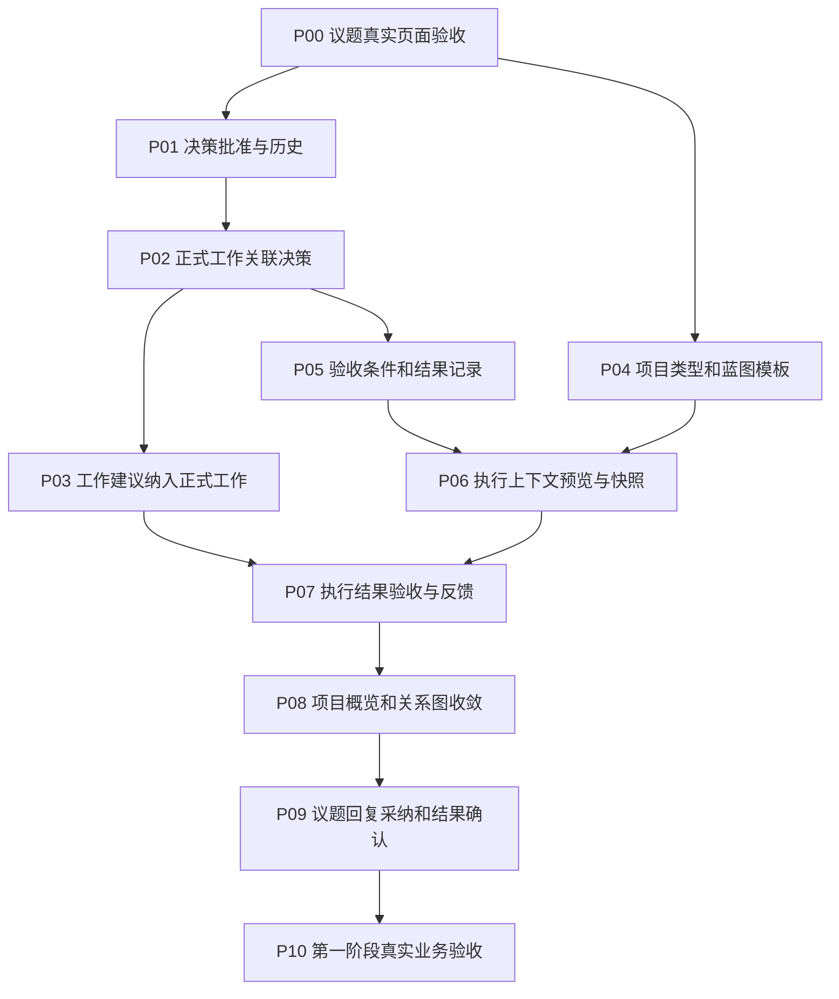
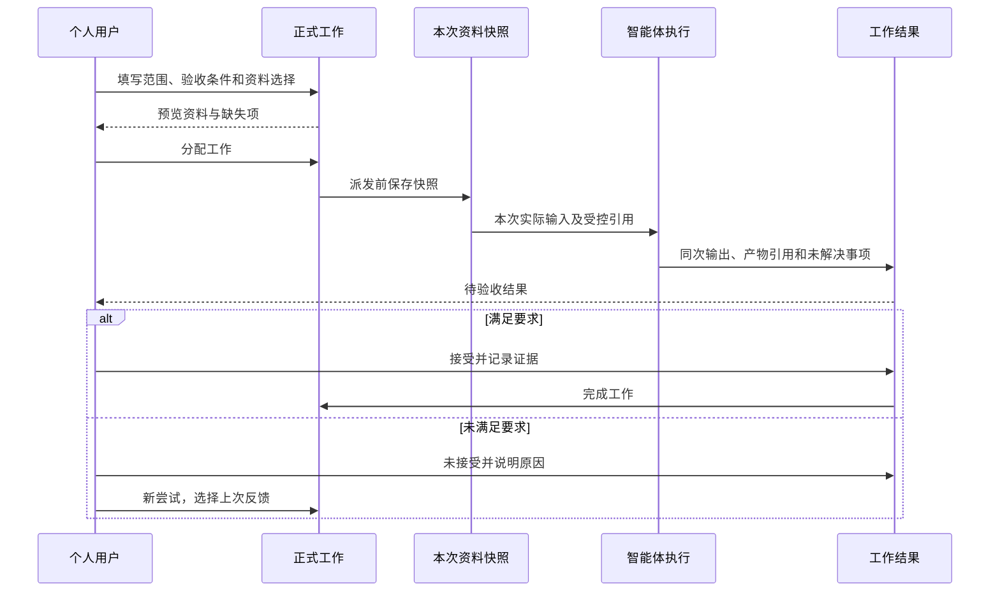

# 元垒第一阶段建设评估与执行计划

> 历史归档：正文保留原时点判断与证据，不承担当前任务或能力声明。当前入口见[规划目录](../../README.md)。


日期：2026-10-05  
检查基线：`bd563c9cca5150412f97c7073a292c41c975f485`。  
对比基线：`ed4d598d0e761d59729bf694b1877ecaf8663acd`。  
依据：《元垒系统架构规划设计》v1.1、《议题规划吸收评估与下一次开发任务》。  
交付性质：代码变化评估与可分批领取的执行计划；未修改产品代码。

后续更新：2026-10-05，用户确认P00完成并推送；远端新增`fcf638ac1d1d668b958ef1c79954cdeb13bdcbf8`，源码及仓库验收记录已核对，本会话未独立重复页面验收。P01扩展与语义细化见《P01决策需求吸收与执行补充》，架构依据更新为v1.2；下述建设评估仍保留bd563c9时点事实。

## 1. 结论与检查范围

本次提交符合架构主线，完成了议题第一批的大部分实现。现在适合结束这一批的浏览器验收，转入“决策—正式工作—上下文—执行—验收”的建设。第一阶段尚不能宣称整体验收完成。

本次对比读取了实际差异及其引用链，重点核对服务、仓储、模型、迁移、路由、页面和测试。新增提交只有一个，修改 36 个文件，新增 2609 行、删除 222 行，其中包含规划文档与测试，不能据此衡量业务完成比例。

证据等级：

- 本次核实：源码行为、数据约束、迁移步骤、页面实现和测试覆盖内容。
- 本次实际执行：`python3 scripts/verify_engineering_contracts.py`，通过。
- 仓库记录：相关 PostgreSQL/HTTP 测试、全量单测、Web 构建、文档构建与独立审查的通过记录。本次没有独立复跑，不将其表述为本次通过。
- 未完成验证：本次没有启动本地应用、访问真实数据库或进行浏览器操作。仓库本次决策记录也明确真实浏览器、主题、响应式和截图尚未验收。

这是针对架构符合性和下一步建设的检查，不能替代完整缺陷审计或部署验收。本次未发现需要推翻现有议题实现的架构偏离。

## 2. 新提交符合规划的部分

| 规划要求 | 实际变化 | 评估 |
|---|---|---|
| 纳入与研讨进度分开 | 旧 status 保持纳入含义，API 返回 admission_status；新增 open/decided/closed | 符合，不再将拍板和实际达成混在一起 |
| 持续研讨 | 未归档议题可修订及讨论，拒绝后可重新提交 | 符合，保留同一议题身份 |
| 三类讨论 | discussion/reconsideration/correction，对应研讨/重议/纠偏 | 符合，讨论不自动改变状态 |
| 历史脉络 | 专用修订与事件表；评论绑定修订；递增序号倒序分页 | 符合，没有引入通用事件平台 |
| 并发保存 | 议题行锁、预期修订号、事务内快照与事件 | 符合；测试包含并发保存和引用删除竞争 |
| 重开与执行解耦 | 继续或建议暂停提示，不改任务、尝试、Request、Run | 符合；关联决策视图也展示提示 |
| 归档与删除 | 归档只读可恢复；无引用可软删除；决策和两类任务引用阻止删除 | 符合；没有永久清理或级联销毁 |
| 保留旧数据事实 | v27→v28；旧进度默认开放，迁移基线标识，旧评论版本未知 | 符合，没有伪造旧正文 |
| 决策依据 | 新决策绑定议题修订号，旧决策保持版本未知 | 是后续 Context Pack 和决策追溯的有用基础 |
| 阶段范围 | 未加入目标达成、回复采纳、团队权限或周期引擎 | 符合第一批边界 |

需要明确的现有行为：

1. 已关闭仍可讨论和修订；归档才控制只读。这是已记录的设计，不应作为状态错误重写。
2. 创建决策不自动将议题标为已形成决策，需要显式选择已拍板决策确认。保留这个动作，避免重开后意外结束研讨。
3. 再次确认已形成决策会清除当前执行提示；关闭不清除提示。浏览器验收应覆盖这两个操作，让用户能够理解提示的变化。
4. 当前决策依旧使用 proposed/implemented，并以 implemented 表示已拍板。这是尚未进入本批的历史语义缺口，下一任务纠正。
5. 当前删除无回收站恢复入口；页面删除后不可访问，数据逻辑保留。不要把“软删除”误解为已经支持用户撤销删除。

## 3. 第一阶段建设现状

| 模块 | 当前能做什么 | 第一阶段仍需补什么 |
|---|---|---|
| 项目 | 单用户维护、工作目录、管理属性和资源关联 | 长期/交付类型、分类标签；负责人继续为管理标识 |
| 蓝图 | Markdown 编辑、归档、重命名与删除 | 目标模板、执行时选取内容、快照引用、共享目录提示 |
| 议题 | 持续研讨、多维状态、历史快照、重开归档 | 真实页面验收；之后补结果确认、一层回复和采纳处置 |
| 决策 | 记录拍板结论、理由与议题版本 | 草案批准动作、批准语义、替代撤销、历史/当前区分 |
| 正式工作 | 看板列表甘特图、子任务问题单、附件、知识库、执行尝试 | 决策来源、验收条件、结果验收、计划与结果统一展示 |
| 工作建议 | 治理任务来源审核与既有执行 | 纳入正式工作映射、重复操作幂等、新执行入口收敛 |
| 上下文 | Agent配置、项目覆盖、知识库与运行manifest | 业务背景组装、预览、派发快照、旧尝试回看 |
| 智能体执行 | 接受排队、中断恢复、失败后新尝试、结果评论 | 接入业务快照，结果关联标准及来源 |
| 结果与复盘 | 普通评论、Run输出、部分产物引用和汇报 | 结果提交、验收记录、未达标后再执行、回到议题与蓝图 |
| 概览/关系图 | 治理对象、Run、蓝图与汇报摘要 | 以正式工作进展、待验收与业务异常为主要内容 |

工作任务与执行底座已有基础，优先补连接和结果判断。不要再建立一套新的任务执行系统。

## 4. 推荐执行顺序

计划按可独立验收、可独立提交的工作包编排，不给缺乏依据的天数估算。每个工作包完成相关验证后再进入依赖它的工作。



推荐领取次序为 P00 → P01 → P02 → P03 → P04 → P05 → P06 → P07 → P08 → P09 → P10。P04不依赖决策建设，可提前完成，但不应让项目标签和蓝图模板延误主交付链。

三段交付：

| 交付段 | 工作包 | 交付结果 |
|---|---|---|
| A：明确执行依据 | P00—P03 | 议题可维护，正式决策可追溯，正式任务有唯一入口 |
| B：完成一次交付 | P04—P07 | AI收到明确背景及验收要求，产物可核对，用户能验收和反馈 |
| C：形成日常管理 | P08—P10 | 首页反映真实进展，讨论处理可追溯，完整链路通过验收 |

## 5. 工作包详细计划

### P00｜议题模块：完成真实页面验收

**任务目的：**确认新提交在真实界面可用，修复可复现问题，结束上一批议题工作。

**具体动作：**

1. 在原本地工作环境核对HEAD与未提交改动，读取仓库规范和此次决策记录。
2. 确认迁移版本为yuanlei=28，保留旧用户数据；以现有可用环境打开议题页面。
3. 验证新建→拒绝→修改→讨论→重新提交→纳入→记录决策→确认决策→重开建议暂停→修订→关闭→归档→恢复。
4. 验证无引用删除成功，有决策/治理任务/正式工作引用删除失败且说明原因。
5. 两个页面同时编辑同一议题，确认后保存者收到冲突，自己的草稿仍能复制保存，不静默丢失。
6. 测试切换议题时未发送草稿、旧请求延迟响应、历史分页、归档深链接和刷新后的状态。
7. 检查浅深主题、窄屏、长标题、长Markdown和历史快照，保存必要截图。

**界面要求：**纳入状态、研讨进度、归档分开显示；“执行操作”按钮优先显示具体动作，例如“重开议题”“归档”；缺原因或缺决策时在表单附近提示。删除确认使用现有应用对话框统一样式，若原生确认已可用，该替换不是阻断验收条件。产品文字尽量使用“执行记录”，不要求用户理解Run。

**实现约束：**只修复验收发现的问题和影响操作理解的文案；不同时添加回复、目标达成或完整决策状态。

**完成证据：**真实页面操作及最终状态回读、截图、相关复验结果；记录尚未可用的环境。没有可用浏览器时此项标记未验收，继续可独立的P01，不伪称通过。

**代码切入：**`TopicHistoryPanel.vue`、`ProjectInspectionBoardView.vue`、`governance_service.py`及相关HTTP测试。

### P01｜决策模块：批准、替代与撤销

**任务目的：**纠正“拍板即implemented”，让正式执行依据可追溯。

**功能设计：**

- 草案可以编辑；提供显式批准动作，记录拍板人和时间。
- 已批准正文不可覆盖。点击“基于此决策调整”创建新草案，保存待替代对象；批准新草案时才完成旧决策替代。
- 草案未批准前，旧决策继续有效；弃用草案不影响原决策。
- 撤销必填原因，保留正文、依据、拍板和撤销历史。
- 无受保护引用的草案可删除；批准后可追加不改变业务含义的文字勘误，保留原文和更正历史，不覆盖批准文本。
- 支持明确指向原决策的补充决策，批准后原决策仍有效；替代使原决策退出当前有效集合。不能只用类型标签代替关系。
- 默认创建草案，批准为显式操作；议题尚未纳入时提示其状态，不自动认为共识已经批准，也不新增强制组织审批流程。
- 决策详情提供修订、批准、勘误、补充、替代和撤销的倒序历史；议题时间线呈现相关决策节点，不另建大事记平台。
- 首期整条替代，同一决策不能被两个并发批准操作重复替代；不同决策可以同时有效。
- 决策关联批准时采用的议题版本，旧版本未知照实展示。议题关闭/归档不等于决策撤销。

**界面设计：**议题详情中展示“当前决策”和折叠的“历史决策”；草案有编辑/批准，已批准有调整/撤销。决策卡显示状态、理由、依据版本、关联工作；替代确认展示旧/新结论并填原因。保留项目级决策入口以支持无议题决策。

**实现约束：**推荐枚举draft/approved/superseded/revoked。旧proposed映射草案，旧implemented映射已批准，不推断已落地。纠正议题“确认已形成决策”的校验与候选列表，所有API、图标签和督查读取同步更新；不改变任务和执行状态。撤销或替代只提示关联工作重新评估，不自动停工。旧渠道若使用旧枚举，明确更新契约或提供有期限的转换，不永久维护两套可编辑状态。

**验收：**创建草案不改变旧决策；批准替代事务原子完成；已批准内容不能被普通编辑覆盖；旧数据迁移可重入；历史议题依据可查看；重开提示不被决策创建误清除。

**代码切入：**`GovernanceDecision`、`governance_service.py`、`governance_repository.py`、`governance_router.py`、议题工作台和图组件。

### P02｜正式工作模块：关联议题和决策

**任务目的：**正式工作能够说明“为什么做、按哪个决定做”，不再只有治理任务有决策关联。

**功能设计：**

- 正式工作增加可选主要来源决策；仍允许无议题、无决策直接创建。
- 从议题/决策点击“创建工作”带入来源，用户填写标题、描述和验收要求。
- 决策属于当前项目；如同时指定议题，必须与决策的议题关系一致。项目级无议题决策允许只关联决策。
- 未执行前可更正来源；首次派发后保留执行依据，来源调整只影响后续尝试，不改历史记录。
- 决策被替代或撤销时工作显示提醒，用户选择维持历史依据或改用新决策；系统不静默重指向。
- 归档议题不允许新建关联工作，但既有工作可查看历史来源。

**界面设计：**新建工作表单的“来源”区是可选项；任务详情顶部显示议题和决策链接、版本及失效提醒。关联的历史决策可以读取，不能仅因退出当前候选列表变成“未知决策”。

**实现约束：**直接扩展现有ProjectWorkTask及API，不新增第三类Task。使用项目范围约束，创建引用与议题删除共享锁机制。保持现有编号：不把增加决策关联当成强制重编号的理由；无议题工作继续使用GEN。第一阶段不增加负责人资格或权限语义。

**验收：**直接建工作成功；从决策建工作来源正确；跨项目关联失败；历史依据可读；并发引用与删除不能破坏关系；改变关联不会修改旧执行输入。

**代码切入：**`project_work_service.py`、`project_work_repository.py`、工作router与API、`ProjectWorkTasksView.vue`、`ProjectWorkTaskView.vue`。

### P03｜工作建议模块：纳入正式工作，收敛新执行入口

**任务目的：**让治理任务承载来源建议，正式工作承载实际执行。

**功能设计：**

- 待审核治理任务显示为“工作建议”；纳入时创建正式工作或关联已有工作。
- 记录建议与正式工作的映射。重复纳入返回同一对象，不创建重复任务。
- 拒绝保留来源与审核历史；尚未审核不产生可执行正式工作。
- 已有canonical且没有执行历史的建议，提供补充关联；有既有执行历史的保留原入口直到运行结束，避免中断。
- 已有历史记录继续可读；不复制旧Run和状态到新工作，不宣称旧产物已按新标准验收。

**界面设计：**“待处理建议”列出标题、来源、议题/决策；“纳入为工作”对话框提供“新建工作”“关联已有工作”，确认后跳转正式工作。新分配按钮只在正式工作入口显示；旧执行历史明确标记历史记录。

**实现约束：**映射保存于yuanlei域，建议审核和映射/创建由一个事务拥有；唯一约束兜底双击/重试。复用现有创建用例；新建时若缺项目/议题编号，让用户在同一流程补齐，不另造编号。既有外部执行器有真实消费者时，先保留适配路径，逐步接到正式工作；不能直接删除委派能力或假装全部渠道已迁移。

**验收：**双击/重复请求只生成一个正式工作；关联已有不复制；失败回滚不会只审核不建工作；旧执行能继续读取；新建议执行最终落到正式工作。

**代码切入：**治理审核服务、正式工作创建服务、`delegation_service.py`及其消费者、工作台任务段、相关通知和跳转。

### P04｜项目与蓝图模块：类型、筛选和目标模板

**任务目的：**让项目表达长期经营或阶段交付，让执行有可选择的方向资料。

**功能设计：**

- 项目设置增加类型、一个可选分类及标签；旧项目使用“未指定”，不猜测用户用途。
- 长期经营项目允许不设结束日期，首页不过度强调完成；阶段交付展示交付重点。两类都允许自定义日期，不强制补历史值。
- 项目列表按类型/分类/标签筛选，筛选不改变任何访问范围。
- 新建蓝图可选长期经营/阶段交付模板，包含预期结果、衡量方式、时间与复盘、约束和当前重点；旧文档不自动覆盖。
- 标明多个项目共用同一工作目录时蓝图可能共享；不要默默复制文件或改变目录归属。

**界面设计：**项目设置沿用现有弹窗，在描述后新增属性；项目列表使用轻量筛选。蓝图新建对话框选模板，仍使用Markdown编辑器。

**实现约束：**属性优先放现有yuanlei项目设置，不改用户归属机制；不建设分类管理中心或领域层。负责人字段继续沿用当前显示规则，不新增组织成员/授权。模板为普通内容；第一阶段Context Pack使用“项目+路径+内容快照+哈希”即可，稳定文档ID可后加，不作为闭环前置条件。路径更名前的历史靠快照核对，不宣称路径引用稳定不变。

**验收：**长期项目无日期可保存；筛选不漏改前项目；模板不覆盖旧蓝图；共享工作目录能看到提示；重命名蓝图不影响已保存的执行快照。

**代码切入：**`project_settings_service.py`与模型、`ProjectSettingsModal.vue`、项目选择组件、蓝图新建服务/页面。

### P05｜工作模块：验收条件与最小结果记录

**任务目的：**先明确如何判断工作完成，再把这些要求交给智能体。

**功能设计：**

- 任务增加Markdown验收条件，允许保存未完善任务；派发前若缺验收条件提供提示，不强制所有简单事项填写复杂表格。
- 使用一个最小工作结果记录：摘要、证据引用、未解决事项、提交者/时间、可选执行尝试来源、验收条件快照。
- 结果状态为待验收、已接受、未接受；验收保存意见和时间。
- 人工工作可直接提交结果并验收，不生成伪AgentRun。
- 已验收结果不覆盖；补充新结果保留旧历史。旧done任务维持原状态，展示“历史完成，未记录验收依据”，不伪造结果。

**界面设计：**任务详情“要求”区放描述和验收条件；“结果”区显示提交卡及证据；简单工作提供“提交并完成”，复杂工作先提交后验收。明确区别于普通评论。

**实现约束：**不增加通用Review平台；结果与任务/尝试同项目关联。输入引用允许文件、附件、网页等现有产物方式，不重复保存文件字节；文件不可读/已删除时明确标记，不能显示验证通过。工作完成与当前有效验收条件一致，条件后来修改要提示旧结果按旧条件验收。保留无活跃执行时才可done的当前约束。

**验收：**人工结果可提交；验收未接受不完成任务；旧完成不被强制重开；证据不可访问明确显示；新条件不改旧快照；同一验收重复提交不产生重复完成通知。

**代码切入：**工作模型、`project_work_service.py`、工作router/API、任务详情和收件箱完成记录。

### P06｜上下文模块：预览并固化本次执行资料

**任务目的：**AI不再只收到标题描述，用户能知道它收到哪些依据。

**功能设计：**

- 从任务目标、验收条件、当前选择的议题版本、正式决策、指定蓝图内容、上次结果、知识库/文件引用组装业务上下文。
- 指定资料使用现有资源选择器；第一批不开发智能自动推荐。
- 预览显示“直接提供的内容”“按需读取的资料”“缺失/截断/无法读取的资料”。长资料可选整份或手动摘录，记录来源。
- 网页当前仅存URL，默认作为引用；不能声称已读网页。主动抓取若要增加，单独评估，不作为本包必需。
- 拍板草案不默认成为正式要求；可选择探索资料并标明草案性质。
- 实际派发前固化快照；同次派发重试复用，新的执行尝试重新生成。预览后资料变更时提示差异或要求刷新，避免预览与派发内容不同。
- 历史尝试显示使用过的上下文，不随当前任务/蓝图变化而覆盖。

**界面设计：**“分配任务”旁显示“查看本次资料”，在抽屉中预览；可正常派发，不新增强制审批。执行卡提供“当时资料”。资料缺失明确标识。

**实现约束：**业务快照绑定ProjectWorkExecution或其专用关联记录，运行manifest继续拥有模型/工具配置，不能混成一份可编辑配置。建议固定预设预算：必需目标与标准优先，议题/蓝图按剩余预算摘要或摘录；对所有删除/截断显示说明。运行时仍重新检查引用访问，不能靠快照扩大权限。附件在对象存储，需通过现有受控读取向智能体提供可读取内容/引用，不能把存储对象名误当工作目录路径。文件哈希不证明旧字节可还原；首期保证已注入文本可回看，大文件引用只承诺来源和哈希可核对。

**验收：**可在请求最终输入核对目标与标准；旧快照不变；重派发复用；新尝试可用新版本；外部URL显示未抓取；附件读取通过受控边界；材料不可读有可见结局；异步切任务不混用资料。

**代码切入：**`project_work_execution_service.py`、`agent_run_manifest_service.py`、`project_agent_service.py`、工作目录/附件服务、任务详情与数字员工工作台。

### P07｜执行与结果模块：完成一次交付并反馈

**任务目的：**将执行输出变成可验收结果，把反馈回到计划。

**功能设计：**

- 智能体尝试完成时，将同次Run的输出引用作为待验收结果，保留来源；纯文本汇报也允许，但不能凭“完成了”自动验证产物。
- 验收通过：记录结果接受，满足任务规则后标为done；验收不通过：填原因，任务继续，允许新的尝试。
- 不通过的新尝试可选择上次结果和验收意见进入Context Pack。
- 结果区提供“反馈到议题”：创建一条带结果链接的纠偏/研讨评论，保留当前版本语境，不自动重开。归档议题给出先恢复提示，不绕过只读。
- 提供“补入蓝图复盘”：生成可预览的文字，用户确认后以现有编辑保存；不得直接覆盖蓝图。

**界面设计：**执行卡和结果卡分开；执行显示结束/失败，结果显示待验收/接受/未接受。验收表单展示标准及证据。反馈按钮明确影响范围。

**实现约束：**继续使用当前Run输出归属与恢复链判断；同一尝试产生结果要幂等，不能从相邻Run猜测输出。Agent完成不自动done；验收与业务完成通知由单一事务负责。因结果反馈造成的议题评论使用其现有行锁和历史事件。蓝图外部编辑并发需有冲突检测或刷新比较，不能静默覆盖。

**验收：**两次不同尝试的结果各自归属正确；输出缺失显式失败；重复收敛不重复结果；未接受能再次执行；反馈能从议题返回结果；手动完成短路径仍可用。

**代码切入：**执行终态收敛、结果服务/工作服务、议题评论服务、蓝图保存入口、任务详情。

### P08｜概览模块：反映正式工作进展

**任务目的：**首页回答“现在做什么、什么卡住、什么等我验收”。

**功能设计：**

- 概览展示待纳入事项、待批准决策、进行中正式工作、受阻/逾期工作、待验收结果及近期复盘。
- Run失败作为执行异常，工作blocked作为业务受阻，各自展示；避免全部失败Run都等价于当前业务阻塞。
- 关系图读取正式工作来源，治理任务作为建议层或独立待处理列表，不继续让旧治理任务充当全部工作进度。
- 图显示实际保存的议题—决策—正式工作—结果关系；遗漏的历史节点提供定位入口，不复制可编辑图事实。
- 定时/规则巡检文案明确“系统规则巡检”，不暗示智能体实际参与；负责人保持标识。

**界面设计：**首页四类重点卡：待处理、工作进展、待验收、异常；下方显示蓝图和近期有效决策。每条点击到唯一维护页。沿用现有组件，不重做应用外壳。

**实现约束：**汇总从源表生成，不新增人工维护进度副本；分页/统计采用一致范围，说明图的显示上限。已有自定义Dashboard保留，不未经说明覆盖用户页面；先修改默认页面和其读API。

**验收：**在任务详情改变状态/验收后首页同步；图链接正式工作；历史建议可读；逾期与已完成不误报；所有计数可回读核对。

**代码切入：**`inspection_board_service.py`、`DefaultProjectDashboard.vue`、`GovernanceBoardPanel.vue`、`ProjectGovernanceGraph.vue`、收件箱与巡检文案。

### P09｜议题模块：回复、采纳处置与实际结果确认

**任务目的：**落实上一轮暂缓的局部需求，在已有交付结果上补齐讨论处理脉络。

**功能设计：**

- 支持一层回复，保存作者、时间、当时议题版本；顶层时间线继续倒序，回复在该条讨论内按时间正序显示。
- 采纳、部分采纳、不采纳作为独立处置，附说明，允许关联实际修订、决策或结果。未有对应修改时照实说明，不能虚构采纳去向。
- 处置修改保留历史，不改写讨论文本；个人用户维护，不建设审批人资格。
- 可选填写议题预期结果及核对条件；实际达成通过结果确认记录表达，带说明、证据、确认时间。问题型议题可不使用。
- 实际达成、研讨进度、归档独立；有新情况可追加更正或新的结果确认，不删除历史证据。

**界面设计：**讨论卡提供回复和“记录处理”；卡上显示处置标签与去向链接。当前议题正文下有可选“预期结果/验证情况”，不在主状态菜单增加已达成。

**实现约束：**不开发无限评论树、投票、论证图或独立目标中心；引用受已有范围保护；归档只读。实际达成不由任务全部done自动推导。

**验收：**回复和处置可回读；修改处置保留原记录；采纳关联真实版本；归档不可写；实际达成不改变纳入状态、任务或Run。

**代码切入：**议题评论/修订/事件模型和服务、`TopicHistoryPanel.vue`、议题详情；复用P05结果引用。

### P10｜整体验收：一次性业务闭环

**任务目的：**以真实业务完成第一阶段验收，形成可复用操作方式。

**场景一：开发交付。**建阶段交付项目→模板蓝图→讨论→批准决策→创建工作→写标准→预览资料→智能体执行→检查产物→首次未接受→调整资料再执行→接受→反馈议题/蓝图→首页反映完成。

**场景二：人工短任务。**不建议题/决策→直接创建任务→手动提供证据→提交并验收→结果和完成通知可回读。用它验证流程没有被过度强制。

**场景三：方向修正。**批准后重开并建议暂停→任务仍独立→新决策替代旧决策→任务明确更换下一次依据→旧尝试仍保留旧资料→新尝试读取新资料。

**场景四：长期经营项目。**无结束日期、分类筛选、方向蓝图、一次记录/复盘任务。这里只验证长期项目可用；每周实例自动生成仍为第二阶段，不以缺周期引擎判第一阶段失败。

**提交物：**场景步骤、实际记录ID、最终产物、页面截图、数据回读、未验证项、简短用户操作说明、阶段验收清单。按仓库规则完成独立代码审查和实际相关gate。

**通过标准：**所有必需场景可运行，源记录一致；批准≠达成、运行成功≠工作完成、负责人≠权限三条边界没有被破坏。

## 6. 目标界面与流程图解

以下为功能布置草图，表示区域和动作，不是实际页面截图或必须复制的视觉规范。

### 6.1 议题详情

```text
项目 / 议题标题
待纳入/已纳入/拒绝纳入   研讨中/已形成决策/已关闭   [归档]
建议暂停原方案：原因、时间（仅提示）
---------------------------------------------------
当前描述                                        [修改]
可选预期结果 / 核对条件 / 实际结果确认
---------------------------------------------------
当前决策    结论、理由、议题版本      [调整] [创建工作]
历史决策    旧结论及替代/撤销原因                 [展开]
---------------------------------------------------
关联正式工作    标题 / 业务状态 / 待验收结果        [进入]
---------------------------------------------------
研讨输入    类型：研讨/重议/纠偏                  [发布]
历史（最新在前）
  修改正文 → 查看当时正文
  纠偏评论 → 一层回复 → 处置及对应修订/决策
  纳入通过 → 原因与时间
```

### 6.2 正式工作详情

```text
任务编号 / 标题                 业务状态：进行中
来源议题 / 来源决策 / 历史或失效提醒
---------------------------------------------------
描述与交付范围     验收条件                   [修改]
执行资料          已选择资料及缺失提示        [预览]
执行者选择        [分配]（继续用现有接受/队列机制）
---------------------------------------------------
执行尝试
  第2次：运行结束   [执行详情] [当时资料]
  第1次：运行结束   [执行详情] [当时资料]
---------------------------------------------------
结果（与执行记录分开）
  第2次结果：摘要 / 证据 / 未解决事项       待验收
  [接受并完成] [未接受，记录原因]
  第1次结果：未接受 / 当时标准 / 验收意见
---------------------------------------------------
反馈到议题 / 补入蓝图复盘     普通评论与问题单
```

### 6.3 执行与验收



## 7. 每次Codex任务的通用执行约束

1. 以当前本地工作目录为准，核对HEAD及未提交文件，不为对齐计划重置用户工作。后续有新提交时先更新建设评估。
2. 每次领取一个工作包。读取架构规划及关联Feature/Decision，给出简短实施和迁移方案后实现；会改变用户明确边界或销毁数据的选择先说明。
3. 新结构属于yuanlei域；不为新增模块改写上游业务表语义。使用router→service→repository的现有边界。
4. 新业务状态只有一个写入拥有者；图、Dashboard、通知和页面读取事实。任何跨对象写操作明确事务和重试幂等。
5. 保留用户归属与已有后端校验。负责人标识不授予权限，不新增组织角色或协作资格要求。
6. 保留旧决策、旧Run、旧尝试、评论、来源和证据。无法恢复的历史标明未知，不推断完成和达成。
7. 小型低影响文案不新增镜像实现测试；状态、迁移、并发、引用、执行归属用实际数据库/HTTP/worker或页面验证。
8. 代码提交前依仓库规范由独立Reviewer检查完整需求与变更。验证结果写清本次执行、历史记录与未运行项。
9. 不顺手做全局页面重写、通用框架、永久清理、团队权限和周期工作引擎。

## 8. 下一条任务指令

可发给原本地会话：

> 当前代码更新到bd563c9cca5150412f97c7073a292c41c975f485。请读取《元垒系统架构规划设计》v1.1和《第一阶段建设评估与执行计划-bd563c9》。先执行P00，完成已实现议题功能的真实浏览器验收与必要修复；核对本地HEAD和未提交内容，保留已有工作。重点验证拒绝后复议、修订冲突、历史分页、重开建议暂停、归档恢复和引用保护删除，并确认任务和运行不被重开改变。保留实际证据和未验证项。P00完成后领取P01，建设决策草案批准、整条替代、撤销和历史呈现，纠正implemented表示拍板的语义；先提出状态迁移和界面方案，随后按仓库规范实现并验证。不扩展负责人权限、团队协作、周期引擎或通用事件平台。P00若因环境无法验收，明确记录原因并继续独立的P01设计和开发，不宣称页面验收通过。

## 9. 第一阶段完成检查表

- [ ] 议题真实页面已验证，旧数据和引用保护可用。
- [ ] 草案、批准、替代、撤销与实际落地分开。
- [ ] 正式工作可直接创建，也可关联决策；建议纳入不会重复。
- [ ] 长期项目无强制结束日期，分类标签可筛选。
- [ ] 蓝图模板表达预期结果、约束和复盘。
- [ ] 任务可写验收条件，人可手工完成短路径。
- [ ] 执行资料可预览、实际使用快照可追溯。
- [ ] 智能体结果与业务完成分开，未通过能再执行。
- [ ] 结果能够反馈到议题和蓝图，首页反映正式工作。
- [ ] 回复、采纳处置与可选实际结果确认可用。
- [ ] 真实开发交付、人工短任务、方向修正和长期项目场景验收完成。
- [ ] 没有将团队权限、周期引擎或通用框架提前建设。

核心交付链在P07完成，日常管理与本次既有局部需求在P09完成，第一阶段整体声明以P10验收为准。第二阶段的周报周期实例、健康持续监控等不列入本检查表。

## 10. 源码与证据索引

链接固定于本次提交：

- [本次提交及完整差异](https://github.com/Sxyon/Yuanlei/commit/bd563c9cca5150412f97c7073a292c41c975f485)
- [议题生命周期与实现验证记录](https://github.com/Sxyon/Yuanlei/blob/bd563c9cca5150412f97c7073a292c41c975f485/docs/develop-guides/yuanlei/decisions/implemented/2026-10-05-topic-lifecycle-revisions.md)
- [议题状态机制与未验收范围](https://github.com/Sxyon/Yuanlei/blob/bd563c9cca5150412f97c7073a292c41c975f485/docs/mechanisms/topic-lifecycle.md)
- [业务数据模型](https://github.com/Sxyon/Yuanlei/blob/bd563c9cca5150412f97c7073a292c41c975f485/backend/package/yuxi/storage/postgres/models_business.py)
- [议题与决策服务](https://github.com/Sxyon/Yuanlei/blob/bd563c9cca5150412f97c7073a292c41c975f485/backend/package/yuxi/services/governance_service.py)
- [议题历史界面](https://github.com/Sxyon/Yuanlei/blob/bd563c9cca5150412f97c7073a292c41c975f485/web/src/components/project/TopicHistoryPanel.vue)
- [正式工作服务](https://github.com/Sxyon/Yuanlei/blob/bd563c9cca5150412f97c7073a292c41c975f485/backend/package/yuxi/services/project_work_service.py)
- [正式工作执行服务](https://github.com/Sxyon/Yuanlei/blob/bd563c9cca5150412f97c7073a292c41c975f485/backend/package/yuxi/services/project_work_execution_service.py)
- [运行资料装配](https://github.com/Sxyon/Yuanlei/blob/bd563c9cca5150412f97c7073a292c41c975f485/backend/package/yuxi/services/agent_run_manifest_service.py)
- [项目设置](https://github.com/Sxyon/Yuanlei/blob/bd563c9cca5150412f97c7073a292c41c975f485/backend/package/yuxi/services/project_settings_service.py)
- [蓝图服务](https://github.com/Sxyon/Yuanlei/blob/bd563c9cca5150412f97c7073a292c41c975f485/backend/package/yuxi/services/project_blueprint_service.py)
- [当前项目汇总](https://github.com/Sxyon/Yuanlei/blob/bd563c9cca5150412f97c7073a292c41c975f485/backend/package/yuxi/services/inspection_board_service.py)
- [正式任务详情界面](https://github.com/Sxyon/Yuanlei/blob/bd563c9cca5150412f97c7073a292c41c975f485/web/src/views/ProjectWorkTaskView.vue)
- [真实HTTP议题测试](https://github.com/Sxyon/Yuanlei/blob/bd563c9cca5150412f97c7073a292c41c975f485/backend/test/integration/api/test_topic_lifecycle_api.py)
- [服务、迁移、并发与引用保护测试](https://github.com/Sxyon/Yuanlei/blob/bd563c9cca5150412f97c7073a292c41c975f485/backend/test/integration/services/test_governance_service.py)
