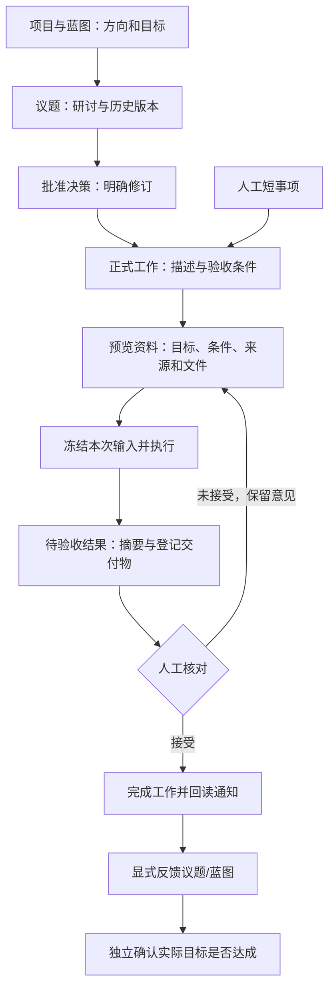

# 元垒第一阶段独立工程审查与下一步行动计划

> 历史归档：正文保留原时点判断与证据，不承担当前任务或能力声明。当前入口见[规划目录](../../README.md)。

审查日期：2026-10-07  
代码基线：`develop-v0.0.1` / `9ace7be3a2cfb26a99fc1c10fc56ba42e60c10c8`  
对照：原第一阶段 P00—P10 计划、后续各工作包边界及 P09 后明确的 P10 执行要求。

## 1. 结论

**第一阶段的个人使用主体架构已落地，P10 为部分完成，尚不满足“第一阶段全部验收通过”。建议进入第一阶段收尾与个人试用，不立即启动第二阶段周期引擎，也不提前建设团队权限。**

这个判断来自本轮代码阅读、重新运行测试、真实 PostgreSQL/HTTP 回读和实际交付文件检查；验收文档只用于定位记录，不作为通过依据。本轮没有修改产品代码。

三个需要收尾的问题：

1. 历史数据库迁移回归用例已经失效，独立执行明确失败，需要恢复这条工程检查。
2. P09 新增的议题目标和验证条件没有被 P06 的议题上下文带入真实执行输入，模块之间尚未接完整。
3. 文件已经由真实执行生成，但结果记录没有登记这些交付物。当前系统允许人工接受摘要，不能因此把“文件交付证据齐全”算作通过。

此外，Codex 的真实成功交付和 Multica 的真实出向闭环仍未取得成功证据。失败处理得到修复，不等于渠道功能已验收完成。

上述问题不要求推翻现有模型。扁平项目、议题内部研讨与决策、独立正式工作、冻结执行依据、人工业务验收和显式反馈的方向成立。

## 2. 本轮如何独立校验

### 2.1 范围与方法

- 审阅当前模型、服务、执行 Owner、页面接线与相关测试，对照第一阶段各工作包，而非只看最后一次提交。
- 审阅 P09 至当前新增的两个提交：`b539618`、`9ace7be`。
- 在实际运行环境重新执行后端完整非 slow unit、Web 完整 unit、第一阶段相关真实 PostgreSQL 集成测试、两项真实 HTTP 测试、工程契约、Web lint 和构建。
- 直接从业务数据库回读 P10 留存的合成账号、项目、两次执行、输入 Message、结果、决策修订、确认历史和通知；回读真实 HTTP 概览与工作接口。
- 检查项目目录中的实际 Markdown 和 Python 交付文件，在 API 容器内运行真实脚本，核对正常、零值和负数输入。

服务使用本地同一提交的开发工作区，审查源码使用独立检出目录。测试使用隔离 Schema；两项 HTTP 原用例复制到临时目录，只替换测试连接 fixture，以避免原 integration 全局清理误删其他会话的资源。用例断言没有改动，测试自身资源由原用例清理。

### 2.2 证据的边界

本轮**没有重新从浏览器点击完成四个场景，也没有启动新的真实 Codex/Multica 成功交付**。历史业务数据的真实性通过数据库、输入、输出与文件交叉检查，不能把这种回读写成“本轮重新执行全部业务场景”。页面结构和交互通过源码与 Web 测试检查；旧截图不算本轮视觉验收。

测试通过证明受测行为，不证明所有组合、外部服务、真实浏览器体验都正确。以下通过结论均受此范围约束。

### 2.3 本轮重新执行结果

| 检查 | 本轮结果 | 含义 |
| --- | --- | --- |
| 后端完整非 slow unit | 2808 passed，63 skipped，428.66 秒 | 覆盖面较广；跳过项没有算通过 |
| 第一阶段相关 PostgreSQL 集成 | 74 passed，1 failed，360.51 秒 | 失败为历史迁移测试准备数据阶段；见问题一 |
| 同一迁移用例单独复跑 | 再次失败 | 可重复，不是单次并发偶发 |
| 真实 HTTP：工作结果、议题后续处理 | 2 passed，13.50 秒 | 原测试断言独立执行，连接实际 API |
| 工程契约校验 | 通过，183 decisions / 20 features | 证明文档与契约结构一致，不替代功能验收 |
| 工程契约 unittest | 70 passed | 独立执行 |
| Web 完整 unit | 515 passed，0 failed，0 skipped，565.47 秒 | 本轮重新执行，非引用旧报告 |
| Web lint | 通过 | 无 lint 警告 |
| Web 生产构建 | 通过，14.69 秒 | 有既有宏提示及大包警告；不代表浏览器实测 |
| P09 至当前差异空白检查 | 通过 | 不是业务通过标准 |

pytest 有缓存目录权限警告；后端有既有依赖告警。它们不是本次迁移失败原因。

## 3. 第一阶段实际建设情况

“已落地”表示核心代码与相关受测行为成立，不表示该模块所有可能场景都已穷尽验收。

| 工作包 | 实际实现及边界 | 本轮评价 |
| --- | --- | --- |
| P00 议题生命周期 | 准入结论、实际推进与归档区分；修改、重开及历史围绕同一议题保存 | 已落地主体；没有将通过等同于实际达成 |
| P01 决策 | 草稿、批准修订、补充/替代/撤销与追溯；正式工作选明确批准修订 | 已落地主体；旧执行仍用旧修订，不静默切换 |
| P02 正式工作 | 可独立建工作，也可关联议题/决策；工作本身有状态和验收条件 | 已落地；不强制人工短任务走完整治理流程 |
| P03 建议纳入与执行入口 | 建议纳入正式工作有幂等与原子性；本地执行和渠道委派分别持有真实执行记录 | 已落地主体；未用普通聊天消息冒充正式工作完成 |
| P04 项目与蓝图 | 项目类型/分类/标签承担领域区分，模板与项目文件承载蓝图 | 已落地；没有增加强制领域层级，保留自定义看板 |
| P05 要求与结果 | 验收要求修订、当次条件快照、pending/accepted/not_accepted；当前条件验收与完成守卫 | 已落地；文件证据登记存在衔接缺口 |
| P06 Context Pack | 可预览选择的修订和资料，派发后固定真实输入；重试保持历史依据 | 已落地主要机制；遗漏 P09 目标/验证条件 |
| P07 输出与反馈 | 按同一 Run/执行来源形成唯一待验收结果；旧意见可进入下一尝试；反馈议题和蓝图需明确操作 | 已落地主体；文件生成不保证文件交付登记 |
| P08 概览与关系 | 从真实工作/结果/执行异常聚合；呈现实际引用，区分当前与当次冻结关系 | 已落地；当前与历史异常分开，不把已结束失败永久当阻塞 |
| P09 讨论与实际确认 | 一层回复、采纳处置、准确修订引用；独立实际确认、更正、撤回及目标条件快照 | 已落地主体；需要与执行上下文补接 |
| P10 整体闭环 | 留存开发两轮、人工短任务、方向修正、长期项目的实际记录；修复委派恢复/Git 中断终态问题 | 本地闭环有证据；工程检查及交付证据待收尾，外部成功闭环未通过 |

### 3.1 架构执行效果

**最有价值的成果是把“同意做、怎么做、实际运行、交付是否合格、目标是否实现”分开保存。** 这已经能支持个人真实使用，避免早期一次性审批单模型的限制。

- 正式工作不依赖议题必填，保留最短使用路径。
- 议题重开和建议暂停没有自动停掉工作或 Run，符合松散关联约定。
- 旧批准修订、旧条件、旧执行输入及旧验收意见得以保留，修正方向不抹掉历史。
- 运行成功产生待验收，人工接受才形成业务判断；实际目标确认再独立记录。
- 项目仍是主要容器。负责人仍是标明关系，没有提前引入组织审批链。
- 关系图基于已有实体引用，未扩张为独立通用图数据库产品。

当前 Work/Execution/Result 为第二阶段分离 Work Definition 与周期实例提供基础，但**现有一次性工作不应被宣称已经覆盖周期、自动化和监控**。这部分尚未建设，属于合理暂缓。

### 3.2 可用性与维护成本判断

目前适合个人试用，尚不能仅凭自动化测试给出“日常使用已经足够简单”的结论。工作页面同时容纳要求、资料、尝试、结果、反馈等内容，信息完整但入口多。先通过真实使用观察是否找得到“下一步”，再做小范围调整；现在不重建整套导航或增加统一治理大页面。

## 4. 独立发现的问题与取舍

### 问题一：历史迁移回归检查失效（收尾必做）

位置：`backend/test/integration/services/test_work_result_migration.py:43–45`。

用例意图验证 v32 → v33：先用当前模型创建表，然后删除新表模拟旧结构。但现在创建的是包含 P07/P09 外键的最新结构，直接删除 `project_work_results` 被三个依赖表阻止：

- `governance_topic_dispositions`
- `governance_topic_confirmations`
- `project_work_result_topic_feedback`

独立整组运行及单独复跑均报 `DependentObjectsStillExistError`。失败发生在历史环境准备阶段，**不是已证明生产迁移损坏或历史完成状态被改写**；但它意味着这项重要历史兼容承诺失去了有效回归证明。

修复：在测试隔离 Schema 内用准确旧版 DDL 建 fixture，或在准备阶段显式按依赖顺序移除后续结构。保留原历史 done、无伪造结果及可重入断言。不要跳过测试、删除断言，或为了测试修改生产迁移/大范围清空现有数据库。

### 问题二：议题目标与验证条件没有进入 Context Pack（收尾必做）

位置：`backend/package/yuxi/services/project_work_context_service.py:99–109`。

议题项只序列化选定版本的 `title` 和 `summary`。P09 新增的 `expected_outcome`、`verification_conditions` 已保存于历史版本，但上下文没有加入。独立检查两次真实执行：所选议题修订包含目标和条件，固化的议题文本却都不包含它们。

影响：用户以为已经选择议题资料，智能体却可能不知道目标与判断方式。工作验收条件仍在输入中，因此不是“所有验收标准都丢失”；但议题层信息存在隐性遗漏，执行与后续实际确认没有完整衔接。

修复：从**所选历史版本**生成议题文本，明确显示标题、正文、预期结果、验证条件；空字段不制造必填。预览、预算、指纹和实际发送复用同一生成结果。旧执行快照不回填、不改写。

界面：资料抽屉中的议题卡片展开后可看见这两项，注明“议题修订 N”；与工作验收条件分别展示，避免错误替代。

### 问题三：真实文件已生成，但业务结果未登记交付物（收尾必做）

位置：`backend/package/yuxi/repositories/project_work_repository.py:349–359`；`backend/package/yuxi/services/project_work_execution_service.py:481–498`；`web/src/components/project/WorkResultsPanel.vue`。

现有自动回收仅提取同一 Run 成功的 `present_artifacts` 调用；普通文件写入不会自动成为结果证据。P10 两次开发结果均为 `evidence=[]`、`source_output.artifacts=[]`，实际 `outputs/sales.py`、`outputs/sales.md` 则存在且可检查。

所以本次不是串 Run，也不是没有物理交付文件。缺口是：业务验收结果与交付文件没有建立可直接核对的关联，审核者需要去结果记录之外查找。

不要把它修成“所有工作必须上传文件”。人工事项、纯文字结论仍允许无文件结果；也不要从模型文本猜路径、扫描整个项目目录归集“可能属于此次执行”的文件。

最小方案：

1. 文件交付执行明确调用 `present_artifacts`；系统继续仅认同一 Run 成功记录并验证项目路径边界。
2. 结果卡片无登记文件时明确显示“未登记文件交付物”，不暗示文件已验证。
3. 对需要文件的工作，可在验收前显式补登记文件到**该待验收结果**并留下操作记录；也可先采用已有人工结果短路径，明确来源与交付文件后再接受。若增加补登记操作，使用当前版本校验，限制 pending，不能悄悄修改已接受历史。
4. 确保可在结果附近打开/查看登记文件；现在仅显示路径和可访问性，不能据此宣称内容已验收。

首选先把执行协议接完整；只有真实使用仍频繁遗漏时，再增加补登记界面。重要交付文件未来可增加内容哈希/独立留存，当前路径可访问性不等于永久保存当次字节。不要在本次收尾中建设完整文件版本平台。

### 问题四：外部执行渠道尚未通过真实成功闭环（保持未验收）

实际委派记录中存在 `sandbox_policy_unsupported`，以及进入执行器后失败的 Codex 记录；没有对应成功交付结果。P10 原记录定位 Codex 模型协议出现 Responses 404，Multica 缺 workspace 配置、执行器未注册导致出向无法跑通。这些环境原因应逐项复验，不能仅按文字说明认定已经修复。

当前提交修复了当次配置冻结、委派恢复的旧 Owner 保护，以及 Git 占用判断忽略 interrupted 终态的问题；相关 PostgreSQL 用例在本轮受测范围内通过。修复方向符合架构：保持真实来源、严格终态、不用失败记录冒充成功。

处理原则：先明确个人日常采用哪个渠道。若 Codex/Multica 继续属于第一阶段承诺，必须补真实成功证据；如果决定延期某个渠道，应由你明确调整验收范围，保留未验收标签，不能悄悄当作已通过。当前规划不做这种默认范围缩减。

## 5. 实际业务事实回读

合成验收账号：`p10-d5130b95d5`。仅用于定位，不含认证材料。

| 事实 | 本轮直接检查 |
| --- | --- |
| 开发工作 `54053f2b-4fc9-41cf-b7eb-6353f5c0af68` | done；当前条件修订 2；两次独立执行、两份结果 |
| 第一次执行 `2fdbb8b1-d513-4bd4-9d24-0130ea09c147` | completed；绑定旧决策修订 2、条件 1；结果 not_accepted |
| 第二次执行 `9c78ff90-7b8e-4a30-aa29-ac8c2865ddcb` | completed；绑定替代决策修订 2、条件 2；输入包含前次结果及意见；结果 accepted |
| 真实输入 | 两次排队 Message 内容分别与当次冻结 prompt 相等；未用报告中的 prompt 替代真实 Message |
| 真实输出 | 两份结果来源的 assistant Message 分别属于各自 Run，未串到线程其他运行 |
| 人工短任务 `ce6b89b4-04b3-44a7-a831-b57a0fb8e030` | 无议题/决策；人工结果 accepted；done；人工文件证据可访问 |
| 长期项目工作 `4f8733f7-5f85-4383-b35f-d1f01e1813f1` | 人工复盘结果 accepted、done；不是周期实例引擎 |
| 议题实际确认 | confirm → correct → withdraw 三条历史保留；原/新目标条件分别随当时修订保存 |
| 完成通知 | 三项工作各一条 task_completed，occurrences=1；未把历史中断次数当重复完成通知 |
| 开发项目 HTTP 概览 | 200；两项工作 done；当前异常 0、历史异常 2、待验收 0；与相关记录一致 |
| 交付脚本 | 正常输入输出 50；零值输出 0；负数输入退出码 2 并报错 |
| 交付物登记 | 两份自动结果都未登记文件，见问题三 |

真实文件路径位于开发项目目录：`outputs/sales.py`、`outputs/sales.md`。本轮读取实际文件计算 SHA-256：

- sales.py：`5eab9df243621c084b2226cc471f557679e13776ce81a3397fc310672fe2fdc9`
- sales.md：`6f5e358fb9ecba764dc59d1603a0975af39cf22ac1b7529cf539085f8fd424b1`

这些事实支持“本地业务链路确实发生过”，同时揭示上下文和交付物登记缺口。它们不能替代 Codex/Multica 的真实成功交付验收。

## 6. 下一步行动计划：按顺序独立交付

建议继续原开发会话，提供本文并固定最新基线。先发 S01—S03，不把全部后续任务一次性授权成大改造。原会话保留开发上下文有价值，不必因为审查发现缺口而终止；本文作为新的收尾依据覆盖旧“已全部完成”判断。

### S01：恢复历史迁移回归检查

**目标：**重新证明旧完成状态兼容与迁移可重入。

- 改测试 fixture，明确真实 v32 环境需要哪些表/列/约束。
- 只作用于用例 UUID Schema，不改生产数据与迁移语义。
- 单跑迁移用例，再运行受影响的结果/议题后续处理迁移测试。
- 提交物：失败原因、fixture 修复、实际测试输出。

**完成标准：**原用例通过；历史 done 不重开、不伪造结果；第二次迁移仍成立。不能用 skip 换通过。

### S02：把议题目标/验证条件接入执行资料

**目标：**选择一份议题资料时，执行者收到用户可预览的完整相关字段。

- 修改议题上下文格式；取选定历史修订，不读取当前字段替代旧版本。
- 抽屉显示目标、验证条件及修订；空字段自然省略。
- 复用现有冻结/指纹逻辑，不新增另一套 Context 存储。
- 测试中把特殊文本只放入目标/验证条件，正文不重复，证明真实发送含这两项；新修订不污染旧尝试，预算错误不静默删掉必需字段。

**完成标准：**预览文本、冻结文本、真实排队输入一致；历史尝试不变；工作验收条件保持独立。

### S03：完成文件交付登记与真实复验

**目标：**从结果卡片可找到本次需要验收的真实交付文件。

- 先修执行协议或交付指引，明确文件输出需调用 `present_artifacts`。
- 结果卡片清楚展示登记文件与未登记提示；无文件的普通事项仍可正常接受。
- 如增加人工补登记，只操作待验收结果，校验版本、路径与来源，并记录历史。
- 真实执行一个小文件交付任务，核对同一 Run → 产物调用 → 文件 → 唯一 pending 结果 → 人工验收 → done。
- 重复回收不重复结果；其他 Run 文件不串入；不存在的文件不能冒充可验收证据。

**完成标准：**真实结果含交付路径，文件内容独立核对；人工短任务仍无需文件；过去结果不被自动补写。

### S04：补 Codex 真实成功闭环

**目标：**验证个人计划采用的真实编码渠道。

- 先检查执行器要求的模型协议、供应商 endpoint 与配置。对 Responses 404 做兼容性定位；不通过吞掉错误或伪造输出绕过。
- 在隔离项目/仓库派发正式工作，回收实际文件；验证所选配置与上下文来自当次冻结记录。
- 人工验收并完成；回收重试不重复结果；真实运行不得越出约定目录。

**完成标准：**真实远端/执行器标识、成功状态、实际文件、来源映射、待验收及人工完成均有回读证据。若仍不可用，保留失败并明确具体配置动作。

### S05：补 Multica 出向闭环，或明确延期范围

**目标：**把“接口有实现”变成“个人实际可用”。

- 检查 workspace、凭据权限、执行器注册及服务连通性；输出检查状态，不输出凭据。
- 从正式工作真实出向创建/派发，回读远端任务 ID、状态和结果；验证本地委派与远端标识一一对应。
- 回收只产生唯一待验收结果；失败不得形成成功结果。

**完成标准：**有真实成功证据。若你决定暂不用 Multica，则更新能力说明为未验收/延期，单独保留任务；不能用入向同步、stub 或“配置理论上正确”替代。

### S06：独立复验与第一阶段收口

**目标：**形成可相信的阶段结论。

- 完成 S01—S03 后运行受影响检查；有新增失败才扩大测试，不反复全量刷数。
- 补真实浏览器核对：资料预览、运行中、结果待验收、文件查看、拒绝再尝试、人工短路径、旧依据和新依据、概览跳转。
- 更新验收表：通过/失败/未验证，分别记录本轮真实执行和历史回读。
- 必需渠道通过后才写第一阶段全通过；否则注明可使用的限定范围。

**完成标准：**关键数据一致，三个模块衔接问题关闭，必需真实渠道闭环，界面可操作，没有用报告替代证据。

### S07：个人真实使用，再选择第二阶段第一个功能

建议用一至两周日常使用覆盖开发交付、人工事项、长期复盘，记录卡点，不设新的强制治理流程。

- 观察创建/派发/验收所需操作、资料遗漏、交付物遗漏、找不到入口、误解暂停等情况。
- 优先解决妨碍日常使用的小缺口，不依据合成验收直接大改 UI。
- 若重复执行确有需要，第二阶段先做一个每周复盘场景：Work Definition 定义一次，按周期生成独立工作实例，各实例独立资料/结果/验收。
- 先明确时区、周期唯一键、暂停恢复和补发规则；不要同时建设任意流程编排、监控平台与自动决策。
- 团队归属、组织角色、权限、审批链继续第三阶段。负责人标签不升级为访问控制。

## 7. 收尾后的使用链路

议题重开/建议暂停不自动控制执行；决策替代不改写旧尝试；接受结果不自动确认议题目标；周期和团队权限不在这次收尾中增加。

## 8. 可直接交给原开发会话的任务

> 基于 develop-v0.0.1 / 9ace7be3a2cfb26a99fc1c10fc56ba42e60c10c8，执行《第一阶段独立工程审查与下一步行动计划》的 S01—S03。先修历史迁移测试 fixture，再把议题历史版本的预期结果与验证条件接入 Context Pack，最后补文件交付登记并真实复验。每项作为可独立审阅的小改动，遵循仓库规范、相关测试和审查要求。不要新增周期引擎、组织权限、通用图或重构整套导航。不得回填改写旧执行快照或已接受结果，不得跳过失败测试。提交完成后给出实际代码位置、测试结果、真实输入/文件/结果回读及未验证项。Codex/Multica 成功闭环仍保留未验收，后续按 S04/S05 执行。

## 9. 开发定位索引

- 议题与决策：`backend/package/yuxi/services/governance_service.py`、`web/src/components/inspection/GovernanceBoardPanel.vue`。
- 正式工作：`project_work_service.py`；建议纳入：`WorkSuggestionsPanel.vue`。
- 执行回收：`project_work_execution_service.py`；结果验收：`project_work_result_service.py`、`WorkResultsPanel.vue`。
- 上下文：`project_work_context_service.py`、`WorkContextDrawer.vue`。
- 蓝图：`project_blueprint_service.py`；反馈：`project_work_feedback_service.py`。
- 概览：`project_work_inspection_service.py`、`inspection_board_service.py`、`ProjectInspectionBoardView.vue`。
- 历史迁移失效用例：`backend/test/integration/services/test_work_result_migration.py`。

无完整前缀的服务文件均位于 `backend/package/yuxi/services/`；工作相关组件位于 `web/src/components/project/`，概览页面位于 `web/src/views/`。

本轮实际 PostgreSQL 集成范围：`test_governance_service.py`、`test_project_work_service.py`、`test_project_blueprint_service.py`、`test_project_work_execution_service.py`、`test_project_work_context.py`、`test_work_result_migration.py`、`test_topic_followup_service.py`、`test_inspection_board_service.py`、`test_delegation_service.py`、`test_project_git_occupancy.py`，均位于 `backend/test/integration/services/`。真实 HTTP 原用例为 `test_project_work_results_api.py`、`test_topic_followup_api.py`。
