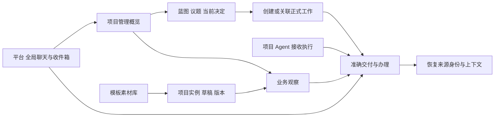

# Dashboard D0：全景设计基线与 D1—D6 验收卡

状态：proposed，推荐方案待用户审阅；只有既有 U5 界面包属于已实施范围。当前源码基线 `3d7c49b8`，审计事实基线 `93416ef`。

读者：专项负责人、产品设计、前后端与验收人员。类型：设计与契约提案。目标：一次审阅日常主流程、页面生成/加载/管理及六个实施包。非目标：本轮产品实现、数据库迁移、发布大屏、外部任务或扩大脚本权限。依据：[全面审计与重规划](两项专项全面审计与第一阶段重规划-93416ef.md)、[契约草案 v1](Dashboard生成加载与项目管理契约草案-v1-93416ef.md)。本文拥有本专项当前设计基线；草案保留推荐来源，历史记录保留产生时的证据。

## 1. 原目标逐项覆盖与证据边界

[原总纲](两个专项初次任务执行/第一阶段两项专项规划总纲-2026-10-08.md)与[原主规划](两个专项初次任务执行/信息架构与Dashboard专项规划-2026-10-08.md)继续拥有原需求。D0—D6 是重规划后的交付包，旧 U 轮次与旧“D2 动态包”只作历史定位：新 D2 是日常办理，新 D3 是动态运行时。

| 原目标 / 已确认原则 | 当前产品证据 | 本基线落实位置与剩余验收 |
| --- | --- | --- |
| 扁平项目，标签区分领域，个人先用 | 项目导航沿用扁平项目，U5 部分真实验证 | 全景稿保留平台/项目两层；库只支持内置、同一人共享、项目专属。无组织/领域树迁移 |
| Dashboard 观察分析导航，业务动作在办理页 | U5 管理与静态业务切换、准确结果入口 | §2、§6 宿主导航和返回；D3、D6 验证动态观察返回，不将验收/批准放入生成定义 |
| 默认管理仪表板兜底 | U5 已实施；隔离多结果、409、数据库/文件回读 | D1/D2 补治理与日常任务，D6 复评密集数据、键盘、身份切换和就绪静态页 |
| 蓝图、议题、讨论、决定与正式工作 | 当前工作台仍是长页，既有服务拥有治理语义 | §2 全景稿、D1 阅读/编辑分离、关联与历史、保留全部旧动作 |
| 工作列表、收件箱、Agent 页连续办理 | U5 仅入口/说明/局部返回改进 | §2、§7、D2；未读/处理/恢复和运行/业务状态明确分开 |
| 准确交付、过程补充、风险与求助 | U5 仅人工准确结果；协作补充/Andon 未产品闭合 | §7 与 C0/C5 投影边界；D2 不虚构远端处理者、送达或恢复 |
| 个人与内置素材/模板复用 | 无产品库；U3 仅合成 R1/R2 | §3、§4 两模板、两个项目绑定、自主与非法定义；D4 实际固定版本与升级 |
| 项目专属生成/维护与 Vue 加载 | 静态 HTML 两工具，空 sandbox，无动态桥 | §3—§8；D3 动态样板，D5 真实根项目 Agent 生成；R2 保留需求触发，不冻结创作上限 |
| 动态数据范围、来源、时间、缺数/过期 | 产品静态页不取动态数据 | §5 正式事实/业务数据/分析分开，后端项目授权；D3 负向，D5 生成数据提交 |
| 模板/实例/版本/当前选择/存储 | 一项目一行静态元数据，非多实例模型 | §4、§9 精确关系与事务；D4 多实例当前首页和可回退版本 |
| 草稿、验证、启用、自主维护与回退 | 无动态生命周期 | §8、§9；D4 手动，D5 有限自动，启用失败不改变当前页 |
| 配置差异、逐级求助和有限正式授权 | 属于协作专项，Dashboard 不接管权限 | §7 消费版本化投影；C0—C6 拥有协议/授权，D6 联合验收；缺失不伪造可用按钮 |

U5 历史证据见[首包验收](两个专项初次任务执行/信息架构与Dashboard-U5首包实施与验收-2026-10-09.md)。其 524 项 unit、真实合成人工链路和作者 DOM 检查不证明治理改版、动态运行时、模板工具或人类使用效率。本轮新增页面稿全部使用合成数据，操作仅影响隔离稿；产品权限、真实 Agent、持久版本及发布均为 Not run。源码重新只读核对标为 Inspected，只有实际稿检查标为 Passed。

## 2. 日常页面全景、阅读顺序和连续任务

平台继续维护全局聊天、收件箱、个人资源和项目选择；项目头部维护身份与概览/工作台/工作/智能体/资料；业务内容维护自身筛选与图层。资源库入口属于平台，项目标题区“管理 Dashboard”进入该项目实例管理；用户始终能回管理概览。既有 U5 布局及偏好保持，宽度和密度为可逆呈现参数。

| 页面 | 首层阅读与主要动作 | 按需内容与保留操作 | 来源与返回 |
| --- | --- | --- | --- |
| 管理概览 | 待验收准确结果→异常→工作进展→治理待处理；标题同时保留管理/业务切换和 Dashboard 管理 | 蓝图摘要、有效决策、反馈、关系图；数据统计继续用现有 overview | 卡片携带对象身份；回概览恢复准确链接及位置，跨项目不套旧筛选 |
| 治理工作台 | 蓝图/议题与决策/工作建议三页签。蓝图默认正文阅读，编辑单独模式。议题列表先看标题、准入/进展、需复核，右侧选中详情：问题/目标→当前有效决定→关联工作 | 讨论与回复、历版决定、修改/重开时间线逐项展开；保留新建/编辑/拒绝/批准/归档/重开/勘误、蓝图新建/重命名/归档/删除、汇报/委派旧入口 | 旧 query 和 hash 解析到相同对象；从决定打开工作返回选中议题和历史修订，编辑中的正文不被刷新替换 |
| 工作列表 | 当前状态+待验收/受阻/逾期过滤；行显示编号/标题、需人动作、第一负责人、最新尝试状态、当前结果修订 | 看板/列表/甘特与日期/状态操作保留；新建人工工作显式常驻；来源为空合法，编号配置未就绪提示已有入口 | 单行按准确 task/result/execution 导航；返回过滤、排序和位置。高频跨项目处理由收件箱，列表维持项目范围 |
| 工作详情 | 沿用 U5 准确结果标题、摘要、提交时条件、文件、意见/办理；旧条件差异突出 | 来源、执行/委派、Git、Issue、参考、附件、反馈完整保留；协作补充按需读、未解决阻塞显示首层 | 文件独立打开与现有预览组合；意见按 uid/project/task/result，登出/换账户/无权/成功/冲突边界不变 |
| 跨项目收件箱 | “需我处理 / 交付入口 / 通知”，另设未读/全部/归档筛选。每行始终显示项目+工作身份+真实处理者或“状态未接入” | 标记已读/归档只是通知状态；问题详情显示待答/已答待送达/待采用/已恢复与逐级时间线；未知阶段不可推测 | 同名工作不同项目分行；打开准确结果或问题，返回当前筛选。已答未恢复保持处理入口，不能用已读隐藏 |
| 项目 Agent 列表/工作台 | 绑定员工列表→接收待接受/执行队列/运行/异常/交付。运行完成与工作验收分开，未解决求助显示处理者和等待的准确尝试 | 自动接受/默认工作模型、绑定覆盖配置、日志与历史折叠；接受/撤回/重试保持现有边界，全局 Agent 管理仍在平台 | 点击尝试定位 work-execution；点击结果定位 work-result；返回队列和选中员工，不猜相邻 Run 的输出 |
| 业务大屏 | 标题、实例/当前修订、时间范围、来源/数据状态，再读业务主图与明细；筛选/刷新/准确对象导航 | 全屏是宿主临时呈现；“管理 Dashboard / 回管理概览”由宿主常驻。写动作进入可信办理页 | §6 返回令牌恢复实例修订、时间/筛选、选中对象、滚动；失效明确回管理 |
| 库与项目管理 | 库：内置/个人共享/项目专属及素材输入说明；项目：当前首页、各实例生效/草稿/来源/缺数、预览/启用 | 模板版本差异、升级映射、提取结构、归档、稳定版本回退；权限与数据绑定只在项目管理 | 库派生进入选定项目配置；预览返回未保存绑定；当前首页改动 CAS，与实例自身启用分开 |



推荐采用“议题列表+当前详情”组织工作台，窄屏进入单独详情并显式返回列表。同一合成场景“议题 T1 有 D1/r2 生效、D1/r1 历史及 W1”：分栏方案保留议题列表和当前依据，代价是正文空间，需要窄屏单页；全长页方案少一次页签切换，但当前决定与 W1 淹没在讨论/编辑框之间；三级目录方案提供更多领域层级却违反扁平项目原则。推荐前者，长正文默认阅读且历史按需展开；若真实用户频繁跨两个长决定对照，增加独立打开，先不造三层导航。

连续任务稿共用合成甲/乙项目、同名“交付检查”、W1/R1（旧条件）、R2（当前条件）及 Q2（已答未恢复）。路线一：管理→工作台读蓝图→选议题→有效决定→创建/关联工作→列表→准确 R1/R2→文件/意见→来源；路线二：收件箱乙项目同名工作→问题 Q2→看送达/采用/恢复→返回收件箱；路线三：模板派生→甲实例绑定→草稿验证→预览→启用→业务时间筛选→准确 R2→返回观察→回退。用户观察未发生，任务指引推进不等于任务验证通过。

## 3. 实质取舍与推荐组合

| 同场景要求 | 推荐：受控定义+可信 Vue | 替代：生成 Vue 隔离包 | 兼容：静态 HTML |
| --- | --- | --- | --- |
| 交付观察：状态指标、当前结果表、准确文件与办理导航 | Agent 自由组合布局/素材/映射，数据和动作可校验；扩展物料需产品审查 | 自由布局与新图形，但同样需要数据服务、导航/隔离协议；多了构建、依赖与资源限制 | 只能快照和页内导航，不能完成动态准确办理返回 |
| 经营观察：月度趋势+区域矩阵+缺数提示 | 趋势、表格热度和摘要可重排；多个数据槽独立状态，有限格式化 | 可写新的高密度图墙，需独立 origin、包签名/隔离执行、取数代理、崩溃/预算处理 | 可表达视觉，不具备实际刷新语义 |
| 特殊小空间：非规则节点位置、弧形边、标签避让、局部动画 | 当前素材无法表达自由路径与任意布局算法；增加可信专用素材有发布成本 | 自由表达较好，运行、代码审核和更新维护成本更高；U3 固定手写样例不证明任意生成代码安全 | 可输出静态图像但交互/真实数据无法满足 |

推荐第一阶段产品化受控定义，至少实现可增删/重排区域、多个数据槽、列/单位映射、图表/表格/流程分组、合法筛选与导航。它不是几张卡片填空；结构和输入可自主生成。特殊空间需求如果变成首批真实业务必需，且可信素材扩展难以复用或维护代价高于隔离包，提交同空间 R2 对照与 D3 范围增量；不直接放宽旧 iframe。此轮不扩大 R2 实验，不宣称可生成 Vue 已获批准。

| 维度 | 推荐与理由 | 真实替代及成本 | 改变推荐的条件 |
| --- | --- | --- | --- |
| 存储 | PG 保存 JSON 定义/绑定/不可变修订/当前指针；资产复用 Workdir/对象存储 | 文件定义+PG 指针利于手工 Git，但两阶段发布需对账，共享目录碰撞；版本包对 R2 合适，JSON 首版多了构建表面 | 用户要求可在仓库文件直接协作编辑并以 Git 为发布 Owner，则另提 CAS/hash 对账与导入规则 |
| 多实例 | 一项目多业务实例，各自稳定修订，一个当前业务首页；管理概览独立 | 单实例界面较小，专题被迫反复覆盖，无法表达两模板共存；可先 D3 做一个，D4 必须补齐 | 第一阶段主动缩减目标时才退单实例，必须说明失去专题保留/切换 |
| 发布 | 默认人工；个人显式授权可信模板精确版本、固定范围自动维护 | 全手工更易解释但无法自主维护；自由定义自动启用需结构/依赖/数据动作预算及授权扩大 | D5 样板证明限定自主组合能机械校验时再开放第三策略；不用模型安全意见代替执行边界 |
| 收件箱 | 按业务需处理投影与通知阅读分离，已答未恢复保留入口 | 只按未读过滤易隐藏待恢复；所有通知当待办造成噪音 | C0 提供真实投影后按处理责任改分组，不用通知字段创造处理事实 |

技术小选择自行推荐：继续 Vue/现有 Ant Design Vue 与 ECharts 基础，不迁移框架或引入拖拽编辑器；用确定的逻辑读视图和 JSON Schema 兼容版本校验，禁止任意 JS/SQL/URL/自由表达式。所有新增 API、schema、工具名均为下面的拟定契约，尚未产品注册。

## 4. 定义、模板、实例和完整示例

定义版本 `schema_version=1`，素材身份 `id@version` 精确锁定，模板版本不可变。定义只保存输入槽、布局、映射、显示参数和动作语义；项目绑定单独保存，数据服务依据实例所属项目重建范围。首次预算建议 128KiB 定义、40 节点、8 输入槽、每槽最多 200 行分页、嵌套布局 4 层；预算与 Schema 由 capability 版本发布，超限显式失败。布局支持 `grid/stack`、12 栏跨度及窄屏顺序，素材接受有类型字段，格式化限定 date/integer/decimal/percent/currency（币种必填），动作字段必须由该输入行的真实对象提供。

以下是可直接供后续实现者消费的完整示例对象；此处 ID 为合成占位。隔离稿目录的 `examples.json` 是同一示例的机器可读产物，未来正式 Schema 实现需要独立 oracle 和负向测试，原型检查不承担运行时校验。

```json
{
  "template": {"id":"delivery-watch","version":1,"scope":"builtin","name":"交付观察"},
  "definition": {
    "schema_version":1,"title":"交付观察",
    "inputs":[{"id":"results","contract":"work.results.v1","required_fields":["task_id","result_id","title","summary","criteria_revision","status"],"filters":{"status":"pending"}}],
    "layout":{"kind":"grid","columns":12,"children":[
      {"id":"summary","span":4,"mobile_span":12,"component":"metric@1","input":"results","mapping":{"value":"totals.total_results"},"display":{"label":"待验收份数","format":"integer"}},
      {"id":"list","span":8,"mobile_span":12,"component":"result-list@1","input":"results","mapping":{"title":"title","summary":"summary","status":"status"},"action":{"type":"open-result","ids":{"task":"task_id","result":"result_id"}}}
    ]}
  },
  "instance":{"id":"alpha-delivery","project":"alpha","name":"交付观察","template_ref":{"id":"delivery-watch","version":1},"expected_revision":0,
    "bindings":{"results":{"source":"project.work_results","parameters":{"status":"pending"}}}},
  "generation":{"kind":"template-derived","rule_version":1,"run_id":"synthetic-root-run","operation_id":"synthetic-g1"}
}
```

第二模板 `business-watch@1`：“经营观察”，三个必需输入槽 `trend:business.monthly.v1`、`regions:business.regions.v1`、`analysis:analysis.note.v1`；grid 上层 8 栏 `trend-chart@1`（month、amount、CNY）与 4 栏 `analysis-note@1`（content、author、as_of、basis），下层 12 栏 `data-table@1`（region、amount、missing_count）。甲绑定sales@3/regions@2/analysis@1，乙绑定sales@7/regions@4/analysis@1，完整ID由机器样例拥有；金额槽单位均为CNY。三个槽的required=true，分析缺失也拒绝启用；人可删除分析区域及槽形成仅两槽的新合法草稿。两者保持结构 delivery-watch@1 相同而数据绑定不同的另一组示例也在机器产物中：甲实例 results→甲正式结果服务，乙实例 results→乙服务；模板本身没有 project ID、行数据或连接凭据。

自主定义示例 `alpha-flow@1`：无 template_ref，布局为纵向 stack（`analysis-note@1`→`flow-lanes@1`→`result-list@1`），输入 `analysis.note.v1`、`work.summary.v1`、`work.results.v1`，flow-lanes 按状态分组并显示编号/标题/需要动作；此结构不同于模板 grid，不包含任意坐标算法。生成规则允许更换布局与素材，也可提取为个人模板：提取删除 project/dataset/run/对象 ID、数据行及绑定，保留逻辑输入槽和类型、依赖、允许导航，并提供审阅清单。

非法定义示例：自主定义中把 results.source 改为另一个 project、加入 `component=remote-code@9`、`action={type:approve-decision,url:"https://example.com"}`、把 money 字段映射为无单位字符串。验证返回 `errors[{pointer,code,expected,actual,remedy}]`，例如 `/definition/layout/children/1/component`→`unknown_component`、`/bindings/results/project_id`→`scope_override_forbidden`、`/action/type`→`write_action_forbidden`、`/mapping/value`→`unit_mismatch`；403/404 授权失败不返回别项目内容。定义严格拒绝未知字段和自由表达式，不能把非法字段忽略后假装验证通过。

模板编辑产生 v2，甲/乙仍锁 v1；升级在项目内创建新草稿，列出素材/输入/布局差异并逐槽映射，缺单位、删除字段、不可用数据源阻止启用。实例草稿修订包含完整定义与完整绑定；修改名称/布局/绑定都会增加修订。实例有自己的 active_revision，项目首页指针只选择一个已启用实例。手动预览另一个专题不会改变首页。归档当前首页须同事务选替代实例或清空业务首页回管理。

## 5. 动态数据契约与生成数据入口

拟定读取 `POST /api/projects/{p}/dashboard-instances/{i}/revisions/{r}/query`，请求 `{input:"results",parameters:{status:"pending",cursor:null},mode:"active"}`。实例/修订来自路径，允许参数从定义+绑定的 Schema 合并白名单，前端 project_id 无权更改范围。active 仅读取当前active指针；history读取该实例曾成功启用、未归档且当前仍授权可见的稳定修订，须验证宿主返回会话token绑定uid/project/instance/revision；直接猜revision不能取得历史观察权限。history恢复原定义及绑定，固定数据集修订保持固定，current源读取当前事实并显示新as_of，不承诺历史业务快照。preview需本人可见草稿与明确预览入口，预览不能成为稳定返回会话。后端用既有 Project active/selectable 可见性、实例 project FK、源 repository 逐项校验。项目撤权、归档或定义引用不符 fail-closed。

```json
{
  "input":"results","contract":"work.results.v1","kind":"formal",
  "state":"ready","source":{"type":"project.work_results","revision":"read-snapshot-17"},
  "scope":{"project":"alpha","parameters":{"status":"pending"}},
  "as_of":"2026-10-09T08:00:00Z","fetched_at":"2026-10-09T08:00:01Z",
  "fields":{"criteria_revision":{"type":"integer"},"title":{"type":"string"},"status":{"type":"enum"}},
  "totals":{"total_results":1,"total_tasks":1},"rows":[{"task_id":"w1","result_id":"r1","title":"交付检查","summary":"旧依据交付","criteria_revision":1,"status":"pending"}],
  "next_cursor":null,"complete":true,"warnings":[]
}
```

字段说明只返回该 contract 的实际字段；业务金额在 monthly/regions 槽声明 decimal 与 CNY。metric 读取 envelope 的 `totals.total_results`，result-list 读取 rows；总数来自正式 overview/result Owner，不能用分页数组长度代替总数。建议刷新默认手动，可配置可见页 60s 最小间隔轮询，离开/隐藏停止，刷新事件只重取输入不创建修订。按 uid/project/instance/revision/input/parameters 隔离缓存，失权立刻清除；晚到响应绑定加载 generation 丢弃。多槽 as_of 不同分别显示，不制造同事务全局时间。

状态定义：`empty` 是成功零行；`missing` 是未绑定/资料缺失；`stale` 是超过源契约新鲜度，保留最后可读值并显示 as_of；`error` 是取数失败，显示可重试且旧值标记过期；`forbidden` 清除缓存值。没有返回数据的 missing/error 不显示 0 代替未知。时间范围沿用 UTC 存储、用户时区显示，图题注明区间和单位。分析槽固定 `kind=analysis`、作者/Run/来源版本/时间/完整性；分析不得被当作正式工作状态或已核验销售事实。

业务数据第一阶段只支持结构化 JSON 数据集（monthly/regions 两种业务contract及analysis.note.v1有限分析contract），不新建 ETL/SQL/外网连接器。拟定 `dataset draft` 输入 `{contract,rows,units,as_of,provenance:{kind,file_ref?,run_id?,basis_refs,coverage},expected_revision}`，拥有字段及行数/大小上限的 service 验证，再由人确认或明确数据授权启用。生成的候选数据只能以 candidate/analysis 预览，未启用显示“候选”，稳定大屏正式业务槽只读已启用 business 数据集修订；原文件导入带授权对象引用、hash 与解析报告，不扫描任意目录。analysis数据集保存content/author/as_of/basis及Run来源，绑定通过同dataset service且kind=analysis；它可展示分析但不能被绑定为business月度事实。根 Agent 可以生成候选与修复错误，不能伪造正式 work/decision/result 表。

推荐布局自动授权不默认包含业务数据启用。数据集授权另列输入 contract、可信来源、预算/有效期和是否允许采纳生成数据；超范围候选要求人确认。D5 必须验“生成数据→候选校验→明确采纳→绑定读取”，用户可以只授权页面维护。数据修订独立于页面修订；页面回退恢复定义/绑定版本，不能撤销已经发生的业务数据更新。绑定可固定 dataset_revision 或受控 current 模式，current 的更新时间与数据修订必须显示。

## 6. 宿主交互、准确导航和观察返回

受控定义由可信 Vue Runtime 消费，注册表将 component@version 映射为产品审查过的组件，动态加载失败隔离在该实例 ErrorBoundary；内容不获得任意 router/HTTP 客户端。运行时请求宿主事件 `{type:"open-object",target:{kind:"result",task_id:"w1",result_id:"r2"},origin:{instance_id:"alpha-delivery",revision:4}}`。素材 action 只能从当前已授权数据行提取 ID，无法直接给任意 URL。后端拟定 `navigation/resolve` 重建 project 与关联关系并返回可见对象描述；宿主用产品路由注册映射到旧 task/result/execution/topic/decision 定位，缺失对象显示错误，不能替换为“最近结果”。治理对象带必要历史 revision，旧决定不得自动定位新决定。

宿主先调用拟定POST `/api/projects/{p}/dashboard-navigation/sessions`，输入准确instance/revision/target和有界filters/selected/presentation/scroll/focus；后端重核对象及曾启用稳定版本可见性，返回随机高熵token和expires_at。navigation service拥有Redis短期记录（uid/project/instance/revision/target、原状态、创建时刻），TTL=2小时；会话不拥有业务事实或永久授权，每次resolve/history query重核当前权限。token不放长期本地存储，不写日志，登出/换账户删除浏览器记录，服务器TTL失效后明确回管理；令牌已失效或Redis不可用不得静默读取历史版。宿主当前标签页仅保存token与呈现镜像，key按uid/project/instance/revision：`{filters:{month:"2026-09",region:"all"},selected_layer:"results",selected_object:{task:"w1",result:"r2"},scroll:180,focus_id:"list-r2",presentation:{fullscreen:true}}`。业务页进入办理时只传不透明 return token；宿主解析可信会话记录，不采纳 query 中任意外部返回地址。返回核对本人、项目、实例和稳定修订仍可读：同修订恢复；当前已更新时提供“回原观察版本 / 查看当前版本”并标记原版本；结构不兼容则显式清掉不兼容筛选并告知，不能悄悄套用。实例归档/失权/原版本不可读回管理并显示原因；登出/换账户清除令牌。可读历史版仅观察，不成为当前首页。

全屏只请求宿主隐藏临时导航，保留 Esc/退出与管理兜底，退出或返回恢复个人固定/项目折叠状态。宽度/菜单滚动由 AppLayout/ProjectLayout，内容时间/图层由 Runtime，文件查看沿用 Workspace；观点缓存仍由 U5 结果 Owner。动态导航绝不增加接受、批准、删除或执行任意命令的桥。

同任务两条返回策略对照：固定观察修订能还原“9月 R2”及图层，但用户会看到历史标签；总回最新版少一个选择，但数据/结构变动会失去原判断依据。推荐保存原观察、提供当前入口，只有原版本不可读才回管理。增加会话 token 与历史读取维护成本，D6 专测刷新、跨版本、窄屏与失权。

R2 如由需求触发，仍需独立构建包、固定依赖、独立隔离 origin、受限端口/消息协议与宿主校验、资源预算和授权取数代理；上述对象导航和返回语义保持。它不能运行在现有静态 iframe 上直接增 script/same-origin 权限，本轮不搭该通道。

## 7. 协作、收件箱与正式事实的消费边界

协作 Owner 由[协作草案](协作者接入与Andon协议草案-v1-93416ef.md)和后续 C0—C6 收敛，D0 仅定义所需读投影。拟定 `collaboration.v1` 投影带 project/task/operation/attempt/question ID、版本、当前处理节点、requested_to、answer_revision、delivery_state、adoption_state、execution_resume_state、阻塞摘要和 timeline cursor；交付补充带来源 operation/attempt、作者、revision、分类、未解决事项、与正式 result 的准确关系。字段未知用 unavailable，禁止由 read_at、自然语言或 Run completed 推测。

Q2 合成例：问题 C→B→A→H，人答复 H→A→B→C；首层显示“当前处理者 C；答复 r2 已答，投递成功，未采用，执行尚未恢复”。时间线可展开原问题、每级判断、正式授权依据、答案版本和恢复尝试。已读仅改变通知，归档仅改变通知文件夹；即使通知归档，真实需人处理的投影仍可由处理工作列表找到。D2 首包在 C0 投影未上线时展示已有 interrupt/notification 的准确状态及“逐级状态尚未接入”，模拟完整时间线必须标明设计态。不得添加前端专属问题状态机。

业务界面操作建议：当前责任为人且 owner 提供 answer/transfer 动作才显示答复/转交；Agent 内部处理只显示进展和处理者，不能要求人替代上级答复。已答未恢复按钮“查看送达与恢复”进入问题详情；重送/重新执行/接替等动作依 C0 返回的 allowed_actions 并由后端再守卫。正式 Decision 批准来自治理授权 Owner，实际 actor/授权消费记录必须来自 C4；Dashboard 不通过启用大屏、对话答复或 UI 可见按钮授予该能力。

跨专项验收输入明确为：D2 需要准确 task/result/execution 与 notification 既有契约，可先完成；C5 接入该页面的 collaboration panel 与问题分组；D6 必须接真实 C2/C3 的已答未恢复投影并与 C5 联合回读。C0 暂缺只阻塞逐级办理与实际恢复验证，不阻塞治理/列表/实例/动态数据设计。

## 8. Agent 规则、草稿维护、验证和启用

推荐新增五个有界工具族，名称为拟定接口；旧 dashboard_read/write 的 HTML 输入保持兼容。所有执行由 service 重新解析 Run→Conversation→Project 与 uid/worker lease，不接受模型 project_id。子 Agent 继续不能直接读写 Dashboard；下游按 versioned delivery 返回定义/数据候选，根核对 scope、规则、来源与预算后提交，子 Run 不直接取得当前指针写权限。

| 拟工具 | 输入、输出与失败 | 可观察结果 |
| --- | --- | --- |
| `dashboard_catalog` | kind=capabilities/materials/templates，query/cursor；返回 rule_version/schema/预算、精确素材及输入/动作、可见模板、源 contract 摘要、启用策略；详细定义按 id/version 读取 | Agent 可发现当前规则，不依赖 prompt 记忆；未知版本拒绝，不输出凭据 |
| `dashboard_instance_read` | instance 或 current，revision 可选；返回草稿 head、生效、模板锁定、完整定义/绑定、config version 和 policy snapshot | 生效和草稿分开，读取项目不可见返回404 |
| `dashboard_draft_save` | create/from_template 或 update、expected_head、定义/绑定、rule_version、operation_id | CAS 生成不可变修订；重复同 operation 同输入回原修订，重复异输入409；不启用 |
| `dashboard_validate` | instance/revision、mode=example/project；返回 validation_id、定义/绑定hash、依赖与授权结果、source契约版本、错误pointer、warning、preview_ref、有效期 | 示例与实际预览有水印；规则/依赖变化使旧报告失效。缺数据可预览结构，实际启用必要槽缺绑定/缺数拒绝 |
| `dashboard_release` | action=activate/rollback，精确revision、validation_id、expected_head/active/config/policy、reason、operation_id | 按本人策略与CAS同事务更新实例active及可选首页；冲突/撤权/过期/越界无指针副作用，回读启用记录 |

数据候选复用独立 dataset Owner 的 bounded 提交/校验/采纳动作，不能塞入 release 万能工具。规则文本包含两个合法模板、自主布局、非法跨项目/写动作、验证报错修复示例，以及工作状态/业务数据/分析三类禁止混用的说明。rules 和 schema 随工具能力版本，素材升级不自动更新现有定义。

完整模型可见任务示例：“在当前项目创建经营观察，使用 business-watch@1，trend（business.monthly.v1）绑定 dataset-sales@3（CNY），regions 绑定 dataset-regions@2，analysis绑定dataset-analysis@1（kind=analysis，带作者/Run/as_of/basis）；三槽均必需。生成只读布局，不编造缺失数据。先读 capabilities/rules@1 和当前config=5，再保存草稿 expected_head=3，验证 project 模式。默认 manual，返回 preview_ref 请本人启用；若已有 fixed-template@1 policy=2 且范围满足则 release，回读 active_revision/config与来源时间。子协作者只提交候选，不调用 release。失败返回错误位置和未解决项，不能报告‘已发布’。”

状态流程：save(r4)→validate(r4,h1,policy2)→preview(r4)→activate(active r3→r4,config5→6)。若另一人/Run先save r5，保存r4旧head失败；启用固定r4是否仍允许由 expected_head 核验，首版要求当前head=r4，避免旧草稿误启用。另一启用先改变 active/config 则409；旧 validation 不能用于新r5。rollback不要求target等于当前head，也不移动head；target必须属于同实例曾成功启用的稳定历史，完整定义/绑定/模板版本仍存在，当前规则、依赖及数据授权下重新project验证通过。rollback使用expected_active/config/policy进行CAS，manual本人操作或明确包含rollback的政策才可执行；旧验证报告不自动复用。回退是一次新的release事件指向可用稳定r3，active指针版本继续增加，历史发布不删除。

发布政策三档：manual 默认；fixed-template 个人显式授权精确模板/素材版本、可改参数/字段映射、允许 source、是否允许首页切换、次数/期限及预算；bounded-composition 允许限定素材集合和布局变化，第一阶段先保留设计，默认不实施。fixed-template 不允许未知组件、跨项目引用、新导航类型或升级模板；策略撤销/过期与发布同事务校验，授权次数消费和 publish event 同事务。每次合法小修改不再要求人工确认，授权外拒绝并保存草稿供人预览。

启用只使用当前规则下有效验证报告；必要源暂时失败拒绝新启用但不改稳定版本，已经生效后源故障显示状态和管理入口。渲染失败不自动启用另一个草稿，保留当前失败诊断和“回退稳定版/管理”；用户可明确回退。历史稳定版依赖不再可用时回退拒绝，并保留管理兜底。页面回退不回滚数据源、正式工作或治理事实。

## 9. 持久结构、事务、资产与旧兼容

以下为推荐的 yuanlei schema 增量清单，未创建表或升级版本；正式实施须先提交 D3/D4/D5 迁移增量，名称以 owning model 为准。类型和关系针对当前 consumer，不建通用工作流或任意策略语言。

| 拟结构 | 关键字段/约束 | Owner 与生命周期 |
| --- | --- | --- |
| dashboard_templates + template_versions | template id、owner_uid、scope builtin/personal/project、project_id?、archived_at；version PK(template_id,number)、定义JSON、input_contracts、依赖manifest、hash | 平台库service/repository；builtin随产品发布，个人/项目仅本人项目可见。内容版本不可变 |
| dashboard_instances | id、project_id、name、head_revision、active_revision、archived_at | 项目service；id+project唯一，active必须引用本实例已验证修订；多实例同Workdir不共用状态 |
| dashboard_revisions | (instance_id,number)、project_id、template_id/version?、definition_json、bindings_json、hash、rule_version、created_by、run/operation、generation_kind | 复合FK防跨实例/项目引用；内容不可变，修改追加。operation幂等hash与修订同事务 |
| dashboard_project_configs | project唯一、home_instance_id/home_revision、config_version、policy_version | 首页必须是所属项目已启用修订；选择首页與active变化同事务协调，无首页回管理 |
| dashboard_validations + releases | validation id、准确revision/hash/规则依赖hash、data-contract版本/检查摘要、expiry；release操作者/实际Run/授权id、from/to、action、理由、幂等key | 报告拥有检验记录，不复制数据事实；发布事件和active/config/策略消费同事务提交 |
| dashboard_policies | project、policy版本、授权人、mode、精确模板/素材/source集合、allowed_parameters、期限/次数、revoked_at | 有限个人授权，只约束Dashboard维护；不得授予正式Decision批准或外部执行权限 |
| project_datasets + dataset_revisions | project/id/contract、head/active、不可变rows JSON或受控资产引用、单位/as_of/provenance/hash、采纳记录 | 有界数据集service；candidate/analysis/business分开，原文件/大字节引用现有资产Owner，不复制工作事实 |

版本更新在 owning PG transaction 内锁实例、项目config、策略并检查 expected_*；锁顺序固定 project/config→instance→policy。active FK 关系可用迁移分步加约束或deferrable，数据库必须证明跨项目首页、跨实例修订和空指针形状被拒绝。验证报告可异步生成，发布时重核权限、规则/依赖和报告hash，不把预览时授权永久兑现。字节资产先用现有授权上传边界写入，实例只引用可回读hash；发布不与外部文件替换建立虚假单事务，未知/未完成资产阻止启用，孤立上传由现有清理语义处理。

归档采用软状态：模板归档停止新派生，已引用不可变版本保留读取/回退；删除已引用版本拒绝并列引用数（不泄露无权项目）。实例归档保留历史和回读；当前首页需选择替代或回管理，不能直接级联消失。项目归档/不可见立即拒绝取数与工具动作，个人模板保留；项目专属资源只保留授权历史访问语义，恢复项目后重核。第一阶段不提供不可逆历史版本清理，容量限额与管理员清理需另案。

推荐 PG JSON 为定义唯一真相；Workdir/MinIO 持有文件字节，定义中资产引用保存类型/对象ID/hash，取资产再校验项目授权及 no-follow/允许类型，禁止本地路径、任意URL或浏览器密钥。导出为版本化副本 `{definition,template_ref,bindings_logical_slots,manifest}`，默认去除项目绑定与实际数据，写合法 Workdir `dashboard-exports/<project>/<instance>/<revision>/`，共享目录靠身份目录防碰撞。导入显式验证/重绑定→新草稿，不直接发布。

旧静态 `project_dashboards`、`project_documents`、`dashboard/index.html` 和 HTML 工具保持独立，管理页以“旧静态页面”入口展示原revision/repair，不自动转换为动态或批量迁移。无动态首页时可显式查看旧静态页；项目默认仍回管理。旧URL/query/hash继续解析，动态实例增加明确instance/revision参数，旧hash不猜新对象。数据库备份覆盖定义/指针/报告，资产备份由现有Owner负责，恢复时核对asset hash；不一致拒绝实例运行并提供管理入口。

## 10. 组件、API 与 schema 落点

API 前缀均为 `/api`，下表“拟新增”行尚不存在。后续 HTTP router 保持薄，service 用例/repository 持久化，认证及当前项目可见性在后端执行。当前精确路由由现有 api 文件拥有，本表保留用例映射，不复制完整接口列表。

| 页面/契约 | 当前可复用 Owner | 拟组件与 API 增量 | 持久影响/实施包 |
| --- | --- | --- | --- |
| 蓝图阅读/编辑、议题决定历史 | ProjectInspectionBoardView、TopicHistoryPanel、DecisionHistoryPanel、WorkSuggestionsPanel；governance_board_api 与治理/blueprint services | 拟拆 BlueprintReader/Editor、TopicMasterDetail、CurrentDecisionAndWork；继续 query.topic_id/decision_id 与旧hash；既有 list/read/operations/admit 接口 | D1 无新治理状态或 schema；草稿缓存按本人/项目/对象/修订，当前蓝图缺编辑CAS若需增加须独立增量，不虚称已有版本守卫 |
| 工作列表和结果 | ProjectWorkTasksView、ProjectWorkTaskView、WorkResultsPanel；project_work_api、result/execution services | 拟 WorkAttentionFilters/WorkRow；继承U5结果处理；若现有列表未给准确结果摘要，追加只读有界投影，不在前端猜相邻结果 | D2 默认不改业务语义；新只读字段需明确来源并真实HTTP验 |
| 通知/协作问题 | InboxView、inbox_api、user_inbox_service；Agent interrupt/resume | 拟 InboxAttentionSections/CollaborationTimeline；现有 GET inbox/PATCH read/archive 保留，问题投影由 C0/C5 提供 | D2 不自造Andon表；C2/C3/C5拥有问题/送达/恢复事实 |
| Agent接收与执行 | ProjectAgentsView/ProjectAgentWorkbenchView、project_agent_api/project_work_execution_api | 拟 AgentWorkSections；既有workbench/config/accept/cancel、task retry与run入口保持；配置放次级 | D2 无队列语义迁移；Andon依赖C5 |
| 运行与导航 | ProjectDashboardView、DefaultProjectDashboard、AppLayout/ProjectLayout、pageReturnScroll、dashboardFrame | 拟 DefinedDashboardRuntime/MaterialRegistry/ObservationReturn；POST instances/{i}/revisions/{r}/query，POST dashboard-navigation/resolve、POST dashboard-navigation/sessions（返回会话mint/短期登记） | D3 最小instances/revisions/config/validation/releases及必要业务dataset；旧HTML iframe不变 |
| 库与管理 | 项目可见性/既有文件对象Owner | 拟 DashboardLibrary/MaterialDetails/ProjectDashboardManager/RevisionDiff；GET dashboard-templates/materials，POST templates/{t}/versions，POST projects/{p}/dashboard-instances/from-template；GET实例列表/修订，POST archive/upgrade/extract | D4 template身份与不可变版本、scope索引、多实例管理；项目专属和个人提取隔离 |
| 草稿与验证/启用 | project_run_scope、dashboard_tools HTML 两工具 | 拟 POST instances/{i}/revisions、POST validations、GET preview描述、POST releases；服务共享给HTTP和新工具族，不绕过守卫 | D3 手动最小链路，D4管理/回退，D5 policy/Agent/幂等审计；不会把HTML解释为JSON |
| 数据候选 | Project Workdir/document/对象授权边界 | 拟 dataset service/repository及 POST datasets/{d}/revisions、validate、activate；规则/字段集有界 | D3 手动一业务样板必要数据；D5根Agent候选与授权采纳；不改work/decision/result Owner |

拟写接口公共信封 `{operation_id,expected_revision?,expected_head?,expected_active?,expected_config?,expected_policy?,payload}`；后端生成操作者身份与Run归属。成功返回准确对象与version，失败 `{code,scope?,errors?,current_versions?,retryable}`，验证失败422、CAS409、不可见404、输入授权拒绝403/404按既有项目隐私语义。客户端保存草稿供比较，不能自动换expected_*重放。GET预览描述只授予当前用户可读的指定修订，匿名preview URL不泄露项目数据。

组件拆分为有真实 consumer 的阅读/编辑/列表/验证/差异/实例渲染块，首版不为每个字段建组件或每个函数造工具。蓝图默认正文、议题列表/详情与决定历史可先做；动态注册表、数据/导航、启用验证相互依赖，D3不以随机演示数据替代真实读取装配。

## 11. D1—D6 实施与验收卡

这些是待批准的可执行包和出口门槛，当前均未实施；不是日期、工时承诺或“后续完善”列表。用户批准具体基线和包范围后，先 D1，按依赖准备 D2/D3；D4/D5依赖运行时与持久契约。每批先最小相关测试，再真实页面和业务回读，独立Review闭合后再继续。

### D1：治理工作台

交付：蓝图阅读/编辑模式；议题筛选列表和选中详情；当前决定、关联工作优先，讨论/历史次级。切批为蓝图→议题/决定→建议准入，保留旧锚点、全部归档/重开/勘误/删除及汇报/委派入口。Owner=InspectionBoard及既有治理/blueprint服务，约束=不修改状态机，新增版本写守卫先独立增量。前置=D0页面稿获批准。

验收：真实隔离“蓝图阅读→议题讨论→已批准决定→建议创建/关联正式工作”回读每个关系和修订；旧决定仍准确，已替代/需复核仍按原守卫；未保存正文经切页/刷新/失败保留，窄屏可读。负向=过期决定、重复准入、跨项目关联、迟到正文不覆盖草稿。证据=web相关unit/lint/build+真实HTTP/PG关系+DOM。退路=保留原URL与旧对象操作组件，某重排失败回原编辑入口，不撤销已持久业务事实。退出门槛=主流程完整且旧操作无丢失；不是只补说明文字。

### D2：列表、收件箱与 Agent 日常办理

交付：项目工作列表状态/需人动作分层、人工独立新建；跨项目收件箱身份/通知阅读/处理投影分开；Agent接收执行异常交付分层、配置/轨迹展开。切批为工作列表→通知/准确入口→Agent与协作投影。前置=D0职责；C0字段契约可并行，C5真实投影接入是最终“已答未恢复”出口，缺失时当前能力诚实显示。

验收：真实两项目同名工作准确结果、不选错项目；人工无Agent/议题创建→交付→办理；Agent异常→同次执行详情→返回队列；已读/归档不改变业务处理；C5接通后真实已答未恢复仍可进入并最终正确恢复。负向=旧通知对象失效、跨项目ID错配、旧Run输出不得冒充新尝试、账户换页不泄露缓存。证据=真实DOM/HTTP/PG和C5恢复回读；局部通知已上线可分批交付，但无投影不能标完整D2完成。退路=既有列表三视图和动作保留，未知协作状态显示未接入。退出门槛=三页日常路径均闭合，不仅做验收页。

### D3：动态运行时与业务一屏

交付：§4/§5有限Schema/素材、一个真实业务数据集、指定修订加载、分槽空错/时间、准确导航和返回；最小草稿/验证/手动release持久路径供D4消费。切批为新模型迁移与只读契约→可信素材一屏→宿主导航恢复。新增yuanlei结构先提交精确迁移方案；受控定义路径尚待§13选择，无任意生成代码或旧sandbox扩权。

验收：真实HTTP/PG创建草稿并手动启用，浏览器读取实际源而非fixture；月筛选刷新看as_of，准确R2→办理→恢复同实例/修订/月份/位置。负向=非法版本/组件/单位/动作/预算、跨项目取数/资产/对象、缺数/过期/迟到响应、渲染故障/无权清除；管理始终可达。证据=独立Schema负向oracle+真实HTTP/PG+实际Vue/DOM。退路=禁用动态视图回管理/旧静态，迁移保留旧表和URL；无丢失草稿，故障不覆盖active。退出门槛=真实有界动态一屏和返回闭合，U3/R1模拟不替代。

### D4：模板库和项目多实例

交付：至少交付观察/经营观察两个模板，素材说明和输入依赖；个人共享/项目专属提取；甲乙固定模板版本独立绑定；多实例、一个首页、差异/升级、手动启用/回退/归档。前置=D3定义/持久读取/手动发布；新增模板索引和FK迁移具体审阅。切批=库派生→多实例首页→升级/回退/归档引用保护。

验收：同模板甲乙数据完全不同；v2发布后原实例仍v1，升级缺字段失败且稳定页不变；两个不同项目共享Workdir实例不串；项目切换/专题预览不更改当前首页；归档当前首页要求替代或管理；引用版本删除拒绝。证据=真实HTTP/PG模板、绑定、发布指针及浏览器，共享提取检查无行数据/凭据。退路=历史v1稳定实例和管理保留；升级未通过保留草稿，导出仅副本。退出门槛=库与项目管理可实际使用，不仅内置枚举。

### D5：项目 Agent 生成和自主维护

交付：版本规则发现、模板/素材读取、CAS草稿、机器可读校验/预览、有限自动政策、生成数据候选/采纳、根接收子交付；所有工具通过同service，不另造权限路径。前置=D3/D4，fixed-template政策与数据授权边界获批准；切批=真实根生成→冲突/子候选→自动启用/数据候选。bounded-composition仍需额外具体授权。

验收：真实根项目Agent从公开规则生成两种结构之一并加载实际数据，修订→验证→启用→回读；子交定义候选由根处理且子直接工具被拒绝；两个Run竞争只一提交，旧报告/撤权/过期/越界均不改变生效。授权内维护无需每次人工确认，越界留下草稿；生成数据未采纳时不能显示正式数值。证据=实际worker/工具/HTTP/PG、发布实际actor/政策消费、Vue页面和来源hash。退路=manual策略、稳定版/管理，保留草稿与失败；不重复无目的外部付费探针。退出门槛=真实Agent链路，人工写fixture不算生成完成。

### D6：联合连续使用与专项收尾

交付：平台→治理→正式工作/协作→准确结果→业务观察与返回；真实用户一次连续走查，操作说明与真实嵌入/剩余样本收尾。前置=D1—D5+真实C2/C3/C5投影，C4批准事实仅在范围内呈现，不接管协作第二渠道实现。切批=设备/身份残余→联合任务→用户观察与问题回包。

验收：深浅主题、长标题/正文/密集行、空错加载、390窄屏、键盘完整焦点路径/辅助技术、真实换账户/失权/登出；就绪静态页保持原隔离且回管理；动态原观察/新版本/归档/失效返回；问题已答未恢复不丢，错版本不恢复新尝试。回读已启用版本、实际数据、结果/恢复归属，记录用户实际操作/原话；未发生观察不能写通过。退路=发现阻塞回对应D/C包修复；普通新素材列后续并明确不影响结束标准。退出门槛=原总纲每目标有产品及直接证据，未验证高风险项不得用文档或Review替代。

## 12. 可操作连续稿、检查与产品证据边界

隔离连续稿与操作说明位于仓库 `research/prototypes/dashboard-d0-20261009/`（README.md），可按说明本地启动。启动后打开[本地入口](http://127.0.0.1:8768/#alpha/overview)。页面持续标注“设计推荐 / 合成数据 / 未连接产品”；治理、工作列表、收件箱、Agent、库、项目实例管理、规则、业务观察和准确结果共用甲乙项目及任务。机器定义与绑定只有[一个样例 Owner](../../../research/prototypes/dashboard-d0-20261009/examples.json)。U5 的真实证据仍引用 §1 的原记录，没有复制或把模拟状态记为新业务事实。

作者通过浏览器控件进行连续走查并回读 DOM：蓝图草稿经切议题后保留；D1/r2→W1→R1/R2意见隔离，409与文件返回保留R2意见；返回治理来源；甲收件箱→乙同名交付意见为空→返回甲收件箱；已读和归档后 Q2仍已答未恢复。派生新实例→非法定义5个错误位置→启用禁用；竞争保存409→读取最新保留→显式保存→合法验证→预览指定r3；启用与首页分别操作，8月/全屏→准确R2→返回同实例r3、8月和全屏。首页归档拒绝，模板v2形成新草稿，稳定回退后模板锁定版本恢复；自主stack与模板grid展示不同组织。以上均为合成稿作者检查。

阅读顺序推荐：治理先蓝图阅读，再议题当前决定与正式工作，讨论/历史展开；列表先准确工作身份、业务状态和需人动作，再同次执行；收件箱先项目/工作/问题身份，再本人处理义务与通知阅读；Agent先接收/执行/异常/交付/求助，配置/轨迹展开；实例管理先首页与各实例草稿/稳定版本，再校验/预览/启用，提取/升级/归档次级。全页统一把依据、正式事实、分析与候选分层。宽度、卡片密度及断点为可逆假设；需要真实阅读任务验证优先级和密度。

原型布局手写、校验有限，未提供生产通用renderer、完整预算/类型/权限、真实CAS/不可变快照、持久模板提取、真实数据采纳、自动发布或Andon。库v2只演示版本锁，回退只模拟修订与模板版本；正式定义/绑定快照由D3/D4验证。分栏/长页对照在同场景描述信息位置和后果，没有制造第二套完整应用。滚动/焦点与版本变动恢复只由§6契约规定，原型未验证。真实嵌入、账户切换、无权、辅助技术、物理触屏、人类使用观察、实际Run生成与动态大屏完整往返仍 Not run。没有用户操作的地方不写通过。

检查结果由[本轮验证记录](../../../research/prototypes/dashboard-d0-20261009/verification.json)拥有。文档链接/build证明产物可读，机器样例检查证明有限结构和明确错误位置；它们不能证明推荐已获批准或产品已实现。产品代码保持U5基线；后端unit未重跑，设计/原型没有消费真实业务服务。

## 13. 集中审阅的实际取舍与进入实现条件

以下是待用户接受或修改的推荐，尚无正式Decision，不要求用户逐个挑控件。已经确认的个人先用、项目扁平、标签分类、管理兜底、准确结果和后台守卫继续有效。技术细节推荐PG持久Owner、版本锁、可信Vue素材、类型化数据/导航、同service工具边界；细节在具体迁移/API增量中评审。

| 需要判断的范围 | 具体操作示例与代价 | 推荐与建设影响 | 不回答会阻塞什么 |
| --- | --- | --- | --- |
| 第一阶段创作能力是否以受控结构组合交付，还是必须包含隔离生成Vue | Agent自行把指标/趋势/表/流程组成grid或stack并准确绑定项目；特殊弧线/自定义避让需新素材。生成Vue可自创算法，但新增构建、依赖、隔离协议、诊断与维护责任 | 采用受控组合为D3—D5首阶段边界；真实业务表达不足触发R2增量。接受可完成可复用动态观察，不能宣称任意代码创作已交付 | D3运行时能力边界和D5完成标准；D1/D2设计准备及U5已实现分项不受影响 |
| 自主维护的首批启用授权边界 | 本人首次预览启用；明确授权“模板X@v1、固定素材/槽/字段与范围”后Agent可修订并自动启用。自由组合自动启用可少一次人工操作，需额外结构预算/差异分类授权 | manual默认、fixed-template显式配置进入D5；自主结构可生成草稿并人工启用，bounded-composition保留具体后继增量。业务数据采纳另有独立授权，布局政策不能顺带授权数据 | D5自动发布实现及负向验收；D3/D4手动生命周期可独立完成 |

同意设计基线只收敛能力与验收，不自动授权新增schema或扩大执行权限。D1先提交不改业务语义的治理页面包；D2按列表/通知/Agent与C5投影分批；D3先提交精确迁移、API与数据集方案，再实现真实动态链；D4/D5消费已验证契约。C0与D0共同审阅字段/状态及边界，C5缺失只阻塞相关恢复验收，D1等独立工作可准备。实施顺序与退路由§11卡拥有，不能把未来出口写成已完成。

推荐被推翻的直接证据：同一真实场景受控素材无法准确表达且专用素材复用/维护成本高于隔离Vue；或有限模板自动授权不能机械判定差异和范围，需先收回manual。若首层工作/处理优先级导致真实用户频繁误判或丢失依据，修订信息层级并重走任务；这些观察目前尚未发生。任何越项目取数、错结果/尝试、无权加载、失败覆盖稳定版均直接阻止对应包验收，不能靠呈现调整豁免。
