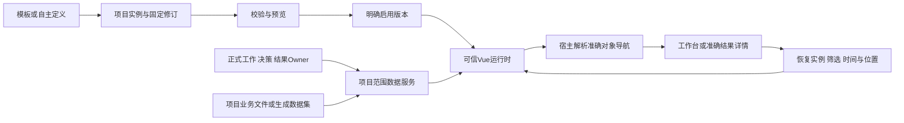

# Dashboard 生成、加载与项目管理契约草案 v1

日期：2026-10-09。事实基线：`93416ef`。读者：产品设计、前后端、项目Agent工具与验收实现者。本文是待收敛设计，字段和动作名称用于表达推荐契约，不表示已有API。进度、分包与结束条件由[重新规划总纲](两项专项全面审计与第一阶段重规划-93416ef.md)拥有。

## 1. 当前缺口与设计目标

当前只有每项目一个静态HTML入口及revision/hash，管理概览和静态业务视图可切换。没有模板库、多实例/版本、动态加载、数据授权、Agent草稿/验证/启用生命周期。根项目Agent的dashboard_read/write只处理静态HTML，子Agent被明确禁止使用；不能把它们当成已经支持以下设计。

目标是让人和项目Agent能发现模板、创建项目页面、接实际数据、预览/启用/更新，并可随时返回管理与业务办理。同时补齐蓝图、议题、决策等日常界面。模板是复用结构，项目实例是项目资产，运行数据与正式业务事实各有Owner。

## 2. 页面与资产分别归谁

| 对象 | 推荐内容和归属 | 更新规则 |
| --- | --- | --- |
| 展示素材 | 平台维护的可信Vue指标卡、图表、列表、布局与静态资产；标明输入、动作、主题/空错表现和版本 | 执行性组件随产品代码审查发布；图片等非执行资产走现有文件边界；不提供任意上传组件运行 |
| 模板 | 名称、适用场景、定义结构、数据输入槽、允许导航、素材依赖；内置、个人共享或项目专属 | 模板身份稳定、版本不可变；编辑产生新版本，不直接改所有派生实例 |
| 项目实例 | project_id、实例名、所用模板精确版本或自主定义、项目自己的数据绑定和派生说明 | 每次内容/绑定修改形成实例修订；不同项目不共用可修改绑定 |
| 草稿/稳定版本 | 同一实例的内容、绑定、依赖、校验和生成来源 | 草稿不替换生效；启用指向明确修订；回退指向历史稳定修订 |
| 项目Dashboard配置 | 当前业务首页实例及修订、默认入口选择、个人自动维护策略 | 修改配置也做版本核对；管理概览始终可达 |
| 数据源与数据集 | 平台管理事实读视图、项目业务资料、受控Agent生成数据集 | 数据Owner检查项目范围；模板只引用逻辑数据源，不保存密钥/别项目数据 |

**建议第一阶段支持一项目多个实例、一个当前业务首页。** 例如“经营总览”“销售专题”均可保存，项目管理页选择当前首页，专题可独立预览。管理概览另为平台内置兜底，不计作可删除业务实例。这样“多个模板”和“多个项目页面”都有清楚位置，不必立即做页面层级树或每屏独立菜单系统。

若首包先做单实例，也必须保持模板身份、实例身份、修订和当前指针分离，并在D4结束前补多实例；不能再用“项目只有一个index.html”承担全部含义。

第一阶段个人共享只指同一人跨项目复用。团队发布、共享权限与模板市场留第三阶段或明确后续；项目归属与个人资源可见性仍由后端执行。

## 3. 生成与Vue加载：推荐有限定义，但保留创作出口

| 路径 | 能力、代价 | 推荐 |
| --- | --- | --- |
| 版本化受控定义→可信Vue组件 | Agent生成布局、素材组合、字段映射和交互配置；校验可预测；特殊表达需增加素材 | 第一阶段先产品化。给足组合与参数能力，以真实业务样板判定是否足够，不做几张固定卡填空 |
| 隔离构建与运行生成Vue | Agent可创作新组件与自由表达；需要包依赖、构建、独立隔离、资源/网络与更新边界 | 保留R2需求触发路径。遇到现有素材确实不能表达且扩展成本更高，给同场景对照后选择，不自动当第一阶段必备任意代码平台 |
| 继续静态HTML | 已有兼容、无需新执行权限；不能动态取数与准确钻取 | 保留旧资产读取与修复，不作为动态目标的最终交付 |

“Vue加载机制”在推荐路径中是平台Vue加载受控页面定义，而非信任任意Agent输出代码。该取舍需要D0给出实际创作样板说明能力与限制，供用户一次确认。若用户最终选择必须可生成Vue，则D3必须改为对应真实隔离包，并同时调整成本和验收，不能只换工具描述。

定义契约至少包含：schema_version、页面身份/标题、布局、可信素材及版本、输入绑定、显示参数、受控导航和数据需求。校验规则包括未知版本/组件、字段/单位不符、尺寸/数量上限、非法引用、动作范围与项目绑定。可用声明式字段映射和有限格式化；首版不执行任意JavaScript、SQL或自由表达式。契约返回机器可读错误位置与修复建议。

示意定义，真实字段在D0对照实现收敛：

```json
{
  "schema_version": 1,
  "title": "本项目交付观察",
  "inputs": [{"id": "delivery", "source": "project.work_results", "parameters": {"status": "pending"}}],
  "layout": [{"id": "results", "component": "result-list", "component_version": 1,
    "data": "delivery", "on_select": {"action": "open-work-result"}}]
}
```

此示例只表达读视图与合法导航。可信素材把真实记录ID传给宿主，模板不能硬编码其他项目ID或凭据。后端按当前实例所属项目决定数据范围，不能信任定义中的project_id。

## 4. 存在哪里，如何保持项目属性

| 存储方案 | 主要好处 | 实际成本 |
| --- | --- | --- |
| 文件化定义 + 数据库索引/当前指针 | 可直接版本管理与工具读取 | 两份提交需对账；共享Workdir中的同路径会碰撞；直接文件改写难保持实例版本及发布原子性 |
| 数据库保存JSON定义/修订/绑定，已有文件或对象存资产 | 版本、草稿、派生、CAS及启用指针可同事务；项目归属显式 | 需yuanlei迁移、导出与备份；大型资产另走现有文件Owner |
| 每模板独立版本包 | 自由代码及依赖封装明确 | 构建/包索引/隔离与版本维护成本较高，有限JSON场景收益小 |

**推荐第二种。** 新受控定义及绑定在数据库中拥有唯一真相，资产用已有文件/对象边界，不新造对象存储服务。旧index.html仍由当前静态service管理，不静默迁移；可在项目管理页显示为“旧静态页面”，显式导入/重建后再切换。

不要因为多个项目共享Workdir，就认为它们的Dashboard实例或模板数据应该共享。实例/修订必须绑定project_id；导出目录需要包含项目和实例身份并限制在合法Workdir，导出是副本。归档项目不自动删除个人共享模板；删除被引用模板先提示引用，历史实例保留锁定版本的读取/回退能力。具体保留/软删除规则在D0给出真实设计，不将数据库外键直接级联成用户资产消失。

第一阶段新增持久结构进yuanlei域，迁移保留旧静态表和所有既有项目。不按模板和实例复制平台工作/决策事实；这些仍从Owner读取。

## 5. 数据如何读，Agent生成数据如何与平台交互



数据请求使用服务提供的逻辑查询及受控参数。请求/响应至少说明来源、字段/单位、查询范围、数据版本或as_of时间、取得时间、空/错/过期状态。管理指标复用overview口径；业务大屏数据只接该样板必要的数据源，避免顺手建通用ETL/BI平台。

区分三类数据：

1. **平台正式事实**：工作状态、有效决策、结果验收等。Agent和页面只能从相应Owner读取；页面生成或JSON字段不能改写它们。
2. **项目业务数据**：已有业务文件或受控数据集。Agent可以在授权范围生成/更新候选数据，通过拥有该数据的服务/工具校验并记录来源和修订；绑定后大屏读取。最小样板先接一种必要格式，不对任意文件/网络自动取数。
3. **Agent分析与总结**：有作者、时间、来源依据和完整性说明的报告。可以展示、上报或引用，标为分析；不当作独立核验。影响验收/正式决策的事项走现有结果/治理，未解决阻塞必须醒目显示或Andon，不藏进可选总结。

“与平台上级交互”分别落在两条路径：页面与宿主的数据/导航契约；下游Agent与直接委派者的草稿、交付、补充或Andon契约。前者不提供任意写平台的桥，后者按[协作草案](协作者接入与Andon协议草案-v1-93416ef.md)匹配operation/attempt，不用页面点击或自然语言消息直接授予治理权限。

浏览器不拿Provider或模型管理密钥。素材能请求的数据在后端再次校验，跨项目被拒绝。模板示例数据只供预览，标为示例；生效时没有实际数据就显示缺数，不能把样例数字当真实数据。

## 6. 宿主联动与返回

平台AppLayout拥有全局导航与聊天；ProjectLayout拥有当前项目菜单和身份；大屏运行时拥有内容布局与筛选。大屏可请求展开/全屏，但宿主决定允许行为，临时状态不覆盖个人手动偏好。

导航请求使用业务对象描述：类型、对象ID、当前项目和来源观察上下文。宿主核对当前可见性、解析到正式页面；错误或失效对象明确提示。首版支持项目工作、准确结果与必要治理对象，不提供任意URL跳转。业务办理在受信任页面，生成内容不带接受、批准、删除等自由写动作。

返回观察上下文至少包含实例/修订、筛选/时间范围、选中图层或对象及必要位置。版本已更新时提示恢复的版本差异，不能把旧筛选误套到不兼容新结构；实例不可用时返回管理并保留错误信息。定义里的直接URL不承担长期路由契约。

## 7. Agent如何知道规则并产出符合规则的页面

Agent创建时必须能拿到一份版本化“生成能力说明”，包括定义schema、可用素材与版本、项目可用数据源/字段、合法导航、输入预算、错误示例、启用政策和当前实例版本。它属于工具可发现/可读契约，不能仅依靠某个开发会话记忆。

推荐最小公共动作，命名待D0定案：

| 动作 | 输入与结果 | 实际边界 |
| --- | --- | --- |
| 发现能力/模板 | 查询范围、关键字；返回规则版本、素材与可见模板摘要 | 返回当前用户/项目可见资源，详细模板按需读 |
| 读取项目配置/实例 | 实例ID或当前；返回来源、锁定模板版本、定义/绑定、草稿/生效修订、允许数据与策略 | 项目来自当前运行授权，不能任意换project_id |
| 派生/保存草稿 | 模板精确版本或自主定义、绑定、expected_revision | 保存草稿，不暗中启用；CAS冲突返回最新信息不盲覆盖 |
| 验证/预览 | 草稿修订；返回字段错误、数据缺项、依赖、响应式/空错说明及预览引用 | 校验版本和项目数据访问；示例与真实预览区分 |
| 请求启用/回退 | 精确草稿/稳定修订、验证引用与理由 | 服务核验策略和当前修订；成功返回生效版本及记录 |

不必为每个内部函数造工具，也不把上表全部塞进无边界万能写入口。已有静态工具保留版本兼容；新的输入不静默把html字段解释成JSON。

推荐工作流：读取当前与能力→选模板/自主组合→读必要数据契约→生成草稿→收到验证错误自行修复→预览→按策略启用→回读生效版本与数据→必要时回退。单独记录生成Run/operation、输入版本、作者及校验；不保存全部内部思考。

子协作者可受委派生成定义/数据候选，并按交付包返回给根项目Agent。第一版保留当前子Agent直接写Dashboard禁令，由根Agent核对并提交；需要放开子Agent受控读取时细化授权，不删除作用域守卫。根Agent必须能检查下游交付的规则版本/修订/来源，不能直接执行其任意代码。

## 8. 启用策略与失败回退

推荐三种明确选择：手动预览启用；授权可信模板固定范围自动维护；扩大自主创作后经具体验证授权自动启用。第一阶段至少实现前两种，第三种根据D0样板和风险定界。默认手动，用户可为项目主动授权自动维护；不是每次改字都强迫人工确认。

自动范围可核查为模板/素材版本集合、允许数据源/字段、允许修改区域和启用动作，禁止新增写权限/外部地址/未知组件。自动策略只准已校验的准确修订，授权失效或竞争更新拒绝。布局范围无法用简单规则表达时缩到已有模板参数，不让另一个模型“认为安全”成为唯一批准依据。

启用记录保留操作者/Agent、授权、前后版本、验证摘要与理由。生效指针事务提交前不得先替换用户稳定页。渲染或取数失败展示具体失败、稳定版本/管理入口；回退恢复定义和绑定，不假装撤回已发生的业务数据写入。策略修改影响新动作，不回写旧发布记录。

## 9. 界面结构与治理主流程

平台资源入口增加“Dashboard模板与素材”，归个人资源管理；不要挤满项目工作首屏。项目概览保留管理/业务切换，标题区有“管理Dashboard”。管理页显示项目实例卡、当前首页、草稿/生效修订、模板来源、缺数/失败、预览/派生/启用/回退/归档。查看模板版本差异和项目绑定是次级详情。

推荐治理工作台布局：

```text
项目身份 / 概览、工作台、工作、项目智能体、资料
工作台：蓝图 | 议题与决策 | 工作建议
蓝图：当前正文阅读 + 编辑入口；历史归档按需展开
议题与决策：可筛选议题列表 | 选中议题详情
详情：问题/目标/当前方案 → 当前有效决定 → 关联工作
次级区：讨论与回复 / 决策历版 / 修改与重开时间线
工作建议：待处理理由 → 创建或关联正式工作 → 已有映射
```

议题仍容纳提案/讨论/决策，不另造Proposal平台。列表与详情只是呈现关系，可以同页分栏、窄屏进入详情；D0需根据真实长文本和流程比较，不把分栏本身当决定。默认阅读不能隐藏继续讨论、归档、重开、拒绝等已有动作。修改/重开仍遵守后端状态与历史规则。

工作列表突出当前状态、待验收/阻塞和准确入口；收件箱分已升级到人的问题、验收入口与普通通知，读状态与业务处理分开；Agent页突出接收、执行、异常和交付，配置/日志按需展开。Andon字段从协作Owner读，不在前端自造处理状态。

## 10. 契约收敛和实施的最低验证

D0交付至少两模板示例、一模板两个项目绑定、一份自主生成定义、一份非法定义，以及完整页面稿、API/Owner/schema映射和新旧兼容策略。比较结论必须在这些相同样例上展示，避免继续只有文字与局部卡片。

产品验收必须覆盖：项目Agent真实生成/修订；实例准确加载；模板版本固定及升级不自动污染；并发保存冲突；跨项目取数与资产引用拒绝；示例/正式/分析数据区分；准确结果导航与返回；自动授权内启用与越界拒绝；渲染/数据/定义故障和稳定回退；共享目录下两个项目不串实例。用真实HTTP/PG与浏览器证明持久和呈现，原型或mock不能代替这些。

本草案不宣称上述能力已实现。D0结束需要一份可批准的实际契约；D3—D5实现后，正式契约文档应链接真实源码和操作示例，替换草案状态，原研究记录保持历史证据。

协作读投影、工作详情/收件箱回溯和准确问题导航由[C0基线第9节](协作接入-C0整体契约基线与C1-C6验收卡-2026-10-09.md)定义候选对接：项目范围、as_of、当前处理者/是否需本人、送达/输入绑定/执行采用/恢复分开，宿主返回实例修订/筛选/时间/位置。D2/C5共同接同一事实Owner，不在Dashboard复制可编辑问题状态。
