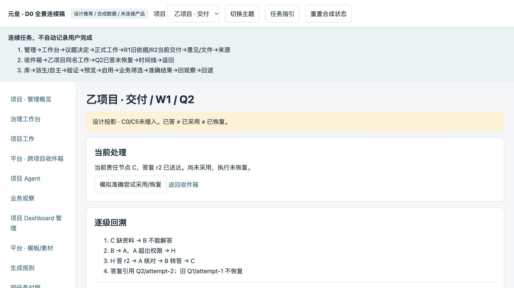
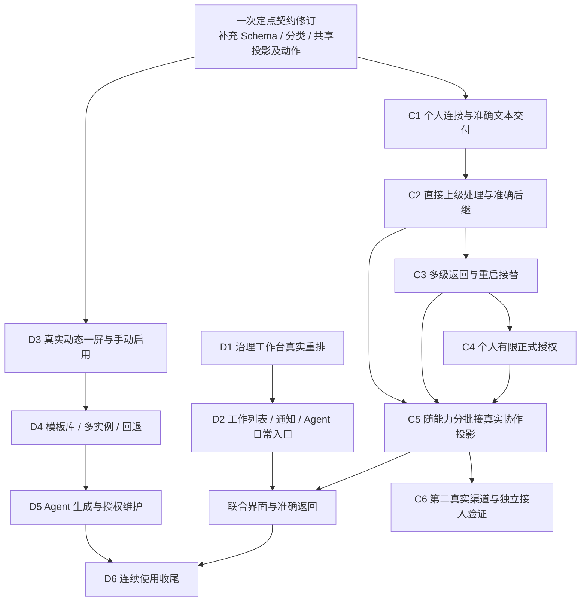

# 两专项 D0 / C0 全面复核与实施收敛

审查节点：`7f7cee3589dafd01f20f4cb78ca222d684d29bae`。审查日期：2026-10-09。

本次独立读取最新主方案、proposed Decision、样例 Schema、原型及检查脚本，对照 `93416ef` 重审规划和当前代码，复跑相关检查，并通过浏览器走查 D0 的治理→准确结果、跨项目收件箱→问题返回链。没有修改产品代码、连接配置或正式业务状态，没有发远端任务。

## 1. 总体判断

**此次重审后的产物有实质改进，值得保留，可以进入实施；设计基线需定点修订，当前不能作为“所有契约无阻断”的依据。**

D0 已回答模板如何管理、定义如何生成、项目如何绑定加载、实例与修订在哪里维护、数据与宿主如何交互、Agent 如何通过规则和工具维护、启用与回退如何约束。C0 已回答连接与目标如何管理、规则如何传给下游、正式交付与补充如何分开、谁先处理问题、怎样逐级返回、事实怎样持久记录、如何恢复以及如何扩展接入。

这些内容已经超出局部原型讨论，能够支撑产品包。继续扩大整体研究轮次的收益有限。建议保留原会话、历史证据、U5 代码和止损修复，修正下文契约缺口后按包执行。

同时，**D0 / C0 的设计覆盖与产品完成度必须分别登记**。本次与 `93416ef` 比较，`web/`、`backend/` 没有变化。原 U5、Multica 止损和 T1-O 的证据仍成立于原范围，D1—D6、C1—C6 仍待实施。两个专项整体均未完成。

## 2. 设计原则与重审要求的覆盖

| 要求 | 最新设计与判断 | 剩余出口 |
| --- | --- | --- |
| 平台与项目导航、Dashboard 嵌套 | 保留平台/项目导航与管理兜底，业务观察独立；沿用 U5 宿主，未要求每页再造导航。合理 | D1/D2/D6 的真实日常路径与嵌入走查 |
| 蓝图、议题、决定、建议主流程 | 明确阅读/编辑、列表/详情、当前决定与关联工作优先，历史次级；不改治理语义。补上原缺漏 | D1 产品重排及所有旧动作、锚点、草稿保护 |
| 动态生成规则 | 版本化受控定义、可信素材、输入与格式类型、预算、校验错误位置、规则发现。能够让 Agent 按规则生成 | D3 实际 Runtime，D5 真实工具生成 |
| 模板、素材库、多项目多实例 | 不可变模板版本、个人共享/项目专属、独立数据绑定、多实例与单一首页、派生/升级/提取。边界合理 | D4 持久库、管理页面及跨项目负控 |
| 生成页面的存储、启用、维护 | PG 管定义与状态，文件/对象服务管字节；草稿、稳定修订、首页指针区分；CAS、验证、启用、回退保护明确 | D3/D4 迁移与真实读写，D5 授权消费 |
| 数据与平台上级交互 | 有界业务数据集、来源/时间、候选与正式数据分离；宿主解析对象、准确结果跳转及返回观察条件 | D3/D5；协作对象动作还需联合收敛 |
| 五花八门的协作者配置 | Provider / Connection / Target / Attempt 分层、冻结目标与配置修订，密钥引用；远端配置默认由平台自身管理 | C1 管理入口、迁移、两类调用入口统一 |
| 正式交付外的补充机制 | 正式交付与可选补充分离，超长补充不直接推翻可信正式结果。方向合理 | 文字契约与 Schema 不一致，见 F1 |
| 下游知道 Andon 规则 | 版本任务包、直接处理者、规则正文、匹配字段与实际输入指纹；不是只保存本地元数据 | C1 实际下发；C2 下游真的发问 |
| 逐级处理、逐级答复 | 稳定问题、不可变修订、节点、因果事件、outbox、答案与等待尝试匹配；B/A/H/C 场景具体 | C2/C3 实际处理、崩溃与接替 |
| 送达、采用、恢复可回溯 | 三者分离；外部无原生续接时终态后开启准确后继尝试；不把 HTTP 成功或模型自述算采用 | C2/C3/C5 真实链路和界面 |
| 明确授权后 Agent 批准部分正式变更 | exact→有限集合→类型化边界；真实 actor、版本、额度同事务，组织治理留第三阶段。符合原则 | C4；类型化新草案增加治理结构，需按具体类别验收 |
| 可依文档接入新协作者 | 能力分级、Adapter 责任、来源证据、测试基准和独立接入者出口明确 | C6 第二真实 Provider 与独立接入验证 |

结论：原核心目标大部分已进入可执行设计。剩余问题主要是契约一致性、范围控制和真实实施，不应再让你重复选择已经明确的基本原则。

## 3. 需要修订的契约缺口

### F1｜补充详细报告的契约与 Schema 冲突——C1 解析器实施前修复

C0 第 5 节（主文第 108 行）明确补充包括 `details_ref`、`complete`；第 66 行要求详细报告通过受控引用提供。样例包的 `return.supplement` 及独立 `supplement` Schema 只接受 `revision/summary/assertion_level`，并设置 `additionalProperties: false`。

独立验证：在合法 `return-completed` 正例上分别添加 `details_ref`、`complete`，两者都被拒绝。因此，按文字契约输出的协作者会遇到协议错误，长过程说明也缺少可用承载字段。现有 7 正例/9 负例通过没有覆盖这一矛盾。

**修订要求：**

- 区分协作者可提交字段和元垒可信注入字段。作者、目标、Run、operation/attempt 来源由后端绑定，不能相信模型自报。
- 为详细报告定义精确引用结构及允许来源、大小、指纹、读取权限；明确 `complete` 表示补充报告完整程度，不表示工作完成。
- 文字、两个 Schema、正负例、产品补充投影同步修订。至少补一个带详细引用的合法正例，以及越范围引用、伪来源、非法指纹的拒绝例。
- 明确引用暂不支持时的首版降级：保存受控文本补充并说明限制，不能保留“支持详细报告引用”的承诺却拒收该字段。

**200 字符上限是新的全局产品选择。** 原 T1-O 的 200 限制是一次试验条件，本轮任务包把它变成 `const:200`。建议把 200 作为可配置摘要预算的默认值，按当次任务包冻结；硬字节安全上限继续保留。详细过程由受控报告承载，过长摘要保留原文并显示摘录。这样不把一个试验的失败条件永久扩散到所有协作者。已有“可选补充超长不直接导致正式结果失败”的设计应保留。

依据：C0 主文第 66、83、108 行；样例包第 443、769 行附近。

### F2｜共享读投影和宿主跳转尚未形成一个可实现契约——D3/C5 联调前修复

D0 第 150 行描述 `collaboration.v1`，主要是平铺 ID、版本和状态需求；C0 第 307 行给出 `projection_version:1`、`work_id` 与嵌套 `question_ref/handling/answer/execution`。名称不同本身允许通过映射解决，但当前没有明确唯一发布 Schema 和映射。

动作也不完整对齐：D0 定义示例使用 `open-result`，宿主请求 `open-object`；C0 使用 `open-work-result/open-collaboration-question/open-collaboration-attempt`。D0 的宿主注册映射尚未明确问题及准确协作尝试的目标描述。两边虽已对齐 return token，但这只解决返回信任边界。

**修订要求：**

- 协作 query Owner 发布唯一机器可读投影及版本；Dashboard 消费它，若需要显示模型，写出确定映射，避免两个专项各造同名状态。
- 分开“当前问题处理者”“本次答复接收方”“等待恢复执行者”“需要本人执行的动作”。不要用一个“当前责任节点”同时表示四种角色。
- 宿主维护唯一动作注册表，明确 question revision、node、attempt、result 的必要字段及对象归属验证；素材动作到宿主动作的转换写成明确表。
- 用同一组样例贯穿收件箱、问题详情、工作详情、Dashboard：内部处理中、待本人答复、已送达未采用、已采用执行失败、旧尝试被替代。
- 真实按钮由权限与当前义务推导；投影 unknown 不显示“已恢复”，已读/归档不关闭问题。

D0 原型的 Q2 已答未恢复、跨项目入口可实际浏览；它仍是硬编码模拟，没有消费 C0 投影。因此本轮不能据此判定接口已经对接成功。

### F3｜成功交付、阻塞问题和非阻塞事项需要明确分类——C1 映射实现前定清

样例 Schema 把正式交付的 `unresolved` 限定为 `maxItems:0`，`completed` 不允许 questions。后者能阻止带真实阻塞的交付冒充完成，值得保留；但前者没有说明一般观察、范围外建议、无需暂停的风险在哪里承载。现有 Result Owner 本身有未解决事项表达，不能无解释地抹掉。

独立检查确认：合法成功正例增加一项非阻塞观察也会被拒绝。这是当前候选协议的限制，不是已经上线的产品缺陷。

**建议：** 严重缺项/授权缺失进入 blocked 及问题；不影响本次交付的事项可进入类型化 notices/risks 或补充。若保持 `unresolved=[]`，就明确它专指阻断本次交付的事项，并提供非阻塞事项的合法正例和 Result 映射。不得凭自然语言猜它是否阻塞，也不能让严重风险只藏在可选补充。

### F4｜问题去重的边界还需一组负控——在 C2 固化

C0 第 131 行候选唯一键为 `(source attempt, message, client key)`。同一远端消息重收能去重；不同消息重复使用同一 client key 则可能生成两个 Q。主文承诺“同问重复不新建”，需要明确其指来源重收，还是同一尝试内的逻辑问题重发。

建议将逻辑身份与收件证据分开：稳定逻辑 key 绑定 attempt；message/hash 保留接收记录。同 key 同内容重发复用 Q；同 key 改内容走显式修订/CAS，或拒绝并要求新 key。两个相似但不同来源问题保持独立。最终字段由实现 Owner 固化，至少覆盖跨消息重发、同 key 改题和旧 revision 迟到。

这是 C2 设计收口，不必阻塞 D1 或 C1 的普通文本交付。

## 4. 主要取舍是否合理

### Dashboard：建议接受受控结构组合，保留隔离 Vue 的需求触发出口

首阶段 R1 能覆盖当前结果观察和基础业务大屏，也能让 Agent 通过 schema 获得稳定生成规则。它的代价是表达受素材注册表限制，不能宣称任意 Vue 页面创作已交付。R2 会新增编译、依赖、来源隔离、资源和消息桥的长期维护成本。

建议按 D0 推荐执行 D3—D5，不为了理论上的任意创作把基础产品链拖住。表达不足必须用实际项目页面证明：现有素材无法表达什么、新增通用素材是否合算，然后开具体 R2 增量。不要把“受控组合”进一步缩成固定卡片排列；仍应支持布局、输入、映射和动作的组合。

### Dashboard：建议接受人工首次启用与固定模板有限自动维护

这符合你要求的 Agent 自主维护，也能机械核查范围。结构自由组合仍可生成草稿并人工启用。布局授权与业务数据采纳授权分开有必要；没有正式数据时不应装成真实经营结论。

自动启用授权一旦明确，范围内不再逐次问人。自由组合自动启用不作为本轮首包必须项，但应在总纲列为具名剩余项，不能悄悄消失。

### 协作：先准确交付，再逐级问题链，顺序正确

每个业务 attempt 独立委派行，可以保留现有结果来源唯一性；成本是需要 root 聚合、旧行兼容及后继映射。blocked-return 让不具备原生等待能力的协作者也能接入，代价是额外后继运行与上下文重建。不得把后继尝试叫原 Run 恢复。

受限上级处理 Run 是合理方案，但 C2 应验证它在原父 Run 等待/结束时仍能调度，不能排在永远不释放的同一等待队列后面。处理节点版本、队列键、租约和实际输入来源要在该包落地，不能仅靠提示词约束。

### 正式授权：目标保留，类型化新草案按具体类别建设

C4 的 exact、有限集合和类型化边界符合“明确授权后允许 Agent 批准部分正式变更”。其中 C4c 会增添治理 Owner 的类型化载荷、规范正文和差异核查，建设量明显大于授予某份已存在草案一次批准权。

建议保留 C4c 目标，但实施前选一个真实需要、可机械检查的类别；主文的“预算上限下调”仅作候选例子。不要在 C1 顺带建通用规则引擎，也不要以 exact 授权完成为由永久删掉授权内生成新草案的目标。

### 返回令牌：边界安全，D3 保持最小实现

两专项统一使用 uid 绑定的短期不透明 token，避免业务页篡改返回上下文，方向合理。它会引入 Redis 可用性与历史修订解析成本。D3 先完成必要的实例/修订/筛选/准确对象/位置返回，令牌仅存导航状态，每次仍查当前权限；不扩成通用页面会话平台。过期回管理概览的退路应真实可用。

## 5. 产品建设现状与证据

| 项目 | 本轮独立确认 | 不应扩大成的结论 |
| --- | --- | --- |
| 当前代码增量 | `93416ef..7f7cee` 没有 web/backend 变化；差异空白检查通过 | D0/C0 机制已经上线 |
| D0 原型检查 | 3 合法、5 非法定义向量通过；app.js 语法通过 | 产品校验器或运行时通过 |
| D0 浏览器走查 | 蓝图阅读/议题决定层级→准确 R2；跨项目收件箱→乙 Q2 已答未恢复可达 | 真实 API、数据库、Agent 或 C0 投影已经接通 |
| 协作样例 | 7 正例、9 负例、4 字节向量独立复跑通过 | shipping parser、远端身份、送达/采用/恢复通过 |
| 语义向量 | 6 项继续 Not run | 真实链路已验 |
| 新增反例 | details_ref / complete 被拒；成功 unresolved 非空被拒 | 这些场景已经有合理产品处理 |
| 文档构建 | 独立复跑通过，构建有既有体积警告 | 文档内所有业务契约一致 |
| 全仓工程检查 | 失败；ef65969 评估文档 166/174/190/234 行四处措辞问题 | gate 通过或新产品故障 |
| 作者独立 Review、70 检查器测试、106 链接 | 阅读其记录；本轮没有重新执行该 70 项及整套 106 链接检查 | 本轮独立复验了全部作者证据 |
| U5 / Multica 止损 / T1-O | 产品代码和原证据保留；没有重新进行完整产品与远端验收 | 两个专项整体结束 |

主机未安装 jsonschema，本次使用已有 API 容器的已有依赖只读验证公开样例，没有安装依赖、启动远端任务或操作数据库业务行。产品源码未变化，本轮没有重复执行全量前后端单测。

## 6. 建议实施顺序与两个会话的分工

Multica 环境证据调查、接入指南完善可从现在并行，不能等 C5 完成才开始；真实派发仍受自己的隔离门槛约束。动态数据准备可与 D1/C1 并行设计，实际启用不越过 D3 验收。

### 近期只启动两条明确产品线

**Dashboard 会话：D1 治理工作台。**

先交蓝图阅读/编辑，再交议题/决定主次分层，最后接建议准入与正式工作关联。保留所有原动作、旧锚点、历史和草稿；使用真实现有接口与隔离业务对象回读。需要新增蓝图写 CAS 时单列服务增量及过期写测试，不能把无守卫编辑藏在 UI 包中。完成后按 D2 的列表、通知、Agent 分批推进。

该包无需等待动态模板或 Andon 产品实现。F2 的对接收口可在旁线完成，但不能继续用它拖延治理页面落地。

**协作会话：修正 F1/F3，随后 C1 产品接入。**

先交小型契约修订差异和新正负例，不再写另一份宏大基线；随后落地连接/目标、准确 attempt/root 映射、任务渲染/解析、Gateway 文本 Adapter、正式结果与补充分离。同步修正外部委派和正式工作两类入口的注册/约束，保留旧数据语义。

先用离线、模拟 Provider、真实隔离 PG/HTTP/worker 验证工程链；真实 OpenClaw 产品入口验证再提交一次完整对象卡，沿用已证明的安装版，不重复 T1 成功文本探针。远端写入及计量授权按既有边界执行。

### 共享契约只设一个维护者

协作会话维护问题/答案/执行的读投影 Schema 和样例；Dashboard 会话维护素材到宿主动作注册与返回机制，并引用前者。双方只在自己的 Owner 文档修改，交叉链接及联合样例闭合，避免各写一套“已对齐”。F2 的完成证据是同一向量经过双方消费映射和宿主解析，不是两份文字互相引用。

## 7. 进度与收尾管理的具体约束

1. 每个 D/C 包登记：未开始、实施中、局部已实现、等待指定联验、完整通过。研究稿/原型另标，不占用产品完成状态。
2. 完成记录列准确 commit、实际入口、对象/版本、相关检查和未验项。不要把作者 Review 或测试总数当作用户使用成功的证据。
3. D2 没有 C5 时可交付列表与通知，但仍留下明确协作联验出口；C1 成功不能注销 C2—C6；D3 一屏成功不能注销模板和 Agent 工具。
4. D6/C6 收尾对照第 2 节逐项指向产品证据；未达到的目标要么继续实施，要么提出具体缩减的能力、代价和用户判断，不能移到含糊“后续完善”。
5. 人类走查安排在可真实使用的 D1/D2 与联合产品链之后。你无需替 Agent 设计字段或为每个 mock 控件验收，但整体阅读与操作体验必须由真实使用观察补证。
6. 旧四处文档 gate 问题可单独机械修订并复跑，不作为本轮新契约问题的替代解释，也不再让它长期污染每次交付状态。

## 8. 可直接给原会话的执行补充

以下是建议你发送的范围约束，发送后可连同原卡授权具体工程实施；本次审查没有代你发送或启动开发。

### 给 Dashboard 会话

保留 D0、U5 和原历史。采用受控结构组合、人工首次启用、显式授权固定模板有限自动维护作为 D3—D5 首阶段方向；隔离 Vue 与自由组合自动启用保留具名需求触发出口。现在执行 D1 治理工作台卡，按蓝图→议题/决定→建议准入分批，不改治理状态与语义。直接使用真实接口验证连续流程、旧动作与锚点、草稿保护和窄屏。同步与协作专项收敛共享投影和宿主动作，以协作 query Owner 的版本 Schema 为源；问题与尝试必须准确定位。不要再扩大 D0 整体研究。完成后报告产品变化、真实证据、未验项，D2—D6 保持未完成。

### 给协作接入与 Andon 会话

保留 C0 整体基线及原止损/T1 证据。先定点修复补充 details_ref/complete 与严格 Schema 的冲突，明确非阻塞事项合法载体及 Result 映射，将摘要预算从一次试验常量收敛为当次任务约定；补对应正负例。发布唯一协作读投影 Schema 与联合场景样例，和 Dashboard 对齐问题/尝试/结果动作及返回语义。随后执行 C1 的完整工程包，覆盖两类现有调用入口和数据库约束、准确来源及补充独立读取；本地隔离验证先行，真实远端产品验收按整卡一次授权。C2 补跨消息问题去重和上级处理 Run 调度负控。不要新增泛化研究轮次，也不要只做 Adapter 后停止；C2—C6 和正式授权内新草案目标持续保留。

## 9. 主要依据

- [Dashboard D0 与验收卡](Dashboard-D0设计基线与D1-D6验收卡-2026-10-09.md)
- [协作 C0 与验收卡](协作接入-C0整体契约基线与C1-C6验收卡-2026-10-09.md)
- [协作协议 Schema 与样例](样例/collaboration-v1-c0.json)
- D0 原型与检查说明：仓库 `research/prototypes/dashboard-d0-20261009/README.md` 拥有隔离稿运行与检查入口。
- [上一轮全面审计与第一阶段重规划](两项专项全面审计与第一阶段重规划-93416ef.md)
