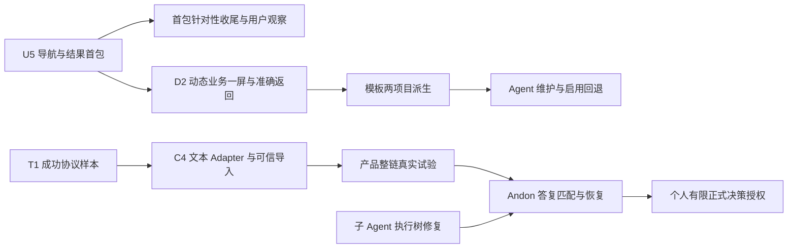

# 两专项 U5 与 OpenClaw 试验复核及下一步

日期：2026-10-09。核查提交：`93416ef696a643313ee494a95d68c8f1c60c8661`。本次只读审查产品与文档，并执行相关前端测试及现有页面走查，没有修改仓库、发送远端任务、办理结果或改变日常配置。

## 1. 结论

| 内容 | 本次判断 | 下一步 |
| --- | --- | --- |
| Dashboard U5 P1a/P1b/P1c | 三项产品增量已落地；本次未发现需要阻止首包推进的新代码问题。首包实施与专项全部完成应分别登记 | 原会话补齐有针对性的收尾验证，同时准备 D2 的真实动态业务一屏 |
| OpenClaw T1-O | 按试验报告，成功运行、准确持久文本与清理已有证据；严格补充长度未通过。不是完整产品接入 | 原会话进入 Gateway 文本 Adapter、本地可信结果导入及恢复观察实现 |
| Multica | 止损已有实现；部署隔离证据仍不足 | 独立补部署事实，不阻塞 OpenClaw 首包 |
| Andon | 本轮没有新增逐级求助、答复与恢复证据 | 保留目标，等准确委派与结果链、平台子 Agent 执行树修复后推进 |

不用重开会话或丢弃这轮产物。现在继续做同层级方案比较的收益很低；应把已确定边界转成下面的实施与验收包。

用户回复中的“未提交代码”是会话结束时的历史状态：当前 U5 产品实现已进入提交，工作树干净。不是仍待提交，也不是本复核替用户批准发布。

## 2. 本次实际校验及证据限度

检查了相对 `1f3fe2a` 的差异、U5 记录、正式导航 Decision、OpenClaw 试验报告和 proposed 接入 Decision。该区间没有后端产品代码变动。产品重点检查包括 AppLayout、ProjectLayout、Dashboard、WorkResultsPanel、工作详情、用户缓存与返回位置管理。

本次执行：

```sh
docker compose exec -T web node --test \
  test/unit/defaultProjectDashboard.test.js \
  test/unit/projectDashboardLoading.test.js \
  test/unit/projectLayout.test.js \
  test/unit/platformPageCache.test.js \
  test/unit/workResultsPanel.test.js \
  test/unit/projectWorkTaskView.test.js \
  test/unit/pageReturnScroll.test.js
```

结果：**34 passed，0 failed，0 skipped**。测试输出有组件桩、Markdown 渲染桩和 Vite 端口等警告，不能据绿色退出认定整个真实页面与全部 Markdown 格式都验证完成。差异空白检查通过。

本次在现有已登录产品中只读走查合成项目：管理概览进入指定旧结果 R1；切换 R2 时 URL 更新到准确结果锚点；查看 R2 原条件、文件引用与既有验收意见；返回来源恢复到项目概览；切换业务大屏显示尚无静态页面的空状态。没有新建事项、提交意见、接受结果或改权限。截图保存为同目录 `U5独立核查-准确结果页面.png`。

作者报告的前端全量 524 项、后端 2844 项、构建、lint、独立 Review 和数据库/文件回读，本次没有全部重跑。524 项在最终纯 CSS 密度调整前执行；最终密度有相关测试和构建证据，应保留这个范围说明。

OpenClaw 本次核对报告与现有实现边界，没有重新连接 Gateway，也没有读取会话交付的私有 RPC 附件逐条复算。因此远端成功与清理仍依据该会话报告，不冒充本次独立执行的协议结果。

## 3. Dashboard：值得认定的成果与剩余工作

### 3.1 实际实现符合首包边界

1. **平台与项目导航分工进入真实宿主。** 平台导航支持窄栏、覆盖展开和固定；项目五个入口稳定存在。窄屏临时展示与手动偏好分开。全局聊天的缓存宿主保持存在，账户身份变化使旧页面缓存退出。
2. **办理围绕准确结果。** 页面不是把所有结果混成一张最新任务卡。缺失锚点不会偷偷替换目标；旧结果保留原条件，接受动作受限制。真实页面的 R1 仍待验收、R2 已接受且工作已完成，三个事实分别显示。
3. **意见缓存有身份范围。** 缓存按用户、项目、工作和结果隔离；切账户、权限失败和成功办理有清理路径；409 保留意见并要求重新核对，没有自动重放办理请求。相关测试支持这些行为，但没有代替真实双账户验证。
4. **管理概览和业务内容分开读取。** 业务页面读取不应拖住管理兜底。现有静态 HTML 沿用 sandbox；没有为了完成表格而放开脚本或偷渡动态通信。
5. **返回和旧功能出口仍在。** 正确结果、文件、历史执行及工作管理保留入口；返回来源校验同项目或允许的全局入口，部分列表滚动和焦点可恢复。

这是有价值的工程推进。当前没有证据支持“整个平台所有页面已经好用”，也不能据首包完成宣布素材库、模板库、Agent 自主维护与启用回退完成。

### 3.2 下一轮分成两个具体工作包

**A：首包收尾验证。** 不再重新讨论导航方向，不再扩写候选方案。

| 工作 | 怎么做 | 结束标准 |
| --- | --- | --- |
| 就绪静态业务页 | 在隔离测试项目用现有合法维护流程准备最小静态 HTML；验证 ready、读取失败、修复后可读及返回管理。沿用当前禁脚本边界 | 实际产品出现内容；业务故障不使管理失联。没有发布权限时先准备内容与具体操作范围，只对最后写入申请一次授权 |
| 账户与失权 | 使用隔离测试账户/受控测试夹具，先建立某结果的意见，再换身份、撤销读取或切项目；不要破坏用户当前会话与日常项目 | 后端拒绝访问，页面不留旧内容和意见；同名工作不会串目标。只造单测不写成真实账户通过 |
| 一次连续体验收集 | 给用户一个明确的 10—15 分钟脚本：概览找事项→看旧依据→切当前结果→看文件→返回来源；记录找不到、误认、阅读负担的具体位置 | 收到一次实际反馈；按问题修正。未收到反馈就登记“待观察”，不能让技术验证和 D2 准备无限等待 |
| 导航操作补验 | 覆盖展开后的键盘焦点、窄→宽恢复、长项目名、内容滚动 | 入口能操作，临时状态不污染偏好；屏幕阅读器/物理触屏未做时按范围保留 |

不要把所有历史业务链都塞回这一包。Git、对象附件、完整 Agent 求助链等根据本次实际改动风险安排验证；未经执行的链继续注明，不能自动转为通过。

**B：D2 真实动态业务一屏。** 下一实施目标应是“一张能读取授权数据、跳到准确对象、再恢复观察位置的项目业务大屏”，而不是先搭一个万能 Dashboard 框架。

1. 选一个有实际数据的项目、一个具体业务问题和两三类必要图表；展示字段、数据来源、更新时间、空值和失败表现逐项列出。不让用户先在抽象框架之间盲选。
2. 把有限 R1 定义映射到真实 Vue 宿主与可信组件；定义版本化页面结构、有限取数入口、格式及导航请求。每个取数请求由后端核对当前用户和项目，内容不能自选任意 API、文件路径或凭据。
3. 大屏声明跳转意图，宿主办理导航。保存项目、页面实例、筛选/时间范围、所选对象和必要滚动位置；完成“业务一屏→准确工作/结果→返回观察”的真实链。宿主负责平台/项目导航及临时全屏，内容不得直接改宿主状态。
4. 验证加载错误、过期/缺数、错误结果 ID、跨项目导航和返回上下文；失败仍可进入管理概览。复用当前结果办理，不复制另一套验收按钮和业务状态。
5. 交付一份可审阅的具体实施清单，再实施这个小包。有限定义是当前增量选择，不是永久禁止 Vue 创作；出现实际表达缺口再触发 R2 比较。不要同时扩展任意 Agent 代码加载、模板市场或通用消息桥。

下一包完成后，再做“一份固定版本模板、两个项目独立实例”的派生验证，然后接入 Agent 的读取、草稿更新、验证、竞争写入与启用/回退。素材可以随样板增长，不能让组件清单把用户的业务创作空间提前封死。自主维护不默认每次必须由人审批；应按明确授权范围逐步开放。

## 4. OpenClaw：成功探针可以支撑什么

报告对公共终态、session/run、持久 assistant 消息做了交叉核对，没有把等待超时当失败，也没有把 `livenessState=working` 单字段当最终状态。它保留 usage 的不同口径，未把 cost=0 宣布为免费；原生删除后的废纸篓/归档保留也明确登记。这些都是合理的证据处理。

**补充长度是未通过项，且执行提示发生了口径偏差。** 原卡“不超过 200 字”被落实成“不超过 200 个汉字”，最终 111 个汉字、240 个 Unicode 字符。不能追认放宽标准；也不需要为让报告全绿再付费运行一次。该格式失败没有推翻准确当次正式文本的来源证据，但不能登记补充格式全部通过。

“200”是本次试验约束，不应无依据变成所有协作任务的全局上限。产品应持久保存原始补充，并记录本次约定及独立校验；展示截取不改变原文。算术 JSON 是试验格式，不是所有任务必须采用的业务 schema。

本轮没有证明：实际元垒委派入口、持久映射恢复、最小运行凭据权限、准确取消、硬截止、并发回收、服务重启、原运行续接或 Andon。尤其模型工具 deny-all 与 Gateway 操作身份的权限是两条边界，不能因为模型没调用工具，就认为接入身份已足够小。

### 4.1 下一实施包：准确文本委派与可信结果导入

现有 proposed Decision 的总体方向可以采用。应落实为以下可验收增量：

| 子包 | 实现范围 | 必须证明 |
| --- | --- | --- |
| C4a：Gateway 文本 Adapter | 复用 DelegatedExecutor；运行配置引用明确远端 Agent，不自动修改长期 Agent 配置。声明实际支持的能力，未验证的续接/文件/取消不得宣传可用 | 每次操作绑定准确 Agent、sessionKey/sessionId、生命周期修订与 runId；仅凭 accepted、delta 或模型自述不成功回收 |
| C4b：映射与异常观察 | 在现有 delegation Owner 中持久保存恢复所需绑定；请求先持久化。用实际消费者决定 request_json、句柄与持久结构的最小扩充 | 新事务或进程重建能恢复观察；接受响应不明时不自动重发；身份不符、旧 owner 和并发操作不能推进错误运行 |
| C4c：结果导入 | 验证准确终态和持久消息，保留来源、内容指纹与原始 usage；正式交付与可选补充分开保存。复用既有 Result Owner、Workdir、source 唯一性和租约 | 产生待验收结果；执行成功不直接接受或完成工作。重复 collect 不造重复结果；本地保存的文本不冒称远端 artifact |
| C4d：产品真实整链 | 本地代码与隔离测试通过后，准备一张新的具体产品试验卡；经授权执行产品入口→委派→观察→导入→本地办理→清理 | 不重复 T1 的纯协议探针。拿到产品 HTTP、真实 PG/Workdir、准确远端与结果绑定证据；未验能力继续登记 |

当前 `DelegationHandle` 只有通用 session/turn/external_ref 字段，`DelegationService._handle()` 也没有恢复执行器专属映射；不能仅把更多身份留在内存里就宣布持久恢复完成。现有 result.summary 是结果摘要，不得直接改作补充总结。需要实际存储增量时说明迁移和既有执行器兼容，而不是另建一套结果系统。

隔离测试至少覆盖：wrong-run/session/agent、缺持久消息、非终态、空输出、模型错误/截断、重复与并发回收、响应丢失、重建后观察、正式文本与补充分开回读。错误/截断拒绝导入与业务“未接受”分别归属执行和验收，不混成一个状态。

暂停实际远端运行而完成本地 Adapter、模拟协议和 PG 回归是可行推进；没有必要把整包实施都停在新远端授权前。原 T1 卡新增对象已清理、一次额度已用，下一次产品调用不能沿用它声称已经授权。新卡应直接填写目标、对象、次数、计量、凭据范围及清理条件，再一次确认，不逐 RPC 反复问用户。

## 5. 不要遗忘的独立平台修复

上一轮指出的子 Agent 执行树冲突仍在：`subagent_run_service.py:256` 把 child_thread_id 写入 runtime_scope_id，`run_worker.py:189` 却要求该字段等于 creator_run.runtime_scope_id。本轮没有修改这两处，也没有用新增 worker 证据证明它们协调一致。

应单独修复创建、继承范围解析和校验的一致性，保持跨树、跨项目拒绝边界；不能简单删除守卫。验收真实父→子 Run 到达模型、准确输出归属及负向拒绝，并把既有限定 xfail 的截断 E2E 推进到真实断言。它不阻塞 Dashboard 或外部独立文本 Adapter，但阻塞可信多层 Agent/Andon 验收。

全仓四处历史文档 gate 措辞失败也应作为一个小维护任务一次清理并重跑，避免每轮继续携带。它不是本轮产品代码新缺陷，也不是“工程全绿”。



## 6. 可以直接发给原会话的指令

### Dashboard 原会话

> 基于 93416ef 继续，不重开导航设计讨论。U5 首包实现按已落地登记，专项保持开放。下一轮分两包：先补真实就绪静态 HTML、业务读取失败/修复后的管理兜底、隔离账户/失权及导航焦点/返回验证；给我一个 10—15 分钟连续走查入口和脚本，未收到人类反馈只登记待观察，不阻塞独立技术准备。与此同时形成 D2 的具体实施增量：选一个真实业务项目、一屏两三类图表，列字段与数据源，采用有限受控定义和可信 Vue 组件，写清后端项目鉴权、缺数/过期/错误、宿主导航与全屏、准确工作/结果和返回筛选位置。提供页面稿、组件/API 改动、兼容旧静态 HTML、负向验收与退路，然后给出推荐和代价，供一次确认这个具体实施包。不要扩成任意 Agent 代码运行、通用消息桥或模板市场；不把纯组件清单当未来创作上限。模板版本/派生、Agent 更新、启用回退保留后续依赖。已有首包内授权继续有效，新增发布或扩大能力的操作按具体范围确认。

### 协作与 Andon 原会话

> 基于 93416ef 继续，T1-O 结束，不重复同类付费探针。认可 proposed OpenClaw 文本接入的窄范围，授权本地 Adapter、持久准确绑定、可信结果导入及必要隔离测试实现；本条不授权新远端写入、运行、日常配置修改或业务决策批准。复用 DelegatedExecutor、DelegationService、Result Owner 和 Workdir；保持现有执行器语义，按真实消费者决定最小存储扩充。正式交付与原始补充分开，summary 不改作补充；记录长度口径失败，不追加调用刷绿。覆盖准确来源、非终态/错误/截断拒绝、重建后观察、响应丢失不盲重发、重复/并发回收与待验收结果。取消/续接/远端文件未验就不开放或承诺。完成本地实现后准备新产品整链试验卡，填好目标、次数、计量、最小权限和清理范围，申请一次整卡授权；试验直接走元垒产品入口，不重复只证明 Gateway 的 T1。Multica 部署调查独立；不建设通用连接中心或提前组织权限。逐级求助、答复匹配、采用/恢复/完成分离，以及明确授权后部分正式决策变更，继续保留为后续目标。

以上文本供用户采用，不表示本复核已经向其他会话发送指令或执行授权动作。
