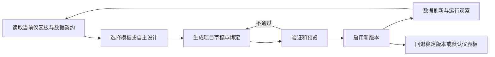

# 信息架构、交互设计与项目 Dashboard 专项规划

日期：2026-10-08；代码事实基线：`ef65969`。

本文是持续专项的研究与收敛框架，不是已拍板的页面设计或一次性实施工单。与[两项专项总纲](第一阶段两项专项规划总纲-2026-10-08.md)及[协作专项](协作接入与Andon专项规划-2026-10-08.md)配套。

## 1. 目标与边界

让个人用户可以直观判断项目情况、找到需要处理的工作，并由项目智能体建立有实际数据支撑的专属仪表板/数据大屏。

专项同时承担两件事：

- **日常产品体验**：默认项目仪表板、项目工作台、收件箱、工作列表/详情、资料预览、运行与验收之间的组织和操作。
- **可复用 Dashboard 能力**：素材库、模板库、项目专属生成与维护、受控加载、数据交互、发布和回退。

默认管理仪表板是认真打磨的兜底与范例，项目专属大屏是业务适配能力。两者共用可信的数据和展示原则，不要求具有相同布局。

不包含：新增领域层级、独立目标中心、组织权限、通用页面搭建平台、任意插件市场、复杂 ETL/BI 平台、周期引擎。需要项目数据接入时，先限定服务具体大屏所需的小范围接口。

## 2. 用户构想吸收后的产品分工

| 对象 | 用途 | 应避免 |
| --- | --- | --- |
| Dashboard / 仪表板 / 数据大屏 | 展示、分析、识别异常和重点，跳转准确办理位置 | 把全部维护表单、日志和历史原文放进大屏 |
| 项目工作台 | 理解和维护项目业务：蓝图、议题、决策及关联工作 | 与 Dashboard 重复展示同一份全量信息 |
| 工作详情 | 当前工作要求、当次执行、真实交付、验收及求助处理 | 不分阶段地展示所有设置、提交框和历史 |
| 收件箱 | 跨项目提醒与需要本人处理的入口 | 把未读等同于未解决；每个执行事件都要求人处理 |
| 智能体工作台 | 能力配置、接收与执行队列 | 代替正式工作的业务验收 |
| 素材与模板库 | 为项目智能体和人提供可信、可复用的生成资源 | 保存原项目凭据或把示例数据当实际数据 |

Dashboard 可以展示交互筛选、钻取与导航；业务批准、验收、删除等改变事实的操作原则上进入相应受信任界面。若以后考虑大屏内快捷办理，应作为单独决定，不让智能体生成页面拥有任意写权限。

## 3. 当前事实与目标的差距

现有默认概览由受信任 Vue 组件渲染；自定义页则是项目目录 `dashboard/index.html` 中的静态 HTML/CSS。

当前自定义页：

- 不支持脚本和 Vue 执行。
- iframe sandbox，CSP 禁止网络读取。
- 后端仅允许页内锚点，不允许跳转工作台。
- 没有动态数据 bridge、模板/素材管理和数据自动刷新契约。
- 专用读写工具在当前根 Project Run 内校验范围和授权，子智能体不能直接读写。
- 文件持有内容，数据库持有 revision/hash/大小；冲突和文件失配明确报错。

所以“事先约定 Vue 加载和数据交互机制”应作为本专项的核心产出，不能告诉智能体直接输出 Vue 就认为已实现。现有静态隔离是 v0 的合理取舍；演进应保留作用域、版本冲突、可恢复性与默认兜底，不是简单去掉 script 限制。

当前代码定位：`project_dashboard_service.py`、`dashboard_tools.py`、`dashboardFrame.js`、`ProjectDashboardView.vue`、`DefaultProjectDashboard.vue`。

## 4. 需要先统一的概念

### 4.1 素材、模板、项目实例与数据

| 概念 | 内容 | 关系 |
| --- | --- | --- |
| 展示素材 | 图表、指标卡、摘要列表、关系展示、布局片段、图标等可复用能力 | 需说明输入、空/错状态、样式、依赖和可支持动作；不只是图片文件 |
| Dashboard 模板 | 版式与素材组合、数据输入约定、交互/导航约定、适用场景 | 允许替换、增删及派生，不限制为死板填空 |
| 项目 Dashboard 实例 | 某项目采用的模板版本或自主生成定义，以及该项目数据绑定 | 绑定自己的项目；不是共享模板中的真实数据副本 |
| 项目数据 | 元垒管理事实或项目业务数据、来源和时间 | 数据访问与可见性由 owning 后端负责 |
| 渲染运行时 | 加载定义、渲染可信素材、取得受控数据、执行合法导航 | 与模板内容和业务数据分开拥有职责 |

图库、图标、图片等静态资产也可属于素材，但应与执行性组件分开描述和验证，不使用同一个“上传文件即可运行”的规则。

### 4.2 范围与版本

第一阶段至少研究三种来源：平台内置、个人跨项目共享、项目专属。项目专属模板经显式提取后可成为个人共享模板；提取的是结构和契约，不连带原项目数据/连接密钥。

应研究模板版本固定与升级行为、实例的派生关系、哪些改动属于项目实例，哪些应回到模板。项目实例不能在模板更新后未经核对就自动改变布局和数据含义。

“当前默认、自主生成、模板派生”是三种创作来源；“当前启用哪个版本”是显示选择。不能用文件是否存在偷偷决定所有切换行为，草稿也不应自动取代稳定页面。

## 5. 事实调研轮

本轮目标是给设计提供真实问题，而非先产生大量截图。

### 5.1 元垒使用观察

观察用户实际操作：从项目到工作、从通知到答复、从结果到文件、从旧决策到新尝试。记录入口、步骤、停顿、术语误解、反复返回和丢失上下文的具体位置。

同时检查浅/深色、正常/空/错、长名称、多个历史尝试及窄屏。现有测试中部分前端测试替换了真实 render，不能以状态测试通过代替视觉和 DOM 可用性。

### 5.2 GitHub 与官方资料研究

围绕具体问题研究候选：

- Plane：工作列表、详情、处理入口与高密度导航。
- AFFiNE：蓝图/文档阅读编辑及上下文联系。
- Multica：工作项与运行、结果摘要/轨迹、协作办理衔接。
- 数据大屏与图表库：调查真实数据绑定、主题、响应式、刷新、错误和导航；组件丰富度并非首要标准。

每个候选记录版本/许可、所学交互、对元垒的适用性、复制成本与不采纳部分。现有 Vue、Ant Design Vue、图表/图谱能力优先纳入比较；不默认迁移 React 或引入整套设计系统。

研究只读公开资料即可先开展；用户实际页面操作样本与数据结构在这一轮逐步补齐。

## 6. 多方案比较轮

### 6.1 信息架构方案

至少比较三套有实质差异的跨页面组织，不是同一布局换三种颜色：

- 项目对象导航优先：围绕概览、蓝图、议题、工作、智能体，处理事项在其中准确定位。
- 当前工作与待处理优先：跨项目处理入口突出，项目仪表板承担经营总览。
- 展示大屏与办理空间清晰分工：大屏强调可视化，工作台承担结构化办理，保留连续跳转和返回。

这些是候选方向，不是最终布局；也可在研究后提出更合适的方案。比较要覆盖普通人工事项与复杂开发交付，不能只服务炫目的经营大屏。

### 6.2 渲染与生成方案

| 候选 | 智能体能做什么 | 主要收益 | 必须验证的代价 |
| --- | --- | --- | --- |
| 受控定义 + 可信 Vue 素材渲染 | 生成布局、数据绑定、素材参数及可扩展定义 | 数据/动作契约清晰，复用和版本验证较直接 | 创作自由是否足够，复杂新图表如何扩展，不能退化为固定填空 |
| 生成 Vue 页面，经构建与隔离运行 | 生成更自由的 Vue 实现及约定接口调用 | 更强项目定制能力 | 代码/依赖、构建、隔离、网络和数据授权、维护成本；不能加载到主应用就等同可信 |
| 静态快照 + 平台导航/刷新壳 | 智能体生成静态展示，由平台组织更新和跳转 | 迁移较小、隔离较简单 | 实时性和交互限制，是否足以满足数据大屏目标 |

可以分级提供能力：先使用可信模板，必要时升级自由定制；但不能未经比较就冻结为这种分级方案。最终 Vue 加载协议必须说明定义/代码如何注册、依赖如何限定、项目数据如何注入、导航如何执行、错误如何兜底。

### 6.3 存储与库管理方案

比较以下路径，并承认不同对象可以有不同 Owner：

- 项目实例继续文件化，中心库管理共享素材/模板的身份和版本。
- 数据库存定义与绑定，静态/代码资产进文件或对象存储。
- 版本化包/目录承载模板内容，数据库维护目录索引与当前启用版本。

判断依据是更新原子性、版本追溯、冲突、派生和共享、备份恢复、智能体工具体验。不能仅因“项目目录是过渡”便认定应全部搬数据库；也不能为了保留目录习惯，把共享库复制进每个项目并产生多份可修改真相。

## 7. 数据交互与统一监管的研究基准

### 7.1 数据契约

每个数据绑定说明：业务含义、来源、项目范围、字段、单位、更新/刷新方式、取得时间、缓存/失效行为及空/错状态。

管理仪表板读取现有正式事实，不重新统计出不同口径；项目业务大屏可以接项目数据，但由 owning 服务/连接层提供受控接口，不能让生成模板任意拼 SQL、读取任何路径或带浏览器凭据访问未知地址。

数据没有就绪时显示缺数据、配置提示或明确示例。示例和真实数据要可识别；数据过期保留旧值时显示时间与状态，不伪装实时。

### 7.2 导航契约

跳转使用受控业务对象/路由描述，由平台解析到工作台、议题、任务、结果或运行位置。模板不能依赖易变内部 URL 拼接，不能越过当前用户项目可见性；数据变更后失效对象给出清楚结果。

自由代码渲染方案也需相同导航契约，不通过开放任意 top navigation 获得“可跳转”能力。

### 7.3 模板与素材检查

检查适用运行时/版本、输入契约、依赖、行为与数据范围、大小和运行预算、长文本/空错数据、主题与响应式。可执行代码与声明式定义采用各自实际有效的验证方法，静态正则不能被当成动态代码的完整安全证明。

检查属于具体加载、数据和操作边界，不扩成泛化合规平台。复用现有鉴权和项目范围，后端最终执行授权，页面里的 project_id 或隐藏按钮不是授权依据。

## 8. 智能体创作与维护工作流

研究一条完整路径：

沿用“读取项目 Dashboard”“更新项目 Dashboard”工具的业务含义；输入可能从 HTML 演进为定义/包/绑定，必须版本化契约。原静态页面保留兼容读取、转换或回退路径，不自动批量改写。

库发现、模板读取、派生和验证等能力是否新增工具，由真实智能体创作流程决定；不能把所有库操作都塞进一个无边界万能工具，也不为每个内部函数建工具。

需在专项内确定草稿/发布模式：人预览启用、项目明确配置的自动发布、以及仅可信模板变更可自动启用的取舍。用户已要求智能体自主生成和维护，不应未经讨论加成“每次改字必须人工批准”。反过来，自主生成也不等于任意代码立即运行。

当前子智能体不可读写 Dashboard：可研究子执行者生成草稿/建议，根项目智能体校验并提交；是否放开受控读取另作决定，不直接解除现有作用域限制。

## 9. 原型与最小验证

不是先把全部素材库建完。原型应同时检验：

- 默认管理仪表板：真实待处理、工作、结果和异常，准确跳转。
- 一个项目业务大屏：使用实际或明确标注的合成业务数据，刷新、缺数、过期、导航均有行为。
- 模板派生：从同一模板生成两个项目实例，数据互不混入。
- 创作流程：智能体读当前版本、生成/更新草稿、验证、启用；竞争更新不覆盖。
- 失败兜底：数据故障、模板不兼容、定义或代码错误，仍可进入项目工作台并回到默认仪表板。

素材选取依据这两个展示场景产生的重复需要。第一版不做拖拽编辑器、复杂模板市场、所有图表类型或自动搭建器。

## 10. 逐轮产出与收敛条件

U0/U1 的源码事实及隔离单结果人工链路由[首轮记录](信息架构与Dashboard-U0U1事实与讨论-2026-10-08.md)拥有；[U2 比较](信息架构与Dashboard-U2整体方案比较-2026-10-08.md)、[U3 连续任务与同空间对照](信息架构与Dashboard-U3连续任务与空间对照-2026-10-08.md)和[U4 首包准备](信息架构与Dashboard-U4分项收敛与首个实施包-2026-10-09.md)保持各阶段证据。用户已批准界面分项并授权进入 U5；[首包实施与验收](信息架构与Dashboard-U5首包实施与验收-2026-10-09.md)拥有真实 AppLayout 嵌入、隔离两版条件/多结果、真实409、接受后完成、文件及来源恢复的新证据。真实业务中的不同尝试、跨项目同名工作、已答未恢复、物理触屏和人类阅读观察仍未验；动态大屏完整数据/钻取/返回、模板与 Agent 生命周期继续开放。界面分项实施不构成整体 U4 或专项完成。

| 轮次 | 实质产出 | 允许继续的条件 |
| --- | --- | --- |
| U0 事实与使用 | 真实操作记录、页面地图、现有工具/加载能力 | 用户反馈对应具体位置，技术现状明确 |
| U1 产品定义 | 页面分工、主要用户动作、信息层级、模板/实例/数据概念 | 不再混淆大屏与工作台、共享结构与共享数据 |
| U2 多方案 | 跨页面方案 + 渲染/数据/存储方案比较 | 每套完成同一组场景，有具体代价和淘汰理由 |
| U3 原型与试验 | 关键状态原型、受控加载与数据/导航小试验 | 可实际操作，不用静态图片证明动态能力 |
| U4 定案 | 用户选定方案、设计样板、加载/数据/工具契约、兼容策略 | 具体结果可审阅，未验证项明确 |
| U5 增量落地 | 可独立发布的小改动和真实页面证据 | 不破坏历史、默认兜底和独立人工工作 |
| U6 日常复评 | 真实使用卡点与下一版依据 | 必要时返回定义/比较轮，不以一次验收封版 |

初始启动范围为 U0/U1，后续授权覆盖 U2 比较、U3 隔离原型及有限 R1/R2 同空间研究、U4 分项收敛。当前授权进入 U5 按 P1a→P1b→P1c 实施首个产品包，保留旧 URL、偏好、聊天、业务操作和真实后端守卫。新增 schema、后端业务语义、动态运行时或明显超范围改动先提交具体增量；首包不授权发布项目 Dashboard。动态业务大屏完整返回链由 D2 与专项收尾闭合，悬浮/拖动、模板/Agent 工具和启用回退保留后续出口。

## 11. 专项首轮启动文本

> 开始元垒“信息架构、交互设计与项目 Dashboard 能力专项”的 U0/U1。阅读本规划与两项专项总纲，核对当前代码和真实页面，结合用户操作逐步讨论。Dashboard 目标是仪表板/数据大屏与工作台衔接；默认管理仪表板需认真打磨，同时研究素材库、模板库和项目智能体专属生成能力。先明确页面分工、信息层级、模板/实例/数据边界和现有技术限制，输出事实证据、问题地图与待讨论项。不要改产品代码，不预选组件库或渲染方案，不直接输出一套定稿界面，不把专项压成一次任务。后续再进行 GitHub 多方案研究、原型、定案和分批实现。
