# 信息架构与 Dashboard：U2 第一轮整体方案比较

日期：2026-10-08。读者：专项发起者、产品与后续实现参与者。类型：研究与候选比较。前置阅读：[主规划](信息架构与Dashboard专项规划-2026-10-08.md)、[两专项总纲](第一阶段两项专项规划总纲-2026-10-08.md)、[U0/U1 事实记录](信息架构与Dashboard-U0U1事实与讨论-2026-10-08.md)、[本轮纠偏要求](Dashboard会话纠偏与下一轮任务-2026-10-08.md)。读完应能比较整体方向、理解推荐的代价，并按第 7 节进入原型验证。

暂定推荐是以稳定的项目导航组织日常工作，管理概览与业务大屏并列可切换，正式工作详情承担准确办理；跨项目收件箱组织人的注意力，智能体工作台解释执行责任。Dashboard 能力先验证受控定义与可信 Vue 组件、受控项目数据和对象导航、版本化项目实例及有限自动启用的组合。生成 Vue 代码保留为表达力试验，静态快照保留为展示与兼容路径。这是 U2 研究推荐，尚未成为正式产品 Decision，也没有选定新增组件库、定义格式或隔离加载实现。

## 1. 阶段、保留与纠正

本轮整理 U0/U1 并开展 U2 第一轮比较。产品代码、业务状态、Dashboard 发布、库的批量实现均不在授权内。事实继续由原记录与源码拥有；本页引用事实、解释问题、提出候选，避免建立第二份可独立编辑的事实清单。

| 性质 | 内容与状态 |
| --- | --- |
| 已确认目标 | 个人先用、项目扁平、标签区分领域；管理仪表板与业务大屏衔接工作台；团队、组织审批、跨用户模板权限留第三阶段 |
| 已确认信息需要 | 进入结果直接识别工作标题、结果摘要、验收条件、文件和办理动作；长条件、全文按需取得，身份与依据连续；未选布局与预览方式 |
| 已核实事实 | 原记录第 1、2、3、5 节的源码、DOM 观察和隔离人工交付终态；单结果人工测试 Passed，其余按范围标注 |
| 本页建议 | 三套页面方案、组合式文件查看、受控动态能力、版本化派生及分批建设 |
| 待验证假设 | 全页办理更能支持长条件与多份结果；受控组件足以表达首个业务图墙；有限自动启用能满足日常自主维护；均有推翻条件 |
| 正式决定 | 本轮没有新增 implemented Decision。后续收敛时在语义 Owner 所属 Feature/Decision 记录正式取舍，不以研究表格替代权限或运行契约 |

| 原产物 | 保留内容 | 原位置同步纠正 |
| --- | --- | --- |
| U0/U1 第 1 节证据表及登录阶段 | 初始访问、用户自行登录、只读样本 | “未执行验收”限定登录/初始只读阶段；后续人工验收引用第 5 节 |
| U0/U1 第 2、4 节页面/问题地图 | 页职责、准确锚点、文件路径与观察 | 单结果定位和独立预览返回已经实测；“DOM 未验”限定多结果、旧要求、不同尝试及其他路径 |
| U0/U1 原等待反馈处与末段 | 用户反馈、测试边界、导航现象 | 删除仍在等待同一反馈的状态；五项需求按信息可取得和身份连续表述，取消全内容铺首屏的推断 |
| 主规划阶段说明 | 原 U0→U5 持续专项和初始启动语句 | 标明人工单结果已走通、其他场景未验，以及当前追加 U2 授权；初始启动语句作为历史范围保留 |

真实浏览器验证限“独立人工工作→单份 Markdown 交付→待验收定位→原标签返回→接受并完成→重载终态”。不代表整体交互合格、文件历史不可变、多份/自动交付准确、收件箱恢复、动态大屏、主题或窄屏已通过。无样本路径用明确合成数据研究，真实回读仍是后续单列验收。与协作专项交换状态时以 [C0/C1 记录](协作接入与Andon-C0C1事实与讨论-2026-10-08.md)为准；跨平台稳定求助与恢复尚未证明。

## 2. 页面职责与完整场景地图

下面是三套候选共同遵守的职责边界，属于产品分析建议。当前路由和装配见原记录第 2 节；名称可在原型中调整，职责先于视觉样式。

| 页面/入口 | 用户主要动作 | 第一层信息 | 按需展开 | 跨页连续性 |
| --- | --- | --- | --- | --- |
| 全局项目导航 | 找项目、按标签筛选、打开项目或收件箱 | 项目名称、当前项目、标签；收件箱入口 | 项目设置、最近访问 | 切换项目明确身份；保留各项目上次视图，不把标签变成组织树 |
| 默认管理概览 | 看需要关注的事情、钻到办理 | 分开的待治理、工作、待验收、最新异常；数据时间与统计口径；直接创建工作入口 | 关系图、蓝图、有效决策、历史异常、汇报 | 每条指向准确对象；完成后回到同一视图与筛选，归零仍可查看历史 |
| 项目业务大屏 | 分析业务指标、筛选、钻取 | 名称、启用版本、数据来源/时间/缺数；核心指标与趋势 | 指标定义、明细表、绑定与维护 | 项目导航与管理概览兜底在平台壳；全屏可退出；钻取携带筛选但不授予写权限 |
| 项目工作台 | 从研讨进入决策/工作、安排项目 | 当前蓝图、待准入议题、草稿决策、工作建议；正式工作入口 | 决策/蓝图历史、讨论与引用 | 正式工作可独立创建；来源可追溯且不成为强制前置 |
| 正式工作列表 | 找工作、创建人工事项、按状态组织 | 标题、编号、工作状态、交付/介入提示、截止/责任 | 完整条件与执行历史 | 列表筛选和滚动保留；工作状态、结果状态、运行状态分列 |
| 工作详情 | 理解当前动作、核对要求与交付、提交/办理 | 固定项目/工作身份；选中结果摘要、提交依据、文件清单、可用动作 | 要求全文与差异、其他结果、各次尝试、历史、设置 | 精确结果/尝试可深链；来源入口有明确返回；动作冲突刷新依据，不提交到另一结果 |
| 跨项目收件箱 | 分配注意力、回答需要人的事项、回查处理 | 项目/工作/问题身份、当前处理者、业务阶段；阅读标记独立 | 原始通知、送达/恢复记录 | 阅读不消除未解决事项；已答复未恢复继续可达；失效对象显示原因 |
| 智能体工作台 | 看是否接收、谁在执行、哪里异常、谁需处理 | 接收配置、当前队列/尝试、异常与求助处理者分组 | Run、委派链、日志、原始错误与配置 | 求助指向准确问题/等待尝试；交付回工作结果；接收任务与接受交付用不同措辞 |
| Dashboard 维护/模板/素材 | 选择或生成草稿、绑定、验证、启用、回退 | 当前启用与草稿分别显示；模板来源/版本、绑定健康、验证报告 | 修订差异、输入契约、素材示例、历史 | 维护在受信任页；退出仍可看稳定版本；个人模板与项目实例可互相追溯 |

### 2.1 同一组场景：目的、现状、候选、数据与未验

| 场景/目的 | 当前路径与困难（事实见原记录） | 候选目标路径（A/B/C 差异见第 4 节） | 必需数据 | 未验与真实验证归属 |
| --- | --- | --- | --- | --- |
| 打开项目：判断近况并开始工作 | 展开项目以对话为先，菜单进 Dashboard/工作台；管理卡片后长页；自定义页替代默认展示 | 稳定项目入口→管理/业务视图→准确对象；维护和工作入口留壳 | 项目身份、当前视图、摘要、活跃实例、读取时间 | 入口发现、跨项目记忆、屏幕密度；U3 原型，无动态样本 |
| 人工独立事项：直接创建、交付、办理 | 第 5 节已走通；需先去工作台/列表，首次编号设置；结果文件手填路径 | 新建工作→要求→人工交付→办理；编号设置内联且保留明确校验；研究复用文件选择 | 正式工作、要求修订、证据引用、结果版本、办理意见 | 多附件、修改要求、空文件、不存在文件；单结果无需重跑 |
| 研讨到执行：找当前依据与历史 | 蓝图/议题/决策在工作台，正式工作独立；详情有来源版本快照和当前依据提示 | 工作台沿关系进入工作；详情看采用版本，旁开当前版本/差异，再回原结果 | 蓝图/议题/决策关联、有效/替代版本、采纳快照、工作关联 | 多个来源与替代后的实际表现；U3 合成，正式批准不在本轮 |
| 交付验收：准确判断多份、旧要求、不同尝试 | 单结果锚点准确；标题滚出视口、条件折叠；文件独立页；未证明多结果与历史文件一致 | 选准确结果→要求快照/当前差异→文件组合查看→回同一办理→终态回读 | 工作/结果/尝试身份、要求修订、origin、文件证据、结果并发版本 | 多结果、失败尝试、后改文件、删除文件、旧条件和并发冲突；原型先不写业务 |
| 跨项目收件箱：读消息并真正处理 | 未读/已读/归档；打开先已读；运行问题跳会话；阅读分类难表达已答复未恢复 | 独立业务阶段视图+阅读筛选→准确处理页→保留未恢复入口 | 通知 ID、业务对象、问题版本、处理者、答复/送达/恢复状态 | 当前并无完整跨平台状态；与 C2/C3 协作契约合并验证 |
| 智能体执行：辨认接收、执行、异常、介入 | 工作台含接收配置/执行队列；默认异常取最新尝试，不能从运行成功推业务完成 | 工作→准确尝试→执行者/处理者；只需人介入的问题进人的注意视图 | Request/Run/委派/结果关联、lease/终态、问题处理者和阶段 | 自动导入、多层求助、崩溃与恢复；C3 和工作链路 E2E |
| 项目业务大屏：可信分析和钻取 | 当前静态 HTML，无直接动态取数；管理 board 有 generated_at，前端未显式展示 | 指标→口径/来源/截至时间→刷新→明细或精确对象；缺数/旧值有标记 | 数据契约、单位/时区、观测/取得时间、有效范围、对象引用 | 首个真实业务源、更新 SLA、部分失败、数据权限；U3 契约试验 |
| 智能体维护大屏：稳定自主迭代 | 根工具基于 revision 写当前静态页；未有草稿/启用/完整版本历史 | 读当前→模板派生/设计→草稿绑定→验证→按策略启用→冲突/回退 | 基准启用版本、草稿身份、依赖版本、验证摘要、发布策略、作者/Run | 隔离执行、竞争更新、失败保留旧版、回退绑定兼容；不宣称现成能力 |
| 模板复用：两个项目共用结构而数据独立 | 素材与模板生命周期尚未实现；现有 JSON 文档有大小/版本边界 | 模板 v1→项目 A/B 独立绑定→A 升级预览；B 继续固定 v1→可提取纯结构 | 模板/输入/版本、实例来源、项目绑定、启用历史、兼容报告 | 结构提取不夹带数据/凭据、升级不传播、旧运行时兼容；U3 双项目合成 |

### 2.2 分层问题判断与共同检验条件

优先解决三层：入口/职责层决定去哪；对象/依据层决定当前到底处理什么；数据/运行层决定展示是否可信。视觉密度与反馈贯穿三层。单改验收卡片能改善第二层，却无法解决项目打开、跨项目注意力和大屏维护的边界。

| 问题层 | 判断与优先级 | 完成判断的证据 |
| --- | --- | --- |
| 入口与职责 | 高：稳定项目入口、默认概览兜底、人工事项直达；同页切换管理/业务不等于同一数据模型 | 首次访问无需讲解找工作/维护；自定义页失败仍能进入管理与工作 |
| 对象与依据 | 高：标题/结果/要求/尝试/文件持续可辨；历史和设置退到按需层 | 旧要求、多结果和失败尝试中用户正确选择；不以最近运行猜交付 |
| 注意力与责任 | 高：阅读标记独立，当前处理者/需人介入准确 | 已读未答、已答未恢复均可找到；依赖协作专项提供真实状态 |
| 数据与版本 | 高：结构、绑定、数据、草稿、启用版本、运行时分开 | 双项目不串数据；验证失败和竞争更新保留稳定版本；时间/缺数可解释 |
| 密度与外观 | 中：优先摘要和明细切换，关系图按需；默认管理页同样需打磨 | 相同任务在亮/暗、窄屏、长标题、密集数据下能准确完成 |

共同状态矩阵：1440 宽屏与 390 窄屏；亮/暗主题；两行以上标题、10 条摘要/100 行明细/长条件；无工作、无交付、无业务绑定；加载、单源失败、全源失败、对象删除、过期数据。数字是明确合成试验条件，不是产品统计。加载用稳定占位，部分失败保留可用分区与时间，全失败保留平台入口；空值区别“0”“未接入”“未取得”；窄屏改为单列与路由详情，固定身份/动作不能遮挡正文；颜色之外以文字/图标表达状态。

## 3. 有目的的外部研究与现有 Vue 基础

检索日期 2026-10-08。发布号由 GitHub release API 读取；实现按下列固定 tag/commit 只读检查。官方在线文档是访问日快照，未证明与开源版同版本或同授权范围；借鉴交互原则，不直接搬入商业功能或 React 状态框架。本轮未安装、构建或实际运行参考项目，不能宣称其体验已测。仓库许可证和依赖需在实际复用前单独核对。

| 参考、版本及可回查来源 | 解决的具体问题/借鉴 | 元垒差异、代价与不采用部分 |
| --- | --- | --- |
| Plane v1.4.2（2026-08-23 release）；[发布](https://github.com/makeplane/plane/releases/tag/v1.4.2)、[Space SidePeek 实现](https://github.com/makeplane/plane/blob/v1.4.2/apps/space/components/issues/peek-overview/side-peek-view.tsx)、[官方详情资料](https://docs.plane.so/work-items/work-item-details) | 源码把身份头与可滚动详情/属性/活动分开；官方资料提供列表旁查看、全屏及独立打开。支撑 B 的连续处理与 A 的长内容详情，身份固定可以与正文滚动分离 | Space 是公开发布视图，官方工作区资料不能当该源码的能力证明。元垒需准确结果/要求/尝试身份，普通 issue 属性不足。实现列表与路由共享详情需维护返回状态和请求竞争；不照搬 cycles、团队层级、自动保存验收或 React/MobX |
| Plane [Dashboard 官方资料](https://docs.plane.so/dashboards)、[2025-12-01 导航变更](https://plane.so/changelog/2025-12-01-workspace-navigation-custom-forms-threads)（在线资料） | 汇总视图与工作操作分工、全局 Inbox 入口稳定；帮助比较管理概览与跨项目注意力 | 商业/不同发行范围须分开。元垒业务图墙有行业数据，Dashboard 不限工作指标；不据资料断言社区版已提供全部功能；不引入 workspace/teamspace 架构 |
| AFFiNE v0.27.4（2026-08-18 release）；[发布](https://github.com/toeverything/AFFiNE/releases/tag/v0.27.4)、[PeekView 服务](https://github.com/toeverything/AFFiNE/blob/v0.27.4/packages/frontend/core/src/modules/peek-view/services/peek-view.ts)、[预览实体](https://github.com/toeverything/AFFiNE/blob/v0.27.4/packages/frontend/core/src/modules/peek-view/entities/peek-view.ts) | 工作区位置变更关闭 peek；提示预览必须与承载上下文有明确生命周期。用于设计预览关闭回原办理、长文独立对照 | 文档编辑器/画布并非结果验收系统；预览存在不证明完整上下文。元垒需绑定结果与文件证据，关闭不可丢验收草稿；不引入编辑器平台。代价是文件类型适配、焦点/滚动恢复；后续需实际测 |
| Grafana v13.2.3（2026-09-29 release）；[发布](https://github.com/grafana/grafana/releases/tag/v13.2.3)、[library panels 服务](https://github.com/grafana/grafana/blob/v13.2.3/pkg/services/librarypanels/librarypanels.go)、[模型资料](https://grafana.com/docs/grafana/latest/visualizations/dashboards/build-dashboards/view-dashboard-json-model/)、[library panel 资料](https://grafana.com/docs/grafana/latest/visualizations/dashboards/build-dashboards/manage-library-panels/) | Dashboard 模型、可复用 panel 与引用对象分别管理；共享修改影响引用者，提示模板与实例升级要有明确策略 | 元垒同一人跨项目复用优先固定版本、独立绑定；自动联动所有消费者增加业务风险。维护 schema/依赖版本和升级校验有成本；不嵌入整个 Grafana，不采用其共享 panel 自动传播作为默认 |
| Grafana [变量](https://grafana.com/docs/grafana/latest/visualizations/dashboards/variables/)、[provisioning](https://grafana.com/docs/grafana/latest/administration/provisioning/)（在线资料） | 数据筛选与布局分开；文件 provisioner 可覆盖 UI 修改，说明双写 Owner 冲突需要处理 | 项目变量不能承担权限；目录文件与集中定义只能有明确权威。元垒已有 Workdir/hash 对账，迁移须兼容。配置和索引会增加恢复成本；不向模板开放任意 SQL/数据源凭据，不照搬文件覆盖 UI |
| Multica v0.6.1（2026-10-01 release）；研究源码固定为与 C0 参考一致的 [fbd3470 客户端](https://github.com/multica-ai/multica/blob/fbd3470eacc1a643f101d703875fb59a019facf7/packages/core/api/client.ts)、[工作方式](https://multica.ai/docs/how-multica-works)、[发布](https://github.com/multica-ai/multica/releases/tag/v0.6.1) | issue、Agent/runtime、task-run 与消息入口分开；协调界面需要同时呈现业务对象和执行实例 | 发布号、研究提交、实际已接服务版本三者分开，后者见 C0。评论/任务完成不能证明问题恢复或交付验收；接入成本在准确身份和协议回读，不复制其 issue 生命周期或推断完整 Andon |
| Vue [安全资料](https://vuejs.org/guide/best-practices/security.html)（访问日官方文档）；元垒 [依赖声明](https://github.com/sxyon/Yuanlei/blob/main/web/package.json) Vue ^3.5.41、Ant Design Vue ^4.2.6、ECharts ^6.1.0、D3 ^7.9.0、G6 ^5.1.1 | Vue 模板具有执行能力，生成模板与普通 JSON 需要不同信任边界。现有 Vue 栈适合受信任壳和组件；依赖声明是可研究基础 | 这些是声明范围，未断言运行安装版本或选择新增库。可信组件承担渲染，生成内容只传受限数据；生成 Vue 不进入主应用动态编译。不整体迁移；构建/隔离方案需另验 |
| ECharts [dataset/encode](https://echarts.apache.org/handbook/en/concepts/dataset/)（官方资料）；MDN [iframe sandbox](https://developer.mozilla.org/en-US/docs/Web/HTML/Reference/Elements/iframe)（浏览器边界资料） | 数据与图形映射分离支撑“模板输入/项目绑定”；iframe 的脚本/同源许可影响隔离。支撑数据契约和第二渲染路线试验 | 完整 ECharts option 可含函数等执行能力，不能原样接受模型输入；沙盒不是私有数据安全证明。需受限图表参数、网络/导航控制和真实攻击负向试验；不以加 allow-scripts 结束动态能力建设 |

结论是借鉴身份头、列表连续性、结构/数据分离和版本权威，使用现有 Vue 基础进行局部试验。参考的成熟功能多于元垒现阶段需要；“有功能”与“适合当前边界”分别判断。源码/文档研究没有替代元垒真实用户验证。

## 4. 同尺度的信息架构与交互候选

三套均覆盖第 2 节九个场景，保持同一对象与权限边界；区别在主要导航轴、办理承载和返回模型。下列关系图、线框和时序都是候选原型说明，使用合成项目“示例项目 A”、工作“供应商比较”和结果 R3；非实际业务记录或定稿界面。线框省略视觉细节，但首层/按需层和动作归属明确。

### 4.1 A：项目对象为主，办理详情有独立地址（暂定推荐）

项目导航常驻，项目内稳定入口为“概览、工作台、工作、智能体、资料”；概览下选择管理或业务视图，维护在平台页。进入待验收直达有地址的工作详情与准确结果。工作身份和当前动作优先，历史/设置按需；列表浏览可增加轻量查看，复杂办理使用完整详情。项目是日常组织主轴，跨项目收件箱仍为全局入口。

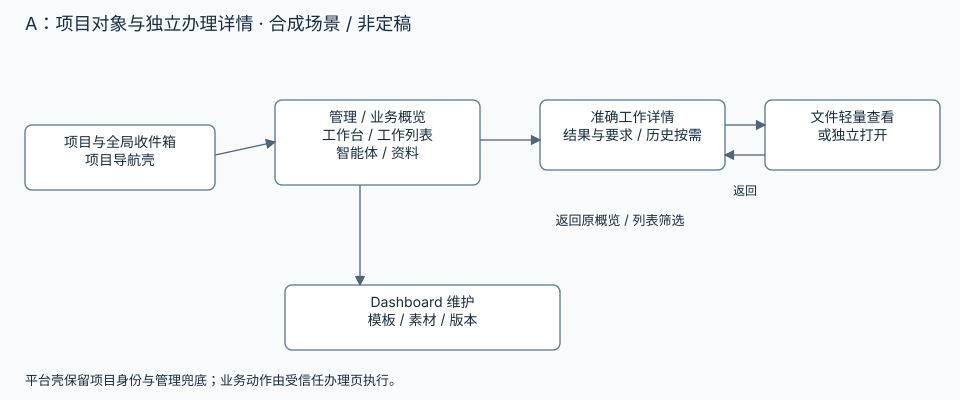

<details>
<summary>页面关系图可编辑 Mermaid 源</summary>

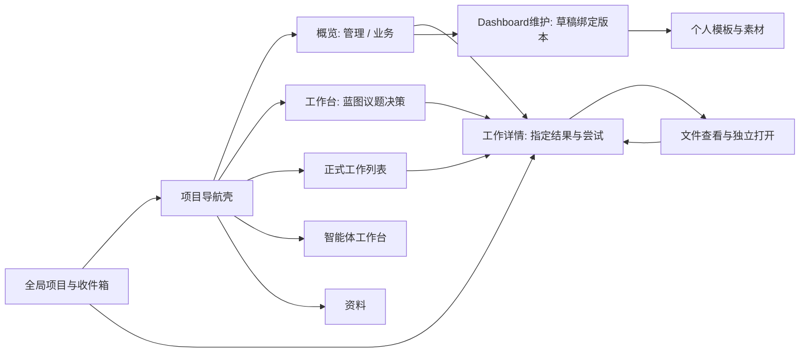

</details>

```text
A / 管理概览                         A / 工作详情
[项目 A · 标签] [收件箱]              [项目 A / 工作 12 供应商比较] [返回管理概览]
[概览 工作台 工作 智能体 资料]        [当前办理 R3 · 人工交付 · 要求 v2 / 当前 v2一致]
[管理 | 业务: 采购观察] [维护]        摘要：比较完成，缺一年度数据
读取时间/统计时区  [新建工作]         验收条件摘要 [提交时全文] [对照当前要求]
待治理 | 工作进展 | 待验收 | 最新异常  交付文件 2份 [快速查看] [独立打开]
待验收行：工作标题/结果摘要/时间      [意见输入] [不接受] [接受] [接受并完成]
[按需: 关系图 决策 蓝图 汇报]         [其他结果与尝试] [来源与历史] [设置]
```

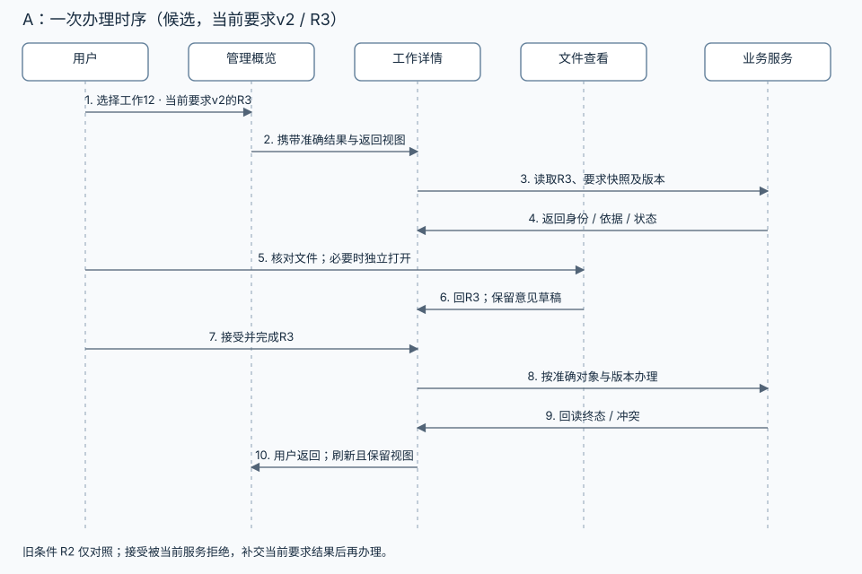

<details>
<summary>办理时序可编辑 Mermaid 源</summary>

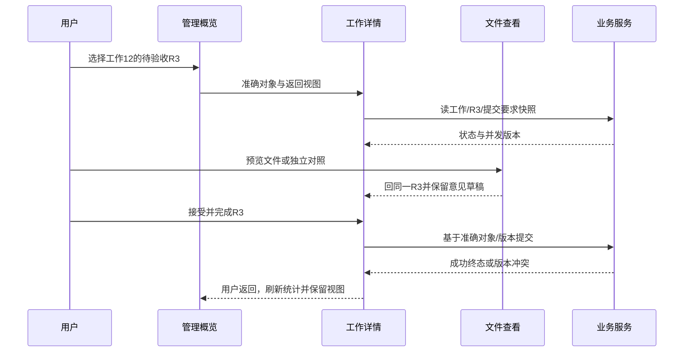

</details>

主时序选取按当前要求 v2 提交的 R3。旧条件 R2 用于对照：现行服务拒绝接受旧要求结果，需要补交当前要求下的新结果；本页不提议解除该 guard。成功后用户看见终态和已接受依据再返回；冲突时保留输入并展示新旧差异，重新明确当前动作；文件失败不替用户验收。优点是准确深链、长条件与复杂证据空间充足、现有独立路由可渐进迁移。反对证据是批量短事项的往返较多，个人多项目使用可能偏爱队列；第 7 节直接比较这些任务，不能只用单结果成功支持 A。

### 4.2 B：跨项目处理队列为主，列表与详情并置

全局“我的处理”按业务阶段和项目筛选，项目页作为队列的局部视图。默认在队列旁边打开办理详情，继续下一项无需离开列表；长内容可提升全页，窄屏直接路由详情。管理/业务视图仍可进入，但日常起点是注意力队列。工作台与智能体工作台各有完整页，避免把治理和日志塞进队列。

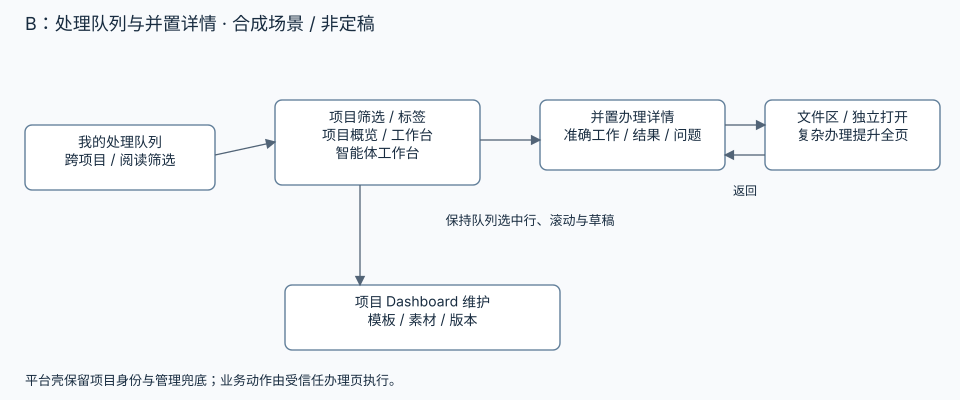

<details>
<summary>页面关系图可编辑 Mermaid 源</summary>

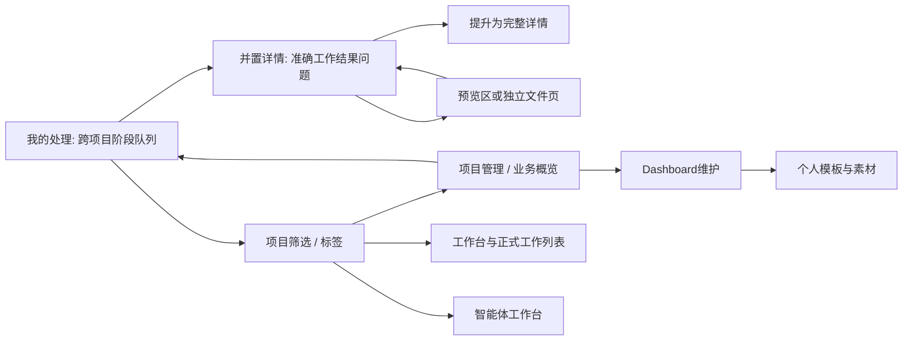

</details>

```text
B / 我的处理
[全部项目 v] [标签] [业务阶段: 待验收 / 待人答复 / 已答未恢复] [阅读筛选]
列表（保留滚动）          | 当前详情（固定身份）             | 文件查看（按需）
A · 供应商比较 · R3 选中 | 项目A / 工作12 / R3 / 要求v2     | report.md
B · 数据补充 · Q1        | 摘要、条件入口、文件清单         | 关闭→原办理
A · 已答未恢复 Q3        | [意见] [不接受][接受][接受完成]   | [独立打开]
[新建工作→选择项目]      | [全页查看][历史/设置]             |
项目观察页: [管理 | 业务] + [回我的处理] + [工作台/智能体/维护]
```

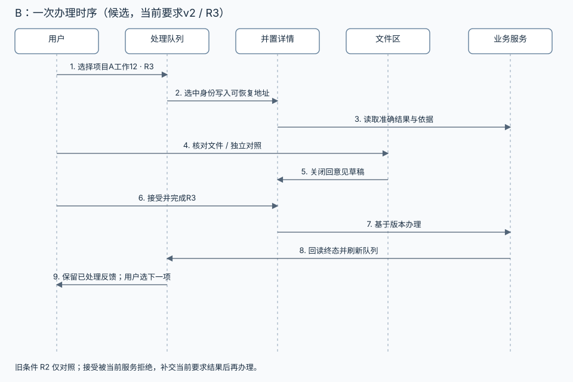

<details>
<summary>办理时序可编辑 Mermaid 源</summary>

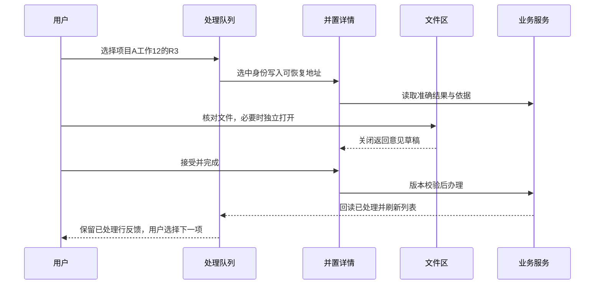

</details>

优点是跨项目高频短办理、密集列表、批量比较效率高。代价是队列语义和权威对象状态需要后端支持，当前阅读文件夹不能直接升级为完整业务队列；三列压缩长条件，项目归属易混淆，返回/草稿/多结果与选中状态增加维护成本。反对证据是若主要活动为项目内长文判断，队列优势不足以承担新聚合与布局成本。

### 4.3 C：观察工作区与办理工作区显式分开

项目顶层提供“观察”和“工作”两个模式。观察工作区容纳管理概览及专属业务图墙，适合日常巡看或全屏展示；所有办理落在工作工作区，那里以工作台/工作/收件箱/智能体组织执行。点击图墙指标打开带来源说明的办理页；返回明确回到原观察画面。两个模式共享项目身份，不建立两份业务状态。

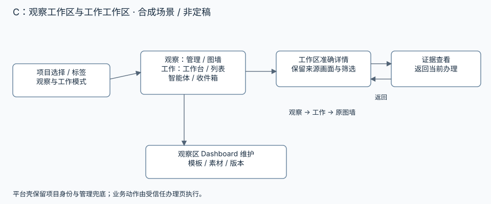

<details>
<summary>页面关系图可编辑 Mermaid 源</summary>

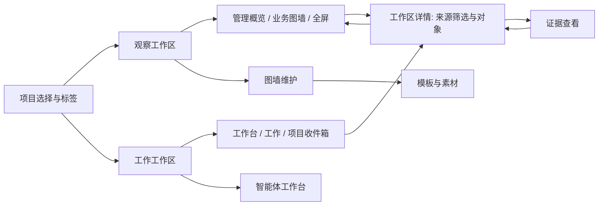

</details>

```text
C / 观察                                  C / 工作
[项目 A] [观察 | 工作] [全局收件箱]        [项目 A] [观察 | 工作]
[管理 | 业务采购图墙] [全屏] [维护]        [工作台 工作 收件箱 智能体 资料]
核心指标/趋势/分区数据时间                 [来自采购图墙: 本月待验收 / 返回该画面]
需关注：工作12 R3 [进入办理]               工作12 供应商比较 · R3 · 要求v2
空/错/旧值提示独立于管理兜底               摘要/条件/文件/意见/办理
[进入工作: 新建工作 / 研讨 / 智能体]       [证据预览] [历史/设置]
```

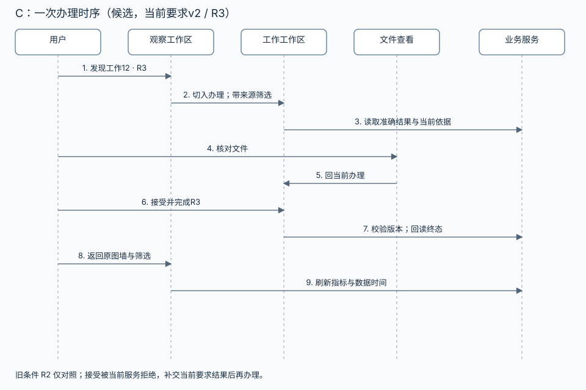

<details>
<summary>办理时序可编辑 Mermaid 源</summary>

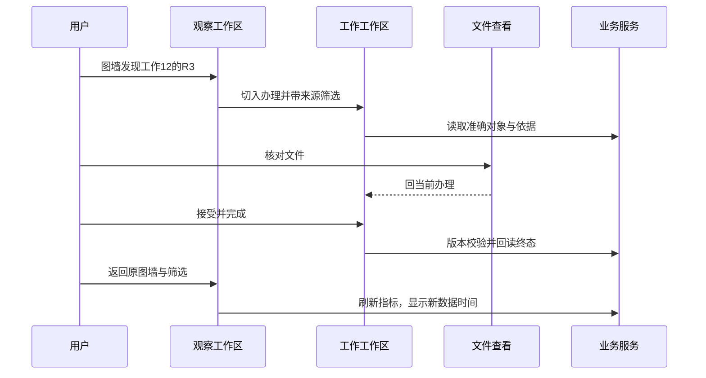

</details>

优点是观察与动作界限明显，图墙表达空间大，未来展示屏和多人分工有余地。代价是项目模式增加一步认知切换；工作台、收件箱和图墙各有返回上下文，维护成本较高。个人独立事项不能被迫先进入观察模式。反对证据是若全屏业务观察频率低，模式层会重于需求；可把全屏作为 A 的展示能力而不采用 C 的整个导航架构。

### 4.4 九个场景的同尺度路径比较

| 场景 | A 项目对象 | B 处理队列 | C 观察/工作 |
| --- | --- | --- | --- |
| 打开项目 | 项目→管理/上次业务视图；工作和维护同壳 | 项目筛选→本项目待处理；概览旁路 | 项目→观察或上次模式；显式进入工作 |
| 人工独立事项 | 壳/工作列表新建→详情交付→返回列表 | 队列新建选项目→并置详情→原队列 | 工作模式新建→详情→工作列表 |
| 研讨到执行 | 工作台→决策采用版→工作详情；回来源 | 工作台生成正式工作→队列；详情打开依据，回选中行 | 工作模式研讨→工作；观察显示关系，办理回工作 |
| 交付验收 | 概览/列表→准确全页结果→组合文件查看→原详情→概览 | 队列→选中结果/并置证据→原行→下一项；复杂内容提升全页 | 观察异常/交付→工作详情→证据→回工作/原图墙 |
| 跨项目收件箱 | 全局 Inbox→准确对象详情→原阶段筛选 | Inbox 是队列阅读维度；业务阶段为主→并置→原行 | 全局 Inbox→工作模式对象；回跨项目 Inbox |
| 智能体执行 | 项目智能体入口→准确尝试/求助→工作或问题 | 人需介入进队列→准确处理者；详细执行打开智能体页 | 工作模式智能体→运行/问题；观察只显示摘要 |
| 项目业务大屏 | 概览业务页→过滤/钻取→对象详情→原业务页 | 项目概览→图墙→目标列表队列→详情→图墙 | 观察业务图墙→工作明细/详情→回原观察 |
| 智能体维护大屏 | 维护→草稿/绑定/验证/版本；启用后回概览 | 项目概览维护→同一维护页；队列接失败需人介入 | 观察维护→草稿工作页→验证启用→观察 |
| 模板复用 | 维护选择个人模板→项目派生与独立绑定 | 项目页维护派生；队列不拥有模板/数据 | 观察维护派生→绑定→验证；实例版本留项目 |

### 4.5 代价比较与暂定选择

| 维度 | A | B | C |
| --- | --- | --- | --- |
| 发现入口 | 稳定项目入口贴近日常对象；全局注意力仍可达 | 高频处理发现最好；项目全貌要另进入 | 观察入口突出；创建工作的模式切换需学习 |
| 切换次数 | 简单单项有全页往返；复杂判断无需提升 | 简单连续事项最少；长文/窄屏需提升详情 | 观察→工作→观察跨模式；连续工作在工作内完成 |
| 上下文保持 | 身份/结果深链稳定；需保留返回筛选/草稿 | 列表位置直观；多列身份与请求竞争风险最大 | 来源画面明确；模式/过滤/对象三层状态需维护 |
| 后续多人余地 | 对象与角色分工自然，可增权限展示 | 聚合需可见性/处理者查询，可扩展但代价较早 | 展示与执行分工清楚，易出现重复入口 |
| 密集信息 | 列表摘要+全页证据适合复杂交付 | 密集队列好，证据受横向空间限制 | 图墙密度高，工作页另处理长证据 |
| 移动端 | 单列路由详情适用；导航折叠 | 多列降为列表→详情，连续感变弱 | 两模式移动仍有额外入口层 |
| 迁移成本 | 低至中：沿现有路由逐步重排 | 高：新增聚合阶段、共享详情、选择状态 | 中至高：新模式壳和返回模型 |
| 维护成本 | 中：对象页与返回约定集中 | 高：聚合/并置/全页等价、草稿与实时列表 | 中至高：模式连续性、图墙与工作双入口 |

暂选 A 作为产品骨架，保留 B 的全局业务注意力入口和轻量查看研究，保留 C 的业务图墙全屏展示。这里借用的是明确局部能力，各页唯一职责仍按第 2 节；不建立三套并行详情或三个主导航。B 未作为骨架的原因是长证据与当前聚合契约成本；C 未作为骨架的原因是个人日常操作的模式负担。若原型中跨项目短处理占主要使用、B 在不误判对象的条件下明显减少中断，则转向 B；若业务图墙巡看成为首要活动且模式切换易理解，则重新评估 C。

### 4.6 文件查看：先给组合方案，再讨论分歧

“页内还是新标签”把不同文件和不同判断压成一个偏好问题。推荐工作详情保留文件清单、证据身份和办理上下文，按类型提供轻量查看与独立打开。当前单 Markdown 新标签返回已验证，后续增量沿此兜底；本轮未确认预览方式。现有预览基础的只读补充证据见 U0/U1 第 6 节。

| 文件/任务 | 候选默认与可选 | 支持边界/失败行为 |
| --- | --- | --- |
| 短 Markdown/文本、图片 | 详情旁/下方只读轻量预览；可全屏或独立打开 | 保留结果身份和文件名；清洗内容、限制读取体积；失败显示原因与下载/独立打开，不显示假全文 |
| PDF | 复用平台 PDF 查看能力，长页可独立打开与条件并排 | 载入/页数/错误明确；不把浏览器自带 PDF 行为当所有设备一致 |
| 长文对照、多份文件 | 用户主动独立打开；原详情意见草稿保留，文件页显示返回准确结果入口 | 不强行三列；文件读取需要同一可见性检查，返回信息不包含敏感正文 |
| 大文件、不支持格式、Office 转换失败 | 元信息+下载/独立查看能力说明 | 大小阈值经试验确定；当前支持范围由 owning 文件接口决定，不承诺浏览器直接全格式编辑 |
| 窄屏 | 轻量查看进入独立的只读查看层/页面，明确“返回此结果” | 屏幕内身份连续，返回恢复选中结果和意见；不把固定按钮盖住正文 |
| 历史交付路径已被改写或删除 | 显示“当前文件/历史内容未证明”与不可用状态 | 后续决定是否保存不可变证据；未有快照前不能把可变路径称提交时全文 |

下一轮关注的是用户能否准确对照和回来，而不是选一个全局打开偏好。若轻量查看持续压缩条件或掩盖证据版本，默认改为独立查看；两种出口仍共用同一结果/文件身份。

## 5. Dashboard 能力候选：按维度独立比较

当前静态能力的业务理由、Owner 和替换条件见 [Dashboard Feature](../../develop-guides/yuanlei/features/project-dashboard.md)，实现事实见 U0/U1 第 3、6 节。动态路线涉及新边界，需要后续 Feature/Decision 和真实验证；本页不修改现行静态契约。管理概览直接读平台正式事实，业务大屏读其声明的项目业务源；两者共用平台入口和错误表达，保留各自指标语义。

### 5.1 渲染路线

| 维度 | R1 受控定义 + 可信 Vue 组件 | R2 生成 Vue 代码，经构建和隔离加载 | R3 静态快照 + 平台受控导航 |
| --- | --- | --- | --- |
| 创作/自由度 | 智能体选择已知素材、布局、受限样式、输入绑定；复杂新表现由开发加入可信组件 | 智能体写页面代码，表达力与布局自由最高；受构建依赖/隔离协议约束 | 智能体生成 HTML/CSS 或图片快照；视觉自由高，交互能力有限 |
| 图墙表现 | 常用指标/趋势/表格/关系/筛选可组合；特殊动画/自定义图形受素材范围限制 | 可做专属图墙和复杂交互，窄屏/主题/无障碍易漂移 | 适合定期报告和展示快照；大量数据或即时筛选需重新生成 |
| 验证 | 结构、输入、布局、对象引用可静态检查；仍需真实数据/渲染验证 | 编译成功只证语法；需产物审查、隔离/网络/资源负向试验及数据权限测试 | 现有静态策略/hash 可继承；快照时间、口径与导航仍需验证 |
| 依赖/维护 | 平台维护有限组件与定义版本；不能演成任意代码 DSL | 依赖固定、构建可重现、包安全与运行时版本维护成本最高 | 成本低、兼容现状；频繁重生成易过期、结构复用弱 |
| 动态数据 | 可信宿主按输入契约受控读取，组件不自拼业务状态 | 经单独加载/数据代理契约，生成页面无平台凭据；私有数据开放需证明新边界 | 服务生成时取数，快照标截至/生成时间；平台壳提供刷新/导航 |
| 失败/退路 | 非法定义拒绝进入草稿验证；组件失败局部告警、平台导航继续 | 构建/验证失败不启用；崩溃可回上一稳定版/管理概览 | 缺失/失配保留 repair_required 与管理入口；快照过期明确 |
| 第一轮研究定位 | 暂定主要路线，首个图墙表达力必须实证 | 表达力替代路线，先合成或公开数据隔离试验 | 保留兼容、导出和低频展示；不作为未来全部 Dashboard 上限 |

R1 的“受控定义”仅指有限、类型化组件输入、布局和对象意图；不接受 JavaScript 字符串、任意 Vue template、事件回调、任意 CSS/URL 或完整图表 option 注入。哪些组件必要由第 7 节一个业务场景决定；定义格式、组件库、图表封装尚未选。复杂计算由有真实 consumer 的 owning 服务或有限经审阅映射完成，不预建通用公式语言。

R2 需比较独立 origin 的构建产物、受限脚本 iframe 与宿主通信，具体方式未定。生成代码不在主应用编译/执行，不持有 session、SQL、文件路径或连接凭据。消息身份、来源窗口、加载版本、可用数据和导航意图必须绑定当前实例；数据代理只提供已声明的只读能力。CSP/无同源并不自动证明私有数据无法外流，导航、网络、下载、资源耗尽和跨项目请求都需负向验证。现行 Feature 明确禁止脚本 bridge 授予私有数据，本轮不推翻；验证未闭合前 R2 只用合成/公开数据，若无法达成边界则保持 R1/R3。

R3 的平台导航放在可信壳或由可信映射生成的入口，当前静态页内部链接限制继续有效。快照携带数据截至时间和生成时间，不能把页面刚加载当数据刚更新；静态 HTML 是现状和一种用途，未来动态业务能力由 R1/R2 契约建设获得。

### 5.2 数据、刷新和准确导航

所有路线先有数据语义，后有渲染。最小数据契约候选包含源标识、字段/类型/单位、统计时区与覆盖范围、观测截至时间、取得时间、刷新方式、缺数/失败表达，以及可钻取对象。管理 board 的工作/结果/异常口径沿 owning service；新业务源由对应服务拥有，图形不重新定义状态。

| 环节 | R1 | R2 | R3 |
| --- | --- | --- | --- |
| 当前项目读取 | 可信宿主把当前项目与已声明绑定传到受控接口；后端从认证和项目可见性执行权限 | 隔离页面向宿主请求有限源/参数；宿主调用后端，页面不决定可访问项目 | 受控生成服务/根运行取数据生成快照，查看仍检查项目可见性 |
| 刷新 | 明确手动刷新和各源策略；可研究定时更新，显示旧数据与更新时间 | 同一代理契约，不能代码任意请求网络；限制频率/数据体积需有样本依据 | 重新生成得到新快照，旧版保留截至时间；加载页不自动成为重新生成 |
| 数据失败 | 分区标缺失/过期/错误；有旧值时注明旧值时间 | 代理返回结构化失败，页面渲染异常由壳接管恢复入口 | 全生成失败保留旧快照并显式过期；没有成功旧版显示缺数 |
| 导航 | 类型化对象引用由平台解析当前项目内工作/结果/决策/运行，检查归属与存在 | 发送有限导航意图，不开放任意目标 URL、表单或写 API | 快照对象引用由可信壳呈现/解析，无法动态核查的正文声明快照范围 |

数据绑定是项目实例对源输入的选择，不是授予源权限。模板可声明“工作状态计数”“采购月表”等输入，不能嵌入项目 ID、连接口令、业务行或任意 SQL。后端依赖和 repository 可见性最终拒绝越界；前端隐藏字段、项目变量或模型 prompt 不承担授权。精确结果引用必须校验结果属于目标工作/项目；不存在/权限丢失时给明确失效反馈，保留返回入口。

钻取分两种：业务对象跳转到准确工作/结果/运行；业务数据明细携带所选时间/分类到只读表。管理概览与业务源异步更新时分别显示时间，不合成一个“全屏实时”的标记。业务截止日期是否使用项目时区仍需真实样本研究，现有 UTC 逾期口径不在原型中偷偷改掉。

### 5.3 素材、模板、项目实例与运行时

| 对象 | 拥有内容（候选） | 不同对象的联系 |
| --- | --- | --- |
| 素材 | 平台可信组件/图形样式、输入示例、主题/窄屏支持、运行时兼容版本 | 智能体可按用途/输入类型发现；第一版只收首场景实际用到的素材，不做市场 |
| 模板 | 布局/素材引用、输入契约、默认样式、导航意图、版本与适用说明；测试示例显式为合成 | 内置模板随受信任发布版本；个人模板供同一人跨项目复用，提取去掉项目数据/凭据 |
| 项目实例 | 模板来源/固定版本、项目专属调整、绑定、草稿及启用历史 | 两个项目派生后各自有修订；模板更新提供差异与兼容检查，不自动覆盖 |
| 项目数据 | 平台事实、项目文件/文档或受控业务源；时间/口径/权限 | 输入匹配不复制源数据进结构模板；凭据留连接 Owner |
| 运行时 | 可信组件及定义版本兼容、加载/数据/导航协议 | 验证兼容才启用；运行时升级需保证旧实例可读或明确迁移/回退 |

研究三个复用策略：复制完整结构容易理解但丢来源和升级依据；实时共享结构减少副本却把模板修改传播给全部项目；固定模板版本派生实例保留来源、独立调整/绑定，升级有成本却最符合当前个人跨项目需要。暂选第三种；未实现通用合并算法，结构有冲突时展示差异并重新派生/人工或智能体明确合并。

示例（合成）：个人“采购观察 v1”声明月份、金额、供应商输入；项目 A 绑定 A 的数据源，B 绑定 B 的数据源，各自启用实例版本 1。模板 v2 增加同比输入，A 有数据可草稿升级，B 缺基期继续 v1。A 的专属展示提取为个人模板时仅复制结构和输入契约，清掉 A 的数据值、对象身份、绑定与凭据；新项目重新绑定。绑定缺失不展示来自 A 的旧数字。

### 5.4 存储与版本权威

| 方案 | 字节、定义、版本、绑定的 Owner | 代价、兼容与适用 |
| --- | --- | --- |
| S1 当前项目目录过渡 | Workdir 保存 HTML/定义/素材字节，PostgreSQL 索引当前 revision/hash；绑定需要明确集中元数据或受版本文件，不能两份都编辑 | 沿现状快；文件与数据库不联合原子，修复/扫描/跨项目检索和历史回退复杂。适合静态兼容与小规模试验，不能仅文件存在就启用 |
| S2 集中小定义/绑定 + 外部资产（暂定） | yuanlei 域保存有界定义、版本、项目绑定、验证结果、启用指针；图片/PDF/构建包等字节留 owning 文件/对象服务，记录受控引用/指纹 | 事务闭合版本与绑定/指针；需 schema 迁移、旧实例兼容和资产完整性/清理策略。第一版可继续现有文件 Owner，不必立即引入新对象系统 |
| S3 版本化包/目录 + 集中索引 | 不可变包拥有结构与素材版本；数据库拥有可见性、项目绑定/启用指针与包引用 | 适合 R2 依赖产物和复杂模板分发；manifest、构建、验证、完整性、垃圾清理成本高，简单定义不必先打包 |

暂定 R1 用 S2、R2 试验用 S3 产物、R3 保留 S1 读路径。不会把当前命名 JSON 的存在当已完成存储架构；复用它必须验证大小/类型/事务和版本 consumer，不能绕开迁移与领域约束。新增持久结构只进 yuanlei 域并按仓库规则升级版本。

启用候选采用“资产先准备/校验可读，事务切换到完整版本”的方式，避免先切指针再写文件；资产写失败/指纹不符则不启用。数据库与文件仍非联合事务，需崩溃点验证、旧版保留和显式修复。旧静态 Workdir 页面读取不立即批量迁移，先区分静态实例与定义实例，保留 revision/hash/repair 行为；迁移失败继续读兼容路径，不以空默认页冒充已迁移内容。

### 5.5 智能体维护：输入演进与可观察生命周期

当前工具只在活跃根项目 Run 授权内读写静态页，子执行者不能直接读写；下一阶段研究新增能力，保留现有工具契约或明确新增有类型工具，不能把 dashboard_write 的 HTML 输入悄然改为任意代码。工具先让智能体读启用版本、模板/素材输入说明、绑定健康和项目范围；再形成草稿、提交验证、查询结果、按策略启用/回退。精确工具名称与数量在真实 consumer 验证后决定。

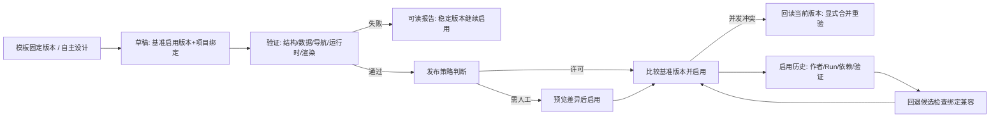

每份草稿绑定起始启用版本和自身修订，验证报告绑定完整定义/素材/输入契约版本及校验的数据快照。验证到启用期间源数据可变化，启用重新检查授权、引用有效性、兼容性与基准版本；正常数据刷新不要求重新发布结构。动态数据更新失败保留旧值并标时间，不能自动使“验证通过”变成新数据正确的承诺。

两个根运行或人/智能体竞争更新时，只有基于当前基准的一个切换成功；失败方回读差异，保留草稿，重新合并并验证，不盲重试覆盖。验证失败不替换当前启用实例。回退创建一次新的启用记录，指向仍可读且绑定/运行时兼容的历史版本；不能降低并发修订号，也不能回退业务数据或恢复已撤授权。历史版本不可用时保留当前可用版本或默认管理入口，说明失败。

子智能体生成草稿建议可由根项目智能体接收并提交验证；是否提供受控读取需要独立作用域决定，现有根限制不因创作协作自动解除。UI 分开“草稿修订”“启用版本”“数据更新时间”；人工验收结果状态与 Dashboard 发布验证状态各由其 Owner 管理。

### 5.6 发布方式：自主维护与许可边界

| 发布策略 | 具体操作例与收益 | 代价/边界 | 建议位置 |
| --- | --- | --- | --- |
| P1 人预览启用 | 新专属图墙生成草稿，用户看差异/缺数/验证再点启用 | 首次确认直观；每次小改都确认会削弱自主维护 | 首次未知结构、新源、新依赖与 R2 私有数据边界的研究起点 |
| P2 明确配置的项目自动启用 | 用户为某项目配置允许的素材/来源/变化范围；智能体更新布局或趋势视图，验证通过且 CAS 成功即启用 | 配置需易理解、可撤销；扩大数据源/可执行能力或范围外变化保持草稿并说明原因 | 自主维护主方向，许可机制以当前有限 consumer 定义，不先造任意策略引擎 |
| P3 可信模板有限自动启用 | 首次选可信模板并完成项目绑定；兼容且在约定变化范围的后续修订可自动启用 | 信任模板不授权任意项目数据；模板大版本/新输入不自动替换，个人修改不能沿用原可信身份 | P2 的较小边界，可作为第一轮自动启用试验 |

暂定组合是首次明确选择/绑定，随后在明确范围内自动维护；超出范围进入可审阅草稿。这不是每次都人工审批，也不是任何生成结果立即上线。普通数据刷新属于读取，不属于模板结构启用。策略说明应以“允许改布局/既有输入；新增来源需预览”等用户可理解范围表达，具体授权对象与撤销事务由后续 Decision 闭合。

必要轻操作可研究“刷新、筛选、展开、复制对象链接”等观察动作。验收、正式批准、删除和修改工作仍进入业务办理页；任何大屏快捷业务写动作另有明确 consumer、权限与负向验证。本轮没有授权此类实现。

## 6. 推荐组合、淘汰理由与改变推荐的证据

信息架构 A 与 R1/S2/P2-P3 是可分别调整的暂定推荐。它使项目内的日常动作沿现有对象路由收敛，动态能力由可信宿主消费受控定义，项目绑定与启用版本集中管理；同时保留静态兼容和明确自动维护。B 的注意力聚合与 C 的全屏表达分别作为局部能力验证，不先实现两套重复入口。

| 暂定推荐 | 依据 | 放弃作为主路线的替代及原因 | 会推翻推荐的证据 |
| --- | --- | --- | --- |
| A 稳定项目壳 + 完整办理详情 | 当前独立路由/准确结果锚点可沿用；长条件/多证据需要完整空间；个人扁平项目不需模式层 | B 主队列需较早新增真实阶段聚合且并置压缩证据；C 主模式增加工作入口认知层 | 同尺度原型中 B 显著减少跨项目中断且不误判身份/依据；或 C 的观察成为主要日常活动且工作可发现 |
| 管理/业务视图切换 + 管理兜底 | 当前自定义内容替换展示，完整错误兜底尚缺；平台导航不应依赖生成内容 | 只留自定义首页会失去默认管理价值；把所有卡片与表单搬进图墙会混淆职责 | 两类视图长期几乎完全重叠，应研究合并展示但保持数据 Owner；不能用隐藏兜底提高简洁评分 |
| 组合文件查看 | 已有独立打开成功与平台预览组件基础；不同文件有不同空间/对照需求 | 全部内嵌容易挤压条件；全部新页增加短文件中断 | 多结果/窄屏测试中轻量预览导致持续误判或草稿丢失，改独立查看为默认 |
| R1 主要动态路线 | 可验证的有限输入与可信 Vue 消费，适配现有栈 | R2 早期构建/私有数据隔离成本高；R3 单独不能支持动态筛选/即时钻取 | 用首图墙仍需大量特殊组件或表达关键关系失败；R2 实测自由度收益明显并闭合边界，可局部引入 |
| S2 定义/绑定/指针集中、资产分开 | 版本和绑定可事务一致，个人跨项目索引与升级更清楚 | S1 全目录权威增加检索/修复/历史成本；S3 对小定义过重 | 真实定义包含大规模自定义产物需包分发，改 S3；现有 JSON 已能满足真实事务/版本要求则缩小新持久化 |
| 固定模板版本派生 + 显式兼容升级 | 双项目结构可复用、数据不共享、升级不会静默传播 | 复制失来源；实时引用给两个项目同时带来变更 | 真实模板仅展示样式且消费者明确接受联动，允许有限共享素材更新；数据绑定仍独立 |
| 首次选择后有限自动启用 | 满足自主维护，校验失败/CAS冲突仍保留旧版 | 全人工阻断小改；全自动无法说明数据/依赖权限范围 | 范围无法被用户理解/验证或误分类风险不可控，收窄到 P3；重复人工确认成本高则完善有限范围而非放开全部 |

建议默认管理概览先展示分开的四组摘要及可行动条目，工作标题优先，结果摘要/时间次层，关系图与治理历史按需。这是原型起点；具体首屏数量、图的默认展开、密度和视觉样式尚未定。管理页应与专属图墙同等打磨主题/窄屏/加载，不能成为临时占位页。

本轮无须用户继续回答局部偏好即可完成比较或进入下一轮原型准备。尚需业务样本来判断经营指标/时区和自动启用的实际范围；未提供时采用第 7 节合成案例，不阻塞 IA 原型。实际业务数据接入、自动发布配置、U4 正式定案与产品实现仍须相应阶段授权；本轮没有用研究推荐替代这些决定。

## 7. 按依赖推进的建设增量与下一轮原型

以下是 U3 试验→U4 定案→分批建设安排，不是本轮实现承诺。每个增量以用户结果验收，失败可退回研究；产品代码变更需按仓库规范独立审查、记录 Decision/Feature 和相称测试。视觉研究与数据契约可并行，动态加载和启用实现必须等边界试验。

| 增量/用户得到什么 | 现有页/服务/工具与实现约束 | 前置与兼容边界 | 验证方式及失败退路 |
| --- | --- | --- | --- |
| I0 职责与稳定入口：项目内直接到工作/维护，管理页始终可达 | router/项目导航/ProjectDashboardView/工作台；稳定壳不依赖 iframe；明确自定义加载失败与空状态 | U3 A/B/C 入口比较后 U4 选定骨架；保留现有 URL/准确深链和扁平项目 | 入口原型首次找任务与维护、窄屏/错误；后续 lint+相关 unit/build+真实 DOM；若壳拥挤先缩首层导航，沿旧路由兼容，不同时重写数据 |
| I1 关键办理与默认管理：看准结果、条件、文件、动作，再回概览 | WorkTaskView/WorkResultsPanel/DefaultProjectDashboard/inspection_board_service；复用预览与选择器先校验文件边界；要求修订/结果/运行分别表达 | I0 的身份/返回约定；保留历史快照、准确锚点、接受与接受完成语义；不新增模板系统作为前置 | 多结果/旧条件/失败尝试/窄屏原型；实现阶段真实 HTTP+浏览器回读终态、冲突/失效证据负向；预览失败保留独立打开，图密度失败改按需明细 |
| I2 一屏业务验证数据/导航：指标可信、能钻到准确对象 | 一个 owning 业务读取服务 + Dashboard 平台宿主；R1 有限组件原型，沿权限 repository；管理 board 口径保留 | I0；真实/合成源身份与时间契约先齐；不接未知凭据，不开放任意 SQL/网络；不解禁静态 iframe | 真实 HTTP 可见/不可见项目、错误结果归属、部分失败/刷新；真实 DOM 比对源值与时间、准确对象；表达力失败做 R2 合成隔离 spike，仍不接私有数据 |
| I3 模板派生与根智能体草稿：两项目独立、维护不覆盖稳定页 | Dashboard/文档 service 与 repository、根工具、维护页；集中定义/绑定/启用，CAS/有界输入与审计 | I2 的输入、导航、加载/版本兼容契约；新增 schema 仅 yuanlei；旧 HTML reader/tool 兼容；先一模板与两实例 | PG/HTTP/worker E2E 回读草稿与启用指针、同基准双写、验证失败、资产缺失/崩溃与回退；失败保留旧版与草稿，不自动重试覆盖 |
| I4 有限自动启用：日常小改可自主维护，越界留下可审阅草稿 | 根工具/发布 Owner、项目配置/验证报告 UI；明确许可/撤销，P3 优先有限场景；刷新与发布分开 | I3；C 系列若提供授权主体能力可复用真实边界，不能借角色名称假授权；子执行者仅提建议 | 策略可理解原型；撤销/新增源/依赖变化/竞争更新负向 E2E；误分类则收窄 P3 或该次 P1，解释原因，不全部回退到永久人工审批 |
| I5 扩充素材/个人模板管理：发现、复用、升级与纯结构提取 | 素材输入文档/版本目录、模板索引、项目维护；只补实际重复用途 | I2-I4 至少一场景闭环；同一人及内置共享，无跨用户发布；固定版本实例继续可读 | A/B 两项目升级/不升级、缺绑定、提取去业务数据/凭据、运行时兼容；需求不足保留内置选择与当前实例，不先建设市场 |

I0 的导航视觉、I1 的详情/概览线框、I2 的数据口径研究可并行。文件预览适配在 I1 内进行，与渲染路线无强绑定；收件箱/智能体工作台外观可并行，但“已答复未恢复、直接处理者、逐级求助”的真实字段与操作需等待 C2/C3 契约，未准备时只展示现有状态并标能力限制。I3 依赖 I2 的加载/数据/导航契约；I4 依赖 I3 的版本/验证和发布边界；I5 依赖实际复用需求。R2 隔离试验可与 R1 表达力比较并行，公开/合成数据范围不影响主路径。

### 7.1 下一轮原型包与明确数据

下一轮先交一组可交互的局部原型，A/B/C 共用数据与任务。先完成静态页面/跳转/状态模拟以检验职责和连续性，再做 R1 小数据源原型；不得将模拟数据接入生产项目。原型显示“合成数据 · 非业务记录”，原 U0/U1 人工样本仅作只读事实对照，未经新授权不再办理。

| 原型包 | 明确场景/数据 | 要验证的不确定性 | 观察与推翻标准 |
| --- | --- | --- | --- |
| P-A 入口与注意力 | 合成项目 A/B、扁平标签；A 有 8 项工作、3 份待验收涉及 2 项工作、1 最新异常；B 有已读未答 Q1 和已答未恢复 Q2。A/B/C 相同数据 | 首次打开先看什么、独立人工事项创建入口、从业务图墙返回工作/维护；A 相对 B/C 是否过重 | 不讲解让用户找“新建独立工作”“项目维护”“已答未恢复”。记录首次错误入口、停顿、项目身份误认与切换；A 连续短办理明显中断而 B 无判断损失，则改骨架推荐 |
| P-B 多结果办理 | 工作“供应商比较”：要求 v1→v2；R1 旧要求已拒、R2 按 v1 待验、R3 按 v2 待验；一个失败尝试无正式结果。2 份 MD、1 张图片、PDF 12 页，长条件；失效文件另分支 | 五项信息可取得、准确结果/要求/尝试定位、轻量查看与独立对照、意见草稿及返回 | 任务“判断 R2 是否符合其提交依据，比较当前条件，再办理 R3”。选错结果/把失败当交付/把当前文件当历史全文是关键失败；持续失误则改身份层级/默认查看，不只增按钮 |
| P-C 业务屏与数据 | 合成采购月数据 A/B 独立：金额单位元、含税口径、Asia/Shanghai 月窗；示例数据截至 2026-09-30，取得时间另列；B 缺基期，A 一源过期、一源超时；图表点可钻工作或明细 | R1 是否表达采购图墙关键比较；缺数/0/旧值、时区、刷新与导航是否可信 | 用户说出数字含义和时间、指出不可比项、从图找准确对象。若素材拼装无法表达关键关系/需大量专属代码，增加 R2 比较；数据含义看不懂先改口径/标注而非渲染库 |
| P-D 派生与自主维护 | 同一模板 v1→A/B；v2 新增同比输入，A 可升级、B 缺数；两草稿同基准；验证失败、范围内自动启用、范围外新增源、回退旧版绑定不兼容 | 版本/绑定/草稿/启用能否分辨；固定派生是否容易理解；发布许可范围是否可判断 | 用户预测“改模板会不会改变 B”“谁的草稿会启用”“验证失败现在看什么”；无法理解范围或错误启用风险则收窄自动策略/简化版本展示，不删除并发验证 |

P-A/P-B 各先在宽屏跑主任务，然后在窄屏与暗色复查关键任务；P-C/P-D 包含空/加载/错/过期/密集状态，不要求用户陪同点击所有组合。分析者先自行检查焦点、滚动、长标题、对比度、数据口径和可返回性，再与用户讨论真正影响方向的观察。点击数只记录路由切换和打开层级，正确定位、依据核对及判断质量是首要证据；不以没有可比实测的评分包装优劣。

### 7.2 从原型到真实验证的出口

原型结果保存场景、数据标识、观察、推荐变化和未验范围；选骨架与契约后在 U4 记录 proposed→正式 Decision，真实实现更新 Dashboard Feature 与相关 Owner。首个真实业务样本再核对源数据、时区/刷新频率、权限和钻取对象；收件箱/自动交付待 C3 提供真实链路，单列协议/数据库/DOM 回读。真实访问条件不足只阻塞对应验证，其余原型继续。

达到“入口可发现、准确依据不误判、R1 表达力可用、草稿/启用/绑定可分辨”才进入相应建设；不要求所有未知先全部清零，也不以一轮原型代替整项专项。若某条未通过，缩小该增量、保留兼容入口并回到问题层修正，继续其他独立增量。

## 8. 专项自查与文档验证

内容自查：两条主线分别有页面职责和能力比较；九场景共用数据需求/未验范围，三候选使用同尺度路径、关系图、关键线框与办理时序；推荐有源码/观察/参考支撑和反对证据；渲染、数据、存储、复用、发布可独立调整；每项增量有前置/验证/退路；下一轮原型有合成数据、不确定性和推翻条件。已确认信息要求与未确认布局/技术分开，单结果人工测试范围保持，未制造新的业务事实或执行结果。

实际检查：专项相对文件链接 Passed；6 张 SVG 经 XML 解析、栅格化和视觉检查，候选图与可编辑 Mermaid 源一并保留，无产品渲染依赖变更。`cd docs && pnpm run build` Passed，保留 bundle size 提示。迁移后的 C0/C1 相对引用及评估材料不可发布本地路径链接已修复，原证据文字/本地材料定位保留。

`python3 scripts/verify_engineering_contracts.py` 仍失败，仅报告原 ef65969 评估文档第 166、174、190、234 行四处既有对举措辞，未改写该独立评估结论；`python3 -m unittest scripts.test_verify_engineering_contracts` 70 项 Passed；`git diff --check` Passed。新独立 Reviewer 核对需求、源码与文档，发现旧条件结果成功时序冲突，修正为当前条件 R3 后复核闭合。

本轮产品 unit/integration/E2E 为 Not run：只有研究文档与只读源码/外部资料检查，无产品行为变更；下一轮真实验证范围见第 7 节。未提交或发布，未代用户改变业务状态。文档构建只证明材料可构建和引用有效，原型有效性与动态能力仍待证明。
