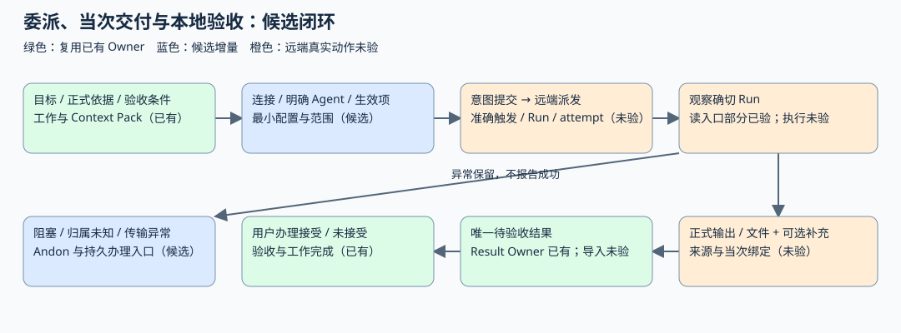
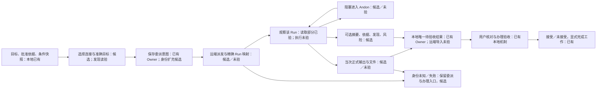
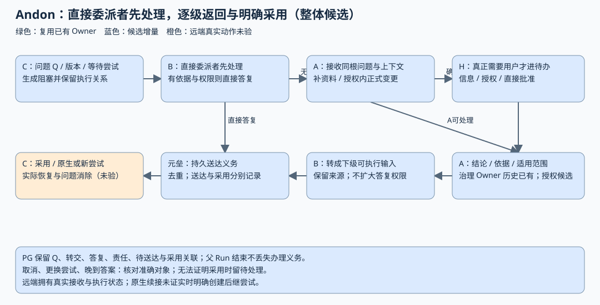
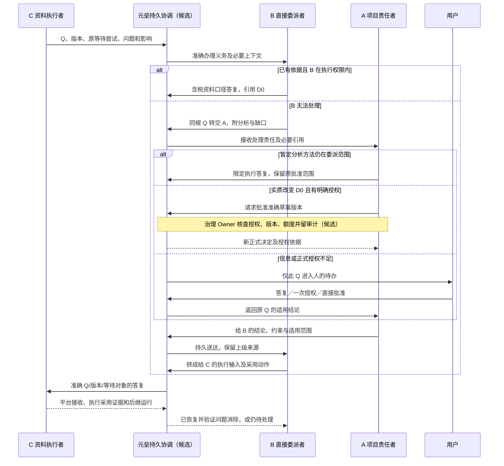

# 协作接入、过程汇报与 Andon：C2 第一轮端到端方案比较

日期：2026-10-08。类型：architecture 研究提案。读者：用户、接入开发者与专项 Reviewer。依据：[专项规划](协作接入与Andon专项规划-2026-10-08.md)、[总纲](第一阶段两项专项规划总纲-2026-10-08.md)、[C0/C1 事实](协作接入与Andon-C0C1事实与讨论-2026-10-08.md)、[本轮推进要求](协作与Andon会话纠偏与下一轮任务-2026-10-08.md)。

## 1. 本轮推荐与可判断的结果

暂定推荐是：复用元垒委派、资料快照与结果验收 Owner；Multica 从独立工作项、明确 Agent 起步，准确绑定其任务运行及重试；OpenClaw 优先研究 Gateway 原生接入，普通 Gateway CLI 作为有限诊断/过渡路径；元垒持久保存跨平台问题与处理链，平台拥有真实执行、原生等待和恢复；个人批准权先建立具体草案的一次授权，再增加可机械核查的有限授权。

先证明准确交付，随后用第二个平台检验公共语义，再增加单层求助和逐级返回。第一阶段需要可核查的个人授权、撤权和审计；组织成员、团队角色、企业审批链留第三阶段。远端长期 Agent/runtime 配置仍由远端拥有，元垒记录使用目标、允许范围和可观测的当次配置，不复制完整配置平台。

本轮交付的是可反证的推荐组合和试验安排。用户已确认产品目标、Multica 样本工作区及“明确授权后智能体可批准部分正式变更”；用户尚未批准本文接口、授权实例、真实写试验或实现。图中的“已有”只指对应本地机制或只读能力，“候选”均尚未实现，“未验”表示真实执行证据缺失。研究文档不构成最终 Decision；实现前仍需 tracked proposed decision，C4 再收敛当前决定。

验收本轮研究的方式是用同一工作逐段说明输入、Owner、状态和失败出口，比较不同平台路径，指出哪些证据会改变推荐，并给下一次工作提供可领命的任务。健康、源码、构建和 Reviewer 各自保留有限证明范围。本轮不修改产品代码、实际配置或账号，不安装升级，不投递任务，不批准正式业务决定。

## 2. C0/C1 保留、纠正与版本依据

元垒 HEAD 仍为 `5ac4a3c0c27dd5df76c6283d76642fc78783e33a`。本轮继承既有实例发现，新增核查只针对版本解析、当次消息结构、Gateway 方法与连接成本，不重新把全部列表探测计为新验收。项目文档已由用户整理到“第一阶段专项”，相关引用随当前路径维护。

| C0/C1 内容 | 处置 | C2 的实际影响 |
| --- | --- | --- |
| Multica 实际服务短提交 `2ea01ae4e`、本地 `83c04ce…`、评估 `fbd3470…` | 保留三种来源；官方 commits API 已将短提交解析为 `2ea01ae4ef55de4310b99af192d2dbd367832883`，提交时间为 2026-10-01 | 可研究对应公开源码；这是服务自报提交的源码匹配，不证明服务无私有补丁或 daemon/Web 同版 |
| 指定工作区，2 个 Agent、5 个 local/online runtime；一项 issue 有 5 次 Run | 保留历史观察；工作区名称已由用户在会话中指定，公开文档用“指定工作区”指代 | 一个 issue 不足以标识交付；Agent/runtime 可见和 online 不证明执行成功 |
| Multica task-runs 结构可读，messages 未验 | 补充只读证据：有 result 的 completed 历史 Run，其 messages 为 200，返回 48 条，包含 task_id/issue_id/seq 等来源字段 | 当次消息读入口已证明；正文质量、文件字节、输入触发与本地 operation 绑定仍未验，不能写成真实交付通过 |
| OpenClaw CLI/Gateway `2026.9.8 (fc23bc8)` | 保留；安装 build-info 补全为 `fc23bc864e4553c2d215e479eeec47b67a0bf943` | 可按安装版本对照随包协议与公开源码；不沿用在线最新版推断全部行为 |
| Gateway/session 发现可用，容器连接未知 | API 容器到宿主 Gateway 的 TCP 成功；本机合法 local backend 握手与只读 agents.list 成功，协商 read scope、未签发 device token | 网络并非必然需要新代理；容器认证、配对及受限凭据仍未验。请求窄 scope 不证明共享凭据本身已收窄 |
| 元垒委派、单层子运行、main resume、治理 user.uid 批准及结果验收 Owner | 保留源码结论，详见 C0/C1 Owner 表与对应 Feature | 复用已有流程；任意多层子运行、正式 Agent 批准、跨平台持久 Andon 都是候选增量 |
| “含税口径”“三年改两年”继续逐点问用户 | 改为本报告完整工作中的不同分支 | 先检查依据与权限，再分类处理。三年若是正式约束才可能走治理；若是执行暂定方法，在委派范围内调整 |
| 缺陷统一留 C5；等待完整 SHA 再推进 | 改为独立任务和分级未知项 | 状态/封存与误报结果的止损可先修；身份与真实输出的完整修复依赖渠道试验；版本细节不会阻塞无关比较 |

版本依据：[Multica 对应提交](https://github.com/multica-ai/multica/commit/2ea01ae4ef55de4310b99af192d2dbd367832883)、[该版路由](https://github.com/multica-ai/multica/blob/2ea01ae4ef55de4310b99af192d2dbd367832883/server/cmd/server/router.go)、[OpenClaw 安装版握手](https://github.com/openclaw/openclaw/blob/fc23bc864e4553c2d215e479eeec47b67a0bf943/docs/gateway/protocol/handshake.md)。Multica 公开源码已只读取回该提交的 issue/service、task lifecycle、comment、task messages 与客户端文件；没有更新相邻 Git 检出。

## 3. 能力矩阵及产品后果

等级：**读验**为实际只读响应；**源码**为对应版本实现或随包文档；**未验**为未执行真实动作。声明存在与权限允许、模型实际使用、最终效果分别验证。

| 能力 | Multica：实际样本及对应源码 | OpenClaw：安装版及实际 Gateway | 起步承诺边界 |
| --- | --- | --- | --- |
| 派发/目标 | 源码 CreateIssue 支持 assignee_type/id，创建服务按条件入队；元垒目前未传它们。写路径未验 | Gateway 声明 agent、sessions.send、chat.send；CLI help 支持 Agent、session key/ID；写未验 | 固定目标并回读实际 Agent。仅建工作项或收到 accepted 不报告执行成功 |
| 触发→Run | task-runs 读验；创建响应是 issue，没有将内部 AssignedTaskID 直接作为句柄返回；评论有触发/合并/延后分支 | 源码 agent 返回 runId/acceptedAt；agent.wait 等待该 Run；幂等键与输入持久机制需真实重试证明 | 无唯一可解释映射则停在“运行归属待核对”，保留工作与人工入口 |
| 输出/消息 | result 为结构化值的 completed 历史 Run、task messages 来源结构读验；未验结果内容。元垒 collect 仍拼 description | 源码终态结果、chat history/full message、agent.wait 与事件；未读输出正文、未发运行 | 以确定 Run 的正式输出取代原任务描述；不可访问或来源不明时不生成成功待验收结果 |
| 文件 | 对应源码有 attachment 下载等入口；work_dir 等字段是路径信息，未验文件 | Gateway 声明 artifacts.list/get/download；声明与当前 Agent 的文件交付策略未验 | 首个试验可先证明文本；承诺文件交付前验证实际字节与权限，不直接读取宿主路径 |
| 可选过程补充 | messages 的 tool/text 结构读验，可能存在截断；结果/评论的修订可变 | event/history/announce 为源码能力，订阅与补读未验 | 摘要引用原来源，执行者报告与独立验证标识分开；不把日志自动当正式交付 |
| 等待/答复 | 对应源码存在 waiting 与评论输入义务，但没有证明可用的“准确 Q→原 Run 恢复”接口；评论可启动新 Run | question.* 方法声明；安装版 ask_user 只向 main session 开放，取消会终止等待，答复不授新权限；真实等待未验 | 原生等待仅用于已证明目标；其他层用显式受阻交付/新尝试或仅通知，不伪造原 Run 暂停 |
| 取消 | 对应源码有 issue+task 精确 cancel、daemon cancel-ack；真实停止及副作用边界未验 | sessions.abort/chat.abort 及 Run 定向能力为源码/声明；实际取消未验 | 提交取消、远端终态、进程/副作用停止分开；本地取消不表示远端已经停止 |
| 续接/重做 | 对应源码 rerun 可指定 source task，返回新 task；实际行为未验 | 原生提问答复、下一 turn、新 session、嵌入 CLI 是不同路径；真实恢复未验 | 用明确后继尝试保留旧运行和采用依据；不能用“resume”混称所有后续执行 |
| 事件/重启 | task messages 的持久读取可用；不依赖事件才回收。评论排队/合并源码复杂 | WS 宣告 agent/session/question 事件；源码要求断序重连和历史补读；实际跨重启终态重取未验 | PG 保存本地处理义务，事件仅提示；远端恢复不了时保留未送达/未知，核对后才发新尝试 |
| 接入权限 | 既有 token 能读指定工作区；调用 Agent、文件权限与凭据实际最小范围未验 | 宿主 read 握手/Agent 读成功；共享 token 仍是高信任凭据，设备/会话限定权限未验 | 连接权限与正式批准权分开；不把管理 CLI 可用当最小权限通过 |

源码依据：[Multica 创建服务](https://github.com/multica-ai/multica/blob/2ea01ae4ef55de4310b99af192d2dbd367832883/server/internal/service/issue.go)、[任务与消息处理](https://github.com/multica-ai/multica/blob/2ea01ae4ef55de4310b99af192d2dbd367832883/server/internal/handler/daemon.go)、[重做入口](https://github.com/multica-ai/multica/blob/2ea01ae4ef55de4310b99af192d2dbd367832883/server/internal/handler/task_lifecycle.go)、[评论触发](https://github.com/multica-ai/multica/blob/2ea01ae4ef55de4310b99af192d2dbd367832883/server/internal/handler/comment.go)。OpenClaw 依据实际包 help 与 [安装版 Agent loop](https://github.com/openclaw/openclaw/blob/fc23bc864e4553c2d215e479eeec47b67a0bf943/docs/concepts/agent-loop.md)、[Ask user](https://github.com/openclaw/openclaw/blob/fc23bc864e4553c2d215e479eeec47b67a0bf943/docs/tools/ask-user.md)。

现有 Codex/OpenCode 委派按 session/turn 回收，可作为身份基线；多轮仍属于 coding_* Owner。本地 Agent 的 checkpoint resume 创建后继 Run，本地子运行仍限一层。公共语义可以复用这些准确尝试和结果关系；公共接口不要求每个平台实现同一种进程树或恢复机制。

## 4. 未知项怎样影响推进与退路

| 阶段门槛 | 未知项与验证办法 | 影响的推荐 | 不成立时的处理 |
| --- | --- | --- | --- |
| 可带假设研究 | 服务自报 SHA 对应源码，Web/daemon 是否同版；由构建/daemon 元数据对照，试验留实际版本快照 | 使用已验证读取形状及该版候选写接口，避免跨版本扩张 | 只调整有差异的动作；保留短提交与读取证据，不停止无关配置/Owner 比较 |
| 可带假设研究 | 遥测、完整过程摘要的可用性；按需读 task messages/history 的截断及作者字段 | 先只持久正式结果和有限补充 | 缺失显示“未提供/不完整”，仍允许无补充事项验收 |
| 可带假设研究 | 处理量、升级时限、是否有第二个处理者；后续小场景计时与体验复评 | 第一阶段直接责任者优先，显式升级，先不引入组织审批链 | 无自动处理者则留人工办理或明确移交；等待时间不当授权 |
| 试验前补齐 | 指定远端 Agent 的调用权限、安全 workdir/工具策略、费用及任务预算；只读配置核对后写入试验授权范围 | 既有连接与目标可复用，不复制长期配置 | 无受控执行边界则降为无工具文本试验，文件/恢复试验暂停；不靠 prompt 限制宿主访问 |
| 试验前补齐 | 元垒 Multica workspace 必填缺失；只读发现已可定位，试验前需明确是否允许装配隔离配置 | 保留现有客户端/注册入口 | 先用隔离协议探针证明平台，不能声称产品入口已装配；本轮不修改环境 |
| 试验前补齐 | OpenClaw 容器认证/WS、稳定客户端身份、最小 scope 和目标可见性；只读认证验证并测试无权动作的拒绝需另外授权 | 优先直接 Gateway；TCP 成功允许先试直接连接 | 宿主受控 CLI 可做有限诊断；若需可信本地执行点再比较最小宿主转接，保持安全边界，不开放 LAN 作为默认解法 |
| 试验前补齐 | 无干扰的触发→Run 关联；独立 issue+目标+稳定 operation，记录触发前集合与返回/新出现 Run，检查重试关系 | Multica 独立工作项、明确目标 | 零 Run 留“已建待执行”；多个无关联 Run 留“归属待核对”；不自动补发、猜最新或回收 |
| 产品承诺前证明 | 两平台当次正式输出与文件：固定 oracle、读取确切 Run、下载字节/哈希与访问拒绝 | 统一正式交付摘要/引用与验收入口 | 只开放已证明的文本交付；错误/失败信息作为执行记录，不能冒充成功结果 |
| 产品承诺前证明 | 原生等待、答复送达、执行采用、恢复：真实问题 ID/版本与 Run 对照，查恢复后输出/事件 | 元垒持久协调+原生动作 | 原 Run 不能续接则采用显式后继尝试；仅评论有证据则标“已提交评论，执行采用未知” |
| 产品承诺前证明 | 取消、重启后的投递去重和运行效果；精确 Run 取消、断线、父 Run 结束、重发与晚到回读 | PG 待投递义务+准确动作核对 | 保留待处理入口，停止自动推进；未知远端副作用先核对/人工处置，不能盲目重试 |
| 产品承诺前证明 | 一次授权与有限授权的拒绝、撤销并发、额度竞争与重复批准；真实副作用边界负向试验 | 一次授权先行，有限授权后续进入第一阶段 | 缺授权由用户批准该草案或上报；限制不能机械检查的类别暂不自动批准，已证明类别继续可用 |

“试验前补齐”只阻塞涉及该项的真实动作。“产品承诺前证明”可先在隔离环境探索失败，失败不取消整个专项。任何降范围都记录具体动作与用户可见限制，保留未完成目标。

## 5. 一项工作的完整委派、交付与验收

贯穿例子：用户要比较三家虚构供应商的采购成本。A 负责项目工作，B 负责比较报告，C 负责资料提取。工作接受条件是交付可追溯表格、依据与风险说明。初始资料明确含税；“三年”在正式约束分支来自已批准 D0，在执行方法分支只是 B 的暂定分析方法。两个分支共用下图，只有发生实质正式变更时才进入治理。

下列 Mermaid 保留关系的文本源；静态图可在当前文档站直接显示。

| 步骤 | 输入与责任方 | 状态、事实存储及远端要求 | 失败的可见结局 |
| --- | --- | --- | --- |
| A 明确目标 | 正式工作、D0 精确修订、验收条件、允许动作、资料清单 | 现有工作/Context Pack 在 PG 冻结；文件字节仍由 owning filesystem/object store 保存 | 引用不可见/失效则派发前失败；旧快照保留，不自动替换批准依据 |
| A 选连接与 B/C | 提供者、连接范围、目标 ID、目标可用能力、允许覆盖的少量当次参数 | 候选连接记录+现有委派；远端返回 Agent/runtime 与实际可观测参数。未暴露配置标“未知”，不能伪造完整生效快照 | 未配置/无调用权限/无受控输入路径则不派发；本地数字员工角色不冒充远端 Agent |
| 保存与派发 | 稳定 operation、不可变输入、明确目标与预算 | PG 意图提交后才外发；候选映射保存 issue/session 与准确 Run/attempt，平台拥有真实队列/执行 | 超时先核对同一意图，不能重建第二工作项；无法确认映射保持待核对 |
| 观察 | 确定 Run，平台原始状态与时间 | 远端读接口/SSE/WS 为观察来源；PG 存本地投影与来源时间；事件不是终态 Owner | 断线显示观察过期，补读确切对象；未知枚举不映射成功 |
| 收正式交付 | B 的完成报告、确切 Run 输出、文件/引用；A 按需读 C 的源交付 | 正式结果只取该次 output/result/messages 的可信终态来源；文件引用附来源、可访问证据与可取得的版本；导入当前结果 Owner | issue 描述、相邻 Run 或仅日志不能成为成功交付；输出缺失/文件不可取保持异常与人工入口 |
| 收补充 | B/C 的过程摘要、失败尝试、风险及来源 | 与正式交付关联但可独立追加；PG 保存有界内容/引用，远端保留长轨迹；作者自述与平台/本地独立核查分开 | 未提供或截断显示限制；关键阻塞单独创建 Q，不能只放在折叠补充里 |
| 本地验收 | 用户看到工作身份、结果、提交时条件、文件和办理动作 | 现有 ProjectWorkResult 保存接受/未接受及审核人；远端 completed 与 issue done 均不自动完成正式工作 | 运行失败与业务未接受分别可见；新补交产生新结果/修订，不覆盖 accepted 历史 |

文件首选受控远端下载或稳定授权引用，再按现有 Workdir/object boundary 登记证据。下载后的副本要保留远端来源与当时版本/哈希，避免“最新文件”替换已验收依据。仅有不可验证 URL 时显示“外部引用、尚未核实”；宿主 work_dir 或私有 transcript 路径不作为平台文件协议。

## 6. 完整 Andon 路径、采用与故障恢复

下图整体是候选协调机制，真实跨平台执行未验；其中读取现有批准资料、治理修订与人工验收可复用已有 Owner。本地运行树限制不因图中 A/B/C 自动解除。首批可以通过分别映射的受托工作验证逻辑责任链，平台内部未暴露后代不进入承诺范围。

| 分支 | 完整处理与可观察事实 |
| --- | --- |
| 直接 B 解答 | C 缺含税口径，B 读取已经批准且含该口径的 D0，按权限答复；PG 保留答复与依据，准确送 C。无需用户再次确认原则。平台确切输入记录/原生问题答复加后继执行输出证明采用；仅 B 写了答案不解除等待 |
| 两级以上 | B 无资料或权限，将同根 Q 转 A；附必要摘录、已尝试方法与需要的判断，不拷贝所有日志。A 若再转上级继续相同规则。返回时 A 明确分析期限与限制，B 转成 C 可执行的资料清单；实质扩大上级结论则再次求决，不能悄悄翻译出新权力 |
| 用户介入 | 只有当前责任已升级到 H、需要独有信息或授权时进入人的待办；上级处理中不计入。H 的答复仍绑定原 Q/版本与等待对象，A/B 接续翻译，传输失败留在“已答复未送达”，不让已读清除办理义务 |
| 正式变更 | 若 D0 正式要求三年，缩成两年需授权内新增补充/替代决策；若三年只是 B 方法，则依委派范围调整，范围不足才上报。治理 Owner 核查后记录实际批准者与 D0/新决定版本；B/C 显式采用新依据和增量输入，原 Context Pack 保留 |
| 不支持原 Run 续接 | C 返回准确受阻事实并自然结束，或在允许范围取消后核对终态；Q 保持未解决。答案到达后以新 operation/attempt 明确引用旧尝试、Q、答复和新依据，生成后继 Run。UI 标“新尝试继续”，显示旧尝试结局；原运行状态和不可回滚副作用先核对，禁止并行重复执行 |
| 仅通知 | 平台只能留评论/链接时标“已通知，采用未知”；提供人工查看与手动创建后继尝试入口。没有可靠阻塞来源时不自动从自然语言生成已暂停承诺；没有回复动作时该动作不可用，平台原生活动仍按真实状态展示 |
| 并发与晚到 | 相似文本不匹配 Q；按问题身份/版本、等待尝试与当前处理节点拒绝错对象。取消、重新委派、问题修订后旧答案保留历史且失效/待复核。新尝试采用旧答案必须是明确关联操作，不自动套到最新 session |
| 父 Run 结束/重启 | PG 保存问题责任主体和处理位置，不依赖父进程存活；可按冻结角色和上下文发一个受限处理后继 Run，记录接替原 Run。若角色/权限失效，升级或待人工移交。pending 送达有 lease/重试/去重；断线核对平台接收记录后再重发，不盲目再批准或再派任务 |

暂定持久化分工：元垒拥有 Q/修订、转交、当前责任、答复及适用范围、授权引用、待投递动作与采用关联；远端拥有输入接收、Run、消息、原生等待和终态；工作/Decision/结果仍由现有 Owner 拥有。需要新增的元垒持久数据进入 yuanlei 域，具体表结构留方案定案；Redis 只提示投递，不能拥有唯一义务。

一个动作的防重身份应绑定问题版本、等待尝试、处理节点和动作意图；PG 提交处理事实与待送达义务后再传输。远端无幂等/回读时，响应丢失转为“送达未知”并人工核对，避免自动重复外部动作。远端 ACK 只证明相应接收层级；“已采用”至少关联实际输入与后继执行，执行者自述单独标注。用恢复后当次输出、文件和缺陷复现的消除证明“问题解决”，不从 HTTP 200、已上报或文字“继续”推导。

## 7. 分层替代比较与推荐依据

### 7.1 连接与生效配置

推荐共通部分只管理提供者类型、连接实例与版本观察、凭据引用、所属个人及允许项目、准确目标、能力/限制、最近检查时间。Multica 的 workspace/project、OpenClaw 的 Gateway/Agent/session 路由属于各自配置。当前先复用既有环境装配做协议验证；进入产品时再按真实多连接消费者增加最小个人连接管理，不假设现有全局环境已经满足多个连接。

| 路径 | 完整行为与代价 | 判断 |
| --- | --- | --- |
| 引用远端长期配置+有限当次输入 | 在远端管理模型、工具、skills、工作目录等；元垒选择目标、冻结本次资料/约束，记录远端公开可观测配置或版本 | 推荐起步。避免远端配置变化被误写成当前业务快照；不可观测设置明确未知，取得“期望配置”不等于取得“实际配置” |
| 元垒管理少量远端覆盖参数 | 用户在元垒选择平台已支持的当次模型/预算等，Adapter 校验、送出并回读实际值 | 有真实消费者和确认接口后增加；需权限、版本、变更审计与冲突处理，不能直接编辑全部远端 Agent 配置 |

角色映射先作为可查看的关系：元垒责任角色与远端执行者分开，默认由委派明确选择目标，不把本地员工 ID 发给不认识它的平台。凭据属于连接 Owner，业务资料只有受控引用。远端配置变化影响下一次执行的准备检查，不回写旧 Context Pack；执行时是否已经冻结配置由平台证据说明。

### 7.2 Multica：工作项、目标与运行

| 比较轴/路径 | 处理闭环 | 优点、成本与推荐 |
| --- | --- | --- |
| 独立委派 issue | 一个逻辑委派建专属 issue，嵌稳定 operation，明确 Agent；读 task-runs 核对唯一触发及其 retry attempt，回收确切结果 | 推荐首批。隔离原讨论，减少无关触发，需处理建单成功但入队失败/响应丢失；专属 issue 仍可能多 Run，不能靠隔离省去运行绑定 |
| 复用已有 issue | 保留平台原议题，送带 operation 的明确触发评论或 rerun；用 trigger_comment_id/已送达评论/重做来源识别当次 Run | 适合后续跟进；评论可能合并 queued、延后 active 或新建任务，资料也持续变化。需处理权限、历史、revision 与触发复杂性，暂不用于首次承诺 |
| 明确 Agent | 创建/分配使用已发现目标，入队与回读确认实际 Agent/runtime | 推荐。执行者选择容易解释，调用权限仍需证明；创建源码中内部 AssignedTaskID 不直接出现在 HTTP issue 句柄，不能只依赖创建响应 |
| 平台分派 | 送平台已支持的分派目标，由远端决定执行者并回读实际身份 | 有真实自动分派消费者后采用；不承诺“所选本地员工执行”；当前不以无 assignee 创建等同平台已接受派发 |

专属 issue 起步的映射规则是：冻结目标与 operation，建立该 issue 的运行集合；只采纳能由受控触发及准确 Agent 解释的 Run，平台重试保留 attempt/来源关系。存在多个无因果依据的候选时停止自动回收。轮询窗口和时间邻近只辅助定位，不拥有归属事实。首次试验使用无外部自动规则干扰的隔离对象；长期承诺必须证明外部评论/重复投递也不会造成错配。

源码的评论触发返回 queued/coalesced/deferred/blocked 等含义，planned input 与 delivered comment 各有用途；它们可以支持送达核查，但不证明执行已经采用，更不证明原 Run 原地恢复。平台 rerun 是新 task 路径。issue status_category 适合说明业务工作项分类，task.status 用来判断运行结局，二者分别投影；业务结果仍在本地验收。

会改变推荐的证据：实际创建可返回准确 task 句柄或可查询稳定 trigger token，可减少专属 issue 的映射成本；若可准确对复用 issue 的输入做去重、冻结和因果回读，复用路径可加入。若普通创建不能触发或目标不允许调用，维持“待分派”，采用平台受支持的显式分配/启动，不能自造私有 endpoint 或先 fork 平台。

### 7.3 OpenClaw：Gateway、CLI 与有限过渡

| 路径 | 身份、交互和恢复 | 权限/运行成本与判断 |
| --- | --- | --- |
| Gateway 原生 | 显式 Agent 与隔离 session；发 agent 或平台支持的 session send，保存 returned runId；按确切 Run 收结果、事件提示、公开历史补读，原生 question 单独适配 | 推荐产品方向。需要 WS 客户端生命周期、重连、方法版本校验及稳定身份；read 与 write、questions/approvals/artifact 的必要 scope 分开验证 |
| 受控普通 CLI | `openclaw agent` 默认经 Gateway，显式 Agent/session、JSON 结果、禁用渠道 deliver；进程超时后核对 accepted Run，不能因 CLI 退出重发 | 可作隔离试验及有限过渡。JSON 和退出码便于诊断，但准确句柄/终态重取要证明，进程包装不减少 Gateway 权限；不把 stdout 尾行当唯一结果 |
| `--local` / `agent exec` | 内嵌运行，agent exec 可拥有临时状态与工作目录；不与既有 Gateway session 同义 | 适合独立一次执行消费者，当前不作为 Gateway 故障的自动退路；会改变身份/凭据/状态 Owner，不能声称恢复了原任务 |
| 必要时的宿主转接 | 元垒提交准确意图给受控宿主执行点，宿主只操作允许目标与动作，并回传句柄 | 当前 TCP 可达，先不增加服务。只有容器合法认证确实不能闭合时比较此路径；多一层投递、审计及故障 Owner，需具体 consumer 证明成本合理 |

推荐先尝试容器直接到现有宿主 Gateway，不调整 bind 或开放 LAN。已取得的是 TCP 与宿主只读握手证据，尚无容器身份授权证据。合法最小权限客户端应使用稳定身份、范围有限的凭据并实测拒绝越权；本轮 trusted local backend 只读探测不当作产品免配对捷径。共享 Gateway token/password 属高信任访问，窄请求 scopes 无法消除持有凭据的实际权力；尤其 HTTP 表面会恢复默认权限。对应 [安装版权限说明](https://github.com/openclaw/openclaw/blob/fc23bc864e4553c2d215e479eeec47b67a0bf943/docs/gateway/operator-scopes.md)。

Gateway 事件用来及时发现进展/Q，断序/断线后按公开历史与确切 Run 补读。`agent.wait` 超时仅是等待超时，不能当作取消。原生 question 在实际 main Run 的允许范围可研究直接答复；内部 subagent 不提供 ask_user 时，可显式向其直接委派者返回阻塞交付并保持本地 Q，不能仅因 question.* 方法存在就开启全树恢复。

若合法 Gateway 身份、准确终态和重启补读证据不足，暂停自动恢复承诺，保留 CLI 有限试验或人工核对。若 Gateway 原生链路通过，CLI 不再承担第二套运行事实，也无需复制 OpenClaw 内部协作树。

### 7.4 交付与过程补充

推荐小公共摘要+准确来源/证据引用+提供者扩展。最低正式内容是当次尝试身份、结局、正式输出、交付引用和提交时条件/资料依据；过程补充最少附作者、来源运行、时间/修订、摘要或引用及完整性说明。模型自述“测试通过”显示为执行报告；读取实际测试结果或文件字节后才显示独立核查。

| 内容路径 | 取舍 |
| --- | --- |
| 本地保存正式内容快照及有界补充，引用远端长轨迹 | 推荐。PG/现有对象 Owner 保存可验收内容和必要来源；按需读远端原记录，远端删除时明确不可用。重要引用在验收时冻结版本/证据，不让可变远端内容替换接受历史 |
| 全量复制轨迹、配置和文件 | 留给确有审计/离线保存要求的消费者；成本包含隐私、体积、版本、删除与权限。第一阶段不全量同步 |

正式交付与补充分别修订。补充改变交付结论时形成明确补交/新结果；仅过程说明可追加且不影响原验收条件。失败信息可看可查，成功结果来源不明时不能借由一个本地自动结果掩盖。

### 7.5 Andon 协调的责任分工

| 路径 | 完整路径、代价与判断 |
| --- | --- |
| 元垒持久协调+平台原生执行 | 推荐。Q、转交、答复、授权依据与待送达/采用关联在元垒；平台原生等待/输入/恢复执行实际动作。多平台与父 Run 结束后责任可继续，代价是最小持久协调及每平台适配/失败核对 |
| 平台原生树承担其内部协作，元垒只映射出口 | 作为组合采用。减少窥探内部实现，只承诺公开映射的责任链；如果平台能可靠处理内部 Q，元垒接边界求助和正式交付，不强制复制整树 |
| 纯评论/通知 | 有限能力模式。登记本地 Q、发准确评论或展示链接，人工核对；不提供自动恢复/采用已确认。维护成本小，但无法承担可靠逐级返回承诺，不作为默认完整 Andon |

持久协调先做当前实际 consumer 的单问题处理和准确返回，随后证明多级链；避免先造全树 UI、通用工作流编排器或平行业务状态。现有 Registry/Adapter 与窄委派协议继续复用，新增等待/答复动作只在真实消费者和平台证据支持时扩充；不用多个无消费者的 Bridge/Factory/Strategy 类表达同一流程。

### 7.6 限定个人授权的顺序与真实边界

| 授权路径 | 完整处理、频率与成本 | 推荐位置 |
| --- | --- | --- |
| 准确 Q/草案的一次授权 | H 对不可变草案内容、目标决策版本、项目、批准主体、有效尝试/期限授权；智能体判断适用后批准。修改草案需新授权；消费与批准同事务 | 首个正式批准试验与第一批产品能力。审阅清楚，频繁但容易查错；与“用户直接批准”有区别，审计实际批准者是智能体 |
| 项目/类别/期限内有限授权 | H 授某主体在有限对象/动作、次数或额度、期限内批准；每次实际动作检查最新授权、当前版本与剩余额度，必要时收窄 | 一次授权闭合后仍进入第一阶段。先支持有限明确草案集合或真实 Owner 能核查的结构化变更；纯文本类别标签不能验证结论是否越界 |
| 用户直接批准 | 无授权或变更范围不可核查时，A/B 起草并呈现影响，由 H 在现有治理入口批准，再逐级送回 | 缺授权退路与高影响事项，保留长期入口；不会把全部智能体批准永久删去 |

推荐第一批暂不允许批准主体继续转授批准权，批准主体固定为元垒项目责任智能体；远端执行者可以提出草案与证据，不因拿到连接 token 获得本地治理批准权。以后需要远端直接批准时另证身份、授权和实际边界，不直接把用户 API 权限借给远端。

一次授权引用准确草案内容指纹与 revision。有限授权若涉及“资料范围可缩小”但治理事实只有自由文本，需先有可核查的批准候选集合或 owning 结构化差异，再开放该类别；不让另一个模型分类或 prompt 承诺成为授权 oracle。按次数/额度消费需在授权与决策的事务锁内串行，先持久幂等意图，拒绝旧版本和新越界动作。撤销与批准竞争以该副作用事务中的最新授权及提交顺序裁决；已提交批准保留历史，撤权只禁止之后的新动作，必要撤销决策走正式治理。

完全相同已提交批准的重试返回原事实，不能再次消费额度或重复批准；未提交的重试仍核查最新授权。审计分别保存授权人、授权版本/范围、实际批准主体和 Run、准确草案/决策版本、Q、原因和结果。正式变更提交与待送达引用可原子记录，网络动作在提交后进行；若分属流程，持久待关联事实可重试收敛，不能要求数据库事务跨远端等待。批准成功不自动替换旧 Context Pack，执行采用单独留证。

## 8. 已知缺陷的独立处置任务

以下均是可另行授权的小任务，本轮未改代码。先做封存/结果止损，再开放按钮和准确输出；不会等待整个 Andon 框架完成。

| 缺陷 | 当前失败路径与 Owner | 最小修复边界与依赖 | 回归证据 |
| --- | --- | --- | --- |
| 回收按钮终态不一致 | WorkDelegationsPanel 只认 completed/failed/cancelled；DelegationService 对 Multica 成功用 done，成功 issue 无入口 | 由现有 Adapter/委派视图给出有限回收动作依据，前端消费；紧急兼容 done 可小修，但必须同时受后端封存/结果 guard 保护。未知/自定义 status 不直接当成功；不引入全平台巨型枚举 | Web unit 覆盖 done、running、failed、自定义/未知；真实页面核对入口与后端拒绝原因。已知 done 不可无入口，非终态不能绕过后端 |
| 提前封存 reclaimed | Multica collect 任意 issue 状态都返回，service 无条件 reclaimed；后续调用返回旧结果，真正完成后仍取不到 | Adapter 明确拒绝非终态/未就绪交付，service 失败释放 collecting lease 回到可观察状态；只有实际终态且交付准备充分才封存。可先补非终态 guard，不依赖全 Andon；缺准确 Run 时保留待核对，不能凭 issue done 宣称完整修复 | 真实 PG：running 回收拒绝，记录保持可再次观察/回收；lease 释放；随后同 operation 得到准确终态交付才唯一封存。负向恢复旧行为须因提前封存而失败；并发收集不产生两个结果 |
| 原描述冒充结果 | MulticaExecutor 拼 title/description/status；service 在 done 下自动生成待验收工作结果 | 可独立止损：禁止将 description/issue URL 作为成功执行正文；仅提供工作项信息/结果未核实，保留失败诊断。完整输出修复与下一行共同依赖平台交付试验，不用占位文本伪装成功 | 输入描述含唯一哨兵、真实输出另一个哨兵；断言无真实输出时不导入成功结果。真实接口有输出后读取对应 Run，预期正文不能从 issue 描述通过；检查 DB 来源及实际文件 |
| 未绑远端 Run | handle/ChannelDelegation 只保留 issue identifier；一个 issue 有多 Run，可串到新旧任务 | 在既有委派意图/尝试关系扩充确定远端 Run/触发/实际 Agent，不另建平行正式工作。多次 retry/后继分别记录；禁止 latest 猜测。该增量依赖 C3 触发因果及输出试验，不依赖多级 Andon | 两 Run 输出不同，旧/新结果不得串线；重复投递/响应丢失/干扰评论留归属待核对；真实派发后的回读核对触发、Agent/runtime、Run、当次输出与唯一结果 |

建议领命顺序：第一张小任务关闭非终态封存及描述误报，明确未知输出暂不可回收为成功；第二张修动作入口并复验真实页面；第三张在 C3 准确交付证据后接通远端 Run/输出。已有错误封存或误导结果保持历史，另列具体受影响记录再授权纠正，不批量解除 reclaimed、不重写 accepted 历史。

## 9. 推荐组合、淘汰理由与分批建设

推荐组合的最小完整能力是：有明确个人连接/目标和被冻结输入；一个委派能解释其准确远端 Run；正式交付与条件/证据绑定并在本地验收；阻塞有稳定 Q、直接责任者和待处理入口；答案逐级返回，送达、采用和运行结果有准确证据；缺能力如实呈现原生动作、新尝试、仅通知或不可用。正式批准以可核查个人授权和真实治理边界闭合。平台内部全树、实时全量日志、远端配置副本都不是最低要求。

| 增量 | 依赖与实现约束 | 可观察验收及未通过退路 |
| --- | --- | --- |
| 准确交付与止损 | 独立缺陷任务先关误报；C3 用 Multica 一个明确目标证明精确输出，继续复用 Delegation/Result Owner | 同 operation→准确 Run→实际输出/字节→唯一待验收；不通过则保留结果未核实，不扩大协议 |
| 第二样本校准 | 在公共字段冻结前，用 OpenClaw 同样输入再做一次；并行研究两平台，真实试验按风险串行 | 公共尝试/正式结果含义可用，issue 与 session 差异留 Adapter；若公共接口需要平台内部树，先收窄 |
| 连接准备与补充 | 确认真实目标与平台专属配置；公共有界摘要/引用，冻结生效可观测项 | 说明连接代表谁、能做什么；补充按需读、出处可查；未暴露配置/截断保持未知 |
| 单问题持久处理 | 准确尝试先闭合；新增 yuanlei 问题/答复/送达义务，复用后台投递/租约模式；不默认改本地嵌套限制 | B 可在已有依据内直接处理；重启不丢义务；有答未送达、已送达未采用均可办理 |
| 多级与用户介入 | 单层和平台支持的等待/新尝试已验；显式责任移交与循环拒绝 | C→B→A→H 与对应返回准确；只有 H 当前待处理项进入人的待办；父 Run 结束仍可接替 |
| 一次正式批准授权 | 治理 Owner 明确实际批准主体、授权与版本；先隔离负向试验再 shipping 真实 PG/HTTP | 授权内草案由 Agent 批准；越界/撤权/旧版本拒绝；采用新依据不改旧快照 |
| 有限个人授权 | 一次授权及额度/撤销竞争闭合，有能核查的候选集合/结构化 consumer | 有效期内多次限定批准、并发额度唯一、撤权后新动作拒绝；不能核查的类别留人工，不永久退回全人工 |
| 故障与 UI 承诺 | 每增量都做最小负向；最终跨平台重启/并发/晚到 E2E，单次事件不当最终事实 | 输出、Q、答复与正确尝试一致，异常入口不丢；Dashboard 只展示拥有来源的真实状态 |

淘汰的是：只改按钮就宣称闭环；用 issue done/description 替代当次交付；靠 latest session/Run 或自然语言匹配问题；用评论“继续”当恢复；共享管理 token 当个人正式授权；全量复制平台内部状态；先造求助全树/万能 AI 基类。这些路径分别无法解释输出来源、等待对象、权限或真实执行结局。它们不因低成本或测试变绿成为可接受的完整方案。

分层推荐可以独立被证据推翻：Multica 明确 trigger 回读可靠时可引入复用 issue；OpenClaw Gateway 合法身份不成立时评估有限宿主执行点；原生等待不成立时先准确新尝试；有限范围不可核查时缩小自动批准类别。已有委派、治理、结果 Owner 继续保留，无需整体接受一套框架才能推进。

向 Dashboard 专项交换候选投影：项目/工作/委派/准确尝试；当前处理者及原问题；是否需要用户；已有答复/待送达/采用未知/已恢复；正式结果与可选补充；可办理的精确链接。当前已有结果入口可复用，Q 入口是候选，未实现时原型必须标注。计数按问题办理义务去重，不把每层转交或所有子任务异常算成新的人的待办；已读不改变处理事实。

## 10. 下一轮 C3 隔离试验单

本节是待授权试验范围，不是开始执行的指令。推荐下一次先执行 T0/T1 的最小真实交付，两平台各一项逻辑委派；T2 以后逐项在前一级证据通过后领命。当前无需用户逐项设计字段，但实际写入、目标/资源范围、费用和清理需要具体授权。

### 10.1 版本、对象、输入与动作

| 项目 | 拟执行范围与前置校验 |
| --- | --- |
| Multica 连接/目标 | 用当前服务自报 `2ea01ae4ef55de4310b99af192d2dbd367832883`、用户指定工作区。只读从两个 Agent 中确定一个可合法调用且有受控执行边界的目标 T-M，绑定其实际 Agent/runtime ID 到受保护试验记录；不凭名称任意挑选。若没有安全目标，需另授权建立一次性受限测试目标，不能修改日常目标 |
| OpenClaw 连接/目标 | 当前 `2026.9.8/fc23bc864e45…` 宿主 Gateway；先验证容器合法客户端与公开读取。选择允许隔离 session、最小工具集的 T-O；不调用已有用户主 session。若需新受限 Agent/配对凭据，单列配置变更授权，不在本轮发生 |
| 隔离对象 | 本地一份专属试验项目/工作及一次性 PG schema 或测试部署；Multica 新建 1 个有 operation 标记的独立 issue，不使用已有业务 issue；OpenClaw 新建 1 个带唯一试验前缀的 session。初轮不自动同步 Multica 入向，避免误建正式业务议题；记录所有新增 ID，不写公开文档 |
| 固定输入 | 三个虚构供应商 A/B/C，2024—2026 含税金额分别 A=100/110/120，B=120/110/100，C=90/100/110。给出完整资料、字段单位与来源为人工 fixture；不读用户目录、账号、真实业务或外网数据 |
| 正式交付 oracle | 要求明确输出比较表、总额/均值和结论；固定预期 A=330/110，B=330/110，C=300/100，C 最低。可交 table.csv 与 brief.md 时下载验证字节和表值；不能取文件时先只完成文本层，文件验收保留未通过。oracle 事先显式审阅，不从执行输出生成预期 |
| 当次关联 | 提交前保存版本观察、输入指纹、operation、准确目标、许可范围；Multica 冻结 issue/触发/Run/attempt，OpenClaw 保存 Agent/session/runId。交付引用原始响应/消息 ID 与可取的文件版本，拒绝来源不明的内容 |
| 初轮允许动作 | 每平台至多 1 个逻辑委派与新增工作项/session；允许读取给定 fixture、返回文本；受控文件边界证实后只写试验输出目录内两个预定文件。禁用自主再委派、渠道 deliver、远端 Git push、系统配置、安装、凭据操作、其他工作区/会话和真实业务治理动作。必须以平台工具/文件边界执行限制，prompt 只描述任务 |
| 预算 | 暂定每平台 120 秒观测窗口、20k 总 token 预算，无调用方自动重发；开始前核对平台原生超时/预算/内部重试设置。无法硬限制时明确预算为观测值，另确认可承受费用后才试验；窗口超时仅停止观察/新投递，取消需已授权且实际回读，不宣称运行已停 |

T0 的只读准备可继续独立完成；具体 T-M/T-O 需从调用权限、工具策略和隔离能力确定，不需要用户猜协议 ID。若平台无法提供受限工具边界，首轮降为无工具文本任务，文件、命令与重启试验不执行。

### 10.2 按风险递增的试验及证明边界

| 试验 | 真实动作与新增范围 | 必须回读的证据与通过条件 |
| --- | --- | --- |
| T0 准备 | 只读版本、目标与权限/网络核对；需要的新凭据/目标/隔离配置另授权 | 与计划一致的版本、作用域、工具和可访问路径；未知越权能力不默认为安全。未通过只阻塞对应动作 |
| T1 单次准确交付 | 按上表每平台一项，明确目标，不复用业务对象；平台内部重试范围开始前记录 | 本地意图、远端触发/准确 Run、正式输出、可取文件、唯一待验收结果交叉核对。现有产品适配尚未修复时用隔离协议探针，不将探针结果写成 shipping 入口已验收 |
| T2 补充 | 在 T1 同次输出请求可选过程摘要、依据、发现/风险；追加时另记录作者/修订 | 交付仍可直接办理，补充有准确来源；自述通过与独立 oracle 分开。截断/缺失被如实显示 |
| T3 直接 B 处理 | 新隔离尝试故意删去输入的含税说明，但冻结上级资料含批准口径；C 产生一个 Q，B 自行取依据并答 | Q/版本/原等待尝试、B 依据、送达、采用及正确后继输出全部对应；不请求 H 重复原则。平台无原生等待则先结束受阻尝试再明确新尝试 |
| T4 多级返回 | 在隔离缺资料尝试中 C 缺 2024 资料，B 无权调整批准范围，转 A；只授权产生必要 Q/处理后继运行 | A 从已给资料能补齐时返回补充，B 转成 C 输入；同根 Q 的各节点与来源不丢；原生内部层无法映射时只验证显式映射链，不宣称全树支持 |
| T5 用户介入 | 采用用户专属 fixture 信息在 A/B 处不可取得的分支；授权一次测试答复送回 | 仅真正升级到 H 的 Q 进入待办；答案沿 A/B/C 返回正确等待；接口接收与实际采用分别有证据 |
| T6 正式授权与拒绝 | 在隔离测试项目创建 D0 正式三年约束、替代草案与一次授权；测试批准主体 A。随后另试期限/项目/内容/额度/旧版本/撤权及相同意图重试 | 只有授权内准确草案被 A 批准，新决策历史/实际 actor/授权消费与送达关联一致；越界新动作无副作用，原快照不改。若此时仅有协议原型，它只证明候选事务/协议，产品批准承诺必须在增量实现后经真实 Owner 的 PG/HTTP 重验 |
| T7 故障 | 专属测试环境断传输/结束处理 Run；两 Q 同文、旧答案晚到、重复投递；Gateway/worker 重启需另明确授权，禁止重启日常实例 | 问题/待送达重读仍在；无重复批准/重复远端动作；旧答不恢复新尝试；无法核对时留未知入口而不自动关闭 |

T3—T7 可先用最小持久协议原型，不需要创建通用编排框架。原型运行于隔离数据库/对象，真实平台动作必须仍有真实回读；mock 用于负向重放，不能替代真实运行。有限授权试验在一次授权通过后，以同一隔离项目中预先明确的两份候选草案与次数上限验证，再考虑真实可核查类别。

### 10.3 失败停止、重试与清理

出现身份不能唯一映射、无权调用、输出取到原描述/相邻 Run、越出文件或授权边界、远端写结果不确定、费用超出已批准范围时，立即停止新投递，保存精确对象与事实，留下待处理入口。平台超时/取消响应不能证明副作用已回滚；已在执行的对象按获授权取消动作处理并核对终态/确认，无法取消则说明仍可能执行并人工处置。

初轮无调用方自动重发。响应丢失先查稳定 operation/触发/Run；原生可幂等时只重试同一意图，不能恢复准确事实时不再发送。新尝试必须获授权范围覆盖，指向原尝试与采用答复。内部 retry/后继 Run 逐个保留，不能只留最终成功一条。

清理只覆盖登记的试验对象：先确认全部试验运行终结或显式留存异常，再撤销试验授权/凭据，按批准范围归档或删除试验 issue/session 与专属文件，清理隔离 schema/部署。保留去敏证据快照与失败结论；不删除业务历史、不修改日常目标、不批量 cancel 用户现有任务。远端无可用删除/取消能力时保留明确已隔离的对象和后续处置清单，不能报“全部清理”。

## 11. 实质分歧与下一次工作的切入

本轮没有需要用户重新决定的既定原则，也没有阻塞比较的用户独有实例信息。工作区已确定；目标身份、只读方法与源码差异由研究负责核对。当前建议可继续被试验推翻，接口字段、问题标识和正常路径无需逐项交给用户设计。

下一次先完成 T0，产出填好具体目标、权限边界、隔离对象、可执行动作、预算和清理方式的 T1 试验卡，再申请真实写入授权。现有日常目标若不能隔离工具或凭据，需要用户选择授权一次性受限目标还是只做无工具文本层；这会阻塞相应平台的写试验，独立缺陷修复与另一平台研究仍可继续。当前资料不足以提出这项选择，不预先要求用户批准空白范围。

可独立领命的最小修复是第 8 节的非终态封存与描述误报止损，随后修页面动作一致性；它们无需等待全套接入框架定案，但实际代码修改仍需后续任务授权。准确 Run/输出接通以 T1 证据为前置。第一阶段一次授权后继续有限个人授权，第三阶段再引入组织治理，避免一次授权成为永久人工瓶颈。

## 12. 证据、验证与审阅范围

本轮新增证据仅为只读：官方短提交解析、对应公开源码、指定工作区历史 Run 的结果/消息结构、安装 build-info、容器 TCP 与宿主 Gateway 只读握手/方法声明。初次客户端组合得到空 scope，改用随包文档中的合法 local backend 客户端身份后读取成功；未签发 device token。该路径用于内部只读核查，不能替代产品客户端的合法配对、受限凭据和越权拒绝证明。凭据、用户正文与实际对象 ID 不进入报告。

真实派发、输出内容/文件验收、Andon 送达采用、取消恢复、正式 Agent 批准与权限负向仍未执行。表中的源码路径与公开版本用于重建研究依据；本页是派生快照，Feature 与真实 Owner 继续解释现行语义。文档构建只证明站点可构建，工程检查只证明对应规则，Reviewer 只证明本轮审阅，均不能代替平台闭环。

验证结果：

- `cd docs && pnpm run build` 通过，保留现有 bundle size 提示。主文档、C0/C1 和规划共 19 个相对文档/图片引用存在性检查通过，两份 SVG XML 解析通过；未取得完整浏览器页面的视觉验证，不把构建报告成截图验证。
- `python3 -m unittest scripts.test_verify_engineering_contracts`：70 项通过。`git diff --check` 通过。
- `python3 scripts/verify_engineering_contracts.py`：失败；仅报告原 ef65969 评估文档第 166、174、190、234 行四处既有对举措辞，本轮文档无新增该类错误。该失败未改写成通过，也未扩大范围修改评估结论。
- 全新 Reviewer 未继承开发上下文，阅读完整任务、主文档及相关规划，核对现有委派/治理/子运行/结果 Owner，并抽查两平台精确版源码/随包文档；审阅通过，无阻止本轮研究交付的实质问题。Reviewer 未重新探测实例或验证真实平台执行。

仅新增研究文档与配图，更新关联研究/规划引用；保留工作树中其他专项及已有暂存内容，未提交。未运行全量后端 unit/真实 HTTP、worker E2E，原因是本轮无产品代码修改，真实平台动作尚未授权；对应增量与 C3 仍须各自完成要求的证据。
