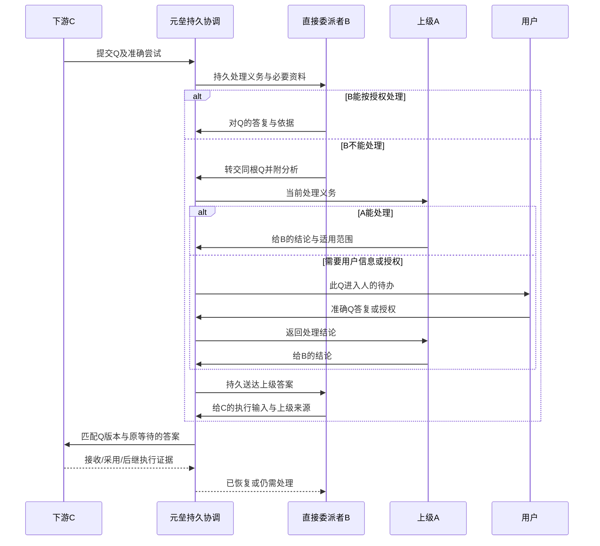

# 协作者接入与 Andon 协议草案 v1

日期：2026-10-09。事实基线：`93416ef`。读者：协作者Adapter开发者、任务委派者、Agent工具与治理/执行实现者。本文是待收敛契约，字段名及动作名是设计示意，不能按已有远端API使用。实施包与完成度由[重新规划总纲](两项专项全面审计与第一阶段重规划-93416ef.md)拥有。

具体推荐、版本样例、完整处理链、持久与UI映射、能力套件及C1—C6卡由[C0整体契约基线](协作接入-C0整体契约基线与C1-C6验收卡-2026-10-09.md)收敛；本文保留草案来源，不作为当前已实现API。

## 1. 当前基础和需要补齐的公共机制

现有DelegatedExecutor只有dispatch/status/collect，默认装配codex/opencode/multica，ChannelDelegation有持久意图、租约和结果。OpenClaw有成功协议样本，尚无产品Adapter。根项目Agent委派工具拒绝子Agent外部委派；现有用户提问/interrupt/resume和父子关系不构成逐级Andon。

本契约把三件事分别规范：委派具体任务与可信交付；按需读取过程补充；遇到阻塞时由直接委派者处理并准确返回。配置差异留给Provider适配，正式工作、执行、结果和决策仍由现有Owner持有。

“自由接入更多协作者”的第一阶段含义：开发者按版本契约写Adapter、配置连接/目标、运行公共与专属验收后注册，业务层无需再为每家重写一套流程。不是上传任意插件热运行，也不是所有Provider都自动获得原地恢复或正式批准权。

## 2. 提供者、连接、目标和当次尝试

| 对象 | 推荐归属与内容 | 必须区分 |
| --- | --- | --- |
| Provider类型/Adapter | 协议实现、支持版本、配置schema、准确身份映射及能力 | 类型不是用户连接或运行身份 |
| 个人连接 | 所属用户、允许项目、地址/工作区、凭据引用、连接状态与检查时间 | 同一Provider可有多连接；不以executor_key猜唯一实例 |
| 协作者目标 | 连接内Agent/runtime/入口标识、显示名、远端配置观察与就绪 | 元垒责任角色与远端执行者不同；不静默换目标 |
| operation/attempt | 正式工作、委派者、目标快照、业务资料/约束/授权、准确远端session/run及结果 | operation是逻辑委派；业务新尝试不是网络重试；当前配置不覆盖历史 |

连接界面统一公共部分，Provider专属字段由其有限schema驱动；第一阶段不建设插件表单平台或统一密钥服务。秘密走已有服务侧配置/凭据边界，模型和业务页面只看引用、权限摘要与结果。长期远端配置默认由远端管理，元垒只记录公开生效证据并传平台支持的有限当次参数。

推荐先落一份可用个人连接管理和目标选择，保留现有环境配置的迁移/兼容入口。装配注册需调整固定executor_key数据库约束与迁移；不能仅新增Python类。旧记录原语义保留，新持久结构进yuanlei域。

## 3. 能力声明不是一张全为true的接口表

Provider记录能力及证据等级：实际验证、文档/源码支持未验、不支持、未知。布尔能力可供运行，但验收记录应说明版本、动作和限制。

| 能力 | 对业务意味着什么 |
| --- | --- |
| dispatch/status/final-output | 固定目标、准确运行与可回读终态文本；是完整自动委派的最低条件 |
| artifacts/supplements | 可取得准确当次文件/引用、过程补充；不支持时限制展示，不能拿描述冒充 |
| question-submit | 能主动提交稳定问题；可以是工具/回调，也可以是受控终态受阻报告 |
| native-wait/reply | 有原生等待和准确答复动作；必须实证匹配对象 |
| continuation-new-attempt | 无原地恢复时，可明确启动引用旧问题/答复的后继尝试 |
| receipt/adoption | 可证明接口接收或执行采用到何层；不能用同一ACK代表全部 |
| cancel/confirmed-stop | 是否有取消请求、如何证实准确运行停止；本地改状态不算 |
| recover-observation | 持久映射重建后可回读原运行；与自动再次派发不同 |

不支持问题接口的Provider可以先只交付，但不能进入“支持自动Andon”的验收。文本受阻模式有条件支持Andon：报告真实阻塞且本次运行自然终止，后续明确新尝试；不能声称它仍原地等待。

## 4. 下发任务：下游必须拿到规则和可用动作

需要定义版本化协作任务包，业务上下文复用Context Pack快照，控制规则与任务资料分开。现有metadata注明不外泄，不能仅在那里保存规则就认为已传给下游。Adapter须渲染明确的模型可见消息/附件/工具说明，并保存实际下发内容或可核查指纹及输入记录。

| 部分 | 任务包最低内容 |
| --- | --- |
| 身份与资料 | 协议版本、operation/attempt、工作及要求修订、业务资料指纹/受控引用、直接委派者、准确目标 |
| 委派约定 | 目标、范围、交付格式/依据、预算与实际可执行限制、工具/路径允许范围、禁止事项 |
| 正式交付 | 本次文本、文件/引用、未解决事项如何提交；结果不要混其他Run |
| 可选补充 | 摘要、依据、发现、失败尝试与引用；大小/完整性说明；无需完整内部思考 |
| Andon规则 | 何时阻塞、向谁求助、允许的提交/查询/收答动作或返回格式、问题版本与等待身份、超时/取消/失效处理 |
| 权限说明 | 当前明确授权摘要与核验引用；原有工具/数据权限仍生效，不能自行批准正式变更 |

示意任务包：

```json
{
  "protocol_version": "yuanlei-collaboration/1",
  "operation_id": "op-demo", "attempt_id": "attempt-demo",
  "work_ref": {"id": "work-demo", "criteria_revision": 2},
  "context_ref": {"fingerprint": "sha256-placeholder"},
  "goal": "按给定清单核算成本，不自行假定缺失税率",
  "parent_handler_ref": "handler-demo",
  "delivery": {"required": ["formal_text", "unresolved"], "supplement_optional": true},
  "andon": {"mode": "blocked-return", "on_missing_input": "ask-direct-parent",
    "reply_match": ["question_id", "question_revision", "attempt_id"]}
}
```

实际给下游的可读规则示例：

> 若缺少会改变成本结论的信息，请停止受影响计算，不自行假设。向本次直接委派者提交问题，包含缺什么、影响什么、已经查过什么和需要的明确答复。只用本任务提供的提问动作；当前没有在线提问工具时，按约定返回受阻报告，结束本次执行。最终文本、可选过程总结和未解决阻塞分别提交。只有匹配本问题与本次尝试的答复才能作为新输入；答案已发出不代表你已恢复。接收、采用及后继执行按平台可提供的回执报告。不得从“上级”称谓推导批准或工具权限。

普通说明文字只能帮助模型理解，不能承担权限和持久匹配。任务开始前记录接入能力协商/确认：Provider实际提供哪种模式、送了哪版规则、绑定哪个等待/结果对象。模型说“我已了解”不是协议或安全证明；模型主动问题中的operation身份由受控调用上下文或Adapter验证。

## 5. 两种可实施的下游交互方式

| 方式 | 问题怎样到元垒、答案怎样回来 | 约束 |
| --- | --- | --- |
| 原生工具/公开接口模式 | 受控提问工具或公开问题事件→Adapter核对→元垒持久问题；答案经原生reply/resume→准确等待对象 | 需要实际平台能力、最小权限和回读证据；不得把管理Token塞进任务或Prompt |
| 受阻终态报告模式 | 本次准确输出中带版本化blocked/questions结构；Adapter解析并验证真实Run终态→登记问题；答复后显式创建后继attempt | 不伪造原Run等待；禁止旧Run仍活跃时重复启动。文本模式需明确schema，不扫描关键词“help”猜求助 |

Provider有稳定MCP/工具入口时可提供限任务的求助/报告入口，但第一阶段不先建设通用转接网关。凭据/会话授权留在服务侧，限定本operation的submit/get-reply权限；模型可见ID不是授权Token。不支持该动作的渠道明确使用第二种或人工有限模式。

新增协作不能要求每个远端平台内部fork本协议。Adapter负责把公共语义映射到真实公开能力；内部子树没有公开映射就由远端自己管理，元垒只接可证明的出口。

## 6. 正式交付、过程补充与真实性

正式交付至少绑定operation/attempt、准确远端运行/消息、正式内容与产物来源、当次要求/资料版本、终态及未解决事项。回收只依据可信终态和持久消息/产物，不依据description、latest、时间接近或模型自己写的runId。

过程补充独立保存来源、作者、时间/修订、内容或引用、是否完整及声明/验证等级。summary仍是结果摘要，不借用它隐式保存补充。补充有后续版本，已接受正式结果保持原文；补充实质改变结论时新结果/补交，并明显提示。

补充按需读取，直接上级可以不展开全部轨迹；严重风险、阻塞、交付缺项必须在主摘要或问题中显式显示。上级综合保留子来源链接与读取范围，不覆盖原报告。平台独立证据与执行者“测试通过”的自述分开。

运行完成→导入唯一待验收结果→本地接受→工作完成分别由Owner记录。失败/受阻执行保留可观察结局，不为了支持Andon就伪造一个成功可验收交付。规则长度等校验结果单独保留，不追认改标准或直接删原始超长内容。

## 7. Andon最小持久对象与责任

推荐复用现有Owner，必要增量可以用下列三个逻辑持久对象落地；实际表结构在C0对照事务和查询细化，不为每个概念造表。

| 逻辑对象 | 最低事实 | 拥有者 |
| --- | --- | --- |
| 问题及不可变修订 | question_id/root、项目/工作、来源operation/attempt/run、问题正文/影响/要求答复、原等待对象、当前处理者/处理版本、依据版本 | 元垒问题处理服务与repository |
| 处理与转交事件 | 事件ID、问题版本、处理节点/前一节点、实际actor、分析引用、动作、答案/适用范围、授权与时间、因果事件 | 同Owner；正式决策引用治理事实，不复制决定状态 |
| 待送达/采用关联 | 动作意图ID、目标节点/准确等待对象、答案版本、接收层级、lease/重试/错误、后继attempt和采用证据 | 持久投递用例；远端执行事实仍在Provider |

问题ID与远端session/run不同；root问题及转交关系稳定，处理节点可变。版本用于拒绝旧问题旧答案。不同子任务问同样一句话是两个问题；同一来源重复提交是同问题的幂等事件。上级另提需要补充的子问题可关联root，但不得删除或改写原问题。

问题与待送达动作在同一拥有事务中提交后再传输。Redis提示有新工作，PG保存唯一义务。不能靠父Run进程存活、内存Promise或聊天历史的最新消息承担责任。

## 8. 状态分别表达，不造一个万能状态机

| 维度 | 必須区分的事实 | 谁能改变 |
| --- | --- | --- |
| 问题处理 | 待处理、处理/转交中、已形成答复、仍未解决、解决/撤回/失效 | 问题服务按当前责任和版本 |
| 答案送达 | 待发送、接口接收、结果未知、失败/需核对、执行采用有证据 | 投递/Adapter回读；没有证据就不升级 |
| 执行 | 原生阻塞、自然终态受阻、恢复请求、后继Run、完成/取消 | 原生运行Owner与后继映射 |
| 通知 | 未读/已读/归档 | 收件箱Owner，不能关闭前三者 |

实际枚举可以收窄，但语义必须保留。“已答复”不能自动消除阻塞，“已上报”不能关闭下游问题，“采用”不能自动算工作完成。无Provider回执只显示已提交/未知，不能伪造确认。

解决证据按业务需要：准确答复被执行采用，后继运行消除原阻塞，必要交付或核验说明成立。Agent自报仍是报告，可作为有限观察但不得标独立验证。人工明确关闭也保留关闭者与理由。

## 9. 逐级处理、返回与父Run结束



每次转交记录当前责任、下个处理者和分析，不直接把C问题全透传给人。B收到A答案后可以按自己掌握上下文转为C可执行输入，保留上级来源与限制；实质扩大结论必须重新处理/核验授权。

处理者由明确委派因果关系与可恢复主体定位，不从任务“负责人”文字或组织职位推导。父Run结束不取消义务：冻结责任Agent/角色及必要资料，调度一个受限处理后继Run并记录接替关系；原主体失效时显式转交或交人。根Run与子Run当前允许的调用范围需扩充实际Owner，不能为了可递归委派删掉已有工具禁令。

正常业务资料最小按需传递：原问题、影响、已有依据引用、上级新增约束。完整Context Pack保持不可变；答复作为增量输入/采用事件，新的决策以明确修订引用加入后继，不倒改原执行输入。

## 10. 匹配、重试、晚到及恢复规则

- 回复匹配question_id/revision、当前处理节点、原等待attempt及动作意图；仅发session_id或“继续”不够。
- 回复前重查问题版本、责任与执行结局。任务已取消/替换，答案保留历史但失效或待显式复核，不套到最新Run。
- 原生resume回读准确中断及后继Run关系；新尝试恢复则新attempt/必要operation明确引用旧问题、答复和输入差异。UI说明新尝试，不宣传原地续接。
- 远端写入响应丢失：有稳定幂等键/回读则核对后补投递；没有则标送达未知并核对，不能自动重复外部动作或批准。
- 当前投递者崩溃/租约过期，新的Owner接管已持久动作，旧Owner不能晚写覆盖。ACK去重按动作意图，不按文本。
- 转交拒绝环，深度/时限/无人处理作为明确可配置边界；首样本先固定小链，不造通用流程引擎。触发上报有理由，不靠无限重试。
- 取消只影响准确目标/依赖分支。没有确认停止的能力就显示取消请求或人工待核对；不会自动停止整个项目。原Run仍活跃时不得为“恢复”启动重复业务。

## 11. 个人有限正式决策授权

本次委派目标/方法范围内解答是执行依据。实质改变批准范围、目标或正式决定走既有补充/替代/撤销路径。用户已允许明确授权后由Agent批准部分正式变更，第一阶段不能永远退成全人工，也不能仅凭Prompt批准。

推荐先支持精确草案的一次授权，再支持有限明确草案集合/次数/期限授权。授权保存实际授权人、批准主体、项目/对象、允许动作/草案指纹及基准修订、时效/适用尝试、次数/资源限制、可否转授及撤销。第一批不自动转授，继承执行权限保持或收窄。

批准用例在事务中核对最新授权、准确草案、决定当前版本、主体、剩余额度与幂等意图，并记录实际Agent批准者和授权消费。自由文本“此类小改动都可以”无法确定语义边界时先限定具体草案集合，不用另一个模型分类当唯一授权校验。

新决策批准后，等待任务仍需显式采用新依据并记录后继。撤权禁止新动作，已发生决定保留历史；撤销决定走正式治理。工具/文件/Provider权限继续由各自边界执行，用户业务授权不自动扩大运行凭据。

## 12. 记录怎样回溯，界面在哪里看

工作详情的“协作与问题”显示当前处理者、阻塞原因、下一动作和准确尝试，展开到问题详情。收件箱只把已升级到本人、需要本人处理的义务列入待办；已读/归档不删除问题事实。项目大屏读摘要计数并跳到准确问题，不把每级转交重复算人的待办。

问题详情按时间倒序/可展开链展示：原问题与版本、C当时资料/要求、B查阅与判断、B→A转交、A/H答复与授权、A→B→C每跳送达、B的转译差异、C采用与后继运行、是否解决及依据。每条含时间、actor、准确来源、因果事件和错误/重试，能够查看原问题快照。正文与事件不可默默改写，敏感材料仍按权限读取。

例：Q1“缺税率”→B查D0发现没有→转A→A请求用户→用户给20%→A答B→B将20%与计算约束答C→Adapter记录接口接收→C后继Run使用20%→结果待验收。若C运行失败，时间线保留“已答/采用但执行失败”，不写Q已解决或工作已完成。Q2同时问“缺税率”不会拿Q1答案自动恢复。

补充详情保留原报告与上级摘要、作者和证据级别；原平台长轨迹按需引用，不全量复制内部思考。Provider删除原内容后显示不可读取；验收时所需正式内容/重要证据保存快照，不只留会变的URL。

## 13. 新协作者接入开发者照着做什么

1. 读取公共版本契约，确认该Provider对应的公开协议/安装版本和认证方式；填能力矩阵，不支持项写限制。
2. 定义连接/目标的必要专属字段、凭据引用和就绪检查；保持共同配置与实际远端设置分开。
3. 实现dispatch/status/collect并明确准确运行因果映射；可支持的question/reply/continuation/cancel用小的可选接口，不为未支持动作写假的通用实现。
4. 实现任务包到Provider模型输入的渲染与实际输入留证；工具模式或受阻报告模式要让下游能看到规则并真正提出问题。
5. 定义公开输出/消息/产物回读与来源校验，正式交付、补充、阻塞分别归一；保持Provider专属扩展命名空间且不覆盖公共状态。
6. 注册Adapter、迁移允许的执行器/绑定结构、接配置和发现入口；工作/结果Owner保持复用，不复制一套验收模型。
7. 运行公共负向套件及该Provider真实隔离卡，回读PG、远端和Workdir；记录版本与没有验证的动作。
8. 写Provider操作页、权限需求、故障核对与清理说明；只有已验证能力进入可用声明。更新正式契约/能力矩阵，新增渠道不再重做全套业务设计。

这里允许继续扩充实际需求，禁止用“遵循协议”掩盖远端不支持。自由接入依赖可实施的文档和测试，而不是写一个Registry名称。

## 14. C0必须交出的具体成果及产品验收

C0提交：版本字段/schema样例与错误规则；两个Provider的映射与能力差异；实际模型可见任务包；工具/受阻报告各一示例；直接B答、C→B→A→H返回完整记录样例；问题/处理/待投递最小持久结构与Owner/API映射；补充和问题详情稿；个人授权的事务方案；C1—C6实现卡。安装版方法不确定只标其传输动作待验，不能让公共问题语义继续空白。

公共验收套件至少包含：准确Run/错误Run、重复派发意图、响应未知不重发、重复/并发collect、正式/补充独立回读；重复Q、两个相似Q、错误版本、直接上级解答、逐级返回、人答复；父Run终止/重启、投递崩溃、租约变更、取消/替换、晚到答复、采用失败；授权内批准、撤销/过期/跨项目/草案变更/旧决定/重复消费拒绝。unit证明规则，真实PG/HTTP/worker证明事务与恢复，真实Provider证明动作和输出。

第二Provider不支持原地续接时验证受阻终态＋准确后继尝试；无可信运行/交付能力则不能宣称完整协作者接入。接入基准需由未参与设计的接入者按文档实现一个受控样例，记录需要回问的缺口并补文档，不能仅让原作者宣布文档足够。

上述是本次建议，当前源码没有自动获得这些能力。C0定案后逐包实现；正式机制文档只写已产品化事实，并链接能力版本与验收，研究草案保留为历史依据。
